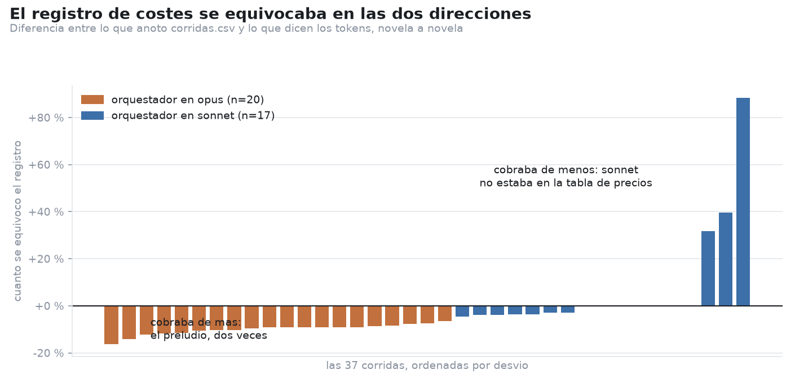
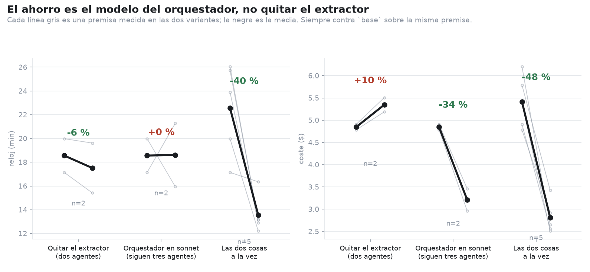
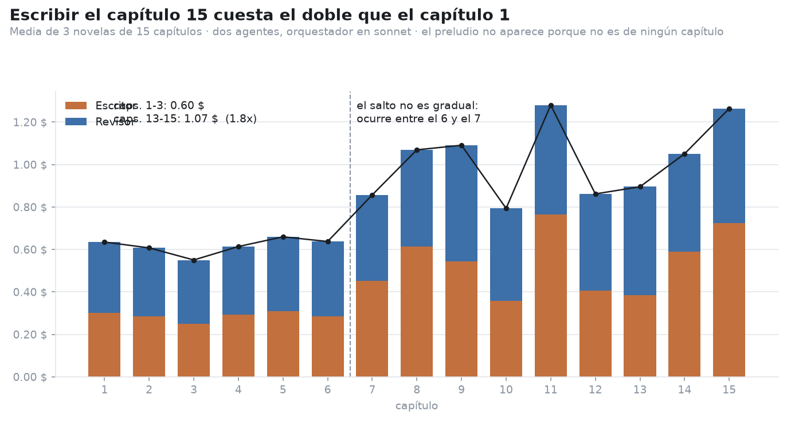
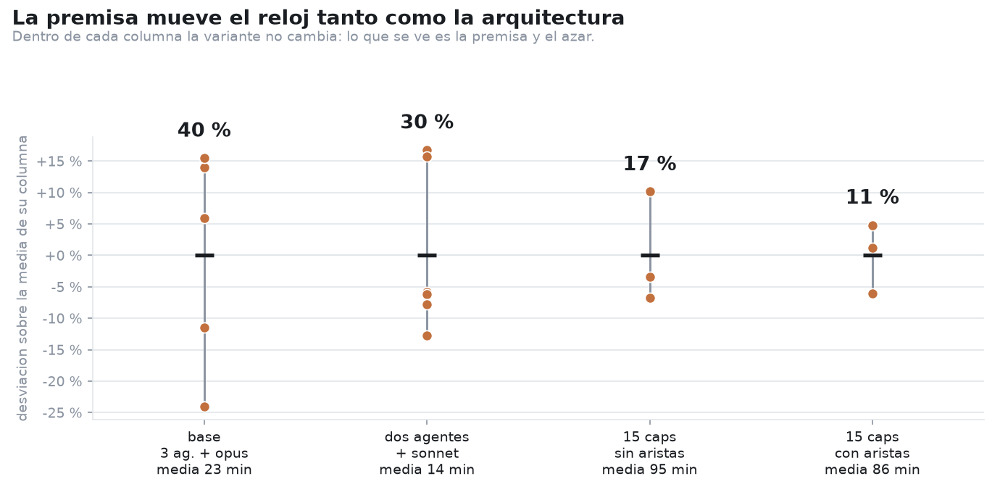
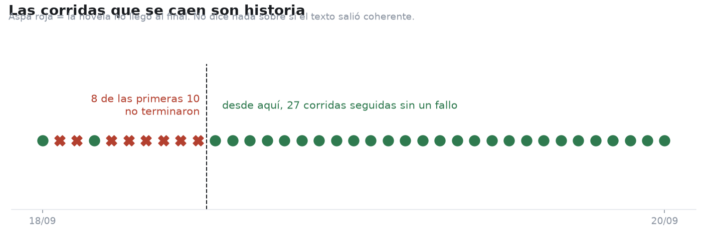

# Qué dicen las 37 corridas

20/09/2026. Análisis exploratorio de todo lo que el harness lleva registrado: 37 novelas escritas
entre el 18 y el 20 de septiembre, con su reloj, su coste, su reparto por agente y el uso de tokens
de cada una de las llamadas.

Se reproduce con `creador-novelas/herramientas/eda.py`.

**El coste no se lee de `corridas.csv`.** Se recalcula desde los tokens de cada llamada con la tabla
de precios de hoy, porque lo primero que salió del análisis fue que el registro estaba mal. Eso va
primero, porque afecta a todo lo demás.

---

## 1. El registro de costes se equivocaba en las dos direcciones

Cuadrando el uso por llamada contra el coste anotado aparecen **dos errores independientes y de
signo contrario**:

**El preludio se cobraba dos veces.** Las cuatro fases de arranque —premisa, sinopsis, escaleta,
inicializar el estado— quedan anotadas en dos sitios: `07_registro/preludio/uso.jsonl` y
`07_registro/fases.jsonl`. `web.coste()` sumaba los dos. Son las mismas cuatro fases: la primera
línea del uso trae 236 707 tokens y la fase `generar-premisa` trae exactamente los mismos 236 707.
**31 de las 37 corridas estaban infladas, un 7,3 % de media y hasta un 16 %.** En una novela de
tres capítulos el preludio pesa tanto que el inflado llegaba a una sexta parte de la factura.

Arreglado: `coste()` ya solo recorre las carpetas `tanda_*` y toma el preludio de `fases.jsonl`,
que además es la fuente completa —el `uso.jsonl` del preludio está incompleto porque H-10 no caza
todos los finales de subagente. Hay un test que falla si vuelve a sumarse dos veces.

**Y `claude-sonnet-5` no estaba en la tabla de precios.** Tres corridas se archivaron en esa
ventana y su orquestador se contabilizó a cero: quedaron infravaloradas entre el 32 % y el 88 %.

**Por qué nadie lo vio:** en las corridas con orquestador en sonnet los dos errores se cancelaban.
`carga` tiene un desvío de exactamente 0,0 %: el preludio que sobraba compensaba el sonnet que
faltaba. Y esas son precisamente las corridas sobre las que se publicó el ahorro.

---

## 2. El ahorro es el modelo del orquestador, no quitar el extractor

Con los costes recalculados y comparando siempre **sobre la misma premisa**:

| cambio | reloj | coste | n |
|---|---|---|---|
| Quitar el extractor (dos agentes, orquestador en opus) | −6 % | **+10 %** | 2 |
| Orquestador en sonnet (siguen tres agentes) | +0 % | **−34 %** | 2 |
| Las dos cosas a la vez | **−40 %** | **−48 %** | 5 |

Quitar el extractor, por sí solo, **no ahorró dinero: costó un 10 % más.** Tiene sentido: el
extractor era haiku, el agente barato, y su trabajo pasa al escritor, que es opus. Lo que ahorra es
bajar el orquestador de opus a sonnet, y eso se puede hacer con tres agentes.

Lo que sí necesita las dos cosas es el reloj: ninguno de los dos cambios por separado movió el
tiempo, y juntos lo bajan un 40 %.

**Cuidado con estas cifras.** Los brazos de un solo factor tienen **n=2**. Son suficientes para
decir que el extractor no era el gasto, y no lo son para poner un número fino al ahorro de cada
pieza. Además el reloj emparejado sobre las cinco premisas da **−40 %**, no el −48 % que se publicó
en `HALLAZGOS.md` sobre tres premisas; el −48 % de coste sí se sostiene.

---

## 3. El capítulo 15 cuesta el doble que el capítulo 1

Repartiendo el gasto de tres novelas de quince capítulos entre los capítulos que lo causaron:

- capítulos 1 a 3: **0,60 $** de media
- capítulos 13 a 15: **1,07 $** de media, un **1,8×**
- el capítulo 15 suelto cuesta **el doble** que el 1

**El salto no es gradual: ocurre entre el 6 y el 7.** Los seis primeros capítulos rondan los 0,62 $
y a partir del séptimo se instalan cerca de 1 $. Eso no parece el crecimiento suave de un contexto
que se llena, sino algo que cambia de régimen. Queda sin explicar y merece mirarse: es el capítulo
en el que el resumen rodante y los hechos acumulados empiezan a llenar el presupuesto del escritor.

La consecuencia práctica es que **no hay economía de escala, hay lo contrario**. Con dos agentes y
orquestador en sonnet:

| longitud | coste por capítulo |
|---|---|
| novela de 3 capítulos | 0,94 $ |
| novela de 15 capítulos | 1,17 $ (**+25 %**) |

Estimar una novela larga multiplicando el precio de una corta se queda corto en una cuarta parte.

El **preludio** cuesta 1,15 $ fijos, independientemente de la longitud: un 6 % de una novela de
quince capítulos y casi un tercio de una de tres.

---

## 4. El Revisor gasta más que el Escritor, y la distancia crece

| longitud | Escritor | Revisor | proporción |
|---|---|---|---|
| 3 capítulos (n=22) | 8 887 tokens | 12 237 tokens | **1,38×** |
| 15 capítulos (n=7) | 53 883 tokens | 93 834 tokens | **1,74×** |

Auditar cuesta más que escribir, y cuanto más largo el libro, más. La causa es estructural: hay un
corte de QA por capítulo y la muestra que el revisor cruza crece con el libro, así que su coste sube
más deprisa que el del texto.

No significa que QA sobre —revisar cada capítulo salió más rápido que revisar cada tres, medido el
19/09— pero sí que **el siguiente sitio donde buscar ahorro es el revisor, no el escritor**.

---

## 5. La premisa mueve el reloj tanto como la arquitectura

Con la variante **fija**, cambiando solo la premisa, el reloj se mueve. La gráfica va en desviación
sobre la media de cada columna y no en minutos: medido en minutos, las novelas de 15 capítulos
parecen más dispersas --16 minutos de recorrido frente a 9-- cuando en proporción son la mitad de
dispersas, y el ojo leía lo contrario de lo que decía la etiqueta.

| variante | recorrido |
|---|---|
| base (3 agentes + opus) | 40 % de la media |
| dos agentes + sonnet | 30 % |
| 15 caps sin aristas | 17 % |
| 15 caps con aristas | 11 % |

Cuarenta por ciento de variación **sin cambiar nada del harness**. Es del mismo tamaño que el
efecto que buscábamos medir. Esto es lo que justifica la regla que ya rige el proyecto: comparar
variantes solo sobre las mismas premisas, y decir siempre sobre cuántos casos.

También se ve que las novelas largas son más estables: con quince capítulos la variación baja al
11-17 %. Cuantos más capítulos, más se promedia la suerte de cada uno.

---

## 6. Las corridas que se caen son historia

**8 de las 37 corridas no terminaron**, un 22 %. Todas por QA: cuatro dejaron el manuscrito pausado
y cuatro no pudieron cerrar la resolución.

Cuidado con la palabra «fallo» aquí: significa **que la novela no llegó al final**, no que el texto
sea coherente. Son dos medidas distintas y esta sección solo habla de la primera. Lo que queda de
contradicciones en el texto acabado se mide aparte, con `herramientas/retencion.py`.

Pero están todas en las **primeras nueve corridas**. Desde la noche del 18/09 hay **27 corridas
seguidas sin un solo fallo**, incluidas las siete de quince capítulos, que son las largas. La tasa
del 22 % es el retrato de unos bugs que ya se arreglaron —entre ellos el de la skill `corte-qa`, que
no tenía permiso de escritura y por tanto nunca había funcionado—, no del harness de hoy.

---

## Lo que habría que mirar después

1. **El escalón del capítulo 7.** Es el hallazgo más concreto y no tiene explicación. Si es el
   resumen rodante o el recorte de hechos, puede haber ahí un ahorro del 40 % en la segunda mitad
   de cada libro.
2. **El Revisor.** Es el actor caro en novelas largas y nunca se ha tocado su prompt ni su cadencia
   por encima de 3.
3. **Rehacer la comparación de un solo factor con n decente.** Que quitar el extractor cueste un
   10 % más se sostiene sobre dos premisas. Si eso se confirma, la configuración por defecto
   debería revisarse: puede que lo correcto sean tres agentes con el orquestador en sonnet.
4. **Volver a publicar las cifras de `HALLAZGOS.md`** con los costes recalculados. El −48 % de coste
   aguanta; el −48 % de reloj era −40 % sobre la muestra completa.
