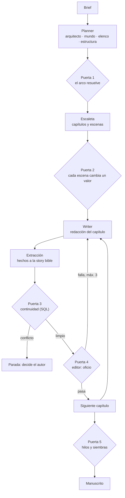

# storyMaker

Generador de novelas de terror espacial con un harness de agentes. Un orquestador en Python encadena agentes de Claude Code (planificación, escaleta, redacción, extracción y juicio de oficio), guarda el canon en una **story bible SQLite** y no da un capítulo por bueno hasta que pasa sus **puertas de control**: consultas deterministas contra la story bible para la continuidad, y un juez con criterios de oficio para la prosa.

Proyecto del examen final de *Harness Engineering*. Lo que falta para la entrega está en [specs/storymaker-plan.md](specs/storymaker-plan.md).

## Cómo funciona, en una imagen



El detalle está en [docs/architecture.md](docs/architecture.md), y la documentación de proceso (decisiones, iteraciones, diagramas) en [docs/proceso/](docs/proceso/README.md).

## Probarlo

Requisitos: Python 3.12 en Windows, y Claude Code solo si se quiere generar con el modelo de verdad.

```bat
cd src\backend
python -m venv .venv
.venv\Scripts\python.exe -m pip install -e ".[dev]"
```

**Sin gastar nada**, con agentes de demostración (`NOVELAS_PUERTO=falso`), en dos consolas desde `src\backend`:

```bat
rem Consola 1: el worker, el unico proceso que escribe
set NOVELAS_DB_PATH=novela.db
set NOVELAS_PUERTO=falso
.venv\Scripts\python.exe -m worker

rem Consola 2: el lanzador crea la novela del brief de ejemplo y muestra como avanza
set NOVELAS_DB_PATH=novela.db
set NOVELAS_PUERTO=falso
.venv\Scripts\python.exe demo.py --brief ..\..\ejemplos\brief-ejemplo.json
```

Con `NOVELAS_PUERTO=terminal` los agentes son Claude Code de verdad, y **cuesta dinero**. Las variables de entorno están en [.env.example](.env.example); la guía completa (API, reanudar, relanzar, verificar) en [src/backend/README.md](src/backend/README.md).

## El encargo: una novela para alguien

Cada novela es un regalo. El **brief** dice para quién es (nombre, edad, rasgos), qué recuerdos y qué personas o mascotas cercanas tienen que aparecer, cuánto miedo admite (tres niveles con edad mínima: atmosférico desde 10 años, tensión desde 14, intenso desde 18), el tono y qué no puede aparecer. El destinatario es el protagonista y nunca muere.

Hay tres formas de hacer el brief, desde `src\backend`:

```bat
rem Entrevista conversacional: pregunta lo que falta, detecta contradicciones y encola la novela
.venv\Scripts\python.exe entrevista.py
rem Partiendo de una carta o anecdota que pega el comprador (se trata como dato, nunca como orden)
.venv\Scripts\python.exe entrevista.py --texto-libre carta.txt
rem Validar y encolar un brief ya escrito, sin agente
.venv\Scripts\python.exe entrevista.py --brief ..\..\ejemplos\brief-ejemplo.json
```

[ejemplos/brief-ejemplo.json](ejemplos/brief-ejemplo.json) es un brief completo y reproducible. También se puede encolar por la API (`python -m main`, en `http://127.0.0.1:8000`); un brief incompleto o contradictorio devuelve `422` con lo que falta:

```bat
curl -X POST http://127.0.0.1:8000/intenciones -H "Content-Type: application/json" -d @..\..\ejemplos\brief-ejemplo.json
```

Qué falta y qué se contradice lo decide el código, no el agente entrevistador: ver [specs/spec3.md](specs/spec3.md), 3.2.

## Estructura

| Carpeta | Qué hay |
| --- | --- |
| [src/backend/](src/backend/) | Orquestador, worker, API FastAPI, story bible SQLite y el puerto a Claude Code |
| [src/frontend/](src/frontend/) | Sin implementar; guarda las ideas pendientes |
| [specs/](specs/) | Especificaciones y sus planes de verificación: [spec1](specs/spec1.md), [spec2](specs/spec2.md) y el [plan de entrega](specs/storymaker-plan.md) |
| [docs/](docs/) | Arquitectura, ontología narrativa, oficio de escritura, métodos de verificación y [documentación de proceso](docs/proceso/README.md) |
| [.claude/](.claude/) | Skills de los agentes, comandos del proyecto y la [memoria de Claude Code](.claude/memoria/README.md) |
| [ejemplos/](ejemplos/) | Brief de ejemplo |

## Trabajar con Claude Code

Las instrucciones para Claude Code están en [CLAUDE.md](CLAUDE.md), que importa las reglas del proyecto de [AGENTS.md](AGENTS.md). La más importante: **el código sigue a la spec**, y la spec entra en el mismo commit que el código.
