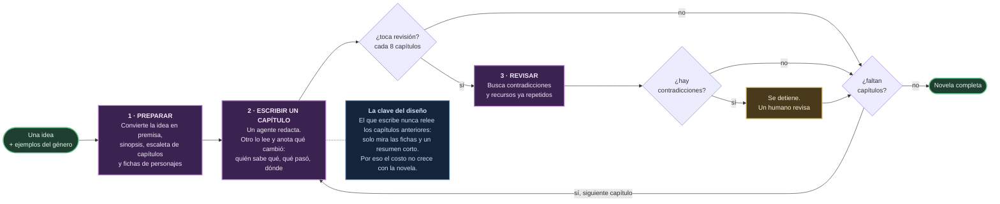
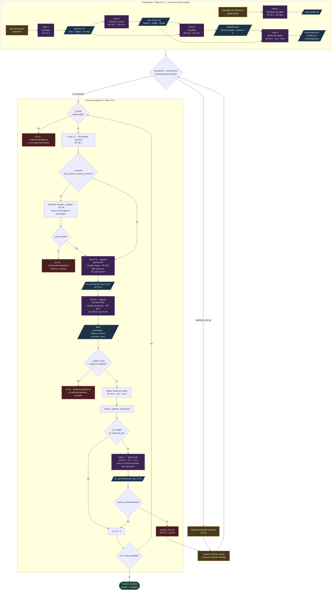
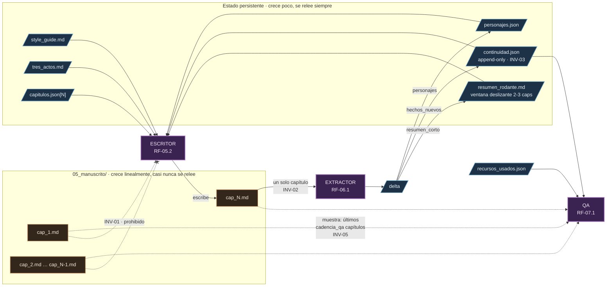
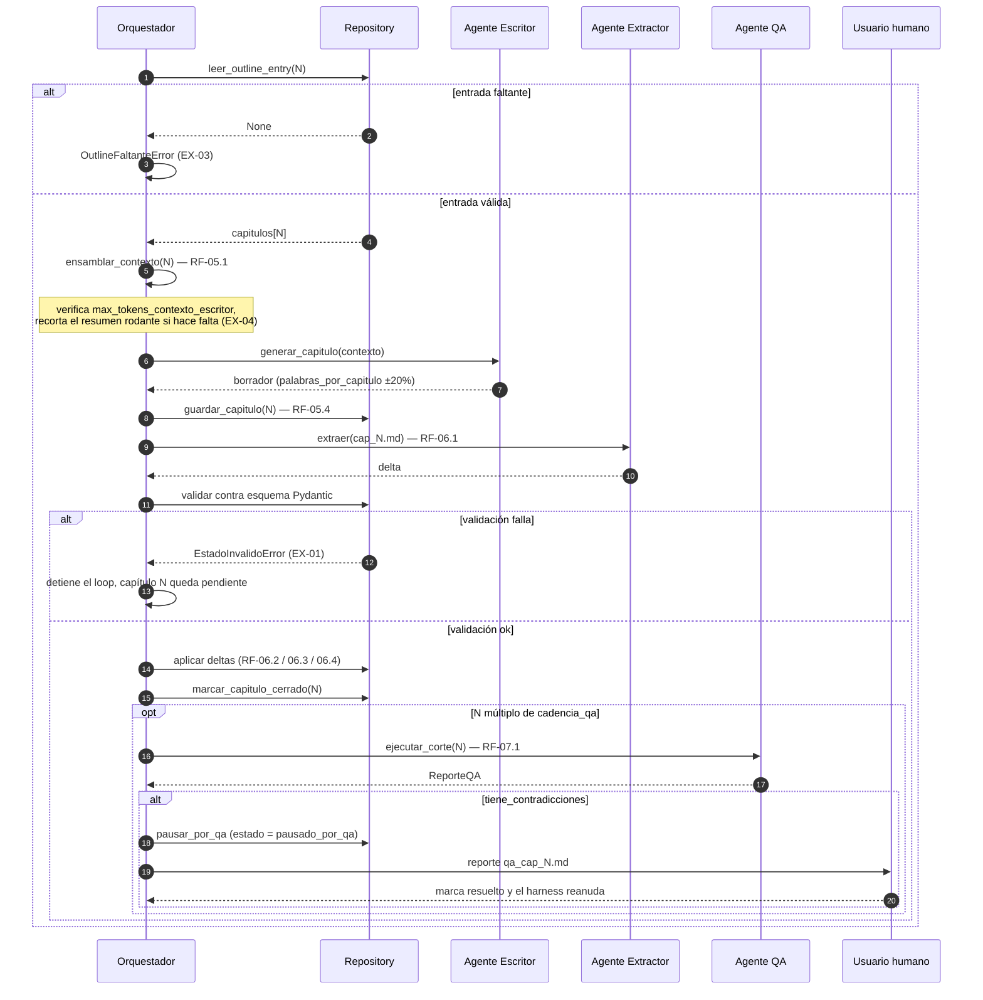
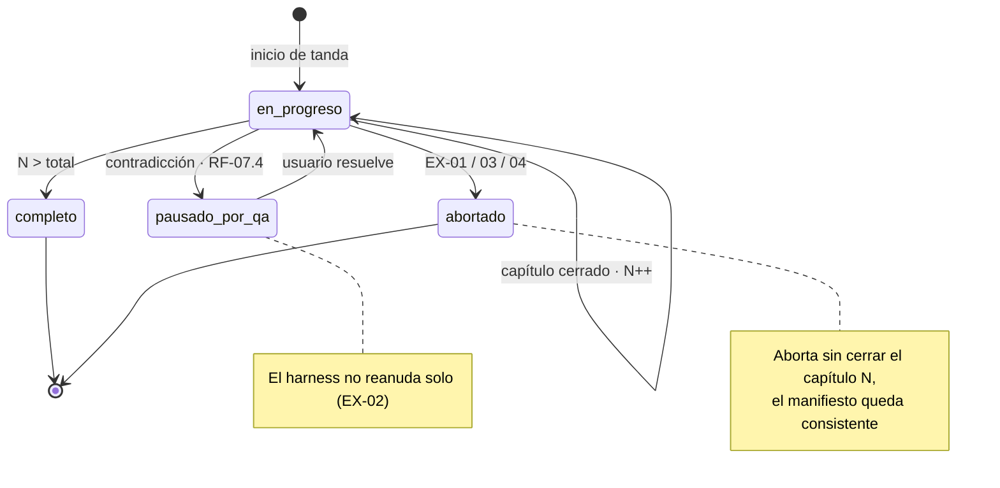

# Diagrama de flujo — Harness Generador de Novelas de Terror Espacial

Fuente: `especificacion-funcional-harness-novela-terror.md` v1.0 y `especificacion-tecnica-harness-novela-terror.md` v1.0.

El **0** es el resumen para explicar el sistema a alguien de cero. Los otros cuatro se reparten el detalle: el **1** es el flujo de control (qué corre y en qué orden), el **2** el flujo de datos (quién lee qué — el invariante central del diseño), el **3** el detalle de una iteración y el **4** la máquina de estados que sostiene la reanudación.

## 0. Resumen — el flujo en tres etapas

## 1. Flujo de control — pipeline de 8 fases

## 2. Flujo de datos — quién lee qué

El punto del harness es que el manuscrito acumulado nunca vuelve a entrar al contexto de generación. Este diagrama muestra las fronteras de lectura (INV-01 a INV-05): es lo que hay que poder auditar en el código.

## 3. Secuencia de un capítulo (fases 5-6-7)

## 4. Estados del manifiesto de ejecución

`04_estado/manifest.json` es lo que permite reanudar una tanda interrumpida sin repetir capítulos ya cerrados.

