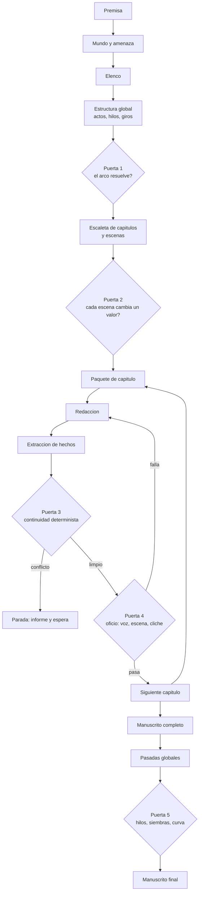
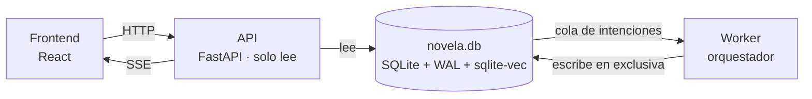

# Architecture — Sistema de agentes

## Estructura del monorepo

El proyecto es un monorepo con estas carpetas principales:

- **`src/`** — todo el código del programa.
  - **`src/backend/`** — FastAPI + Python.
  - **`src/frontend/`** — React + Three.js.
- **`specs/`** — especificaciones del programa, una por `.md`.
- **`docs/`** — definiciones del proyecto (este documento entre ellas).

**`src/backend/` está implementado** en su primera versión, según [specs/spec1.md](../specs/spec1.md): persistencia, puerto a Claude Code, las nueve skills de agente, orquestador, worker, las cinco puertas y la API. `src/frontend/` tiene su v1 según [specs/spec-frontend.md](../specs/spec-frontend.md): tablero, novela, paradas, lector y alta desde un brief, probada con mocks y pendiente de probar contra el backend real. Ver sus respectivos `README.md`.

## El sistema

Lo que se construye es un **sistema con dos mitades**: un backend que genera la novela y un frontend desde el que se arranca, se vigila y se lee. No es una librería ni un script: es una aplicación con servidor e interfaz.

| Mitad | Tecnología | De qué responde |
| --- | --- | --- |
| **Backend** | **FastAPI** + Python | Ejecuta el pipeline de agentes, mantiene el canon y aplica las puertas. FastAPI es el borde HTTP entre las dos mitades: no llama al modelo ni orquesta nada. |
| **Frontend** | **React** + Three.js | Configurar la obra, arrancar y parar la generación, ver el pipeline correr y leer el manuscrito. |
| **Motor de agentes** | **Claude Code** | Ejecuta cada agente con su skill. No es una librería del backend: es el programa al que el worker invoca. |
| **Persistencia** | **SQLite** + `sqlite-vec` | Un único fichero con el grafo de estado, el texto de los capítulos y los embeddings. |

Las dos mitades se detallan en [Arquitectura de ejecución](#arquitectura-de-ejecución) y [Arquitectura del frontend](#arquitectura-del-frontend).

### Restricción que condiciona el resto

**Límite de contexto: 100.000 tokens por llamada al modelo.** No es un detalle de implementación: es la restricción que da forma a todo el pipeline. Obliga a que el contexto se ensamble por selección y no por volcado, y es la razón de que la unidad de trabajo sea el capítulo y no el acto.

## Principios de diseño

Siete decisiones que condicionan todo lo demás. Están antes que el diagrama porque explican por qué el pipeline tiene la forma que tiene.

**1. Autónomo, con intervención de excepción.** El sistema genera de principio a fin sin que nadie apruebe cada paso. La intervención humana existe, pero es excepción: parar, corregir y relanzar desde un punto. No es un asistente de escritura ni un flujo de aprobaciones.

**2. La coherencia gana a la riqueza.** Ante el dilema entre una escena más viva y una novela que no se contradice, gana la novela. Se acepta que cada escena cueste más a cambio de que el manuscrito no se contradiga nunca.

**3. Todo lo que el texto fija, se captura.** Si la prosa menciona una quemadura en el antebrazo, esa quemadura es canon a partir de ese momento. La extracción de hechos no es un paso opcional de limpieza: es parte de producir una escena, y una escena sin extraer no está terminada.

**4. La fricción es información.** Si el sistema se detiene catorce veces en el primer acto, el problema no son las paradas: es que el canon estaba mal especificado y conviene saberlo ahí y no doscientas páginas después. No se relajan las puertas para que el pipeline fluya.

**5. Lo determinista va antes que el juicio.** Todo lo que la ontología modela como estado se verifica con consultas al grafo, no preguntándole a un modelo. El juicio se reserva para voz, subtexto, función de escena y cliché. Ver [validators.md](validators.md).

**6. El capítulo es la unidad de trabajo.** Es lo que se produce, se verifica y se da por bueno de una vez. Más pequeño (la escena) impide que el redactor vea el arco; más grande (el acto) no cabe en 100.000 tokens junto con su canon, y además detecta los conflictos demasiado tarde.

**7. El contexto se selecciona, nunca se vuelca.** Con 100.000 tokens de techo, ningún agente puede recibir el canon entero ni el manuscrito anterior. Todo lo que entra en una llamada entra porque el orquestador decidió que esa unidad lo necesita.

## Fuente de verdad

El **grafo de estado** es el canon; el manuscrito es su manifestación. Pero el redactor no escribe rellenando huecos: escribe con libertad dentro de su paquete de contexto, y lo que fije en la página se incorpora al grafo inmediatamente después.

De ahí salen dos reglas duras:

- **Un `Hecho` establecido no se borra por una pasada de prosa.** La revisión puede cambiar *cómo* se dice algo; no puede hacer que deje de decirse. Una pasada que elimina un hecho falla, no se aplica.
- **Cada tipo de pasada tiene permisos sobre el grafo.** La estructural puede alterar estado; la de línea, la de estilo y la de continuidad solo pueden tocar prosa. El permiso es por tipo de pasada, no por agente.

> **Decisión sin entrevistar.** Estas dos reglas y el alcance de la revalidación en cascada las decidí yo, no salieron de la entrevista. Son el punto más probable de tener que rehacerse.

## Los agentes

Un agente por fase del proceso. Cada uno tiene una entrada, una salida y un criterio de terminación, y ninguno ve más contexto del que su fase necesita.

Los agentes son el punto donde se encuentran los otros tres documentos de `docs/`, y ninguno de los tres es opcional:

- **[definitions.md](definitions.md)** dice **qué escribe** cada agente. Un agente no inventa su salida: rellena entidades de la ontología, y lo que no está modelado ahí no puede producirlo.
- **[domain-knowledge.md](domain-knowledge.md)** dice **con qué criterio** la escribe. Sus 55 principios son el oficio; sin ellos un agente produce texto correcto y narrativamente inerte.
- **[validators.md](validators.md)** dice **cómo se comprueba** que lo hizo bien, y con qué etiqueta del Trust Spec.

> **Decisión sin entrevistar.** Lo decidido es el *criterio* de reparto —uno por fase, frente a uno por capa de oficio, redactor único con herramientas, o fases más críticos en paralelo—. **Cuáles son esas fases, y por tanto cuántos agentes hay, lo derivé yo** del proceso manual de escritura. La tabla es una propuesta, no una decisión tomada.
>
> El **extractor** merece mención aparte: no corresponde a ninguna fase del oficio humano. Existe solo porque quien escribe es un modelo sin memoria entre llamadas, y porque la coherencia gana a la riqueza (principios 2 y 3). Un escritor humano no extrae sus propios hechos a una base de datos.
>
> Las fronteras entre agentes se ven bien cuando se define qué produce cada uno exactamente, así que esta tabla se revisa al escribir la primera spec.
>
> **Decisión entrevistada el 21 de septiembre de 2026.** El **revisor** se añadió como décimo agente para que las pasadas globales tuvieran dueño y la lista de carpetas coincidiera con la de agentes. En la misma revisión, y ya sin entrevista, se asignó `EstiloNarrativo` al arquitecto, `LineaDeTiempo` al constructor de mundo y `Objeto` al estructurador, porque eran entidades de la ontología que ningún agente escribía. Son las asignaciones más discutibles de la tabla.

| Agente | Produce | Termina cuando |
| --- | --- | --- |
| **Arquitecto** | Premisa, logline, pregunta dramática, tema, subgénero dominante, tipo de final y `EstiloNarrativo` | Las tres compresiones son coherentes entre sí, el final está declarado y el estilo está fijado |
| **Constructor de mundo** | `Mundo`, `SistemaTecnologico`, `Lugar`, `Faccion`, `Amenaza` con sus reglas, `LineaDeTiempo` | Toda regla que la trama vaya a usar está escrita, incluidos límites y costes |
| **Diseñador de elenco** | `Personaje` con su cadena fantasma→herida→mentira→defecto, arco y rol narrativo | Ningún personaje duplica la función de otro y el oponente tiene argumento propio |
| **Estructurador** | `Acto`, `HiloNarrativo`, `PuntoDeGiro`, `Siembra` inicial y los `Objeto` que la trama necesita | Los hilos abren y cierran en orden, y el clímax responde la pregunta dramática |
| **Escaletador** | `Capitulo`, `Secuencia`, `Escena` con POV, objetivo, conflicto y valor en juego | Ninguna escena tiene `valorInicial` igual a `valorFinal` |
| **Redactor** | La prosa de las escenas de un capítulo | El capítulo está escrito entero, sin marcadores pendientes |
| **Extractor** | `Hecho`, `EstadoDeConocimiento`, `UsoDeConocimiento`, `EstadoObjeto`, `EstadoPersonaje`, `Evento`, `EstadoSiembra`, `EstadoHilo`, `RevelacionAmenaza` | Todo lo que el texto afirma está registrado en el grafo |
| **Revisor de continuidad** | Informe de conflictos contra el canon | No hay contradicciones, o las hay y el pipeline para |
| **Revisor de oficio** | Informe de voz, subtexto, función de escena y cliché | Cada criterio tiene veredicto contra su principio de [domain-knowledge.md](domain-knowledge.md) |
| **Revisor** | El manuscrito revisado: las cuatro [pasadas globales](#pasadas-de-revisión), en orden (fuera de la v1), y la pasada del cambio del lector ([spec3, 3.8](../specs/spec3.md)) | Las cuatro pasadas han corrido sin mezclarse y toda escena tocada ha vuelto a pasar la puerta 3; en el cambio del lector, cada capítulo corregido pasa las comprobaciones del cambio y la puerta 4 |
| **Intérprete** | El cambio de canon que pide el lector: renombrar una entidad o cambiar el valor de un hecho | El código encuentra el id entre los candidatos que recibió y el valor tiene forma de dato |
| **Entrevistador** | El `Encargo` de una novela personalizada, con sus `ElementoPersonal` | El código no encuentra nada que falte ni que se contradiga, y el comprador lo confirma |

> **Decisión sin entrevistar, 23 de septiembre de 2026.** La fila del extractor nombraba solo cinco registros, pero ya escribía los usos de conocimiento, las siembras y la revelación de la amenaza. Y nadie escribía `EstadoHilo`: todo hilo acababa la novela abierto y la puerta 5 avisaba siempre. Se le asigna al extractor, que es quien lee la prosa y ya registra las siembras (RF2-PIPE-18 de spec2). Se descartó derivarlo de los puntos de giro de la escaleta, que dicen lo planificado y no lo que la prosa hizo.

`Restriccion` no la escribe ningún agente: la fija el usuario desde el frontend al configurar la obra (longitud objetivo, público, política de contenido) y entra al pipeline como dato de entrada. El arquitecto la lee; no la inventa.

### Agentes y sus skills

Cada agente se materializa como una **skill de Claude Code**: una carpeta en `.claude/skills/` con su `SKILL.md`, donde vive el oficio que ese agente necesita y solo ese. Es la aplicación del principio 7 al conocimiento: igual que ningún agente recibe el canon entero, ninguno recibe los 55 principios del oficio.

| Agente | Skill | Ontología que escribe ([definitions.md](definitions.md)) | Oficio que aplica ([domain-knowledge.md](domain-knowledge.md)) |
| --- | --- | --- | --- |
| **Arquitecto** | `arquitecto` | `Novela`, `Tema`, `Motivo`, `EstiloNarrativo` | 1, 7, 8, 28 · 39, 52 |
| **Constructor de mundo** | `mundo` | `Mundo`, `SistemaTecnologico`, `Lugar`, `Faccion`, `Amenaza`, `LineaDeTiempo` | 43, 44, 46, 47, 48, 53 |
| **Diseñador de elenco** | `elenco` | `Personaje` | 20, 21, 22, 24, 25, 27 · 50 |
| **Estructurador** | `estructura` | `Acto`, `HiloNarrativo`, `PuntoDeGiro`, `Siembra`, `Objeto` | 2, 3, 4, 5, 6, 15, 16, 18 · 51, 54 |
| **Escaletador** | `escaleta` | `Capitulo`, `Secuencia`, `Escena`, `Beat`, `Secuela` | 9, 10, 11, 12, 13, 17, 23 · 41, 45 |
| **Redactor** | `redaccion` | — (escribe prosa, no ontología) | 28, 29, 30, 31, 32, 33, 34, 35, 36, 37 · 40, 42, 49 |
| **Extractor** | `extraccion` | `Hecho`, `EstadoDeConocimiento`, `EstadoObjeto`, `EstadoPersonaje`, `Evento` | 26 |
| **Revisor de continuidad** | `continuidad` | — (solo lee) | 14, 26 · 44 |
| **Revisor de oficio** | `oficio` | — (solo informa) | 10, 19, 25, 29, 31, 33, 38 · 48 · 55 |
| **Revisor** | `revision` | — (reescribe prosa; el estado que altere la pasada estructural vuelve a pasar por el extractor; el del cambio del lector lo aplica el código) | 11, 13, 16, 17, 19, 26, 29, 32, 36, 38 |
| **Intérprete** | `interprete` | — (propone un cambio; el código lo valida y lo aplica) | — (entiende la petición; no decide si se aplica) |
| **Entrevistador** | `entrevistador` | `Encargo`, `ElementoPersonal` | — (entiende respuestas y pregunta; no decide qué falta) |

**El redactor y el revisor son los únicos agentes que producen algo que no es ontología.** Escriben prosa; que esa prosa se convierta en canon es trabajo del extractor. Esa asimetría es justo la razón de que el extractor exista y de que un capítulo sin extraer no esté terminado (principio 3).

Los números remiten a los principios numerados de [domain-knowledge.md](domain-knowledge.md); el punto separa el oficio general del propio del terror espacial (capa 5).

**Tres cosas que la tabla hace evidentes:**

- **El redactor carga con la capa 4 casi entera.** Es el agente con más oficio encima y en el que más caro sale equivocarse, lo que refuerza que la puerta 4 reintente en vez de dejar pasar.
- **El extractor casi no tiene oficio.** Solo el principio 26, y de rebote. Confirma lo que ya dice la nota de arriba: no es una fase del oficio humano, es una consecuencia de que escriba un modelo sin memoria. Su dificultad es de exhaustividad, no de criterio.
- **El revisor de continuidad no escribe ontología ni decide.** Su puerta es SQL (principio 5). La skill redacta el informe cuando ya hay conflicto y da una segunda opinión de si cada uno parece real o un falso positivo, que va al informe de la parada y nunca la levanta (spec3, RF3-JUE-01). La opinión se añadió porque las diez paradas de la primera novela real fueron falsos positivos o discutibles y el autor tenía que leer el grafo para saberlo; se descartó que decidiera, porque la puerta es SQL y exacta con lo registrado (la excepción está escrita en validators.md).

**Diez de estas once skills existen ya** en `.claude/skills/`: las nueve escritas junto con [specs/spec1.md](../specs/spec1.md) y la del **entrevistador**, que añade [specs/spec3.md](../specs/spec3.md). Falta la del **revisor**, que queda fuera de la primera versión. Además está `verificacion`, que es de desarrollo: sirve para construir este sistema y no forma parte de él, así que el puerto rechaza invocarla como agente.

> **Decisión sin entrevistar, 23 de septiembre de 2026.** El entrevistador es un agente más, con su skill y su carpeta en `tareas/`, pero **no corre en el pipeline**: lo invoca `entrevista.py` antes de crear la novela, y la entrevista no escribe en la base salvo la intención `crear_novela`, igual que la API. Se descartó hacerlo una fase del worker (la entrevista es interactiva y el worker no habla con nadie) y exponerlo por la API (la API no invoca al modelo). Qué falta y qué se contradice en el encargo lo calcula el código, no el agente: es la regla de que lo determinista va antes que el juicio.

Cada skill lleva cuatro secciones: qué produce, con qué criterio, qué no hace y el formato de salida. Reparte **solo el oficio de su fase**, que es el principio 7 aplicado al conocimiento.

> **Decisión sin entrevistar, 22 de septiembre de 2026.** El **revisor** y sus cuatro pasadas globales quedan fuera de la v1. Dependen de la revalidación en cascada, que a su vez exige que las dependencias entre hechos estén modeladas, y eso sigue sin estar en [definitions.md](definitions.md). Se descartó implementarlo revalidando el manuscrito entero tras cada pasada, porque el coste crece con el cuadrado de la obra. Un manuscrito sin pasadas globales sigue siendo un resultado completo y verificable, así que la v1 llega hasta ahí. En consecuencia, **`tareas/` tiene nueve carpetas y no diez**.

El **orquestador** no es un agente: es código. Decide qué fase toca, ensambla los paquetes de contexto, ejecuta las puertas y aplica la política de fallo.

## El motor de los agentes: Claude Code

Los agentes **no son llamadas a una API de modelo**. Cada uno es una invocación de **Claude Code** con su skill cargada. El orquestador sigue siendo código propio; quien escribe, extrae y juzga es Claude Code.

Tres capas, y conviene no confundirlas:

| Capa | Qué hace | Quién lo hace |
| --- | --- | --- |
| **FastAPI** | Borde HTTP entre backend y frontend. No ve el modelo nunca. | Código propio |
| **Orquestación** | Qué fase toca, ensamblado del paquete de contexto, puertas, política de fallo, reanudación. | Código propio, en el worker |
| **Ejecución del agente** | Escribir, extraer, juzgar. | Claude Code, con la skill de ese agente |

### Por qué esto y no la API

- **Un solo servicio.** No hay clave de proveedor que gestionar ni un segundo sistema del que depender.
- **Las skills dejan de ser una metáfora.** La [tabla de agentes y skills](#agentes-y-sus-skills) describe carpetas reales en `.claude/skills/` que Claude Code carga. Contra una API, «la skill del redactor» sería un prompt y nada más.
- **El oficio se versiona con el repositorio.** [domain-knowledge.md](domain-knowledge.md) y las skills que lo reparten viven en el mismo árbol de git que el código que las invoca, y cambian en el mismo commit.

Esto cierra la pendiente de *modelos por fase* tal como estaba planteada: la elección de modelo deja de ser un parámetro de cada llamada del orquestador.

### Cómo invoca el worker a Claude Code

Dos formas, y las dos son Claude Code:

| Forma | Qué es | A cambio |
| --- | --- | --- |
| **La terminal, como subproceso** | El worker ejecuta `claude` en modo no interactivo y lee su salida. | Lo más simple de arrancar y de ver funcionar. Hay que serializar entrada y salida a través de la frontera del proceso. |
| **El Claude Agent SDK** | El mismo motor, pero como librería, sin subproceso. | Mejor integración con el worker y con el manejo de errores. Más acoplamiento. |

> **Decisión sin entrevistar, 22 de septiembre de 2026.** Se elige **la terminal**. Migrar al SDK después es barato y al revés no, y el puerto de `compartido/` absorbe la diferencia, así que la decisión es reversible. Las banderas están verificadas contra el binario instalado, no supuestas.

### Las dos gestiones de contexto se pisan

Es el punto de fricción real de esta decisión, y no existía mientras el agente era una llamada a una API.

El principio 7 dice que **el contexto se selecciona, nunca se vuelca**: lo que entra en una llamada entra porque el orquestador lo decidió. Pero Claude Code trae su propia gestión de contexto —lee ficheros por su cuenta, busca por el repositorio, compacta cuando se llena—. Si no se acota, el agente ignora el paquete que se le montó y se pone a leer lo que le parece; con ello se pierden a la vez el presupuesto de tokens y la garantía de que la selección la hizo el orquestador.

De ahí una regla dura: **el paquete de capítulo se le entrega al agente, y el agente no busca canon por su cuenta.**

> **Decisión sin entrevistar, 22 de septiembre de 2026.** Así se impone, y se sostiene **por construcción y no por instrucción**: no se le pide al agente que no busque, se le quita con qué.
>
> | Qué | Cómo |
> | --- | --- |
> | La skill entra como prompt de sistema | El puerto lee la `SKILL.md` del disco y sustituye con ella el prompt de sistema. No depende de que el modo no interactivo descubra skills, ni de darle la herramienta que las carga |
> | El agente no tiene herramientas | Se le **retiran** las herramientas integradas y los servidores MCP de la configuración del usuario, y además la lista de permitidas va vacía: no puede leer ficheros, buscar ni ejecutar. Y se comprueba después: una respuesta con permisos denegados, o con más turnos de los que usa la salida estructurada, es un error |
> | No hay nada que leer | El directorio de trabajo es un temporal vacío por llamada, no la raíz del repositorio |
> | La salida llega validada | Se le pasa el esquema JSON de su tarea y el CLI devuelve la salida ya conforme |
>
> Se descartaron dos alternativas. Entregar el canon **como ficheros acotados** en un directorio, que exigiría devolverle la herramienta de lectura y con ella la capacidad de leer de más. Y **pedírselo en el prompt**, que convierte una garantía en una petición.
>
> **Decisión sin entrevistar, 23 de septiembre de 2026.** La auditoría señaló que una lista de permitidas vacía quita permisos pero no retira las herramientas, y que nada comprobaba si el agente intentaba usarlas. Se añade la retirada explícita y la comprobación de la respuesta. El umbral de turnos es dos y no uno: una llamada real sin herramientas y con salida estructurada usa dos, verificado contra la versión instalada del CLI. Detalle en [specs/spec2.md](../specs/spec2.md), RF2-PUERTO-10.
>
> Queda un supuesto sin verificar: que Claude Code **no compacte** dentro de una llamada. Sin herramientas y con el paquete bajo presupuesto no debería ocurrir, y el puerto registra en la traza cualquier señal de que haya ocurrido, para poder contradecirlo.

## Fases del pipeline



La planificación corre una vez. El bucle central —paquete, redacción, extracción, puertas— se repite por capítulo. Las pasadas globales corren sobre el manuscrito terminado.

### El proceso, paso a paso

1. **Planificación.** Arquitecto, constructor de mundo, diseñador de elenco y estructurador corren una sola vez, en ese orden, y cada uno escribe su parte del canon en el grafo. La **puerta 1** comprueba que el arco resuelve antes de dejar bajar a capítulos.
2. **Escaleta.** El escaletador convierte la estructura en capítulos, secuencias y escenas con POV, objetivo, conflicto y valor en juego. La **puerta 2** verifica que ninguna escena deja el valor donde estaba.
3. **Paquete de capítulo.** El orquestador —que es código, no agente— selecciona del grafo lo que este capítulo necesita y lo ajusta al presupuesto de tokens. Nada se vuelca entero.
4. **Redacción.** El redactor escribe las escenas del capítulo con libertad dentro de ese paquete.
5. **Extracción.** El extractor lee la prosa recién escrita y registra en el grafo todo lo que el texto ha fijado. Hasta aquí, el capítulo no está terminado.
6. **Puerta 3, continuidad.** Consultas SQL contra el canon. Si hay conflicto, **el pipeline para** y espera a un humano: nunca se acumula deuda narrativa.
7. **Puerta 4, oficio.** Con la 3 limpia se juzgan voz, subtexto, función de escena y cliché. Si falla, vuelve al paso 4 con el criterio incumplido; a los tres intentos escala a parada.
8. **Siguiente capítulo.** Se recomprime el estado rodante y se vuelve al paso 3. Los pasos 3 a 8 son el bucle central. **Texto y hechos entran juntos o no entra ninguno**, que es lo que impide que exista un capítulo escrito cuyos hechos no se capturaron.
9. **Pasadas globales.** Con el manuscrito completo, el revisor aplica las cuatro pasadas de revisión en orden y sin mezclarlas, y la **puerta 5** corre sobre el conjunto.

Los pasos 1, 2, 4, 5, 9 y la parte de juicio del 7 los hace un agente. Todo lo demás es código; el reparto completo está en [Qué es código y qué es agente](#qué-es-código-y-qué-es-agente).

## Gestión de contexto

Ningún agente recibe el canon entero. El orquestador ensambla un **paquete de capítulo** con exactamente lo que esa unidad necesita, y esa selección es código determinista, no una búsqueda que el agente hace por su cuenta.

| Registro | Se actualiza | Qué aporta al paquete |
| --- | --- | --- |
| **Canon** | Casi nunca | Las entradas de `Mundo`, `SistemaTecnologico`, `Personaje` y `Lugar` que este capítulo toca |
| **Estructura** | Al resolverse un hilo | La escaleta del capítulo actual y el estado de los hilos vivos |
| **Estado rodante** | Cada capítulo | Sinopsis comprimida de lo escrito hasta aquí |
| **Registro de hechos** | Tras cada capítulo | Solo los `Hecho` relevantes al reparto y al lugar de estas escenas |
| **Siembras** | Tras cada capítulo | Las que deben regarse o pagarse en este tramo |
| **Conocimiento** | Tras cada escena | El `EstadoDeConocimiento` filtrado al reparto de este capítulo |
| **Estilo** | Nunca | `EstiloNarrativo` completo: es corto y aplica siempre |

El registro de hechos es *append-only* y se consulta, nunca se vuelca entero. El de conocimiento es el que más barato resulta de olvidar y el que más caro sale: es la fuente número uno de errores de continuidad en obra larga.

### Presupuesto de contexto

Con un techo de 100.000 tokens, el paquete no puede crecer con la novela: un manuscrito de 90.000 palabras no cabe, y hacia el capítulo 30 el canon acumulado tampoco. El presupuesto es por tanto **fijo y repartido**, y el orquestador lo calcula antes de cada llamada:

| Bloque | Presupuesto | Qué pasa si no cabe |
| --- | --- | --- |
| Instrucciones del agente y `EstiloNarrativo` | Fijo y pequeño | No se recorta: es lo que garantiza la consistencia de voz |
| Escaleta del capítulo actual | Fijo | No se recorta: es la tarea |
| Canon filtrado (personajes, lugares, sistemas de este capítulo) | Acotado | Se recorta por relevancia al reparto y al lugar; el POV y los lugares de las escenas nunca |
| Hechos y conocimiento del reparto | Acotado | Los del reparto y de los lugares de sus escenas nunca se recortan; si no caben, se para. Solo caen los de amenaza, mundo y novela, empezando por los más antiguos |
| Siembras vivas en este tramo | Pequeño | No se recorta: es barato y su olvido es caro |
| Estado rodante (sinopsis comprimida) | **Elástico** | Es el bloque que absorbe la presión: se recomprime a medida que la novela crece |
| Texto del capítulo anterior | Elástico | Primero en caer; se sustituye por su resumen |

El **estado rodante** es la válvula: una sinopsis comprimida que se reescribe tras cada capítulo manteniendo un tamaño aproximadamente constante. Es lo que permite que el capítulo 40 quepa en el mismo presupuesto que el capítulo 2.

> **Decisión sin entrevistar, 22 de septiembre de 2026.** Dos cosas que faltaban.
>
> **Las cifras, provisionales.** Instrucciones y estilo 8.000; escaleta 6.000; canon filtrado 20.000; hechos y conocimiento 16.000; siembras 2.000; estado rodante 10.000; capítulo anterior 6.000; recuperado del índice 4.000; criterios incumplidos 2.000. Total 74.000, dejando 26.000 para la salida del agente y la sobrecarga del motor. Son provisionales y viven en un solo diccionario de configuración; se fijan midiendo contra un capítulo real, y la traza guarda los tokens por bloque de cada llamada para poder hacerlo.
>
> **Quién recomprime.** Lo hace **código**, no un agente. El extractor devuelve dos resúmenes de cada capítulo, uno completo y otro de una frase, y comprimir consiste en elegir cuál de los dos se usa según la distancia: los últimos capítulos con el resumen entero, los anteriores con la frase. La alternativa, una llamada de agente por capítulo para reescribir la sinopsis, añade coste y una fuente de deriva a cambio de una prosa más fluida en un bloque que es contexto, no manuscrito.

Dos consecuencias que conviene tener presentes:

- **La compresión pierde información, y por eso el grafo existe.** Lo que se comprime es la narración de lo ocurrido, no los hechos: esos viven en el registro y se consultan íntegros. Si algo solo está en el estado rodante, tarde o temprano se pierde.
- **Superar el presupuesto es un fallo del orquestador, no del modelo.** Si un paquete no cabe, la respuesta correcta es partir la unidad o recomprimir, nunca truncar el canon.
- **Ningún recorte es silencioso.** Cada bloque es una lista de elementos enteros —un personaje, un hecho, un párrafo—, cada uno obligatorio u opcional. Recortar es quitar opcionales desde el final, nunca medio elemento, y cada recorte queda en la traza aunque el paquete quepa.

> **Decisión sin entrevistar, 23 de septiembre de 2026.** La auditoría encontró que el bloque de hechos se unía en un solo párrafo y el recorte, que cortaba por párrafos, lo vaciaba entero sin avisar: el redactor escribía sin los hechos establecidos y ninguna puerta lo notaba. Se pasa a elementos con marca de obligatorio y se descarta seguir recortando texto, porque ningún corte de texto sabe qué parte es imprescindible. Qué es obligatorio en cada bloque, y que el techo por llamada sale de la configuración, está en [specs/spec2.md](../specs/spec2.md), RF2-CTX-01 a RF2-CTX-12.

## Arquitectura de ejecución

> **Decisión sin entrevistar.** Esta sección se aceptó sin la entrevista que exige `AGENTS.md`. Descansa sobre tres premisas no verificadas: **un solo autor**, **una obra a la vez** y **ejecución en máquina propia, sin usuarios ajenos**. Si alguna cae, la sección se rehace entera.

El patrón es **web-queue-worker**: dos procesos sobre una única base de datos, con la cola dentro de esa misma base.



La API **no ejecuta el pipeline**. Escribe una intención (`arrancar`, `parar`, `relanzar desde el capítulo N`) en una tabla y el worker la recoge. El orquestador vive en el worker; la API ni lo importa.

### Por qué esta forma y no otra

| Alternativa | Por qué se descarta |
| --- | --- |
| **Tareas en el propio proceso** (`BackgroundTasks`) | El pipeline dura horas y muere con el proceso. No deja nada que restaurar, y la reanudación de este sistema es restaurar el grafo al final del capítulo N-1, no reintentar un paso. |
| **Cola con broker** (Celery, RQ + Redis) | Añade un servicio que administrar y una segunda sede del estado, justo lo que la decisión de SQLite evita. Resuelve fan-out y concurrencia; aquí hay una sola tarea en serie. |
| **Motor de ejecución durable** (Temporal, Prefect) | Regala reanudación y reintentos a cambio de una **segunda fuente de verdad**: el estado del flujo en el motor y el canon en SQLite. Esos dos se desincronizan, que es el fallo que el principio 3 existe para evitar. La reanudación que hace falta es de dominio, no de flujo. |
| **Un solo proceso** | Impide reiniciar la API sin matar una generación en curso. |

### El escritor único

SQLite admite un escritor a la vez. Con dos procesos, esto deja de ser trivia y pasa a ser una regla de diseño:

- **El worker escribe. La API solo lee.** Única excepción: insertar una fila en la tabla de intenciones.
- `PRAGMA journal_mode=WAL` — lectores y escritor no se bloquean entre sí.
- `PRAGMA busy_timeout` distinto de cero.
- **Un solo worker.** El worker toma un cerrojo en la base antes de escribir nada, un hilo propio lo renueva mientras el proceso vive, y cada transacción suya comprueba, con el bloqueo de escritura de SQLite ya tomado, que el cerrojo sigue siendo suyo. Si otro proceso se lo ha quedado, el worker se detiene sin escribir nada más.

Sin esta regla, el fallo aparece como `database is locked` en mitad de un capítulo.

> **Decisión sin entrevistar, 23 de septiembre de 2026.** La auditoría encontró que el cerrojo caducaba a los seis segundos y que nadie lo renovaba durante un capítulo: un segundo worker podía entrar y los dos escribían. Se renueva desde un hilo y no desde el bucle de espera del agente, porque las fases SQL largas también necesitan latido; y se añade la comprobación dentro de cada transacción (*fencing*), porque un latido solo dice que el cerrojo **era** nuestro hace un momento. Se descartó alargar la gracia a minutos, que solo retrasa el mismo fallo. El detalle está en [specs/spec2.md](../specs/spec2.md), RF2-WK-07 y RF2-WK-08.

### La cola es una tabla

Una tabla `intencion` y un worker que hace *polling* cada pocos segundos. No hace falta más: la latencia aceptable se mide en segundos y el *throughput* es una tarea.

La ventaja no es la simplicidad, es la transaccionalidad: **encolar el capítulo siguiente entra en la misma transacción** que guardar el anterior con sus hechos extraídos. La unidad de encolado y la unidad de trabajo coinciden.

### Organización del código: cortes verticales

**Una carpeta por tipo de tarea.** El corte es vertical: cada tarea del pipeline se lleva dentro todo lo suyo —su esquema de entrada y salida, su servicio, su prompt si es agente, su puerta si la tiene, sus pruebas— en vez de repartirse entre una carpeta de rutas, otra de modelos y otra de servicios.

```text
src/backend/
├── main.py              # el borde HTTP. Solo lee; actuar es encolar una intencion
├── worker.py            # el unico proceso que escribe
├── config.py            # unico sitio donde se lee el entorno
├── compartido/          # infraestructura y canon
│   ├── db.py            # conexion, PRAGMAs, transacciones, migraciones, integridad
│   ├── grafo/           # lectura y escritura del canon, resolucion de nombres a ids
│   ├── contexto/        # ensamblado del paquete y presupuesto de tokens
│   ├── puerto/          # el puerto a Claude Code, real y falso
│   └── vectores/        # indice derivado: embeddings y recuperacion
├── orquestador/         # que fase toca, puertas, politica de fallo, reanudacion
├── evals/               # medidas del sistema; nada de aqui corre dentro del pipeline
└── tareas/              # una carpeta por agente
    ├── arquitecto/
    ├── mundo/
    ├── elenco/
    ├── estructura/
    ├── escaleta/
    ├── redaccion/
    ├── extraccion/
    ├── continuidad/
    └── oficio/
```

> **Decisión sin entrevistar, 22 de septiembre de 2026.** El **orquestador está fuera de `compartido/`**, junto al worker. `compartido/` es infraestructura que usan todos; el orquestador solo lo usa el worker, y las tareas no lo tocan. Meterlo dentro habría engordado `compartido/` sin razón, que es la señal que este mismo documento identifica como corte mal hecho.

> **Decisión sin entrevistar, 23 de septiembre de 2026.** Las evals viven en **`evals/`**, fuera de `tareas/` y de `tests/`. No son un agente, y la lista de carpetas de `tareas/` es la de agentes. Tampoco son solo tests: el banco de contraejemplos de la puerta 3 tiene que poder correrse como comando para dar su tabla ([spec3](../specs/spec3.md), 3.10). Dependen del pipeline y de las puertas, y nada del pipeline depende de ellas.

Dentro de cada tarea, siempre los mismos ficheros: `router.py` si se expone por HTTP, `esquemas.py`, `servicio.py`, `prompt.py`, `puerta.py`, y sus pruebas al lado.

**La lista de carpetas es la lista de agentes**, con el mismo nombre que su skill, así que se mueve con ella: mientras la tabla de agentes siga siendo una propuesta, esta estructura también lo es.

**Dos reglas la sostienen:**

- **Una tarea no importa de otra.** Si dos la necesitan, eso baja a `compartido/`. El día que una tarea importe de otra, el corte vertical ha dejado de existir.
- **FastAPI solo aparece en los `router.py`.** FastAPI es el borde HTTP entre backend y frontend; no llama al modelo, no orquesta y no toca el grafo. Quien invoca a Claude Code es el worker, a través del puerto de `compartido/`.

**Qué vive en `compartido/` y por qué no es una vía de escape:** solo lo que es infraestructura o canon —la conexión y las transacciones, el grafo de [definitions.md](definitions.md), el ensamblado de paquetes de contexto y el **puerto que invoca a Claude Code**—. Nada de lógica de una fase concreta.

Ese puerto es la única abstracción real del backend: absorbe la decisión pendiente entre terminal y SDK, y es lo que permite probar el orquestador sin gastar dinero ni depender de la no determinación de un agente. SQLite y el sistema de ficheros no se van a cambiar nunca: no llevan puerto. `compartido/` creciendo sin parar es la señal de que el corte está mal hecho.

**Por qué vertical y no por capas.** Cada tarea de este pipeline tiene poco que ver con la siguiente: el extractor y el redactor no comparten nada salvo el grafo. Un corte por capas los obligaría a compartir carpeta de servicios sin compartir nada real, y tocar una fase significaría abrir cinco directorios. El corte vertical hace que trabajar en una fase sea abrir una carpeta, que es también lo que hace que cada una pueda tener su propia spec y sus propias evals —empezando por el extractor.

### Comunicación con el frontend

**SSE para el progreso, `GET` para la verdad.** Un endpoint de eventos emite lo que va ocurriendo; un `GET` normal devuelve el estado completo. Si el stream se cae, el frontend reconsulta y se recupera.

**Ninguna decisión del frontend depende de haber recibido un evento.** El stream es comodidad; la tabla `ejecucion` es el estado. WebSockets pagaría una bidireccionalidad que no se usa; el *polling* puro perdería el ver aparecer el capítulo.

## Arquitectura del frontend

> **Decisión sin entrevistar.** Igual que la sección anterior. Se escribió cuando **qué ve el frontend** estaba todavía abierto, así que solo fija el esqueleto, lo que se sostiene sea cual sea la respuesta. La respuesta llegó el 23 de septiembre y está en [Qué ve el frontend y para qué sirve Three.js](#qué-ve-el-frontend-y-para-qué-sirve-threejs).

**Agrupación por funcionalidad (*package by feature*), sin Feature-Sliced Design.** Una carpeta por funcionalidad, con sus componentes, sus hooks de datos y sus tipos dentro. Es el mismo criterio que en el backend: el corte sigue al trabajo, no a la técnica.

```text
src/frontend/src/
├── app/                 # arranque, rutas, providers
├── compartido/          # primitivos de UI, cliente de API generado, hooks base
└── funcionalidades/
    ├── novela/          # crear y configurar la obra
    ├── ejecucion/       # arrancar, parar, ver el pipeline correr
    ├── canon/           # consultar el grafo
    └── manuscrito/      # leer capítulos y comparar versiones
```

**Se descarta FSD** explícitamente. Feature-Sliced Design impone capas (`entities`, `widgets`, `features`, `pages`) con reglas de importación jerárquicas entre ellas. Resuelve un problema de equipos grandes y disciplina compartida; aquí añadiría ceremonia sin resolver nada, y su capa de `entities` duplicaría lo que ya modela [definitions.md](definitions.md).

**Una funcionalidad no importa del interior de otra.** Si necesitan compartir algo, baja a `compartido/`; si necesitan componerse, se componen en `app/`.

### El frontend observa, no posee

El pipeline corre solo durante horas y el frontend no lo controla (principio 1). Eso invierte lo habitual: **no hay estado de cliente que merezca la pena**, porque el estado vive en SQLite. Lo que hay es una caché de lo que el servidor dice.

- **Nada de un almacén global que duplique datos del servidor.** Lo que hace falta es una capa de *server state* con su caché, su revalidación y sus reintentos. El estado propiamente de cliente —qué panel está abierto, qué capítulo se está leyendo— es poco y va aparte.
- **Los eventos SSE invalidan, no rellenan.** Un evento avisa de que algo cambió; el frontend vuelve a consultar. Si construyera su estado a partir de los eventos, perder uno lo dejaría desfasado en silencio, y eso rompería desde el frontend la regla de que el `GET` es la verdad.
- **La reconexión es un caso de primera clase, no un error.** Esto va a estar abierto horas: el equipo se suspende, la red salta. Al reconectar hay que reconsultar el estado completo, porque lo ocurrido mientras tanto se perdió.

### Los tipos se generan

FastAPI publica OpenAPI. El cliente TypeScript se genera desde ahí en vez de escribirse a mano: elimina de raíz el desajuste entre un esquema Pydantic que cambia y un frontend que sigue creyendo en el campo viejo.

### Qué ve el frontend y para qué sirve Three.js

> **Decisión entrevistada, 23 de septiembre de 2026.** Cierra las dos pendientes que tenía esta sección. **El frontend es un panel de control**, no una sala de lectura: un tablero al estilo Jira con una tarjeta por novela y, dentro de cada novela, sus capítulos como tarjetas que avanzan. La lectura se queda en un lector sencillo de capítulos cerrados, porque la lectura de la entrega es el HTML estático con PDF del bloque 7 de [storymaker-plan.md](../specs/storymaker-plan.md). Se descartó la sala de lectura como pantalla principal: el pipeline corre horas y lo que el autor necesita ver es dónde está y cuándo le toca intervenir, sobre todo en las paradas.
>
> **Three.js es una pieza expresiva y está declarada como tal**: la estación dibujada como plano en la pantalla de crear novela, decorativa, cargada de forma perezosa y apagada con `prefers-reduced-motion`. Se descartó un grafo del canon en 3D, por la oclusión que ya advertía esta sección.
>
> Arrastrar una tarjeta **encola una intención** y la tarjeta se mueve cuando la ejecución lo confirma, que es aplicar al tablero la regla de arriba. Requisitos en [specs/spec-frontend.md](../specs/spec-frontend.md).

## Persistencia

Un solo SQLite guarda las tres cosas: el grafo de estado, el texto y los vectores. No hay base de datos aparte para el manuscrito ni almacén vectorial separado, y eso es deliberado: si el texto y el estado vivieran en sistemas distintos podrían desincronizarse, que es justo el fallo que el principio 3 pretende evitar.

### Qué guarda

| Grupo | Tablas | Naturaleza |
| --- | --- | --- |
| **Canon** | `novela`, `restriccion`, `mundo`, `sistema_tecnologico`, `lugar`, `personaje`, `faccion`, `amenaza`, `objeto`, `linea_de_tiempo`, `tema`, `motivo`, `estilo_narrativo` | Cambia poco; cada cambio se versiona |
| **Encargo** | `brief`, `elemento_personal`, `entrevista`, `termino_vetado` | Lo fija el comprador antes de empezar; ninguna reversión lo toca. `termino_vetado` lleva además los términos globales por intensidad (spec3, 3.5) |
| **Estructura** | `acto`, `capitulo`, `secuencia`, `escena`, `secuela`, `beat`, `punto_de_giro`, `hilo`, `siembra` | El plan de la obra. `siembra` va aquí porque la planifica el estructurador, aunque su `estado` se actualice durante la redacción; [definitions.md](definitions.md) la agrupa con el estado por esa segunda razón |
| **Estado** | `hecho`, `estado_conocimiento`, `uso_conocimiento`, `hecho_uso`, `estado_personaje`, `estado_objeto`, `evento`, `siembra_estado`, `hilo_estado`, `amenaza_revelacion`, `entidad_no_reconocida`, `atributo_conducta`, `presencia_escena`, `hecho_revocacion` | Append-only, **todas con su escena de origen** salvo la revocación, que es una decisión del autor y lleva el capítulo desde el que rige; es lo que consultan las puertas deterministas y lo que permite revertir borrando por escena. Un hecho no se modifica nunca: revocarlo es insertar una revocación, y un trigger lo hace cumplir |
| **Texto** | `escena_texto` con versión, `capitulo_compilado` | Cada reescritura es una versión nueva, no un `UPDATE` |
| **Publicación** | `novela_version`, `novela_version_capitulo` | Lo que leyó el lector. Nace al completarse la novela con un texto distinto del de la versión anterior, copia ese texto y ninguna reversión la toca |
| **Vectores** | Tablas virtuales `vec0` sobre el texto de escena y sobre los hechos | Índice derivado, reconstruible |
| **Traza** | `ejecucion`, `llamada_modelo`, `resultado_puerta`, `traza_evento`, `langfuse_envio`, `decision_politica` | Observabilidad: qué agente produjo qué y con qué contexto. `traza_evento` es lo que lee el stream. `langfuse_envio` apunta qué filas ya envió el worker a Langfuse (spec3, 3.4). `decision_politica` es el registro del guardrail: append-only y ninguna reversión la toca |
| **Cola y control** | `intencion`, `parada`, `worker_lock`, `esquema_version`, `indice_estado` | Infraestructura: la cola, las paradas abiertas, el cerrojo del escritor único |

A las tablas de las entidades se añaden las de relación que la ontología modela como muchos a muchos: `escena_personaje`, `escena_objeto`, `escena_motivo`, `escena_elemento`, `personaje_relacion`, `faccion_relacion` e `hilo_personaje`. Son sesenta tablas en total, sin contar las `vec0` del índice, más nueve vistas derivadas: el orden global de escena, el estado vigente de siembras e hilos, los hechos vigentes (los que ninguna revocación retira), dónde se establece y se usa cada hecho (`hecho_escena`), el nacimiento de cada personaje, la cronología con sus personajes y quién está en cada escena (`presencia`: reparto, POV y lo que registra el extractor).

> **Decisión entrevistada, 23 de septiembre de 2026.** El bloque 3 del plan de entrega añade `hecho_uso` (dónde se usa cada hecho, para regenerar solo lo afectado por un cambio del lector), la edad de los personajes y el día de los eventos (para que Lean compruebe edades y orden), y las versiones de la novela. La versión se publica en la misma transacción que completa la novela. El detalle y las alternativas descartadas están en [specs/spec3.md](../specs/spec3.md), 3.3, y en [definitions.md](definitions.md).

> **Decisión entrevistada, 23 de septiembre de 2026.** La observabilidad con Langfuse (bloque 4) no añade un registro propio: exporta lo que ya está en `llamada_modelo` y `resultado_puerta`, y `langfuse_envio` solo apunta qué filas envió el worker. Envía el worker al cerrar cada unidad de trabajo, con el encargo seudonimizado, y un fallo de Langfuse nunca toca el pipeline. El detalle está en [specs/spec3.md](../specs/spec3.md), 3.4.

> **Decisión sin entrevistar, 23 de septiembre de 2026.** La cifra decía cincuenta cuando eran cuarenta y nueve; con `hecho_revocacion` vuelven a ser cincuenta. La revocación pasa a ser una tabla porque `hecho.vigente` era la única columna mutable del estado append-only y un retcon no se deshacía al relanzar. El detalle está en [specs/spec2.md](../specs/spec2.md), RF2-PER-06, y en [definitions.md](definitions.md).

### Por qué SQLite encaja

- **Transaccional.** El texto de un capítulo y los hechos extraídos de él se escriben **en la misma transacción**, y la puerta 3 corre dentro de ella: si encuentra conflicto, revierte y no queda nada. No puede existir un capítulo escrito cuyos hechos no se hayan capturado.

  > **Decisión sin entrevistar, 22 de septiembre de 2026.** Antes decía que el capítulo entero era una sola transacción, con las llamadas al agente dentro. Al implementarlo resultó imposible: una transacción de escritura retiene el cerrojo de SQLite, un capítulo tarda minutos, y la API necesita escribir para encolar una intención. Con las llamadas dentro, **pulsar «parar» en mitad de un capítulo habría devuelto «database is locked»**, justo cuando más falta hace. Así que las llamadas al agente caen entre transacciones y no dentro, y la escritura se concentra en dos tramos cortos: uno que mete texto y hechos y ejecuta la puerta 3, y otro que cierra el capítulo cuando el oficio pasa. Lo que la regla protegía se conserva entero. Lo que cambia es que entre los dos tramos puede quedar un capítulo con texto y hechos sin marcar como completado; ningún lector lo ve como terminado, y si el worker muere ahí, la recuperación revierte al último capítulo íntegro.
- **Un fichero.** La reanudación desde el capítulo N es restaurar un estado concreto, y con un único fichero eso es una operación trivial y auditable.
- **Un solo escritor, y eso obliga.** SQLite admite un escritor a la vez, así que la separación API/worker no es estética: el worker escribe y la API lee, con WAL activado. Ver [Arquitectura de ejecución](#arquitectura-de-ejecución).
- **Embebido.** No hay servicio que administrar, y el backend de FastAPI lo abre directamente. Para un sistema de un solo autor y una obra a la vez, cualquier cosa mayor es infraestructura sin contrapartida.
- **Consultable.** Las puertas deterministas de [validators.md](validators.md) son consultas SQL, no llamadas a un modelo. Esto es lo que hace barato el principio 5.

### Qué papel tienen los vectores, y cuál no

La búsqueda vectorial sirve para **recuperar**, nunca para **verificar**. Esta es la línea que no se cruza:

**Sí** — recuperar hechos o escenas relevantes cuando el filtro por reparto y lugar no basta ("¿se ha descrito ya este pasillo, y cómo?"); detectar repetición de imágenes, gestos y fórmulas a lo largo de la obra, que es un problema real de la prosa generada; encontrar la escena donde se sembró algo cuando la relación explícita se perdió; ayudar al orquestador a decidir qué entradas de canon entran en el paquete cuando sobran candidatas para el presupuesto.

**No** — decidir si hay una contradicción de continuidad. Eso es una consulta sobre `hecho` y `estado_conocimiento`, con respuesta exacta. La similitud semántica da respuestas aproximadas, y una puerta que a veces falla no es una puerta. Si una comprobación depende de un vecino más cercano, no pertenece a la puerta 3.

El índice vectorial es **derivado**: se puede borrar y reconstruir desde el texto y los hechos sin perder nada. Ninguna decisión del pipeline depende de que exista.

## Puertas de control

Cinco puertas. Las deterministas van primero porque son baratas y su fallo invalida el trabajo posterior: no tiene sentido evaluar la prosa de una escena que contradice el canon. El catálogo completo de métodos está en [validators.md](validators.md).

| Puerta | Cuándo | Qué comprueba | Etiqueta |
| --- | --- | --- | --- |
| **1. Estructura** | Tras la estructura global | Los cuatro puntos de giro obligatorios del hilo principal, en orden; el protagonista tiene arco declarado y hay oponente; **para** si una subtrama cierra después del clímax; **avisa** si el anidamiento no es perfecto o el final no encaja con el subgénero. Que el clímax responda la pregunta dramática es la parte de juicio, y no se evalúa en la v1. Si la novela es un regalo: el destinatario es el protagonista con su nombre exacto, los allegados están en el elenco, la dedicatoria lo nombra y el subgénero cabe en la intensidad | `A` (+ `I` pendiente) |
| **2. Escaleta** | Tras la escaleta | Toda escena tiene POV declarado y cambia un valor; ninguna escena carece de conflicto; presupuesto de longitud dentro de rango. Si la novela es un regalo: los capítulos del encargo, el destinatario como punto de vista de más de la mitad de las escenas y cada elemento personal obligatorio planificado en alguna | `A` |
| **3. Continuidad** | Tras extraer los hechos del capítulo | Contradicción con el canon; conocimiento no adquirido; presencia imposible, en sus dos formas (personaje muerto que reaparece, y personaje en dos lugares en el mismo momento); objeto que aparece sin traslado registrado; coherencia temporal; entidad usada por el texto que no estaba en el paquete. Una sorpresa repetida avisa pero no para. Si la novela es un regalo, el destinatario no muere | `A` |
| **4. Oficio** | Con la puerta 3 limpia | Voz constante, distancia psíquica modulada, subtexto en diálogo, emoción no nombrada, la escena se gana su lugar, cliché, tropos con causalidad y cuentas que cuadran con el canon (spec3, RF3-PAS-12) — principios 10, 19, 25, 29, 31, 33, 38, 48 y 55 de [domain-knowledge.md](domain-knowledge.md). La parte mecánica devuelve además el capítulo por un nombre mal escrito o un allegado ausente (spec3, 3.6) | `I` |
| **5. Global** | Sobre el manuscrito completo | Siembras sin pagar e hilos sin cerrar (`A`); reglas de la amenaza respetadas de principio a fin (`I`, exige interpretar el texto); curva de tensión en lectura continua (`D`) — principios 6, 14, 16, 18 y 44 | `A` + `I` + `D` |

## Política de fallo

**La puerta 3 para el pipeline.** Un conflicto de continuidad no se marca ni se acumula: se detiene la generación, se emite un informe con el conflicto, el hecho que lo origina y la escena donde quedó establecido, y no se avanza hasta que un humano decida. Nunca se acumula deuda narrativa silenciosa.

**La puerta 4 reintenta.** Un fallo de oficio devuelve el capítulo al redactor con el criterio incumplido. Tras tres intentos sin pasar, escala a parada: si el capítulo no se puede escribir bien, el problema probablemente está en la escaleta y no en la prosa.

**Las puertas 1 y 2 rehacen su fase.** Una parada de estructura o de escaleta no se resuelve relanzando capítulos, porque no hay capítulos que relanzar: se resuelve **rehaciendo la fase**. Se borra lo que la puerta rechazó y el agente lo vuelve a producir con el informe de la puerta en su paquete; lo anterior a esa fase (premisa, mundo, elenco) se conserva, y la puerta se evalúa otra vez. Cada tipo de parada admite solo las acciones que tienen sentido para él, y cualquier otra se rechaza sin tocar nada.

> **Decisión entrevistada, 23 de septiembre de 2026.** La auditoría de ese día encontró que resolver una parada de estructura o de escaleta dejaba la ejecución en `generando` sin haber pasado las puertas, y la novela acababa «completada» con cero capítulos. Se decidió con el autor que resolver una de esas paradas rehace la fase. Se descartaron dos alternativas: **abandonar la novela** y empezar otra, porque tira el mundo y el elenco, que la puerta no ha juzgado; y **permitir continuar con la fase rechazada**, porque es exactamente saltarse la puerta. El detalle, con la tabla de acciones por tipo de parada, está en [specs/spec2.md](../specs/spec2.md), RF2-FALLO-03.

**Reanudación.** El estado es la unidad de reanudación, no el texto. Relanzar desde el capítulo N significa restaurar el grafo a como estaba al terminar N-1 y volver a ensamblar el paquete. Los hechos extraídos de capítulos posteriores se revierten con él.

**Qué toca se deriva del grafo, no del estado.** Al reanudar, el orquestador no se fía de lo que diga la fila de la ejecución, que puede haberse quedado atrás tras una parada o una caída: mira qué fases están escritas y qué puertas siguen **vigentes**, es decir, cuyo último veredicto no fue un fallo y juzgó exactamente lo que hay ahora. Un capítulo no se genera nunca sin las puertas 1 y 2 vigentes, y eso se comprueba dos veces: por construcción, al derivar qué toca, y en ejecución, con un guardarraíl al empezar cada capítulo.

> **Decisión sin entrevistar, 23 de septiembre de 2026.** «Juzgó exactamente lo que hay ahora» se implementa con una huella del contenido que la puerta lee, guardada junto a su veredicto. Se descartaron las marcas de tiempo, que tienen resolución de segundo y no ordenan dos escrituras del mismo segundo, y los identificadores de fila, que no son comparables entre tablas distintas.

## Pasadas de revisión

Cuando el primer manuscrito completo existe, se aplican las pasadas del oficio en orden y **sin mezclarlas**, que es la regla que las hace útiles: cada una tiene un objetivo y una altitud distinta, y pulir prosa que se va a eliminar es trabajo perdido.

| Pasada | Objetivo | Oficio | Permiso sobre el grafo |
| --- | --- | --- | --- |
| **Estructural** | Estructura, causalidad, arcos, ritmo, función de cada escena | 11, 13, 17, 19 | Puede alterar estado |
| **De línea** | Párrafo y frase: claridad, ritmo, voz, transiciones, concisión | 29, 32, 36 | Solo prosa |
| **De continuidad** | Cotejo completo contra el canon, incluidas las siembras | 16, 26 | Solo lectura |
| **De estilo** | Mecánica, consistencia léxica, tics prohibidos, ortografía de nombres inventados | 36, 38 | Solo prosa |

Toda escena que una pasada toque vuelve a extraerse y a pasar la puerta 3, junto con las escenas que dependen de sus hechos.

### La pasada del cambio del lector

> **Decisión entrevistada, 24 de septiembre de 2026.** El lector puede pedir, desde la lectura, un cambio de canon: renombrar un personaje, un lugar o un objeto, o cambiar el valor de un hecho. Un agente nuevo, el **intérprete**, convierte la petición en un cambio estructurado, y el **revisor** corrige de forma quirúrgica los capítulos que usan el dato, sobre su prosa ya aprobada. Se descartaron los cambios de estilo (no hay un dato que localizar ni una forma determinista de comprobar el resultado) y regenerar los capítulos enteros desde la escaleta (los siguientes apuntan a hechos y conocimientos del capítulo revertido, y rehacer esa parte del grafo sin regenerar lo que viene después rompía la continuidad). El detalle está en [spec3, 3.8](../specs/spec3.md).

Es la primera pasada del revisor en la v1, y difiere de las cuatro globales en dos cosas, las dos escritas como decisión de la spec en 3.8:

- **No vuelve a extraer ni a pasar la puerta 3.** El cambio lo aplica el código al canon, de forma coherente en todo el grafo, y el resto del estado del capítulo sigue siendo cierto. Lo que se comprueba es que la corrección aplicó el cambio y no tocó nada más (comprobaciones deterministas del cambio) y la puerta 4 entera, juez incluido.
- **Retira un hecho a conciencia.** La regla de que una pasada de prosa no borra un hecho se mantiene: aquí no lo borra la pasada, lo cambia una persona, el lector, como cuando el autor acepta un retcon. Queda revocado con su motivo (`cambio_lector`) y el nuevo ocupa su escena.

El cambio se simula en una transacción que siempre se deshace mientras los agentes trabajan, y se aplica de una vez al final (canon, textos, puertas de planificación y versión nueva), así que ningún fallo deja una novela a medias.

## Qué es código y qué es agente

La separación no es de conveniencia: es la misma decisión que fija `validators.md`. Todo lo que tiene una respuesta correcta única es código.

**Código** — el orquestador y su máquina de estados; el ensamblado de paquetes de contexto y el cálculo del presupuesto de tokens; el registro de hechos y sus consultas; el seguimiento de conocimiento por personaje; el estado de hilos y siembras; las puertas 2 y 3 enteras y la parte determinista de las puertas 1 y 5; el presupuesto de longitud; la reanudación y el versionado del estado.

**Agente** — premisa, tema y estilo; mundo, amenaza y sus reglas; elenco y arcos; estructura y escaleta; redacción; extracción de hechos desde la prosa; las pasadas globales de revisión; los juicios de la puerta 4 y la parte de juicio de las puertas 1 y 5.

El **extractor** es la pieza frágil del diseño: es el único punto por el que el texto alimenta el grafo, y si captura mal o de menos, toda la coherencia aguas abajo se degrada sin que ninguna puerta lo note. Merece su propia spec y sus propias evals antes que ninguna otra pieza.

## Cerrado al implementar la v1

Lo que la primera versión del backend resolvió, con el sitio donde está escrito el porqué:

| Estaba pendiente | Cómo se cerró |
| --- | --- |
| Arranque del worker | **Dos comandos separados.** Reiniciar la API no puede matar una generación que dura horas |
| Límites de `async` | La API es **síncrona** y corre en el pool de hilos, así que ninguna consulta bloquea el bucle de eventos. El único `async` es el stream, que solo duerme y consulta. El worker es síncrono entero |
| Terminal o Agent SDK | [La terminal](#cómo-invoca-el-worker-a-claude-code) |
| Cómo se acota el contexto de Claude Code | [Sin herramientas, con la skill como prompt de sistema y el directorio vacío](#las-dos-gestiones-de-contexto-se-pisan) |
| Cifras del presupuesto y quién recomprime | [Provisionales, y recomprime el código](#presupuesto-de-contexto) |
| Esquema concreto de las tablas | [Persistencia](#qué-guarda), y el detalle columna a columna en [specs/spec1.md](../specs/spec1.md) |
| Qué fases existen | Las diez de la tabla. **Nueve se implementan**; el revisor espera |
| Modelo de embeddings, dimensión y granularidad | Ver abajo |

### El índice vectorial

> **Decisión sin entrevistar, 22 de septiembre de 2026.** Claude Code escribe y juzga, pero **no produce embeddings**, así que el índice necesita un modelo aparte. Se elige uno **local y en CPU**, cargado como dependencia de Python, para no reintroducir la clave de proveedor que la elección de Claude Code evita. Se descartó un modelo por API por esa razón.
>
> Tiene que ser **multilingüe**: la novela es en castellano y los modelos pequeños más citados son de inglés y degradan sobre texto español. Se prefiere uno servido por ONNX, y si su runtime no arranca en la máquina se cae a uno de embeddings estáticos, que es solo numpy. Cuál se usó de verdad queda escrito en la base de datos, para que la diferencia entre recuperar bien y recuperar mal no sea invisible.
>
> Se vectoriza **por escena y por hecho**, no por párrafo. Lo que el redactor necesita recuperar es la escena donde se describió un lugar, no un párrafo suelto, y un índice de párrafos multiplica el coste sin que un bloque de cuatro mil tokens lo pueda aprovechar.
>
> El índice **solo recupera y ordena**. El filtro determinista por reparto y lugar decide quién entra; la similitud solo desempata. Ninguna puerta depende de él, y si no está, el bloque recuperado queda vacío y el pipeline sigue igual.

> **Decisión sin entrevistar, 23 de septiembre de 2026.** Tres correcciones de la auditoría. La distancia se mide **solo sobre los candidatos** que el filtro admitió, y no con una búsqueda de vecinos sobre todo el índice filtrada después, que en una novela larga dejaba el bloque vacío. El índice guarda **con qué modelo se construyó** y se rehace si el modelo cambia: mezclar vectores de dos modelos no da error, da distancias sin sentido. Y el embedding por hash ya no es un repuesto silencioso: solo se usa si se pide; sin modelo no hay índice, y todo fallo del índice queda como aviso en la traza. Se descartó subir el número de vecinos, porque cualquier número fijo vuelve a quedarse corto. Detalle en [specs/spec2.md](../specs/spec2.md), RF2-CTX-07 a RF2-CTX-10.

## Decisiones pendientes

- **Alcance de la revalidación en cascada** cuando una pasada reescribe una escena antigua: revalidar solo las escenas dependientes exige que las dependencias entre hechos estén modeladas, y eso todavía no está en [definitions.md](definitions.md). Es lo que bloquea al revisor, y por tanto la única pieza del pipeline que falta.
- **Fijar las cifras del presupuesto** midiendo contra un capítulo real. Hoy son provisionales y la traza ya guarda lo necesario para medirlas.
- **La parte de juicio de las puertas 1 y 5**: que el clímax responda la pregunta dramática, que la prosa respete las reglas de la amenaza de principio a fin y la curva de tensión en lectura continua. Las tres exigen interpretar el texto.
- **Evals de los agentes**, empezando por el extractor, que es la pieza frágil: es el único punto por el que el texto alimenta el grafo y ninguna puerta puede echar de menos un hecho que nadie registró.
