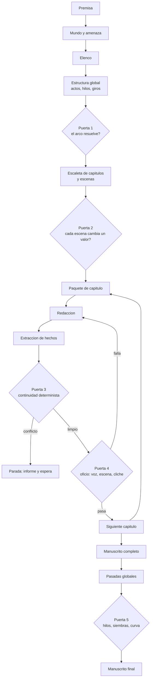
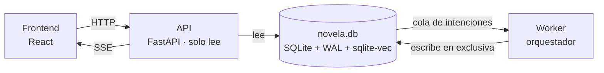

# Architecture — Sistema de agentes

## Estructura del monorepo

El proyecto es un monorepo con estas carpetas principales:

- **`src/`** — todo el código del programa.
  - **`src/backend/`** — FastAPI + Python.
  - **`src/frontend/`** — React + Three.js.
- **`specs/`** — especificaciones del programa, una por `.md`.
- **`docs/`** — definiciones del proyecto (este documento entre ellas).

`src/backend/` y `src/frontend/` están creadas pero sin scaffolding todavía; ver sus respectivos `README.md` para el estado actual.

## El sistema

Lo que se construye es un **sistema con dos mitades**: un backend que genera la novela y un frontend desde el que se arranca, se vigila y se lee. No es una librería ni un script: es una aplicación con servidor e interfaz.

| Mitad | Tecnología | De qué responde |
| --- | --- | --- |
| **Backend** | **FastAPI** + Python | Ejecuta el pipeline de agentes, mantiene el canon y aplica las puertas. FastAPI es el borde HTTP entre las dos mitades: no llama al modelo ni orquesta nada. |
| **Frontend** | **React** + Three.js | Configurar la obra, arrancar y parar la generación, ver el pipeline correr y leer el manuscrito. |
| **Motor de agentes** | **Claude Code** | Ejecuta cada agente con su skill. No es una librería del backend: es el programa al que el worker invoca. |
| **Persistencia** | **SQLite** + `sqlite-vec` | Un único fichero con el grafo de estado, el texto de los capítulos y los embeddings. |

Las dos mitades se detallan en [Arquitectura de ejecución](#arquitectura-de-ejecución) y [Arquitectura del frontend](#arquitectura-del-frontend).

### Restricción que condiciona el resto

**Límite de contexto: 100.000 tokens por llamada al modelo.** No es un detalle de implementación: es la restricción que da forma a todo el pipeline. Obliga a que el contexto se ensamble por selección y no por volcado, y es la razón de que la unidad de trabajo sea el capítulo y no el acto.

## Principios de diseño

Siete decisiones que condicionan todo lo demás. Están antes que el diagrama porque explican por qué el pipeline tiene la forma que tiene.

**1. Autónomo, con intervención de excepción.** El sistema genera de principio a fin sin que nadie apruebe cada paso. La intervención humana existe, pero es excepción: parar, corregir y relanzar desde un punto. No es un asistente de escritura ni un flujo de aprobaciones.

**2. La coherencia gana a la riqueza.** Ante el dilema entre una escena más viva y una novela que no se contradice, gana la novela. Se acepta que cada escena cueste más a cambio de que el manuscrito no se contradiga nunca.

**3. Todo lo que el texto fija, se captura.** Si la prosa menciona una quemadura en el antebrazo, esa quemadura es canon a partir de ese momento. La extracción de hechos no es un paso opcional de limpieza: es parte de producir una escena, y una escena sin extraer no está terminada.

**4. La fricción es información.** Si el sistema se detiene catorce veces en el primer acto, el problema no son las paradas: es que el canon estaba mal especificado y conviene saberlo ahí y no doscientas páginas después. No se relajan las puertas para que el pipeline fluya.

**5. Lo determinista va antes que el juicio.** Todo lo que la ontología modela como estado se verifica con consultas al grafo, no preguntándole a un modelo. El juicio se reserva para voz, subtexto, función de escena y cliché. Ver [validators.md](validators.md).

**6. El capítulo es la unidad de trabajo.** Es lo que se produce, se verifica y se da por bueno de una vez. Más pequeño (la escena) impide que el redactor vea el arco; más grande (el acto) no cabe en 100.000 tokens junto con su canon, y además detecta los conflictos demasiado tarde.

**7. El contexto se selecciona, nunca se vuelca.** Con 100.000 tokens de techo, ningún agente puede recibir el canon entero ni el manuscrito anterior. Todo lo que entra en una llamada entra porque el orquestador decidió que esa unidad lo necesita.

## Fuente de verdad

El **grafo de estado** es el canon; el manuscrito es su manifestación. Pero el redactor no escribe rellenando huecos: escribe con libertad dentro de su paquete de contexto, y lo que fije en la página se incorpora al grafo inmediatamente después.

De ahí salen dos reglas duras:

- **Un `Hecho` establecido no se borra por una pasada de prosa.** La revisión puede cambiar *cómo* se dice algo; no puede hacer que deje de decirse. Una pasada que elimina un hecho falla, no se aplica.
- **Cada tipo de pasada tiene permisos sobre el grafo.** La estructural puede alterar estado; la de línea, la de estilo y la de continuidad solo pueden tocar prosa. El permiso es por tipo de pasada, no por agente.

> **Decisión sin entrevistar.** Estas dos reglas y el alcance de la revalidación en cascada las decidí yo, no salieron de la entrevista. Son el punto más probable de tener que rehacerse.

## Los agentes

Un agente por fase del proceso. Cada uno tiene una entrada, una salida y un criterio de terminación, y ninguno ve más contexto del que su fase necesita.

Los agentes son el punto donde se encuentran los otros tres documentos de `docs/`, y ninguno de los tres es opcional:

- **[definitions.md](definitions.md)** dice **qué escribe** cada agente. Un agente no inventa su salida: rellena entidades de la ontología, y lo que no está modelado ahí no puede producirlo.
- **[domain-knowledge.md](domain-knowledge.md)** dice **con qué criterio** la escribe. Sus 55 principios son el oficio; sin ellos un agente produce texto correcto y narrativamente inerte.
- **[validators.md](validators.md)** dice **cómo se comprueba** que lo hizo bien, y con qué etiqueta del Trust Spec.

> **Decisión sin entrevistar.** Lo decidido es el *criterio* de reparto —uno por fase, frente a uno por capa de oficio, redactor único con herramientas, o fases más críticos en paralelo—. **Cuáles son esas fases, y por tanto cuántos agentes hay, lo derivé yo** del proceso manual de escritura. La tabla es una propuesta, no una decisión tomada.
>
> El **extractor** merece mención aparte: no corresponde a ninguna fase del oficio humano. Existe solo porque quien escribe es un modelo sin memoria entre llamadas, y porque la coherencia gana a la riqueza (principios 2 y 3). Un escritor humano no extrae sus propios hechos a una base de datos.
>
> Las fronteras entre agentes se ven bien cuando se define qué produce cada uno exactamente, así que esta tabla se revisa al escribir la primera spec.
>
> **Decisión entrevistada el 21 de septiembre de 2026.** El **revisor** se añadió como décimo agente para que las pasadas globales tuvieran dueño y la lista de carpetas coincidiera con la de agentes. En la misma revisión, y ya sin entrevista, se asignó `EstiloNarrativo` al arquitecto, `LineaDeTiempo` al constructor de mundo y `Objeto` al estructurador, porque eran entidades de la ontología que ningún agente escribía. Son las asignaciones más discutibles de la tabla.

| Agente | Produce | Termina cuando |
| --- | --- | --- |
| **Arquitecto** | Premisa, logline, pregunta dramática, tema, subgénero dominante, tipo de final y `EstiloNarrativo` | Las tres compresiones son coherentes entre sí, el final está declarado y el estilo está fijado |
| **Constructor de mundo** | `Mundo`, `SistemaTecnologico`, `Lugar`, `Faccion`, `Amenaza` con sus reglas, `LineaDeTiempo` | Toda regla que la trama vaya a usar está escrita, incluidos límites y costes |
| **Diseñador de elenco** | `Personaje` con su cadena fantasma→herida→mentira→defecto, arco y rol narrativo | Ningún personaje duplica la función de otro y el oponente tiene argumento propio |
| **Estructurador** | `Acto`, `HiloNarrativo`, `PuntoDeGiro`, `Siembra` inicial y los `Objeto` que la trama necesita | Los hilos abren y cierran en orden, y el clímax responde la pregunta dramática |
| **Escaletador** | `Capitulo`, `Secuencia`, `Escena` con POV, objetivo, conflicto y valor en juego | Ninguna escena tiene `valorInicial` igual a `valorFinal` |
| **Redactor** | La prosa de las escenas de un capítulo | El capítulo está escrito entero, sin marcadores pendientes |
| **Extractor** | `Hecho`, `EstadoDeConocimiento`, `EstadoObjeto`, `EstadoPersonaje`, `Evento` | Todo lo que el texto afirma está registrado en el grafo |
| **Revisor de continuidad** | Informe de conflictos contra el canon | No hay contradicciones, o las hay y el pipeline para |
| **Revisor de oficio** | Informe de voz, subtexto, función de escena y cliché | Cada criterio tiene veredicto contra su principio de [domain-knowledge.md](domain-knowledge.md) |
| **Revisor** | El manuscrito revisado: las cuatro [pasadas globales](#pasadas-de-revisión), en orden | Las cuatro pasadas han corrido sin mezclarse y toda escena tocada ha vuelto a pasar la puerta 3 |

`Restriccion` no la escribe ningún agente: la fija el usuario desde el frontend al configurar la obra (longitud objetivo, público, política de contenido) y entra al pipeline como dato de entrada. El arquitecto la lee; no la inventa.

### Agentes y sus skills

Cada agente se materializa como una **skill de Claude Code**: una carpeta en `.claude/skills/` con su `SKILL.md`, donde vive el oficio que ese agente necesita y solo ese. Es la aplicación del principio 7 al conocimiento: igual que ningún agente recibe el canon entero, ninguno recibe los 55 principios del oficio.

| Agente | Skill | Ontología que escribe ([definitions.md](definitions.md)) | Oficio que aplica ([domain-knowledge.md](domain-knowledge.md)) |
| --- | --- | --- | --- |
| **Arquitecto** | `arquitecto` | `Novela`, `Tema`, `Motivo`, `EstiloNarrativo` | 1, 7, 8, 28 · 39, 52 |
| **Constructor de mundo** | `mundo` | `Mundo`, `SistemaTecnologico`, `Lugar`, `Faccion`, `Amenaza`, `LineaDeTiempo` | 43, 44, 46, 47, 48, 53 |
| **Diseñador de elenco** | `elenco` | `Personaje` | 20, 21, 22, 24, 25, 27 · 50 |
| **Estructurador** | `estructura` | `Acto`, `HiloNarrativo`, `PuntoDeGiro`, `Siembra`, `Objeto` | 2, 3, 4, 5, 6, 15, 16, 18 · 51, 54 |
| **Escaletador** | `escaleta` | `Capitulo`, `Secuencia`, `Escena`, `Beat`, `Secuela` | 9, 10, 11, 12, 13, 17, 23 · 41, 45 |
| **Redactor** | `redaccion` | — (escribe prosa, no ontología) | 28, 29, 30, 31, 32, 33, 34, 35, 36, 37 · 40, 42, 49 |
| **Extractor** | `extraccion` | `Hecho`, `EstadoDeConocimiento`, `EstadoObjeto`, `EstadoPersonaje`, `Evento` | 26 |
| **Revisor de continuidad** | `continuidad` | — (solo lee) | 14, 26 · 44 |
| **Revisor de oficio** | `oficio` | — (solo informa) | 10, 19, 25, 29, 31, 33, 38 · 55 |
| **Revisor** | `revision` | — (reescribe prosa; el estado que altere la pasada estructural vuelve a pasar por el extractor) | 11, 13, 16, 17, 19, 26, 29, 32, 36, 38 |

**El redactor y el revisor son los únicos agentes que producen algo que no es ontología.** Escriben prosa; que esa prosa se convierta en canon es trabajo del extractor. Esa asimetría es justo la razón de que el extractor exista y de que un capítulo sin extraer no esté terminado (principio 3).

Los números remiten a los principios numerados de [domain-knowledge.md](domain-knowledge.md); el punto separa el oficio general del propio del terror espacial (capa 5).

**Tres cosas que la tabla hace evidentes:**

- **El redactor carga con la capa 4 casi entera.** Es el agente con más oficio encima y en el que más caro sale equivocarse, lo que refuerza que la puerta 4 reintente en vez de dejar pasar.
- **El extractor casi no tiene oficio.** Solo el principio 26, y de rebote. Confirma lo que ya dice la nota de arriba: no es una fase del oficio humano, es una consecuencia de que escriba un modelo sin memoria. Su dificultad es de exhaustividad, no de criterio.
- **El revisor de continuidad no escribe ontología ni necesita juicio.** Su puerta es SQL (principio 5). La skill existe solo para redactar el informe cuando ya hay conflicto.

**Ninguna de estas skills existe todavía.** La única que hay en `.claude/skills/` es `verificacion`, que es de desarrollo: sirve para construir este sistema, no forma parte de él. Las diez de la tabla se escriben junto con la spec de su agente, no antes.

El **orquestador** no es un agente: es código. Decide qué fase toca, ensambla los paquetes de contexto, ejecuta las puertas y aplica la política de fallo.

## El motor de los agentes: Claude Code

Los agentes **no son llamadas a una API de modelo**. Cada uno es una invocación de **Claude Code** con su skill cargada. El orquestador sigue siendo código propio; quien escribe, extrae y juzga es Claude Code.

Tres capas, y conviene no confundirlas:

| Capa | Qué hace | Quién lo hace |
| --- | --- | --- |
| **FastAPI** | Borde HTTP entre backend y frontend. No ve el modelo nunca. | Código propio |
| **Orquestación** | Qué fase toca, ensamblado del paquete de contexto, puertas, política de fallo, reanudación. | Código propio, en el worker |
| **Ejecución del agente** | Escribir, extraer, juzgar. | Claude Code, con la skill de ese agente |

### Por qué esto y no la API

- **Un solo servicio.** No hay clave de proveedor que gestionar ni un segundo sistema del que depender.
- **Las skills dejan de ser una metáfora.** La [tabla de agentes y skills](#agentes-y-sus-skills) describe carpetas reales en `.claude/skills/` que Claude Code carga. Contra una API, «la skill del redactor» sería un prompt y nada más.
- **El oficio se versiona con el repositorio.** [domain-knowledge.md](domain-knowledge.md) y las skills que lo reparten viven en el mismo árbol de git que el código que las invoca, y cambian en el mismo commit.

Esto cierra la pendiente de *modelos por fase* tal como estaba planteada: la elección de modelo deja de ser un parámetro de cada llamada del orquestador.

### Cómo invoca el worker a Claude Code

Dos formas, y las dos son Claude Code:

| Forma | Qué es | A cambio |
| --- | --- | --- |
| **La terminal, como subproceso** | El worker ejecuta `claude` en modo no interactivo y lee su salida. | Lo más simple de arrancar y de ver funcionar. Hay que serializar entrada y salida a través de la frontera del proceso. |
| **El Claude Agent SDK** | El mismo motor, pero como librería, sin subproceso. | Mejor integración con el worker y con el manejo de errores. Más acoplamiento. |

Sin decidir. Empezar por la terminal y migrar al SDK es barato; al revés no.

### Las dos gestiones de contexto se pisan

Es el punto de fricción real de esta decisión, y no existía mientras el agente era una llamada a una API.

El principio 7 dice que **el contexto se selecciona, nunca se vuelca**: lo que entra en una llamada entra porque el orquestador lo decidió. Pero Claude Code trae su propia gestión de contexto —lee ficheros por su cuenta, busca por el repositorio, compacta cuando se llena—. Si no se acota, el agente ignora el paquete que se le montó y se pone a leer lo que le parece; con ello se pierden a la vez el presupuesto de tokens y la garantía de que la selección la hizo el orquestador.

De ahí una regla dura: **el paquete de capítulo se le entrega al agente, y el agente no busca canon por su cuenta.**

Cómo se impone —qué herramientas se le permiten, si el canon entra por la entrada o como ficheros acotados, qué pasa cuando Claude Code decide compactar a mitad de un capítulo— está sin decidir, y es la primera pregunta que tiene que responder la spec del redactor.

## Fases del pipeline



La planificación corre una vez. El bucle central —paquete, redacción, extracción, puertas— se repite por capítulo. Las pasadas globales corren sobre el manuscrito terminado.

### El proceso, paso a paso

1. **Planificación.** Arquitecto, constructor de mundo, diseñador de elenco y estructurador corren una sola vez, en ese orden, y cada uno escribe su parte del canon en el grafo. La **puerta 1** comprueba que el arco resuelve antes de dejar bajar a capítulos.
2. **Escaleta.** El escaletador convierte la estructura en capítulos, secuencias y escenas con POV, objetivo, conflicto y valor en juego. La **puerta 2** verifica que ninguna escena deja el valor donde estaba.
3. **Paquete de capítulo.** El orquestador —que es código, no agente— selecciona del grafo lo que este capítulo necesita y lo ajusta al presupuesto de tokens. Nada se vuelca entero.
4. **Redacción.** El redactor escribe las escenas del capítulo con libertad dentro de ese paquete.
5. **Extracción.** El extractor lee la prosa recién escrita y registra en el grafo todo lo que el texto ha fijado. Hasta aquí, el capítulo no está terminado.
6. **Puerta 3, continuidad.** Consultas SQL contra el canon. Si hay conflicto, **el pipeline para** y espera a un humano: nunca se acumula deuda narrativa.
7. **Puerta 4, oficio.** Con la 3 limpia se juzgan voz, subtexto, función de escena y cliché. Si falla, vuelve al paso 4 con el criterio incumplido; a los tres intentos escala a parada.
8. **Siguiente capítulo.** Se recomprime el estado rodante y se vuelve al paso 3. Los pasos 3 a 8 son el bucle central, y son también la unidad de transacción: texto, hechos y avance de estado entran juntos o no entra nada.
9. **Pasadas globales.** Con el manuscrito completo, el revisor aplica las cuatro pasadas de revisión en orden y sin mezclarlas, y la **puerta 5** corre sobre el conjunto.

Los pasos 1, 2, 4, 5, 9 y la parte de juicio del 7 los hace un agente. Todo lo demás es código; el reparto completo está en [Qué es código y qué es agente](#qué-es-código-y-qué-es-agente).

## Gestión de contexto

Ningún agente recibe el canon entero. El orquestador ensambla un **paquete de capítulo** con exactamente lo que esa unidad necesita, y esa selección es código determinista, no una búsqueda que el agente hace por su cuenta.

| Registro | Se actualiza | Qué aporta al paquete |
| --- | --- | --- |
| **Canon** | Casi nunca | Las entradas de `Mundo`, `SistemaTecnologico`, `Personaje` y `Lugar` que este capítulo toca |
| **Estructura** | Al resolverse un hilo | La escaleta del capítulo actual y el estado de los hilos vivos |
| **Estado rodante** | Cada capítulo | Sinopsis comprimida de lo escrito hasta aquí |
| **Registro de hechos** | Tras cada capítulo | Solo los `Hecho` relevantes al reparto y al lugar de estas escenas |
| **Siembras** | Tras cada capítulo | Las que deben regarse o pagarse en este tramo |
| **Conocimiento** | Tras cada escena | El `EstadoDeConocimiento` filtrado al reparto de este capítulo |
| **Estilo** | Nunca | `EstiloNarrativo` completo: es corto y aplica siempre |

El registro de hechos es *append-only* y se consulta, nunca se vuelca entero. El de conocimiento es el que más barato resulta de olvidar y el que más caro sale: es la fuente número uno de errores de continuidad en obra larga.

### Presupuesto de contexto

Con un techo de 100.000 tokens, el paquete no puede crecer con la novela: un manuscrito de 90.000 palabras no cabe, y hacia el capítulo 30 el canon acumulado tampoco. El presupuesto es por tanto **fijo y repartido**, y el orquestador lo calcula antes de cada llamada:

| Bloque | Presupuesto | Qué pasa si no cabe |
| --- | --- | --- |
| Instrucciones del agente y `EstiloNarrativo` | Fijo y pequeño | No se recorta: es lo que garantiza la consistencia de voz |
| Escaleta del capítulo actual | Fijo | No se recorta: es la tarea |
| Canon filtrado (personajes, lugares, sistemas de este capítulo) | Acotado | Se recorta por relevancia al reparto y al lugar |
| Hechos y conocimiento del reparto | Acotado | Se recorta a los personajes presentes, nunca al resto |
| Siembras vivas en este tramo | Pequeño | No se recorta: es barato y su olvido es caro |
| Estado rodante (sinopsis comprimida) | **Elástico** | Es el bloque que absorbe la presión: se recomprime a medida que la novela crece |
| Texto del capítulo anterior | Elástico | Primero en caer; se sustituye por su resumen |

El **estado rodante** es la válvula: una sinopsis comprimida que se reescribe tras cada capítulo manteniendo un tamaño aproximadamente constante. Es lo que permite que el capítulo 40 quepa en el mismo presupuesto que el capítulo 2.

Dos consecuencias que conviene tener presentes:

- **La compresión pierde información, y por eso el grafo existe.** Lo que se comprime es la narración de lo ocurrido, no los hechos: esos viven en el registro y se consultan íntegros. Si algo solo está en el estado rodante, tarde o temprano se pierde.
- **Superar el presupuesto es un fallo del orquestador, no del modelo.** Si un paquete no cabe, la respuesta correcta es partir la unidad o recomprimir, nunca truncar el canon.

## Arquitectura de ejecución

> **Decisión sin entrevistar.** Esta sección se aceptó sin la entrevista que exige `AGENTS.md`. Descansa sobre tres premisas no verificadas: **un solo autor**, **una obra a la vez** y **ejecución en máquina propia, sin usuarios ajenos**. Si alguna cae, la sección se rehace entera.

El patrón es **web-queue-worker**: dos procesos sobre una única base de datos, con la cola dentro de esa misma base.



La API **no ejecuta el pipeline**. Escribe una intención (`arrancar`, `parar`, `relanzar desde el capítulo N`) en una tabla y el worker la recoge. El orquestador vive en el worker; la API ni lo importa.

### Por qué esta forma y no otra

| Alternativa | Por qué se descarta |
| --- | --- |
| **Tareas en el propio proceso** (`BackgroundTasks`) | El pipeline dura horas y muere con el proceso. No deja nada que restaurar, y la reanudación de este sistema es restaurar el grafo al final del capítulo N-1, no reintentar un paso. |
| **Cola con broker** (Celery, RQ + Redis) | Añade un servicio que administrar y una segunda sede del estado, justo lo que la decisión de SQLite evita. Resuelve fan-out y concurrencia; aquí hay una sola tarea en serie. |
| **Motor de ejecución durable** (Temporal, Prefect) | Regala reanudación y reintentos a cambio de una **segunda fuente de verdad**: el estado del flujo en el motor y el canon en SQLite. Esos dos se desincronizan, que es el fallo que el principio 3 existe para evitar. La reanudación que hace falta es de dominio, no de flujo. |
| **Un solo proceso** | Impide reiniciar la API sin matar una generación en curso. |

### El escritor único

SQLite admite un escritor a la vez. Con dos procesos, esto deja de ser trivia y pasa a ser una regla de diseño:

- **El worker escribe. La API solo lee.** Única excepción: insertar una fila en la tabla de intenciones.
- `PRAGMA journal_mode=WAL` — lectores y escritor no se bloquean entre sí.
- `PRAGMA busy_timeout` distinto de cero.

Sin esta regla, el fallo aparece como `database is locked` en mitad de un capítulo.

### La cola es una tabla

Una tabla `intencion` y un worker que hace *polling* cada pocos segundos. No hace falta más: la latencia aceptable se mide en segundos y el *throughput* es una tarea.

La ventaja no es la simplicidad, es la transaccionalidad: **encolar el capítulo siguiente entra en la misma transacción** que guardar el anterior con sus hechos extraídos. La unidad de encolado y la unidad de trabajo coinciden.

### Organización del código: cortes verticales

**Una carpeta por tipo de tarea.** El corte es vertical: cada tarea del pipeline se lleva dentro todo lo suyo —su esquema de entrada y salida, su servicio, su prompt si es agente, su puerta si la tiene, sus pruebas— en vez de repartirse entre una carpeta de rutas, otra de modelos y otra de servicios.

```text
src/backend/
├── main.py              # monta los routers de cada tarea
├── config.py
├── compartido/          # lo transversal: db, grafo, contexto, puerto al modelo
└── tareas/
    ├── arquitecto/
    ├── mundo/
    ├── elenco/
    ├── estructura/
    ├── escaleta/
    ├── redaccion/
    ├── extraccion/
    ├── continuidad/
    ├── oficio/
    └── revision/
```

Dentro de cada tarea, siempre los mismos ficheros: `router.py` si se expone por HTTP, `esquemas.py`, `servicio.py`, `prompt.py`, `puerta.py`, y sus pruebas al lado.

**La lista de carpetas es la lista de agentes**, con el mismo nombre que su skill, así que se mueve con ella: mientras la tabla de agentes siga siendo una propuesta, esta estructura también lo es.

**Dos reglas la sostienen:**

- **Una tarea no importa de otra.** Si dos la necesitan, eso baja a `compartido/`. El día que una tarea importe de otra, el corte vertical ha dejado de existir.
- **FastAPI solo aparece en los `router.py`.** FastAPI es el borde HTTP entre backend y frontend; no llama al modelo, no orquesta y no toca el grafo. Quien invoca a Claude Code es el worker, a través del puerto de `compartido/`.

**Qué vive en `compartido/` y por qué no es una vía de escape:** solo lo que es infraestructura o canon —la conexión y las transacciones, el grafo de [definitions.md](definitions.md), el ensamblado de paquetes de contexto y el **puerto que invoca a Claude Code**—. Nada de lógica de una fase concreta.

Ese puerto es la única abstracción real del backend: absorbe la decisión pendiente entre terminal y SDK, y es lo que permite probar el orquestador sin gastar dinero ni depender de la no determinación de un agente. SQLite y el sistema de ficheros no se van a cambiar nunca: no llevan puerto. `compartido/` creciendo sin parar es la señal de que el corte está mal hecho.

**Por qué vertical y no por capas.** Cada tarea de este pipeline tiene poco que ver con la siguiente: el extractor y el redactor no comparten nada salvo el grafo. Un corte por capas los obligaría a compartir carpeta de servicios sin compartir nada real, y tocar una fase significaría abrir cinco directorios. El corte vertical hace que trabajar en una fase sea abrir una carpeta, que es también lo que hace que cada una pueda tener su propia spec y sus propias evals —empezando por el extractor.

### Comunicación con el frontend

**SSE para el progreso, `GET` para la verdad.** Un endpoint de eventos emite lo que va ocurriendo; un `GET` normal devuelve el estado completo. Si el stream se cae, el frontend reconsulta y se recupera.

**Ninguna decisión del frontend depende de haber recibido un evento.** El stream es comodidad; la tabla `ejecucion` es el estado. WebSockets pagaría una bidireccionalidad que no se usa; el *polling* puro perdería el ver aparecer el capítulo.

## Arquitectura del frontend

> **Decisión sin entrevistar.** Igual que la sección anterior. Además descansa sobre una decisión todavía abierta —**qué ve el frontend**—, así que aquí solo está el esqueleto: lo que se sostiene sea cual sea la respuesta.

**Agrupación por funcionalidad (*package by feature*), sin Feature-Sliced Design.** Una carpeta por funcionalidad, con sus componentes, sus hooks de datos y sus tipos dentro. Es el mismo criterio que en el backend: el corte sigue al trabajo, no a la técnica.

```text
src/frontend/src/
├── app/                 # arranque, rutas, providers
├── compartido/          # primitivos de UI, cliente de API generado, hooks base
└── funcionalidades/
    ├── novela/          # crear y configurar la obra
    ├── ejecucion/       # arrancar, parar, ver el pipeline correr
    ├── canon/           # consultar el grafo
    └── manuscrito/      # leer capítulos y comparar versiones
```

**Se descarta FSD** explícitamente. Feature-Sliced Design impone capas (`entities`, `widgets`, `features`, `pages`) con reglas de importación jerárquicas entre ellas. Resuelve un problema de equipos grandes y disciplina compartida; aquí añadiría ceremonia sin resolver nada, y su capa de `entities` duplicaría lo que ya modela [definitions.md](definitions.md).

**Una funcionalidad no importa del interior de otra.** Si necesitan compartir algo, baja a `compartido/`; si necesitan componerse, se componen en `app/`.

### El frontend observa, no posee

El pipeline corre solo durante horas y el frontend no lo controla (principio 1). Eso invierte lo habitual: **no hay estado de cliente que merezca la pena**, porque el estado vive en SQLite. Lo que hay es una caché de lo que el servidor dice.

- **Nada de un almacén global que duplique datos del servidor.** Lo que hace falta es una capa de *server state* con su caché, su revalidación y sus reintentos. El estado propiamente de cliente —qué panel está abierto, qué capítulo se está leyendo— es poco y va aparte.
- **Los eventos SSE invalidan, no rellenan.** Un evento avisa de que algo cambió; el frontend vuelve a consultar. Si construyera su estado a partir de los eventos, perder uno lo dejaría desfasado en silencio, y eso rompería desde el frontend la regla de que el `GET` es la verdad.
- **La reconexión es un caso de primera clase, no un error.** Esto va a estar abierto horas: el equipo se suspende, la red salta. Al reconectar hay que reconsultar el estado completo, porque lo ocurrido mientras tanto se perdió.

### Los tipos se generan

FastAPI publica OpenAPI. El cliente TypeScript se genera desde ahí en vez de escribirse a mano: elimina de raíz el desajuste entre un esquema Pydantic que cambia y un frontend que sigue creyendo en el campo viejo.

### Pendiente antes de poder cerrarla

- **Qué ve el frontend**: panel de control de un proceso, o sala de lectura del manuscrito. Las dos llevan a interfaces que no se parecen, y de ahí cuelga el reparto de pantallas.
- **Three.js**: aparece en el stack sin una razón escrita. Si es para visualizar el grafo de canon, conviene contrastarlo con 2D antes de comprometerse: un grafo tridimensional se ocluye y cuesta leerlo. Si es para una pieza expresiva —la novela como objeto—, es una decisión de producto que debe declararse como tal.

## Persistencia

Un solo SQLite guarda las tres cosas: el grafo de estado, el texto y los vectores. No hay base de datos aparte para el manuscrito ni almacén vectorial separado, y eso es deliberado: si el texto y el estado vivieran en sistemas distintos podrían desincronizarse, que es justo el fallo que el principio 3 pretende evitar.

### Qué guarda

| Grupo | Tablas | Naturaleza |
| --- | --- | --- |
| **Canon** | `novela`, `restriccion`, `mundo`, `sistema_tecnologico`, `lugar`, `personaje`, `faccion`, `amenaza`, `objeto`, `linea_de_tiempo`, `tema`, `motivo`, `estilo_narrativo` | Cambia poco; cada cambio se versiona |
| **Estructura** | `acto`, `capitulo`, `secuencia`, `escena`, `secuela`, `beat`, `punto_de_giro`, `hilo`, `siembra` | El plan de la obra. `siembra` va aquí porque la planifica el estructurador, aunque su `estado` se actualice durante la redacción; [definitions.md](definitions.md) la agrupa con el estado por esa segunda razón |
| **Estado** | `hecho`, `estado_conocimiento`, `estado_personaje`, `estado_objeto`, `evento` | Append-only; es lo que consultan las puertas deterministas |
| **Texto** | `escena_texto` con versión, `capitulo_compilado` | Cada reescritura es una versión nueva, no un `UPDATE` |
| **Vectores** | Tablas virtuales `vec0` sobre el texto de escena y sobre los hechos | Índice derivado, reconstruible |
| **Traza** | `ejecucion`, `llamada_modelo`, `resultado_puerta` | Observabilidad: qué agente produjo qué y con qué contexto |

### Por qué SQLite encaja

- **Transaccional.** El texto de un capítulo, los hechos extraídos de él y el avance del estado se escriben **en una sola transacción**. O entra todo o no entra nada: no puede existir un capítulo escrito cuyos hechos no se hayan capturado. La unidad de transacción es la misma que la unidad de trabajo.
- **Un fichero.** La reanudación desde el capítulo N es restaurar un estado concreto, y con un único fichero eso es una operación trivial y auditable.
- **Un solo escritor, y eso obliga.** SQLite admite un escritor a la vez, así que la separación API/worker no es estética: el worker escribe y la API lee, con WAL activado. Ver [Arquitectura de ejecución](#arquitectura-de-ejecución).
- **Embebido.** No hay servicio que administrar, y el backend de FastAPI lo abre directamente. Para un sistema de un solo autor y una obra a la vez, cualquier cosa mayor es infraestructura sin contrapartida.
- **Consultable.** Las puertas deterministas de [validators.md](validators.md) son consultas SQL, no llamadas a un modelo. Esto es lo que hace barato el principio 5.

### Qué papel tienen los vectores, y cuál no

La búsqueda vectorial sirve para **recuperar**, nunca para **verificar**. Esta es la línea que no se cruza:

**Sí** — recuperar hechos o escenas relevantes cuando el filtro por reparto y lugar no basta ("¿se ha descrito ya este pasillo, y cómo?"); detectar repetición de imágenes, gestos y fórmulas a lo largo de la obra, que es un problema real de la prosa generada; encontrar la escena donde se sembró algo cuando la relación explícita se perdió; ayudar al orquestador a decidir qué entradas de canon entran en el paquete cuando sobran candidatas para el presupuesto.

**No** — decidir si hay una contradicción de continuidad. Eso es una consulta sobre `hecho` y `estado_conocimiento`, con respuesta exacta. La similitud semántica da respuestas aproximadas, y una puerta que a veces falla no es una puerta. Si una comprobación depende de un vecino más cercano, no pertenece a la puerta 3.

El índice vectorial es **derivado**: se puede borrar y reconstruir desde el texto y los hechos sin perder nada. Ninguna decisión del pipeline depende de que exista.

## Puertas de control

Cinco puertas. Las deterministas van primero porque son baratas y su fallo invalida el trabajo posterior: no tiene sentido evaluar la prosa de una escena que contradice el canon. El catálogo completo de métodos está en [validators.md](validators.md).

| Puerta | Cuándo | Qué comprueba | Etiqueta |
| --- | --- | --- | --- |
| **1. Estructura** | Tras la estructura global | El clímax responde la pregunta dramática; los hilos cierran en orden inverso al de apertura; el arco del protagonista resuelve | `A` + `I` |
| **2. Escaleta** | Tras la escaleta | Toda escena tiene POV declarado y cambia un valor; ninguna escena carece de conflicto; presupuesto de longitud dentro de rango | `A` |
| **3. Continuidad** | Tras extraer los hechos del capítulo | Contradicción con el canon; conocimiento no adquirido; presencia imposible; coherencia temporal | `A` |
| **4. Oficio** | Con la puerta 3 limpia | Voz constante, distancia psíquica modulada, subtexto en diálogo, emoción no nombrada, la escena se gana su lugar, cliché — principios 10, 19, 25, 29, 31, 33, 38 y 55 de [domain-knowledge.md](domain-knowledge.md) | `I` |
| **5. Global** | Sobre el manuscrito completo | Siembras sin pagar e hilos sin cerrar (`A`); reglas de la amenaza respetadas de principio a fin (`I`, exige interpretar el texto); curva de tensión en lectura continua (`D`) — principios 6, 14, 16, 18 y 44 | `A` + `I` + `D` |

## Política de fallo

**La puerta 3 para el pipeline.** Un conflicto de continuidad no se marca ni se acumula: se detiene la generación, se emite un informe con el conflicto, el hecho que lo origina y la escena donde quedó establecido, y no se avanza hasta que un humano decida. Nunca se acumula deuda narrativa silenciosa.

**La puerta 4 reintenta.** Un fallo de oficio devuelve el capítulo al redactor con el criterio incumplido. Tras tres intentos sin pasar, escala a parada: si el capítulo no se puede escribir bien, el problema probablemente está en la escaleta y no en la prosa.

**Reanudación.** El estado es la unidad de reanudación, no el texto. Relanzar desde el capítulo N significa restaurar el grafo a como estaba al terminar N-1 y volver a ensamblar el paquete. Los hechos extraídos de capítulos posteriores se revierten con él.

## Pasadas de revisión

Cuando el primer manuscrito completo existe, se aplican las pasadas del oficio en orden y **sin mezclarlas**, que es la regla que las hace útiles: cada una tiene un objetivo y una altitud distinta, y pulir prosa que se va a eliminar es trabajo perdido.

| Pasada | Objetivo | Oficio | Permiso sobre el grafo |
| --- | --- | --- | --- |
| **Estructural** | Estructura, causalidad, arcos, ritmo, función de cada escena | 11, 13, 17, 19 | Puede alterar estado |
| **De línea** | Párrafo y frase: claridad, ritmo, voz, transiciones, concisión | 29, 32, 36 | Solo prosa |
| **De continuidad** | Cotejo completo contra el canon, incluidas las siembras | 16, 26 | Solo lectura |
| **De estilo** | Mecánica, consistencia léxica, tics prohibidos, ortografía de nombres inventados | 36, 38 | Solo prosa |

Toda escena que una pasada toque vuelve a extraerse y a pasar la puerta 3, junto con las escenas que dependen de sus hechos.

## Qué es código y qué es agente

La separación no es de conveniencia: es la misma decisión que fija `validators.md`. Todo lo que tiene una respuesta correcta única es código.

**Código** — el orquestador y su máquina de estados; el ensamblado de paquetes de contexto y el cálculo del presupuesto de tokens; el registro de hechos y sus consultas; el seguimiento de conocimiento por personaje; el estado de hilos y siembras; las puertas 2 y 3 enteras y la parte determinista de las puertas 1 y 5; el presupuesto de longitud; la reanudación y el versionado del estado.

**Agente** — premisa, tema y estilo; mundo, amenaza y sus reglas; elenco y arcos; estructura y escaleta; redacción; extracción de hechos desde la prosa; las pasadas globales de revisión; los juicios de la puerta 4 y la parte de juicio de las puertas 1 y 5.

El **extractor** es la pieza frágil del diseño: es el único punto por el que el texto alimenta el grafo, y si captura mal o de menos, toda la coherencia aguas abajo se degrada sin que ninguna puerta lo note. Merece su propia spec y sus propias evals antes que ninguna otra pieza.

## Decisiones pendientes

- **Alcance de la revalidación en cascada** cuando una pasada reescribe una escena antigua: revalidar solo las escenas dependientes exige que las dependencias entre hechos estén modeladas, y eso todavía no está en [definitions.md](definitions.md).
- **Cifras concretas del presupuesto de contexto**: el reparto está definido por bloques y por prioridad de recorte, pero no en tokens. Hay que medirlo contra un capítulo real antes de fijarlo.
- **Arranque del worker**: si lo lanza el `lifespan` de la API como subproceso o son dos comandos separados. Dos comandos es más honesto de depurar; no está decidido.
- **Recuperación del worker caído a medio capítulo**: al arrancar debe detectar intenciones tomadas y sin terminar, y revertir al último capítulo íntegro. Es la parte de la reanudación que más cuidado necesita al especificarse.
- **Límites de `async`**: el worker puede ser síncrono, pero falta decidir qué consultas del grafo no pueden bloquear el bucle de eventos de la API.
- **Terminal o Agent SDK**: cómo invoca el worker a Claude Code. Lo absorbe el puerto de `compartido/`, así que es reversible, pero condiciona el manejo de errores y la traza.
- **Cómo se acota el contexto de Claude Code**: qué herramientas se le permiten a un agente y por qué vía recibe el canon, para que la gestión de contexto de Claude Code no anule el principio 7. Es la pendiente más urgente: sin ella el presupuesto de tokens no se sostiene.
- **Qué fases existen y dónde están sus fronteras**: el criterio de reparto está decidido, la lista de diez agentes no. Se entrevista al escribir la primera spec.
- **Esquema concreto de las tablas** y las migraciones: la sección de persistencia fija los grupos y la naturaleza de cada uno, no las columnas.
- **Modelo de embeddings** y su dimensión, más si los vectores se calculan por escena, por párrafo o por ambos.
- **Qué ve el frontend**: panel de control o sala de lectura, y qué papel tiene Three.js. La estructura por funcionalidades está decidida; el reparto de pantallas no.
