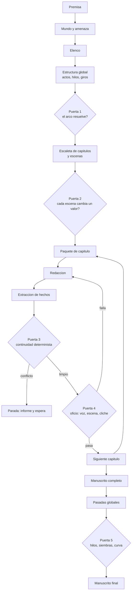

# Architecture — Sistema de agentes

## Estructura del monorepo

El proyecto es un monorepo con estas carpetas principales:

- **`src/`** — todo el código del programa.
  - **`src/backend/`** — FastAPI + Python.
  - **`src/frontend/`** — React + Three.js.
- **`specs/`** — especificaciones del programa, una por `.md`.
- **`docs/`** — definiciones del proyecto (este documento entre ellas).

`src/backend/` y `src/frontend/` están creadas pero sin scaffolding todavía; ver sus respectivos `README.md` para el estado actual.

## Requisitos técnicos

- **Backend**: FastAPI.
- **Frontend**: React.
- **Persistencia**: SQLite con extensión vectorial (`sqlite-vec`). Un único fichero guarda el grafo de estado, el texto de los capítulos y los embeddings.
- **Límite de contexto**: **100.000 tokens por llamada al modelo.** No es un detalle de implementación: es la restricción que da forma a todo el pipeline. Obliga a que el contexto se ensamble por selección y no por volcado, y es la razón de que la unidad de trabajo sea el capítulo y no el acto.

## Principios de diseño

Seis decisiones que condicionan todo lo demás. Están antes que el diagrama porque explican por qué el pipeline tiene la forma que tiene.

**1. Autónomo, con intervención de excepción.** El sistema genera de principio a fin sin que nadie apruebe cada paso. La intervención humana existe, pero es excepción: parar, corregir y relanzar desde un punto. No es un asistente de escritura ni un flujo de aprobaciones.

**2. La coherencia gana a la riqueza.** Ante el dilema entre una escena más viva y una novela que no se contradice, gana la novela. Se acepta que cada escena cueste más a cambio de que el manuscrito no se contradiga nunca.

**3. Todo lo que el texto fija, se captura.** Si la prosa menciona una quemadura en el antebrazo, esa quemadura es canon a partir de ese momento. La extracción de hechos no es un paso opcional de limpieza: es parte de producir una escena, y una escena sin extraer no está terminada.

**4. La fricción es información.** Si el sistema se detiene catorce veces en el primer acto, el problema no son las paradas: es que el canon estaba mal especificado y conviene saberlo ahí y no doscientas páginas después. No se relajan las puertas para que el pipeline fluya.

**5. Lo determinista va antes que el juicio.** Todo lo que la ontología modela como estado se verifica con consultas al grafo, no preguntándole a un modelo. El juicio se reserva para voz, subtexto, función de escena y cliché. Ver [validators.md](validators.md).

**6. El capítulo es la unidad de trabajo.** Es lo que se produce, se verifica y se da por bueno de una vez. Más pequeño (la escena) impide que el redactor vea el arco; más grande (el acto) no cabe en 100.000 tokens junto con su canon, y además detecta los conflictos demasiado tarde.

**7. El contexto se selecciona, nunca se vuelca.** Con 100.000 tokens de techo, ningún agente puede recibir el canon entero ni el manuscrito anterior. Todo lo que entra en una llamada entra porque el orquestador decidió que esa unidad lo necesita.

## Fuente de verdad

El **grafo de estado** es el canon; el manuscrito es su manifestación. Pero el redactor no escribe rellenando huecos: escribe con libertad dentro de su paquete de contexto, y lo que fije en la página se incorpora al grafo inmediatamente después.

De ahí salen dos reglas duras:

- **Un `Hecho` establecido no se borra por una pasada de prosa.** La revisión puede cambiar *cómo* se dice algo; no puede hacer que deje de decirse. Una pasada que elimina un hecho falla, no se aplica.
- **Cada tipo de pasada tiene permisos sobre el grafo.** La estructural puede alterar estado; la de línea, la de estilo y la de continuidad solo pueden tocar prosa. El permiso es por tipo de pasada, no por agente.

> **Decisión sin entrevistar.** Estas dos reglas y el alcance de la revalidación en cascada las decidí yo, no salieron de la entrevista. Son el punto más probable de tener que rehacerse.

## Los agentes

Un agente por fase del proceso. Cada uno tiene una entrada, una salida y un criterio de terminación, y ninguno ve más contexto del que su fase necesita.

| Agente | Produce | Termina cuando |
| --- | --- | --- |
| **Arquitecto** | Premisa, logline, pregunta dramática, tema, subgénero dominante, tipo de final | Las tres compresiones son coherentes entre sí y el final está declarado |
| **Constructor de mundo** | `Mundo`, `SistemaTecnologico`, `Lugar`, `Faccion`, `Amenaza` con sus reglas | Toda regla que la trama vaya a usar está escrita, incluidos límites y costes |
| **Diseñador de elenco** | `Personaje` con su cadena fantasma→herida→mentira→defecto, arco y rol narrativo | Ningún personaje duplica la función de otro y el oponente tiene argumento propio |
| **Estructurador** | `Acto`, `HiloNarrativo`, `PuntoDeGiro`, `Siembra` inicial | Los hilos abren y cierran en orden, y el clímax responde la pregunta dramática |
| **Escaletador** | `Capitulo`, `Secuencia`, `Escena` con POV, objetivo, conflicto y valor en juego | Ninguna escena tiene `valorInicial` igual a `valorFinal` |
| **Redactor** | La prosa de las escenas de un capítulo | El capítulo está escrito entero, sin marcadores pendientes |
| **Extractor** | `Hecho`, `EstadoDeConocimiento`, `EstadoObjeto`, `EstadoPersonaje`, `Evento` | Todo lo que el texto afirma está registrado en el grafo |
| **Revisor de continuidad** | Informe de conflictos contra el canon | No hay contradicciones, o las hay y el pipeline para |
| **Revisor de oficio** | Informe de voz, subtexto, función de escena y cliché | Cada criterio tiene veredicto contra su principio de `domain-knowledge.md` |

El **orquestador** no es un agente: es código. Decide qué fase toca, ensambla los paquetes de contexto, ejecuta las puertas y aplica la política de fallo.

## Fases del pipeline

La planificación corre una vez. El bucle central —paquete, redacción, extracción, puertas— se repite por capítulo. Las pasadas globales corren sobre el manuscrito terminado.

## Gestión de contexto

Ningún agente recibe el canon entero. El orquestador ensambla un **paquete de capítulo** con exactamente lo que esa unidad necesita, y esa selección es código determinista, no una búsqueda que el agente hace por su cuenta.

| Registro | Se actualiza | Qué aporta al paquete |
| --- | --- | --- |
| **Canon** | Casi nunca | Las entradas de `Mundo`, `SistemaTecnologico`, `Personaje` y `Lugar` que este capítulo toca |
| **Estructura** | Al resolverse un hilo | La escaleta del capítulo actual y el estado de los hilos vivos |
| **Estado rodante** | Cada capítulo | Sinopsis comprimida de lo escrito hasta aquí |
| **Registro de hechos** | Tras cada capítulo | Solo los `Hecho` relevantes al reparto y al lugar de estas escenas |
| **Siembras** | Tras cada capítulo | Las que deben regarse o pagarse en este tramo |
| **Conocimiento** | Tras cada escena | El `EstadoDeConocimiento` filtrado al reparto de este capítulo |
| **Estilo** | Nunca | `EstiloNarrativo` completo: es corto y aplica siempre |

El registro de hechos es *append-only* y se consulta, nunca se vuelca entero. El de conocimiento es el que más barato resulta de olvidar y el que más caro sale: es la fuente número uno de errores de continuidad en obra larga.

### Presupuesto de contexto

Con un techo de 100.000 tokens, el paquete no puede crecer con la novela: un manuscrito de 90.000 palabras no cabe, y hacia el capítulo 30 el canon acumulado tampoco. El presupuesto es por tanto **fijo y repartido**, y el orquestador lo calcula antes de cada llamada:

| Bloque | Presupuesto | Qué pasa si no cabe |
| --- | --- | --- |
| Instrucciones del agente y `EstiloNarrativo` | Fijo y pequeño | No se recorta: es lo que garantiza la consistencia de voz |
| Escaleta del capítulo actual | Fijo | No se recorta: es la tarea |
| Canon filtrado (personajes, lugares, sistemas de este capítulo) | Acotado | Se recorta por relevancia al reparto y al lugar |
| Hechos y conocimiento del reparto | Acotado | Se recorta a los personajes presentes, nunca al resto |
| Siembras vivas en este tramo | Pequeño | No se recorta: es barato y su olvido es caro |
| Estado rodante (sinopsis comprimida) | **Elástico** | Es el bloque que absorbe la presión: se recomprime a medida que la novela crece |
| Texto del capítulo anterior | Elástico | Primero en caer; se sustituye por su resumen |

El **estado rodante** es la válvula: una sinopsis comprimida que se reescribe tras cada capítulo manteniendo un tamaño aproximadamente constante. Es lo que permite que el capítulo 40 quepa en el mismo presupuesto que el capítulo 2.

Dos consecuencias que conviene tener presentes:

- **La compresión pierde información, y por eso el grafo existe.** Lo que se comprime es la narración de lo ocurrido, no los hechos: esos viven en el registro y se consultan íntegros. Si algo solo está en el estado rodante, tarde o temprano se pierde.
- **Superar el presupuesto es un fallo del orquestador, no del modelo.** Si un paquete no cabe, la respuesta correcta es partir la unidad o recomprimir, nunca truncar el canon.

## Persistencia

Un solo SQLite guarda las tres cosas: el grafo de estado, el texto y los vectores. No hay base de datos aparte para el manuscrito ni almacén vectorial separado, y eso es deliberado: si el texto y el estado vivieran en sistemas distintos podrían desincronizarse, que es justo el fallo que el principio 3 pretende evitar.

### Qué guarda

| Grupo | Tablas | Naturaleza |
| --- | --- | --- |
| **Canon** | `novela`, `restriccion`, `mundo`, `sistema_tecnologico`, `lugar`, `personaje`, `faccion`, `amenaza`, `tema`, `motivo`, `estilo_narrativo` | Cambia poco; cada cambio se versiona |
| **Estructura** | `acto`, `capitulo`, `secuencia`, `escena`, `secuela`, `beat`, `punto_de_giro`, `hilo`, `siembra` | El plan de la obra |
| **Estado** | `hecho`, `estado_conocimiento`, `estado_personaje`, `estado_objeto`, `evento` | Append-only; es lo que consultan las puertas deterministas |
| **Texto** | `escena_texto` con versión, `capitulo_compilado` | Cada reescritura es una versión nueva, no un `UPDATE` |
| **Vectores** | Tablas virtuales `vec0` sobre el texto de escena y sobre los hechos | Índice derivado, reconstruible |
| **Traza** | `ejecucion`, `llamada_modelo`, `resultado_puerta` | Observabilidad: qué agente produjo qué y con qué contexto |

### Por qué SQLite encaja

- **Transaccional.** El texto de un capítulo, los hechos extraídos de él y el avance del estado se escriben **en una sola transacción**. O entra todo o no entra nada: no puede existir un capítulo escrito cuyos hechos no se hayan capturado. La unidad de transacción es la misma que la unidad de trabajo.
- **Un fichero.** La reanudación desde el capítulo N es restaurar un estado concreto, y con un único fichero eso es una operación trivial y auditable.
- **Embebido.** No hay servicio que administrar, y el backend de FastAPI lo abre directamente. Para un sistema de un solo autor y una obra a la vez, cualquier cosa mayor es infraestructura sin contrapartida.
- **Consultable.** Las puertas deterministas de [validators.md](validators.md) son consultas SQL, no llamadas a un modelo. Esto es lo que hace barato el principio 5.

### Qué papel tienen los vectores, y cuál no

La búsqueda vectorial sirve para **recuperar**, nunca para **verificar**. Esta es la línea que no se cruza:

**Sí** — recuperar hechos o escenas relevantes cuando el filtro por reparto y lugar no basta ("¿se ha descrito ya este pasillo, y cómo?"); detectar repetición de imágenes, gestos y fórmulas a lo largo de la obra, que es un problema real de la prosa generada; encontrar la escena donde se sembró algo cuando la relación explícita se perdió; ayudar al orquestador a decidir qué entradas de canon entran en el paquete cuando sobran candidatas para el presupuesto.

**No** — decidir si hay una contradicción de continuidad. Eso es una consulta sobre `hecho` y `estado_conocimiento`, con respuesta exacta. La similitud semántica da respuestas aproximadas, y una puerta que a veces falla no es una puerta. Si una comprobación depende de un vecino más cercano, no pertenece a la puerta 3.

El índice vectorial es **derivado**: se puede borrar y reconstruir desde el texto y los hechos sin perder nada. Ninguna decisión del pipeline depende de que exista.

## Puertas de control

Cinco puertas. Las deterministas van primero porque son baratas y su fallo invalida el trabajo posterior: no tiene sentido evaluar la prosa de una escena que contradice el canon. El catálogo completo de métodos está en [validators.md](validators.md).

| Puerta | Cuándo | Qué comprueba | Etiqueta |
| --- | --- | --- | --- |
| **1. Estructura** | Tras la estructura global | El clímax responde la pregunta dramática; los hilos cierran en orden inverso al de apertura; el arco del protagonista resuelve | `A` + `I` |
| **2. Escaleta** | Tras la escaleta | Toda escena tiene POV declarado y cambia un valor; ninguna escena carece de conflicto; presupuesto de longitud dentro de rango | `A` |
| **3. Continuidad** | Tras extraer los hechos del capítulo | Contradicción con el canon; conocimiento no adquirido; presencia imposible; coherencia temporal | `A` |
| **4. Oficio** | Con la puerta 3 limpia | Voz constante, distancia psíquica modulada, subtexto en diálogo, emoción no nombrada, la escena se gana su lugar, cliché | `I` |
| **5. Global** | Sobre el manuscrito completo | Siembras sin pagar, hilos sin cerrar, curva de tensión, reglas de la amenaza respetadas de principio a fin | `A` + `D` |

## Política de fallo

**La puerta 3 para el pipeline.** Un conflicto de continuidad no se marca ni se acumula: se detiene la generación, se emite un informe con el conflicto, el hecho que lo origina y la escena donde quedó establecido, y no se avanza hasta que un humano decida. Nunca se acumula deuda narrativa silenciosa.

**La puerta 4 reintenta.** Un fallo de oficio devuelve el capítulo al redactor con el criterio incumplido. Tras tres intentos sin pasar, escala a parada: si el capítulo no se puede escribir bien, el problema probablemente está en la escaleta y no en la prosa.

**Reanudación.** El estado es la unidad de reanudación, no el texto. Relanzar desde el capítulo N significa restaurar el grafo a como estaba al terminar N-1 y volver a ensamblar el paquete. Los hechos extraídos de capítulos posteriores se revierten con él.

## Pasadas de revisión

Cuando el primer manuscrito completo existe, se aplican las pasadas del oficio en orden y **sin mezclarlas**, que es la regla que las hace útiles: cada una tiene un objetivo y una altitud distinta, y pulir prosa que se va a eliminar es trabajo perdido.

| Pasada | Objetivo | Permiso sobre el grafo |
| --- | --- | --- |
| **Estructural** | Estructura, causalidad, arcos, ritmo, función de cada escena | Puede alterar estado |
| **De línea** | Párrafo y frase: claridad, ritmo, voz, transiciones, concisión | Solo prosa |
| **De continuidad** | Cotejo completo contra el canon, incluidas las siembras | Solo lectura |
| **De estilo** | Mecánica, consistencia léxica, tics prohibidos, ortografía de nombres inventados | Solo prosa |

Toda escena que una pasada toque vuelve a extraerse y a pasar la puerta 3, junto con las escenas que dependen de sus hechos.

## Qué es código y qué es agente

La separación no es de conveniencia: es la misma decisión que fija `validators.md`. Todo lo que tiene una respuesta correcta única es código.

**Código** — el orquestador y su máquina de estados; el ensamblado de paquetes de contexto y el cálculo del presupuesto de tokens; el registro de hechos y sus consultas; el seguimiento de conocimiento por personaje; el estado de hilos y siembras; las puertas 1, 2, 3 y la parte determinista de la 5; el presupuesto de longitud; la reanudación y el versionado del estado.

**Agente** — premisa y tema; mundo, amenaza y sus reglas; elenco y arcos; estructura y escaleta; redacción; extracción de hechos desde la prosa; los juicios de la puerta 4.

El **extractor** es la pieza frágil del diseño: es el único punto por el que el texto alimenta el grafo, y si captura mal o de menos, toda la coherencia aguas abajo se degrada sin que ninguna puerta lo note. Merece su propia spec y sus propias evals antes que ninguna otra pieza.

## Decisiones pendientes

- **Alcance de la revalidación en cascada** cuando una pasada reescribe una escena antigua: revalidar solo las escenas dependientes exige que las dependencias entre hechos estén modeladas, y eso todavía no está en [definitions.md](definitions.md).
- **Cifras concretas del presupuesto de contexto**: el reparto está definido por bloques y por prioridad de recorte, pero no en tokens. Hay que medirlo contra un capítulo real antes de fijarlo.
- **Orquestación**: si el orquestador es código propio o se apoya en un framework de agentes. El documento asume código propio; adoptar un framework cambiaría la máquina de estados y la reanudación.
- **Modelos por fase**: si todas las fases usan el mismo modelo o la redacción y el juicio se separan.
- **Esquema concreto de las tablas** y las migraciones: la sección de persistencia fija los grupos y la naturaleza de cada uno, no las columnas.
- **Modelo de embeddings** y su dimensión, más si los vectores se calculan por escena, por párrafo o por ambos.
- **Qué ve el frontend** de todo esto.
