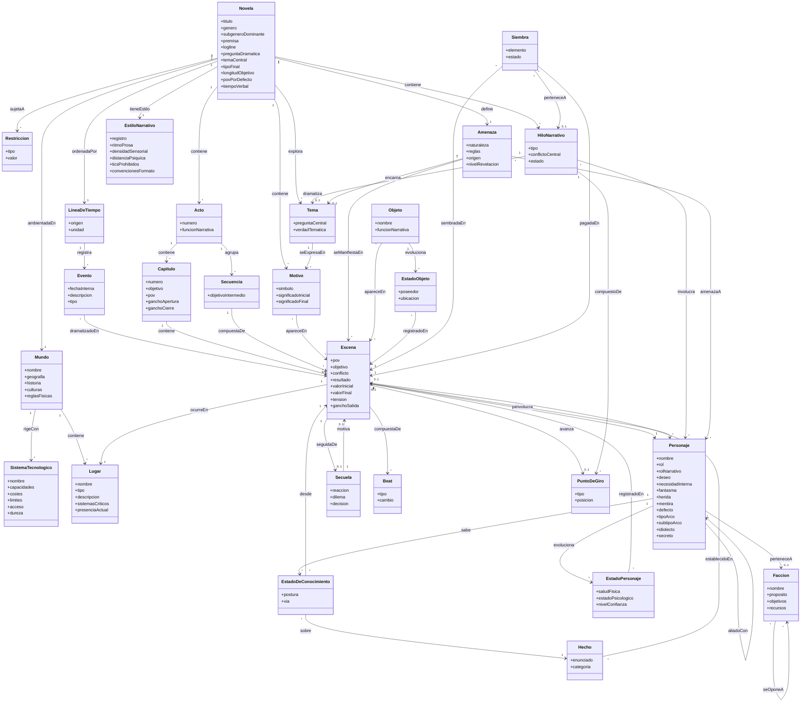

# Definitions — Ontología narrativa: terror espacial

Modelo de clases y relaciones del universo narrativo de la novela de terror espacial. Es el esquema de datos base del proyecto: qué entidades existen y cómo se conectan entre sí.

El modelo cubre tres cosas distintas y conviene no confundirlas:

- **Canon** — lo que es verdad en la obra y cambia poco: `Novela`, `Mundo`, `SistemaTecnologico`, `Personaje`, `EstiloNarrativo`. Un cambio aquí se propaga hacia adelante sobre todo lo ya escrito.
- **Estructura** — el plan de la historia: `Acto`, `Capitulo`, `Secuencia`, `Escena`, `Secuela`, `Beat`, `HiloNarrativo`, `PuntoDeGiro`.
- **Estado** — lo que cambia escena a escena y hay que rastrear para no contradecirse: `EstadoPersonaje`, `EstadoDeConocimiento`, `EstadoObjeto`, `Hecho`, `Siembra`, `Evento`.

El proceso de producción (borradores, tipos de pasada de revisión, lectores beta) **no** está aquí: es pipeline, y vive en [architecture.md](architecture.md).

## Diagrama

## Definiciones

### Canon

**Novela** — La obra completa y contenedor raíz de la ontología. Además del título y el género fija la **premisa** (la proposición causal que la obra demuestra), el **logline** (una frase con protagonista, objetivo y antagonismo), la **pregunta dramática** que el clímax responde, el subgénero dominante, el tipo de final, la longitud objetivo y los valores por defecto de punto de vista y tiempo verbal.
`titulo` · `genero` · `subgeneroDominante` · `premisa` · `logline` · `preguntaDramatica` · `temaCentral` · `tipoFinal` · `longitudObjetivo` · `povPorDefecto` · `tiempoVerbal`

**Restricción** — Requisito no narrativo impuesto a la obra: público objetivo, presupuesto de palabras por acto o capítulo, política de contenido, obligaciones de continuidad con entregas anteriores.
`tipo` · `valor`

**Mundo** — La realidad del universo de la obra: geografía, historia, culturas y las leyes físicas o sociales que definen lo posible. Es canon duro: cambiarlo obliga a revisar todo lo escrito después.
`nombre` · `geografia` · `historia` · `culturas` · `reglasFisicas`

**SistemaTecnologico** — El conjunto explícito de reglas de la tecnología de la obra: qué permite, qué cuesta usarla, dónde están sus límites y quién tiene acceso. `dureza` distingue el sistema **duro** (entendido por el lector y por tanto utilizable para resolver conflictos) del **blando** (solo genera asombro y no puede resolver nada). Es la entidad que más agujeros de guion produce cuando está infraespecificada: si una regla no está escrita, la fase de redacción la improvisa de forma distinta cada vez.
`nombre` · `capacidades` · `costes` · `limites` · `acceso` · `dureza`

**Lugar** — El escenario concreto de una escena: una cubierta, un módulo, una esclusa, una superficie planetaria. Tiene descripción canónica y un estado de presencia (quién o qué está allí ahora) que cambia entre escenas.
`nombre` · `tipo` · `descripcion` · `sistemasCriticos` · `presenciaActual`

**EstiloNarrativo** — Cómo suena la novela al leerla: registro, ritmo de prosa, densidad sensorial, distancia psíquica por defecto, tics prohibidos y convenciones de formato. Se define una vez para toda la obra y se mantiene constante en cada escena, sin importar quién la haya escrito.
`registro` · `ritmoProsa` · `densidadSensorial` · `distanciaPsiquica` · `ticsProhibidos` · `convencionesFormato`

### Tiempo

**LineaDeTiempo** — La cronología interna de la obra. Ordena dos capas: la historia previa del mundo y los días que cubre la novela.
`origen` · `unidad`

**Evento** — Un suceso situado en la línea de tiempo, con su fecha interna. Es *append-only*: se añaden eventos, no se reescribe la historia sin una decisión explícita de retcon. Un evento puede estar dramatizado en una escena o haber ocurrido fuera de la página.
`fechaInterna` · `descripcion` · `tipo`

### Personajes

**Personaje** — Cualquier individuo con agencia. Separa lo que busca conscientemente (`deseo`) de lo que necesita resolver (`necesidadInterna`), y encadena el origen de su defecto: el suceso pasado que sigue operando (`fantasma`), el daño que dejó (`herida`), la creencia falsa con la que se protege (`mentira`) y la conducta observable que de ahí se deriva (`defecto`). `tipoArco` es positivo, plano o negativo; `subtipoArco` precisa el negativo (desilusión, caída, corrupción). `rolNarrativo` es su función en la historia, no su oficio: protagonista, oponente, aliado, falso aliado, mentor, heraldo, guardián del umbral, espejo.
`nombre` · `rol` · `rolNarrativo` · `deseo` · `necesidadInterna` · `fantasma` · `herida` · `mentira` · `defecto` · `tipoArco` · `subtipoArco` · `idiolecto` · `secreto`

**Facción** — Grupo organizado con objetivos y recursos propios, distintos de los de cualquiera de sus miembros: tripulación, corporación, culto, gobierno.
`nombre` · `proposito` · `objetivos` · `recursos`

**EstadoPersonaje** — Las variables dinámicas de un personaje en una escena concreta: cómo está física y psicológicamente y en quién confía. Es lo que permite modelar la evolución en vez de solo la definición fija.
`saludFisica` · `estadoPsicologico` · `nivelConfianza`

**EstadoDeConocimiento** — Qué postura tiene un personaje frente a un hecho concreto (lo sabe, lo cree, lo sospecha, lo ignora, cree una versión falsa), desde qué escena y por qué vía lo supo (presenció, se lo contaron, lo dedujo, le mintieron). Es la entidad que gobierna al mismo tiempo la coherencia y la tensión: un personaje no puede reaccionar a lo que aún no ha recibido, y la asimetría entre lo que sabe el lector y lo que sabe el personaje es lo que produce misterio, suspense o ironía dramática.
`postura` · `via`

**Hecho** — Una afirmación que el texto ya ha establecido y que no se puede contradecir: un nombre, una fecha, un rasgo físico, una distancia, una regla del mundo. Registra en qué escena quedó fijada. Es el registro de continuidad de la obra.
`enunciado` · `categoria`

### Amenaza y objetos

**Amenaza** — La fuerza antagonista central: su naturaleza, las reglas que la rigen, su origen y el nivel de revelación alcanzado hasta un punto dado de la novela (rastro, efecto, vislumbre parcial, encuentro, confrontación). Las reglas se fijan desde el principio en el canon aunque los personajes las descubran tarde: sin reglas estables el lector no puede calcular el peligro, y sin cálculo no hay anticipación.
`naturaleza` · `reglas` · `origen` · `nivelRevelacion`

**Objeto** — Elemento material con función narrativa: pista, arma, artefacto recuperado, prueba.
`nombre` · `funcionNarrativa`

**EstadoObjeto** — Dónde está un objeto y quién lo tiene en una escena dada. La ubicación de los objetos es una de las fuentes de contradicción más frecuentes en obra larga.
`poseedor` · `ubicacion`

### Estructura

**Acto** — División estructural mayor. Su frontera deja al protagonista en una situación irreversiblemente distinta y con un objetivo nuevo.
`numero` · `funcionNarrativa`

**Capítulo** — Unidad de lectura, no de historia: agrupa una o varias escenas y administra el momento en que el lector puede parar. Tiene su propio gancho de apertura y de cierre, independientes del gancho general del libro.
`numero` · `objetivo` · `pov` · `ganchoApertura` · `ganchoCierre`

**Secuencia** — Bloque de tres a ocho escenas unidas por un objetivo intermedio propio. Es la escala en la que se percibe la escalada y la que permite planificar un acto como cinco bloques en lugar de cuarenta escenas sueltas.
`objetivoIntermedio`

**Escena** — Unidad de acción continua en un tiempo, un lugar y un punto de vista. Tiene objetivo (lo que el personaje POV quiere ahora), conflicto (lo que se lo impide) y resultado (el revés, o el logro con coste, que deja la situación cambiada). `valorInicial` y `valorFinal` registran el valor en juego y su polaridad: si no cambia, la escena no existe.
`pov` · `objetivo` · `conflicto` · `resultado` · `valorInicial` · `valorFinal` · `tension` · `ganchoSalida`

**Secuela** — La unidad que conecta una escena con la siguiente: reacción emocional al revés, dilema entre opciones todas malas, y decisión que se convierte en el objetivo de la escena siguiente. Es el eslabón que hace la trama causal en lugar de episódica, y el respiro sin el cual la acción continua se vuelve ruido.
`reaccion` · `dilema` · `decision`

**Beat** — La unidad mínima de cambio narrativo: un intercambio de acción y reacción que altera, aunque sea un grado, la situación o el estado emocional. Una escena es una sucesión de beats; si ninguno cambia nada, la escena es relleno por larga que sea.
`tipo` · `cambio`

**PuntoDeGiro** — Momento que cambia la dirección de la trama: gancho, incidente incitador, primer umbral, punto de pellizco, punto medio, todo está perdido, crisis, clímax, resolución. `posicion` guarda su lugar aproximado en la obra.
`tipo` · `posicion`

**HiloNarrativo** — Una línea argumental completa con su propia pregunta dramática. La trama principal es un hilo de tipo "principal"; cada subtrama es otro. `estado` rastrea su situación en cada punto del manuscrito: abierto, complicando, latente, resuelto o abierto deliberadamente. Un hilo latente demasiado tiempo se olvida; un hilo que nunca sale de abierto es la causa habitual de un final insatisfactorio.
`tipo` · `conflictoCentral` · `estado`

**Siembra** — Un elemento plantado que crea una expectativa y debe recogerse: un objeto mostrado, una promesa, un secreto insinuado, una regla anunciada. Registra dónde se siembra, dónde se paga y su `estado` (sembrada, regada, pagada, abandonada). Todo lo que se destaca debe usarse, y nada debe resolverse con material que no se haya anunciado.
`elemento` · `estado`

### Tema

**Tema** — La pregunta de fondo que la novela explora más allá de la trama, junto con la `verdadTematica` que la obra defiende y que el protagonista debe aprender o rechazar.
`preguntaCentral` · `verdadTematica`

**Motivo** — Símbolo, objeto o frase que reaparece a lo largo de la novela y cuyo significado cambia entre su primera y su última aparición. Es el vehículo concreto del tema.
`simbolo` · `significadoInicial` · `significadoFinal`

## Relaciones clave

- **Novela** contiene Acto, Tema, Motivo e HiloNarrativo; define Amenaza; tiene un EstiloNarrativo y una LineaDeTiempo; está sujeta a Restricción
- **Mundo** rige con SistemaTecnologico y contiene Lugar
- **LineaDeTiempo** registra Evento; un Evento puede estar dramatizado en una Escena
- **Acto** contiene Capítulo y agrupa Secuencia → Escena → Beat
- **Escena** tiene un POV, involucra Personaje, ocurre en Lugar, avanza PuntoDeGiro y es seguida de una Secuela que motiva la siguiente
- **HiloNarrativo** está compuesto de PuntoDeGiro, involucra Personaje y dramatiza un Tema
- **Tema** se expresa en Motivo; Motivo aparece en Escena
- **Personaje** pertenece a Facción, y se opone o se alía con otros Personaje
- **Personaje** evoluciona en EstadoPersonaje (registrado en una Escena) y sabe EstadoDeConocimiento sobre un Hecho desde una Escena
- **Hecho** queda establecido en una Escena y no puede contradecirse después
- **Amenaza** se manifiesta en Escena, amenaza a Personaje y encarna un Tema
- **Objeto** aparece en Escena y evoluciona en EstadoObjeto
- **Siembra** se siembra en una Escena y se paga en otra; puede pertenecer a un HiloNarrativo
