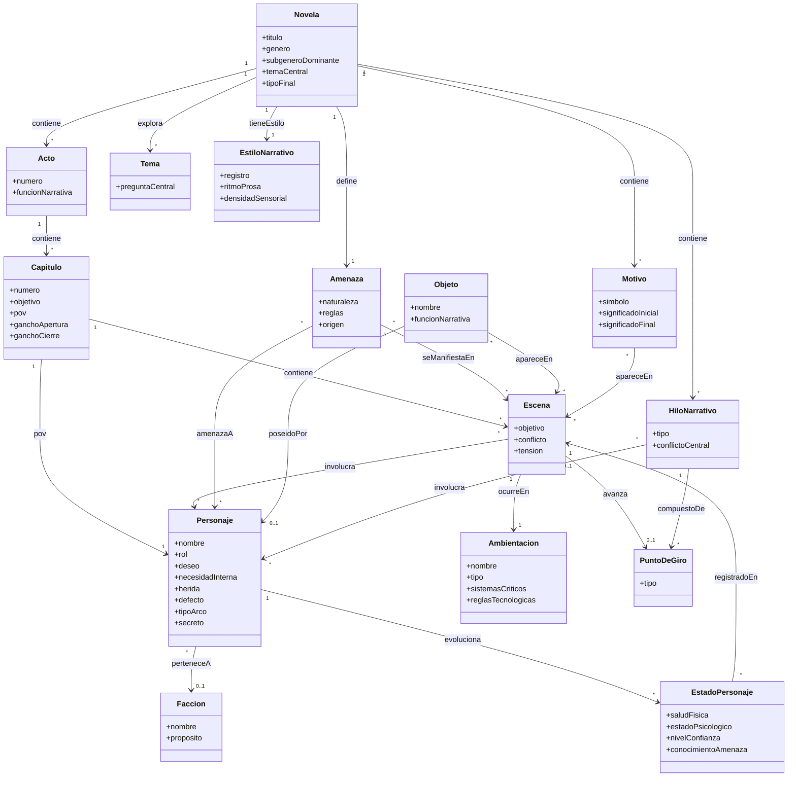

# Definitions — Ontología narrativa: terror espacial

Modelo de clases y relaciones del universo narrativo de la novela de terror espacial. Es el esquema de datos base del proyecto: qué entidades existen y cómo se conectan entre sí.

## Diagrama

## Definiciones

**Novela** — La obra completa. Es el contenedor raíz de toda la ontología: de aquí cuelgan los actos, los temas, los hilos narrativos y los motivos. También fija el subgénero dominante (corporal, cósmico, slasher espacial, IA hostil) y el tipo de final hacia el que apunta la historia.
`titulo` · `genero` · `subgeneroDominante` · `temaCentral` · `tipoFinal`

**Personaje** — Cualquier individuo con agencia dentro de la historia. Incluye las variables estáticas del arco: lo que busca conscientemente (deseo) frente a lo que realmente necesita resolver (necesidadInterna), el evento pasado que explica su defecto (herida) y el tipo de arco que recorre (positivo, plano o negativo).
`nombre` · `rol` · `deseo` · `necesidadInterna` · `herida` · `defecto` · `tipoArco` · `secreto`

**Facción** — Grupo organizado al que puede pertenecer un personaje: tripulación, corporación, culto, gobierno.
`nombre` · `proposito`

**Ambientación** — El espacio físico donde ocurre la acción: la nave, la estación o el planeta, junto con sus sistemas críticos y las reglas tecnológicas o físicas que no pueden romperse a mitad de libro sin explicación.
`nombre` · `tipo` · `sistemasCriticos` · `reglasTecnologicas`

**Amenaza** — La fuerza antagonista central: su naturaleza, las reglas que la rigen y su origen.
`naturaleza` · `reglas` · `origen`

**Objeto** — Elementos materiales con función narrativa: pistas, armas, artefactos recuperados.
`nombre` · `funcionNarrativa`

**Acto** — División estructural mayor de la trama (establecimiento, escalada, confrontación).
`numero` · `funcionNarrativa`

**Capítulo** — Unidad narrativa intermedia con su propio mini-arco: punto de vista, y un gancho de apertura y uno de cierre propios, independientes del gancho general del libro.
`numero` · `objetivo` · `pov` · `ganchoApertura` · `ganchoCierre`

**Escena** — La unidad mínima de acción dramática: objetivo, conflicto y resultado.
`objetivo` · `conflicto` · `tension`

**PuntoDeGiro** — Momento que cambia la dirección de la trama: detonante, punto medio, clímax.
`tipo`

**Tema** — La idea o pregunta de fondo que la novela explora más allá de la trama.
`preguntaCentral`

**EstadoPersonaje** — Las variables dinámicas de un personaje en un momento puntual de la historia: cómo está física y psicológicamente, en quién confía y qué sabe de la amenaza en esa escena. Es lo que permite modelar la evolución, no solo la definición fija del personaje.
`saludFisica` · `estadoPsicologico` · `nivelConfianza` · `conocimientoAmenaza`

**EstiloNarrativo** — Cómo suena la novela al leerla: registro, ritmo de la prosa y densidad sensorial. Se define una sola vez para toda la obra y debe mantenerse constante en cada escena, sin importar quién la haya escrito.
`registro` · `ritmoProsa` · `densidadSensorial`

**HiloNarrativo** — Una línea argumental completa: la trama principal es un hilo con tipo "principal", y cada subtrama es otro hilo que debe cruzarse con los demás en los puntos de giro importantes.
`tipo` · `conflictoCentral`

**Motivo** — Un símbolo, objeto o frase que reaparece a lo largo de la novela y cuyo significado cambia entre su primera y su última aparición. Suele ser el vehículo concreto del tema.
`simbolo` · `significadoInicial` · `significadoFinal`

## Relaciones clave

- **Novela** contiene Acto, explora Tema, define Amenaza
- **Acto** contiene Capítulo → contiene Escena
- **Capítulo** pov Personaje
- **Escena** involucra Personaje, ocurre en Ambientación, avanza PuntoDeGiro
- **Personaje** pertenece a Facción (opcional)
- **Amenaza** se manifiesta en Escena, amenaza a Personaje
- **Objeto** poseído por Personaje, aparece en Escena
- **Personaje** evoluciona en EstadoPersonaje, cada uno registrado en una Escena
- **Novela** tiene estilo EstiloNarrativo (uno solo, para toda la obra)
- **Novela** contiene HiloNarrativo, cada uno compuesto de PuntoDeGiro e involucra Personaje
- **Novela** contiene Motivo, cada uno aparece en varias Escena
