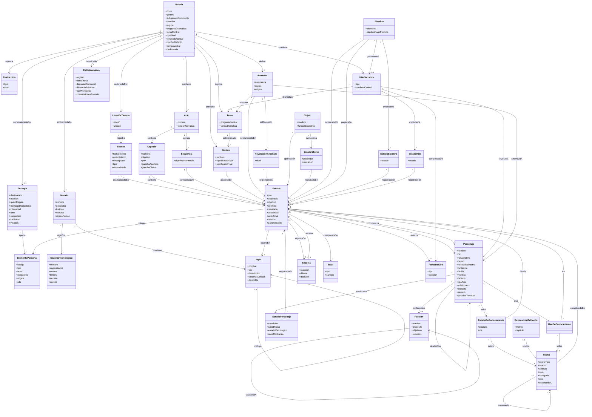

# Definitions — Ontología narrativa: terror espacial

Modelo de clases y relaciones del universo narrativo de la novela de terror espacial. Es el esquema de datos base del proyecto: qué entidades existen y cómo se conectan entre sí.

El modelo cubre tres cosas distintas y conviene no confundirlas:

- **Canon** — lo que es verdad en la obra y cambia poco: `Novela`, `Mundo`, `SistemaTecnologico`, `Personaje`, `EstiloNarrativo`, y el `Encargo` con sus `ElementoPersonal`, que fija el comprador antes de empezar. Un cambio aquí se propaga hacia adelante sobre todo lo ya escrito.
- **Estructura** — el plan de la historia: `Acto`, `Capitulo`, `Secuencia`, `Escena`, `Secuela`, `Beat`, `HiloNarrativo`, `PuntoDeGiro`.
- **Estado** — lo que cambia escena a escena y hay que rastrear para no contradecirse: `EstadoPersonaje`, `EstadoDeConocimiento`, `UsoDeConocimiento`, `EstadoObjeto`, `Hecho`, `Siembra`, `Evento`, y los tres registros derivados `EstadoSiembra`, `EstadoHilo` y `RevelacionAmenaza`.

El proceso de producción (borradores, tipos de pasada de revisión, lectores beta) **no** está aquí: es pipeline, y vive en [architecture.md](architecture.md).

## Una regla que atraviesa todo el estado

**Todo lo que cambia durante la redacción es un registro *append-only* con su escena de origen, no un atributo que se sobrescribe.** El estado de una siembra, el de un hilo, el nivel de revelación de la amenaza y quién está presente en un lugar no son columnas que se actualicen: se derivan del último registro anterior a un punto dado.

> **Decisión sin entrevistar, 22 de septiembre de 2026.** La alternativa era mantenerlos como atributos mutables, que es como estaban escritos aquí antes. Se descarta por dos razones que aparecieron al implementar [specs/spec1.md](../specs/spec1.md). La primera es la reanudación: relanzar desde el capítulo N significa dejar el grafo como estaba al terminar N-1, y con registros por escena eso es borrar por escena de origen, mientras que con atributos mutables habría que reconstruir el valor anterior, que ya no existe en ninguna parte. La segunda es el rastro: un atributo mutable permite que una pasada de prosa altere estado sin que quede constancia, y eso choca con la regla de que un `Hecho` establecido no se borra por una pasada. Afecta a [architecture.md](architecture.md), cuya tabla de persistencia lista ahora esas tablas.

## Diagrama

## Definiciones

### Canon

**Novela** — La obra completa y contenedor raíz de la ontología. Además del título y el género fija la **premisa** (la proposición causal que la obra demuestra), el **logline** (una frase con protagonista, objetivo y antagonismo), la **pregunta dramática** que el clímax responde, el subgénero dominante, el tipo de final, la longitud objetivo y los valores por defecto de punto de vista y tiempo verbal.
Si la novela es un regalo, fija también la **dedicatoria** de la portada.
`titulo` · `genero` · `subgeneroDominante` · `premisa` · `logline` · `preguntaDramatica` · `temaCentral` · `tipoFinal` · `longitudObjetivo` · `povPorDefecto` · `tiempoVerbal` · `dedicatoria`

**Restricción** — Requisito no narrativo impuesto a la obra: público objetivo, presupuesto de palabras por acto o capítulo, política de contenido, obligaciones de continuidad con entregas anteriores.
`tipo` · `valor`

**Encargo** — Para quién es la novela y qué quiere quien la regala. El **destinatario** (nombre, edad, pronombres y rasgos) es el protagonista de la historia; la **intensidad** del terror tiene una edad mínima; los **vetados** son palabras o temas que no pueden aparecer. Lo fija el comprador en la entrevista y ningún agente lo inventa: de él se derivan las restricciones de la obra, y del destinatario sale el personaje protagonista con su nombre exacto. Una novela sin encargo es una novela sin personalizar.
`destinatario` · `ocasion` · `quienRegala` · `mensajeDedicatoria` · `intensidad` · `tono` · `subgenero` · `capitulos` · `vetados`

**ElementoPersonal** — Un rasgo, un recuerdo o un allegado (persona o mascota) del destinatario que la novela tiene que incorporar. Lleva un **código** estable (`REC1`, `ALL2`) por el que la escaleta dice en qué escenas se integra. `origen` distingue lo que el comprador dijo en la entrevista de lo extraído de un texto libre que aportó, y `cita` guarda el fragmento literal del que sale, para que ningún dato del regalo sea una invención.
`codigo` · `tipo` · `texto` · `obligatorio` · `origen` · `cita`

> **Decisión sin entrevistar, 23 de septiembre de 2026.** El encargo entra en la ontología porque los agentes lo leen y producen entidades a partir de él (el protagonista, la dedicatoria, qué escena integra qué recuerdo), y una puerta no puede comprobar lo que el modelo no nombra. Se descartó guardarlo solo como restricciones sueltas: una restricción es un par tipo-valor y no puede decir que un recuerdo concreto tiene que aparecer en una escena concreta. Las cuatro decisiones de producto que lo condicionan (el destinatario es el protagonista, tres niveles de intensidad, el destinatario nunca muere, entrevista por CLI) están en [specs/spec3.md](../specs/spec3.md), 3.2. Afecta a [architecture.md](architecture.md) (el entrevistador y las tablas nuevas) y a [validators.md](validators.md) (comprobaciones deterministas del encargo).

**Mundo** — La realidad del universo de la obra: geografía, historia, culturas y las leyes físicas o sociales que definen lo posible. Es canon duro: cambiarlo obliga a revisar todo lo escrito después.
`nombre` · `geografia` · `historia` · `culturas` · `reglasFisicas`

**SistemaTecnologico** — El conjunto explícito de reglas de la tecnología de la obra: qué permite, qué cuesta usarla, dónde están sus límites y quién tiene acceso. `dureza` distingue el sistema **duro** (entendido por el lector y por tanto utilizable para resolver conflictos) del **blando** (solo genera asombro y no puede resolver nada). Es la entidad que más agujeros de guion produce cuando está infraespecificada: si una regla no está escrita, la fase de redacción la improvisa de forma distinta cada vez.
`nombre` · `capacidades` · `costes` · `limites` · `acceso` · `dureza`

**Lugar** — El escenario concreto de una escena: una cubierta, un módulo, una esclusa, una superficie planetaria. Tiene descripción canónica. Quién o qué está allí en un momento dado **se deriva** del reparto de la última escena ocurrida ahí; no es un atributo que se sobrescriba. Un lugar puede estar **dentro de** otro (la sala de lechos dentro del anillo de habitación); para la continuidad, un lugar y los que contiene son el mismo sitio.

> **Decisión entrevistada, 23 de septiembre de 2026.** La primera pasada con Claude Code real paró por un objeto «movido sin traslado» del anillo de habitación a una sala que está dentro del anillo. Se añade la relación `dentroDe` (RF2-PER-13 y RF2-PIPE-26 de spec2). Se descartó deducirla del nombre de los lugares, que es frágil.
`nombre` · `tipo` · `descripcion` · `sistemasCriticos`

**EstiloNarrativo** — Cómo suena la novela al leerla: registro, ritmo de prosa, densidad sensorial, distancia psíquica por defecto, tics prohibidos y convenciones de formato. Se define una vez para toda la obra y se mantiene constante en cada escena, sin importar quién la haya escrito.
`registro` · `ritmoProsa` · `densidadSensorial` · `distanciaPsiquica` · `ticsProhibidos` · `convencionesFormato`

### Tiempo

**LineaDeTiempo** — La cronología interna de la obra. Ordena dos capas: la historia previa del mundo y los días que cubre la novela.
`origen` · `unidad`

**Evento** — Un suceso situado en la línea de tiempo, con su fecha interna y su **orden interno**, que es un ordinal creciente. Es *append-only*: se añaden eventos, no se reescribe la historia sin una decisión explícita de retcon. Un evento puede estar dramatizado en una escena o haber ocurrido fuera de la página.
`fechaInterna` · `ordenInterno` · `descripcion` · `tipo` · `dramatizado`

> **Decisión sin entrevistar, 22 de septiembre de 2026.** `ordenInterno` se añade porque la fecha no basta para comprobar nada. La alternativa era comparar `fechaInterna` como texto, y se descarta porque falla de dos formas a la vez: no ordena de manera fiable dos fechas escritas en libre, y marca como simultáneo todo lo que comparte fecha, cuando dos escenas del mismo día en lugares distintos son lo normal. Con un ordinal, «antes» y «a la vez» pasan a ser comparaciones exactas, que es lo que la puerta 3 necesita para ser determinista.

### Personajes

**Personaje** — Cualquier individuo con agencia. Separa lo que busca conscientemente (`deseo`) de lo que necesita resolver (`necesidadInterna`), y encadena el origen de su defecto: el suceso pasado que sigue operando (`fantasma`), el daño que dejó (`herida`), la creencia falsa con la que se protege (`mentira`) y la conducta observable que de ahí se deriva (`defecto`). `tipoArco` es positivo, plano o negativo; `subtipoArco` precisa el negativo (desilusión, caída, corrupción). `rolNarrativo` es su función en la historia, no su oficio: protagonista, oponente, aliado, falso aliado, mentor, heraldo, guardián del umbral, espejo.
`posicionTematica` recoge qué responde este personaje a la pregunta central del tema.
`nombre` · `rol` · `rolNarrativo` · `deseo` · `necesidadInterna` · `fantasma` · `herida` · `mentira` · `defecto` · `tipoArco` · `subtipoArco` · `idiolecto` · `secreto` · `posicionTematica`

> **Decisión sin entrevistar, 22 de septiembre de 2026.** `posicionTematica` existe para hacer comprobable el criterio de terminación del diseñador de elenco: que ningún personaje duplique la función de otro. Sin ella esa condición solo se puede juzgar leyendo. Con ella es una consulta, porque dos personajes con el mismo rol narrativo y la misma posición ante el tema son el mismo personaje escrito dos veces, que es la tercera prueba del principio 24.

**Facción** — Grupo organizado con objetivos y recursos propios, distintos de los de cualquiera de sus miembros: tripulación, corporación, culto, gobierno.
`nombre` · `proposito` · `objetivos` · `recursos`

**EstadoPersonaje** — Las variables dinámicas de un personaje en una escena concreta: cómo está física y psicológicamente y en quién confía. Es lo que permite modelar la evolución en vez de solo la definición fija. `condicion` es la parte cerrada del estado físico —vivo, herido, incapacitado, muerto o desaparecido—; `saludFisica` es el detalle en texto libre.
`condicion` · `saludFisica` · `estadoPsicologico` · `nivelConfianza`

> **Decisión sin entrevistar, 23 de septiembre de 2026.** Se añade `condicion` porque la comprobación de que un muerto no reaparece buscaba «muert» dentro de `saludFisica`: «casi muerto» paraba la generación y «fallecida» no. Una lista cerrada convierte la muerte en un dato que se consulta y no en un texto que se interpreta. Se descartó ampliar la búsqueda con más palabras, que solo cambia qué frases fallan. La condición la declara el extractor, así que la comprobación mide lo que él dice; la búsqueda del nombre del muerto en la prosa posterior es el segundo método que mira el texto ([validators.md](validators.md)).

**EstadoDeConocimiento** — Qué postura tiene un personaje frente a un hecho concreto (lo sabe, lo cree, lo sospecha, lo ignora, cree una versión falsa), desde qué escena y por qué vía lo supo (presenció, se lo contaron, lo dedujo, le mintieron). Es la entidad que gobierna al mismo tiempo la coherencia y la tensión: un personaje no puede reaccionar a lo que aún no ha recibido, y la asimetría entre lo que sabe el lector y lo que sabe el personaje es lo que produce misterio, suspense o ironía dramática.
`postura` · `via`

**Hecho** — Una afirmación que el texto ya ha establecido y que no se puede contradecir: un nombre, una fecha, un rasgo físico, una distancia, una regla del mundo. Se guarda como **triple**: un sujeto, un atributo y un valor. «Ibarra tiene los ojos grises» se registra como sujeto Ibarra, atributo color de ojos, valor grises. Guarda además la cita literal que lo fija y la escena donde quedó establecido. Es el registro de continuidad de la obra.

`supersedeA` señala el hecho anterior que este sustituye **legítimamente**: una herida que cicatriza, un objeto que se rompe. Una cadena de sustituciones es legítima entera: herida, infectada, cicatrizada.
`sujetoTipo` · `sujeto` · `atributo` · `valor` · `categoria` · `cita` · `supersedeA`

Un hecho **no se modifica nunca**. Retirarlo del canon, cuando el autor acepta un retcon, es añadir una **RevocacionDeHecho** que dice cuál, por qué y desde qué capítulo; el hecho sigue ahí con su escena y su cita. Un hecho está vigente mientras ninguna revocación lo retire.

**RevocacionDeHecho** — La decisión de retirar un hecho del canon, con su motivo y el capítulo desde el que rige. Es un registro y no un atributo del hecho: deshacer una revocación es borrarla, y relanzar desde un capítulo anterior a ella la deshace con el resto del estado.
`motivo` · `capitulo`

> **Decisión sin entrevistar, 23 de septiembre de 2026.** Antes el hecho tenía un atributo `vigente` que se ponía a falso al revocarlo. Era la única columna mutable de un registro que se declara append-only, y por eso un retcon no se deshacía al relanzar. Se pasa a un registro aparte, derivando la vigencia, que es la misma decisión que ya se tomó para el estado de siembras, hilos y amenaza. Se descartó conservar el atributo y copiarlo al revertir, porque seguiría siendo un dato que cambia sin rastro de escena.

> **Decisión sin entrevistar, 22 de septiembre de 2026.** Antes era un `enunciado` en texto libre. Se cambia porque con enunciados libres «contradicción» deja de ser una consulta y pasa a ser una opinión, y con ello la puerta 3 dejaría de ser determinista, que es lo que el principio 5 no permite. El triple es lo mínimo que hace exacta la comparación: dos hechos vigentes con el mismo sujeto y atributo y distinto valor se contradicen. El coste es que el extractor puede inventar sinónimos de atributo, y por eso el paquete le entrega los atributos que ya existen para cada sujeto.

**UsoDeConocimiento** — Que un personaje **actúe** sobre un hecho en una escena, lo supiera desde antes o no. Es distinto de `EstadoDeConocimiento`, que registra cuándo lo adquirió.

> **Decisión sin entrevistar, 22 de septiembre de 2026.** Se añade porque detectar que alguien actúa sobre lo que todavía no ha recibido exige las dos listas y no una. Con solo la adquisición no hay nada contra lo que comparar: hace falta saber que en una escena alguien usó un dato para poder preguntar si ya lo tenía. Sin esta entidad, la comprobación de conocimiento no adquirido no se puede escribir como consulta.

### Amenaza y objetos

**Amenaza** — La fuerza antagonista central: su naturaleza, las reglas que la rigen y su origen. Cada regla lleva tres cosas: qué puede hacer, qué no puede hacer y qué la dispara. Se fijan desde el principio en el canon aunque los personajes las descubran tarde: sin reglas estables el lector no puede calcular el peligro, y sin cálculo no hay anticipación.
`naturaleza` · `reglas` · `origen`

**RevelacionAmenaza** — El peldaño alcanzado en una escena: rastro, efecto, vislumbre parcial, encuentro o confrontación. El nivel vigente en un punto de la novela se deriva del último registro anterior.
`nivel`

**Objeto** — Elemento material con función narrativa: pista, arma, artefacto recuperado, prueba.
`nombre` · `funcionNarrativa`

**EstadoObjeto** — Dónde está un objeto y quién lo tiene en una escena dada. La ubicación de los objetos es una de las fuentes de contradicción más frecuentes en obra larga.
`poseedor` · `ubicacion`

### Estructura

**Acto** — División estructural mayor. Su frontera deja al protagonista en una situación irreversiblemente distinta y con un objetivo nuevo.
`numero` · `funcionNarrativa`

**Capítulo** — Unidad de lectura, no de historia: agrupa una o varias escenas y administra el momento en que el lector puede parar. Tiene su propio gancho de apertura y de cierre, independientes del gancho general del libro.
`numero` · `objetivo` · `pov` · `ganchoApertura` · `ganchoCierre`

**Secuencia** — Bloque de tres a ocho escenas unidas por un objetivo intermedio propio. Es la escala en la que se percibe la escalada y la que permite planificar un acto como cinco bloques en lugar de cuarenta escenas sueltas.
`objetivoIntermedio`

**Escena** — Unidad de acción continua en un tiempo, un lugar y un punto de vista. Tiene objetivo (lo que el personaje POV quiere ahora), conflicto (lo que se lo impide) y resultado (el revés, o el logro con coste, que deja la situación cambiada). `valorInicial` y `valorFinal` registran el valor en juego y su polaridad: si no cambia, la escena no existe. `analepsis` marca la escena que retrocede en la cronología.
`pov` · `analepsis` · `objetivo` · `conflicto` · `resultado` · `valorInicial` · `valorFinal` · `tension` · `ganchoSalida`

> **Decisión sin entrevistar, 22 de septiembre de 2026.** `analepsis` se añade porque sin ella la comprobación de coherencia temporal no distingue un flashback de un error, y marcaría como conflicto toda escena que retroceda. La alternativa, deducir el salto del propio texto, exigiría interpretarlo, y eso saca la comprobación del terreno determinista.

**Secuela** — La unidad que conecta una escena con la siguiente: reacción emocional al revés, dilema entre opciones todas malas, y decisión que se convierte en el objetivo de la escena siguiente. Es el eslabón que hace la trama causal en lugar de episódica, y el respiro sin el cual la acción continua se vuelve ruido.
`reaccion` · `dilema` · `decision`

**Beat** — La unidad mínima de cambio narrativo: un intercambio de acción y reacción que altera, aunque sea un grado, la situación o el estado emocional. Una escena es una sucesión de beats; si ninguno cambia nada, la escena es relleno por larga que sea.
`tipo` · `cambio`

**PuntoDeGiro** — Momento que cambia la dirección de la trama: gancho, incidente incitador, primer umbral, punto de pellizco, punto medio, todo está perdido, crisis, clímax, resolución. `posicion` guarda su lugar aproximado en la obra.
`tipo` · `posicion`

**HiloNarrativo** — Una línea argumental completa con su propia pregunta dramática. La trama principal es un hilo de tipo "principal"; cada subtrama es otro.
`tipo` · `conflictoCentral`

**EstadoHilo** — La situación del hilo en una escena concreta: abierto, complicando, latente, resuelto o abierto deliberadamente. Un hilo latente demasiado tiempo se olvida; uno que nunca sale de abierto es la causa habitual de un final insatisfactorio.
`estado`

**Siembra** — Un elemento plantado que crea una expectativa y debe recogerse: un objeto mostrado, una promesa, un secreto insinuado, una regla anunciada. Registra dónde se siembra y, si el estructurador lo previó, hacia qué capítulo debería pagarse. Todo lo que se destaca debe usarse, y nada debe resolverse con material que no se haya anunciado.
`elemento` · `capituloPagoPrevisto`

**EstadoSiembra** — Su situación en una escena: sembrada, regada, pagada o abandonada.
`estado`

> **Decisión sin entrevistar, 22 de septiembre de 2026.** `capituloPagoPrevisto` se añade para que seleccionar las siembras vivas de un tramo sea una consulta y no un juicio. La alternativa, decidir cuáles entran en el paquete leyendo cada elemento, obligaría a que esa selección la hiciera un modelo, y el principio 7 dice que la selección de contexto es código determinista.

### Tema

**Tema** — La pregunta de fondo que la novela explora más allá de la trama, junto con la `verdadTematica` que la obra defiende y que el protagonista debe aprender o rechazar.
`preguntaCentral` · `verdadTematica`

**Motivo** — Símbolo, objeto o frase que reaparece a lo largo de la novela y cuyo significado cambia entre su primera y su última aparición. Es el vehículo concreto del tema.
`simbolo` · `significadoInicial` · `significadoFinal`

## Relaciones clave

- **Novela** contiene Acto, Tema, Motivo e HiloNarrativo; define Amenaza; tiene un EstiloNarrativo y una LineaDeTiempo; está sujeta a Restricción; puede estar personalizada por un Encargo
- **Encargo** aporta ElementoPersonal; una Escena integra ElementoPersonal; el Personaje protagonista representa al destinatario del Encargo
- **Mundo** rige con SistemaTecnologico y contiene Lugar
- **LineaDeTiempo** registra Evento; un Evento puede estar dramatizado en una Escena
- **Acto** contiene Capítulo y agrupa Secuencia → Escena → Beat
- **Escena** tiene un POV, involucra Personaje, ocurre en Lugar, avanza PuntoDeGiro y es seguida de una Secuela que motiva la siguiente
- **HiloNarrativo** está compuesto de PuntoDeGiro, involucra Personaje y dramatiza un Tema
- **Tema** se expresa en Motivo; Motivo aparece en Escena
- **Personaje** pertenece a Facción, y se opone o se alía con otros Personaje
- **Personaje** evoluciona en EstadoPersonaje (registrado en una Escena) y sabe EstadoDeConocimiento sobre un Hecho desde una Escena
- **Personaje** usa un Hecho en una Escena mediante UsoDeConocimiento, sepa o no desde antes
- **Hecho** queda establecido en una Escena y no puede contradecirse después; puede sustituir legítimamente a otro anterior
- **Amenaza** se manifiesta en Escena, amenaza a Personaje y encarna un Tema
- **Objeto** aparece en Escena y evoluciona en EstadoObjeto
- **Siembra** se siembra en una Escena y evoluciona en EstadoSiembra; puede pertenecer a un HiloNarrativo
- **HiloNarrativo** evoluciona en EstadoHilo, y **Amenaza** en RevelacionAmenaza: los dos registrados en una Escena
