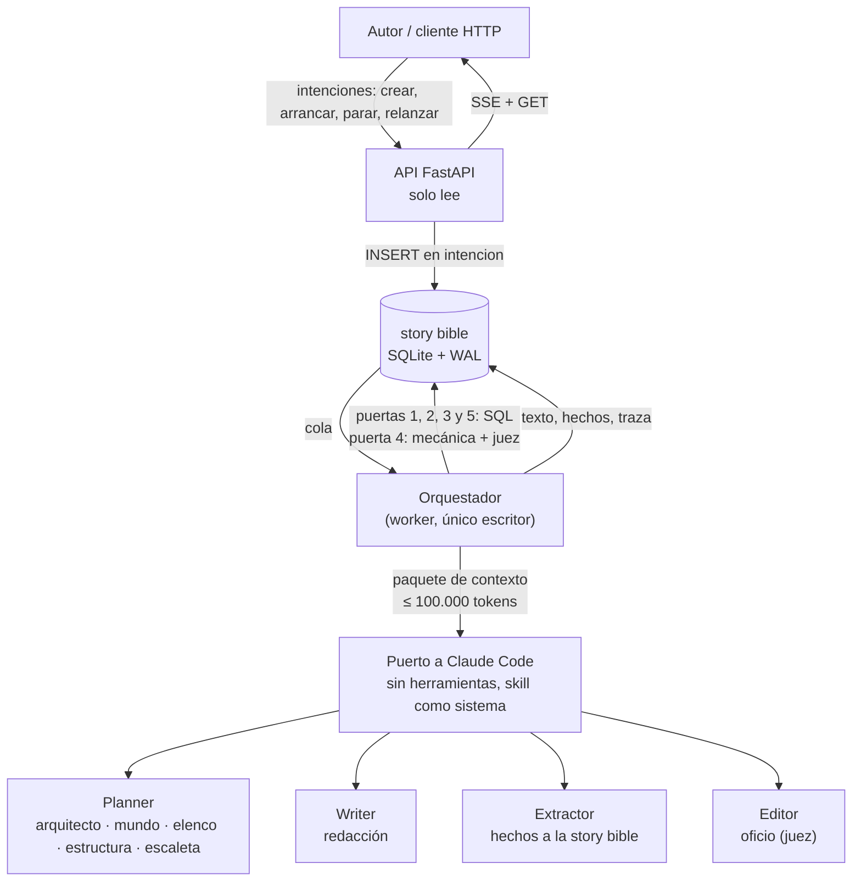
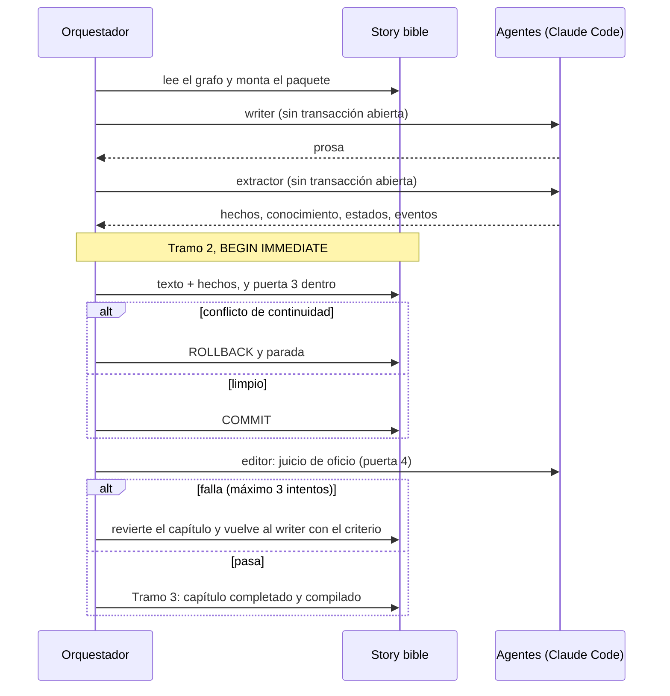
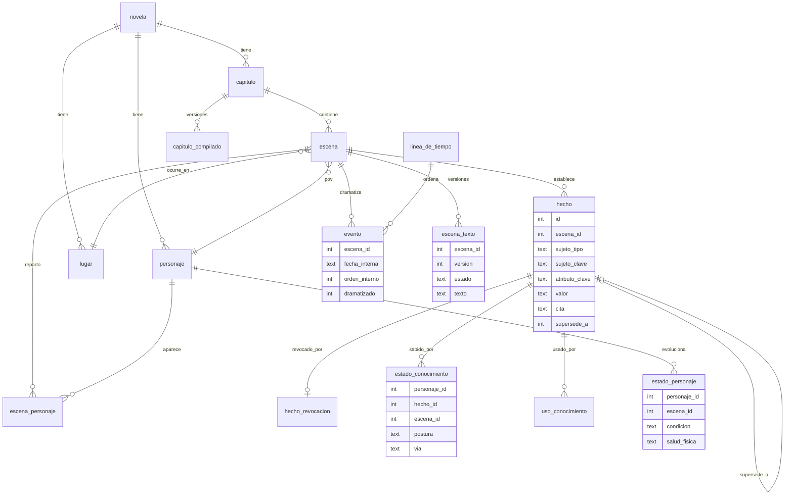

# Diagramas

Los cuatro diagramas que pide la entrega. Los que ya viven en otro documento se enlazan en lugar de copiarse, para que no haya dos versiones.

## 1. Arquitectura del harness

Dos procesos sobre una sola base de datos. La API solo lee y encola intenciones; el worker es el único que escribe y en él vive el orquestador, que invoca a los agentes a través del puerto.

El bucle de capítulo, con las llamadas al agente fuera de las transacciones:

El pipeline completo por fases está en [architecture.md](../architecture.md), «Fases del pipeline».

## 2. Máquina de estados

La máquina de estados que implementa el código (`orquestador/estados.py`) está dibujada en [specs/spec2.md](../../specs/spec2.md), requisito RF2-WK-06.

*Pendiente:* la máquina de estados de la especificación TLA+ (bloque 9 del [plan de entrega](../../specs/storymaker-plan.md)), con la correspondencia entre sus acciones y el código.

## 3. Esquema SQLite (núcleo de la story bible)

La base tiene cincuenta tablas y varias vistas; esto es el núcleo que consultan las puertas. El inventario completo por grupos está en [architecture.md](../architecture.md), «Persistencia», y el DDL en `src/backend/compartido/esquema.sql` más las migraciones de `compartido/migraciones/`.

Tres reglas sostienen el esquema: **todo el estado es append-only y lleva su escena de origen** (revertir es borrar por escena), **el texto se versiona** y nunca se actualiza, y **lo que cambia se deriva en vistas** (`hecho_vigente`, `siembra_vigente`, `hilo_vigente`, `escena_ordinal`).

## 4. Validadores y su punto de ejecución

| Validador | Tipo | Dónde se ejecuta | Si falla |
| --- | --- | --- | --- |
| Salida de cada agente contra su schema | Programático | Puerto y orquestador, tras cada llamada | Una repetición con el error adjunto; después, error |
| El agente no usa herramientas | Programático | Puerto, tras cada llamada | Error de puerto (`AgenteUsoHerramientas`) |
| Puerta 1: estructura (protagonista, oponente, hilo principal, giros obligatorios en orden, subtramas que cierran antes, final compatible) | Programático | Orquestador, tras el estructurador | Parada; se rehace la estructura |
| Puerta 2: escaleta (cada escena cambia un valor, tiene conflicto y lugar, POV en el reparto, longitudes en rango) | Programático | Orquestador, tras la escaleta | Un reintento; después, parada y se rehace |
| Guarda de vigencia de las puertas 1 y 2 | Programático | Al empezar cada capítulo | Error: no se genera un capítulo sin plan aprobado |
| Puerta 3: continuidad (contradicción factual, conocimiento no adquirido, presencia imposible, objeto sin traslado, coherencia temporal, entidad fuera de canon) | Programático | Tramo 2, dentro de la transacción que inserta texto y hechos | ROLLBACK y parada |
| Búsquedas dirigidas sobre la prosa (nombre sin registro, cifra sin hecho, muerto nombrado) y descartes del extractor | Programático | Tramo 2, como avisos de la puerta 3 | Aviso en el informe |
| Puerta 4, mecánica (tics prohibidos; palabras filtro, adverbios de atribución y verbos de habla como avisos) | Programático | Tras la puerta 3 limpia | El capítulo vuelve al writer |
| Puerta 4, juicio de oficio (ocho criterios con evidencia) | Semántico (LLM-as-judge) | Tras la mecánica | El capítulo vuelve al writer; al tercer fallo, parada |
| Puerta 5: global (siembras sin pagar, pago sin siembra, hilos sin cerrar o fuera de orden, latencia de hilos) | Programático | Tras el último capítulo | Aviso: la novela termina `completada_con_avisos` |
| Integridad del grafo (`verificar_integridad`) | Programático | Al recuperar un worker caído, y en los tests | Se revierte el capítulo a medias |
| Evals del extractor (recall contra capítulo anotado) | Eval | Desarrollo, `pytest -m agente` | — |

*Pendientes para la entrega* (ver el plan): nombres exactos, longitud real del capítulo, cobertura de la personalización, palabras prohibidas, validación visual con browser MCP, Lean 4 y TLA+, puntuación del juez y revisión humana. Todos acaban enviando su resultado a Langfuse como score.
