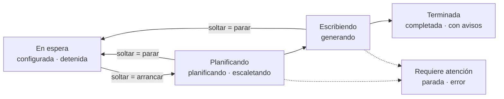
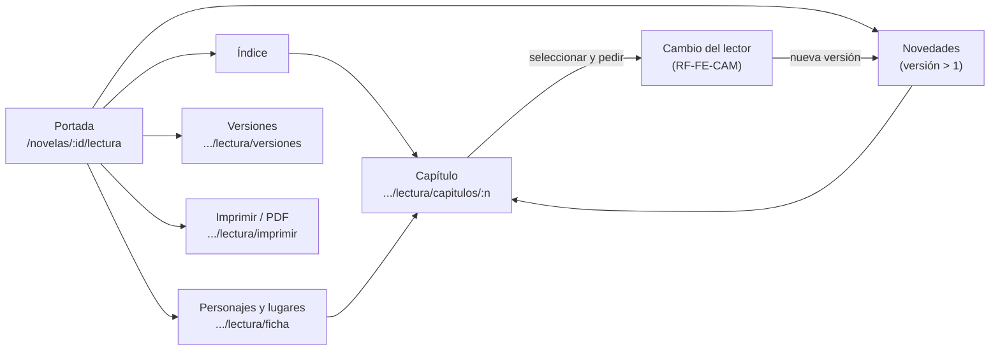
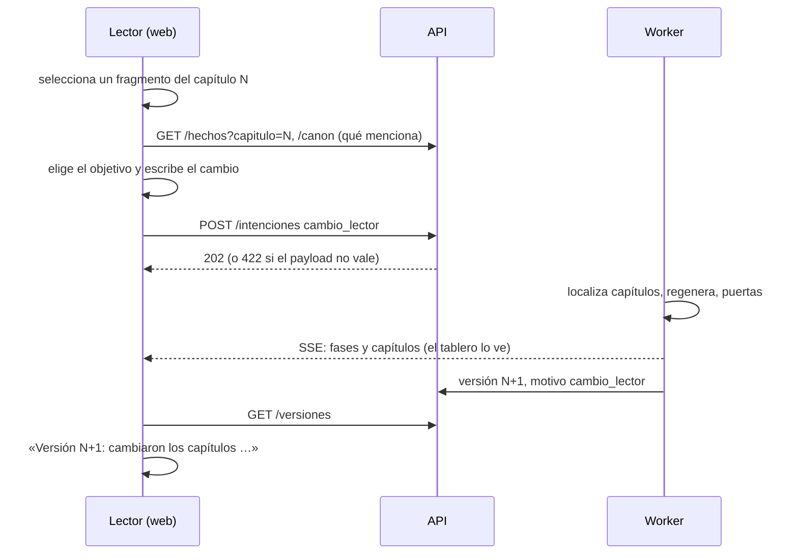

# SRS — Frontend: tablero de novelas y lectura de la entrega

Requisitos del frontend web: un tablero al estilo Jira para ver las novelas y su generación, el detalle de una novela con sus capítulos, las paradas y la creación de una novela desde un brief. Desde la versión 0.2 es también **la lectura de la entrega**: portada, índice, ficha de personajes y lugares, versiones con sus novedades, el cambio del lector y la exportación a PDF.

Versión 0.4 · 24 de septiembre de 2026 (la 0.1, del 23, era el tablero; la 0.2, la lectura contra MSW; la 0.3, la lectura contra el backend integrado; la 0.4, las imágenes)

> **Cómo leer este documento.** Se apoya en [spec1](spec1.md) (API y estados), [spec2](spec2.md) (paradas y reanudación) y [spec3](spec3.md) (brief), y no cambia ninguno. Los requisitos llevan el prefijo `RF-FE-`. Los callouts **Decisión entrevistada** y **Decisión de la spec** marcan qué se preguntó al autor y qué se decidió sin él. El plan de verificación está en [spec-frontend-verification.md](spec-frontend-verification.md).

---

## 1. Alcance

> **Decisión entrevistada, 24 de septiembre de 2026.** La web **es la lectura de la entrega**: la variante «web» del enunciado. Sustituye al HTML estático más PDF del bloque 7 de [storymaker-plan.md](storymaker-plan.md), y el cambio del lector (bloque 8) se pide desde la propia página. El encargo llegó del autor a través de la sesión del backend (novelasv2-f4) y el autor lo confirmó. Se descartó mantener la web como extra junto a un HTML estático: serían dos lecturas que mantener, y la demo obligatoria del cambio del lector luce más dentro del documento que desde un formulario aparte. El PDF sigue siendo obligatorio (`/ejemplos/novela-ejemplo.pdf`) y sale de la web (RF-FE-PDF).
>
> Esto sustituye a la decisión del 23 de septiembre, que dejaba el frontend como extra y la lectura en HTML estático.

Entra:

- Tablero general de novelas (RF-FE-TAB).
- Tablero de una novela: planificación y capítulos (RF-FE-NOV).
- Alerta de parada con sus acciones (RF-FE-PAR).
- Lector de consola de un capítulo cerrado (RF-FE-LEC).
- Crear novela con un formulario del brief (RF-FE-BRF).
- Lectura de la entrega: portada, índice, ficha, versiones y novedades (RF-FE-LEE).
- Cambio del lector desde la página (RF-FE-CAM).
- Exportación a PDF (RF-FE-PDF).
- Inspección con un browser MCP (RF-FE-MCP).

No entra, y por qué:

| Fuera | Motivo |
| --- | --- |
| Entrevista conversacional en la web | La decisión 4 de spec3 la deja en el CLI, y la API no invoca al modelo (RF-COD-05). Llevarla a la web obliga a que corra en el worker por intenciones: es trabajo de backend con su propia spec |
| Explorador completo del canon y cronología | La lectura usa `/canon` (personajes, lugares y objetos), `/hechos`, `/hechos/{id}/usos` y `/versiones`. El resto del canon (sistemas, facciones, temas, motivos) y `/cronologia` no los pide la lectura |
| Crear novela sin brief (payload de spec1) | Sigue existiendo en la API para tests y demo. En la web, toda novela nueva es personalizada |
| Despliegue | Corre en local con el servidor de desarrollo, contra el backend en `127.0.0.1:8000`. La entrega enseña la web en local y adjunta el PDF |

La referencia visual es el prototipo navegable de la **propuesta B, «papel técnico»** (`src/frontend/prototipo-b/`, con sus decisiones en `DECISIONES.md`). La v1 reproduce sus pantallas y sus tokens. El comportamiento que el prototipo simula lo fija esta spec, y donde los dos difieren manda la spec.

## 2. Decisiones de producto

> **Decisión entrevistada, 22 y 23 de septiembre de 2026.** Seis decisiones:
>
> 1. **Tablero tipo Jira con dos niveles.** El tablero general tiene una tarjeta por novela y, al abrir una, sale su propio tablero con los capítulos como tarjetas. Se descartó un tablero solo de novelas (con una única obra generándose a la vez, casi siempre habría una tarjeta moviéndose y el resto quietas) y uno solo de capítulos (se pierde la vista de todas las obras).
> 2. **Estética B, «papel técnico».** Fondo de papel claro, azul cianotipo como único acento y rojo reservado a parada y error. Se descartaron la A, «Nostromo» (terminal ámbar sobre negro, demasiado oscura y cargada para una herramienta de horas), y una mezcla de las dos con tema oscuro alternativo.
> 3. **Crear novela = formulario del brief por pasos.** Se envía como `crear_novela` con `brief`, y la API devuelve lo que falta o se contradice. Se descartaron la entrevista en la web (ver el alcance) y no poder crear desde la web.
> 4. **Arrastrar es pedir, no hacer.** Soltar una tarjeta encola una intención, y la tarjeta cambia de columna cuando lo confirma el servidor. Se descartó que el arrastre moviera la tarjeta por su cuenta: rompería «el frontend observa, no posee» de [architecture.md](../docs/architecture.md#el-frontend-observa-no-posee).
> 5. **Three.js solo como ambiente**, en la pantalla de crear. Se descartó un grafo del canon en 3D, que se ocluye y cuesta leer.
> 6. **Prototipo antes que React.** El prototipo HTML fija la dirección visual y el flujo, y la v1 en React lo reproduce.

## 3. Requisitos específicos

### 3.1 Estructura y stack

**RF-FE-COD-01** El frontend vive en `src/frontend/` y sigue la estructura por funcionalidad de [architecture.md](../docs/architecture.md#arquitectura-del-frontend):

```text
src/frontend/
├── package.json · vite.config.ts · tsconfig.json · index.html
└── src/
    ├── app/                 # arranque, rutas, providers, composición entre funcionalidades
    ├── compartido/
    │   ├── api/             # tipos generados, cliente, SSE, intenciones
    │   ├── estilo/          # tokens.css (los de la propuesta B, sin cambios) y base
    │   └── ui/              # primitivos: botón, chip, diálogo, barra de progreso, aviso
    └── funcionalidades/
        ├── novela/          # crear: formulario del brief
        ├── ejecucion/       # tablero general, tablero de novela, paradas
        ├── canon/           # vacía en la v1
        └── manuscrito/      # lector de capítulo
```

Una funcionalidad no importa del interior de otra. Lo común baja a `compartido/` y la composición se hace en `app/`.

**RF-FE-COD-02** Stack:

| Pieza | Elección | Alternativa descartada |
| --- | --- | --- |
| Build | Vite 7 + React 19 + TypeScript 5 estricto | Next.js: no hay servidor que renderizar, el backend es otro proceso. Vite 8: ver la decisión de abajo |
| Estado del servidor | TanStack Query | SWR: invalidación por clave menos expresiva. Un almacén global (Redux, Zustand) lo prohíbe la arquitectura |
| Rutas | React Router | — |
| Arrastre | dnd-kit con sensor de ratón; teclado y táctil van por el menú de la tarjeta (RF-FE-TAB-05) | HTML5 drag and drop: sin control del fantasma ni de las zonas |
| Ambiente 3D | `three` en un único componente cargado de forma perezosa | react-three-fiber: una sola pieza decorativa no justifica la capa |
| Cliente HTTP | `openapi-fetch` sobre los tipos generados | Un cliente escrito a mano: duplicaría las rutas y sus parámetros |
| Tests | Vitest 4 + Testing Library + MSW + axe | Vitest 3: tiene un aviso de seguridad abierto (GHSA-82fw-gwwq-j7x9) |

> **Decisión de la spec, 23 de septiembre de 2026.** **Vite 7 y no 8.** Vite 8 compila con rolldown, y en el equipo del autor la política de control de aplicaciones de Windows bloquea su binario nativo (`rolldown-binding.win32-x64-msvc.node`), que todavía es muy reciente. Los binarios de rollup, esbuild y lightningcss que usa Vite 7 cargan sin problema. Se descartaron dos salidas: forzar la build WASM de rolldown, porque sería rodear la política en vez de respetarla, y pedir una excepción a IT, porque bloquearía el trabajo sin ganar nada que Vite 7 no dé. Se revisa cuando el binario de rolldown gane reputación o cuando la política lo permita.

> **Decisión de la spec.** El autor no eligió librerías. Estas son las de menor ceremonia que cumplen lo que exige la arquitectura: *server state* con revalidación, arrastre accesible y 3D sin framework.

**RF-FE-COD-03** Rutas:

| Ruta | Pantalla |
| --- | --- |
| `/` | Tablero general |
| `/crear` | Crear novela (brief) |
| `/novelas/:id` | Tablero de la novela |
| `/novelas/:id/paradas/:pid` | Alerta de parada |
| `/novelas/:id/capitulos/:n` | Lector de capítulo |

### 3.2 Contrato con la API

**RF-FE-API-01 — Los tipos se generan.** Los tipos TypeScript salen de `src/backend/tests/openapi.json`, el snapshot que ya protege RF2-API-01, con `openapi-typescript` y el script `npm run tipos`, en `compartido/api/esquema.gen.ts`. TypeScript se queda en la 5.x, porque `openapi-typescript` usa la API de compilador que la 7 ya no trae. El fichero generado se commitea. Si el backend cambia el contrato, se regenera: un tipo escrito a mano que duplique un esquema publicado no pasa la revisión.

**RF-FE-API-02 — Sin CORS.** En desarrollo, Vite hace de proxy de `/api` a `http://127.0.0.1:8000`, también para el SSE. El backend no cambia. La variable `NOVELAS_API` cambia el destino, para probar contra una API en otro puerto sin tocar la del autor.

**RF-FE-API-03 — Mocks del mismo contrato.** MSW sirve respuestas escritas contra los tipos generados, así que un cambio del contrato rompe la compilación de los mocks. Con `VITE_MOCKS=1`, el frontend corre entero sin backend, y en los tests siempre corre así.

**RF-FE-API-04 — Huecos del contrato.** Lo que el frontend necesita y la API todavía no publica. Cada hueco se resuelve en **un solo fichero** marcado como deuda, con un comentario que nombra el pedido al backend (sección 5):

| Hueco | Consecuencia | Solución provisional |
| --- | --- | --- |
| El `payload` de `crear_novela` es un `object` sin esquema, así que el `Brief` no aparece en el OpenAPI | No se puede generar su tipo | `compartido/api/brief.ts`, escrito a mano desde `compartido/brief.py` (RF3-BRF-01), con los mismos límites |
| Las acciones válidas de cada tipo de parada (`RESOLUCIONES` de `orquestador/estados.py`) no se exponen | El frontend no sabe qué botones ofrecer | `compartido/api/reglas.ts` copia la tabla de resoluciones y los conjuntos `ESTADOS_QUE_ADMITEN_ARRANCAR` y `ESTADOS_QUE_ADMITEN_RELANZAR`. El worker sigue siendo quien decide |
| `estado` y `fase` de `Ejecucion` y `NovelaResumen`, el `tipo` y el `estado` de `Parada` y el `estado` de una intención salen como `string`, no como enumerados | El compilador no avisa si el backend añade un estado | `reglas.ts` declara las uniones (`EstadoEjecucion`, `Fase`, `TipoParada`, `EstadoIntencion`) desde `compartido/tipos.py` y convierte cada `string` al leerlo. Un valor desconocido se pinta tal cual con aviso y no rompe la pantalla |
| `NovelaResumen` no trae `fase` ni `total_capitulos` | La tarjeta no puede pintar fase ni progreso | Una consulta de `/ejecucion` por novela visible. Con pocas novelas es aceptable |
| El `422` de `brief_incompleto` no está en el OpenAPI | El cuerpo del error no se tipa | Se tipa en `brief.ts` desde RF3-PER-05 |
| El `payload` de `cambio_lector` y los campos `objetivo`, `cita` y `cambio` de `CambioVista` son objetos libres, y el `422` de `cambio_invalido` no está en el OpenAPI | No se generan sus tipos | `compartido/api/cambios.ts`, escrito a mano desde spec3 (RF3-CAM-01, RF3-CAM-13). El tipo `cambio_lector`, `/cambios`, `/cambios/alcance` y `/apariciones` ya salen de `esquema.gen.ts` |

### 3.3 Estado y datos

**RF-FE-DAT-01 — El `GET` es la verdad.** Toda pantalla se pinta desde consultas: `/novelas`, `/novelas/{id}/ejecucion`, `/estructura`, `/paradas` y `/capitulos/{n}`. No hay estado de cliente que duplique datos del servidor. El estado propio del cliente (qué diálogo está abierto, el borrador del brief) se queda en su componente.

**RF-FE-DAT-02 — El SSE invalida, no rellena.** Con una novela abierta, el frontend escucha `/novelas/{id}/eventos`. **Cada evento invalida todas las consultas de esa novela** (ejecución, estructura, paradas y capítulos), agrupando los que lleguen en menos de medio segundo. Ningún evento escribe datos en la caché. El stream se lee con `fetch` y un lector propio de `text/event-stream`, que manda `Last-Event-ID` al reconectar.

> **Decisión de la spec.** Se descartaron dos alternativas.
> - **`EventSource`:** la API emite cada evento con su nombre (`event: fase_cambiada`), y `EventSource` solo entrega los eventos con nombre a quien se ha suscrito a ese nombre concreto. Habría que mantener en el cliente la lista de los veinte tipos que emite el backend, y uno nuevo se perdería en silencio.
> - **Invalidar por tipo de evento:** tiene el mismo problema de la lista. Reconsultar las cuatro cosas de una novela cada vez que pasa algo es barato: los eventos llegan cada varios segundos como mucho.

**RF-FE-DAT-03 — Sondeo de respaldo.** La ejecución de una novela activa (`planificando`, `escaletando` o `generando`) se reconsulta cada 5 s aunque no llegue ningún evento. El tablero general se reconsulta cada 15 s.

**RF-FE-DAT-04 — Reconexión.** Si el SSE se corta o la red cae, aparece un aviso no bloqueante («Enlace perdido, reintentando»). Al volver, se invalidan todas las consultas y el SSE se reabre con `Last-Event-ID`. Volver de una suspensión del equipo (`visibilitychange`) cuenta como reconexión.

**RF-FE-DAT-05 — Ciclo de una intención.** `POST /intenciones` devuelve `202`, y el frontend consulta `GET /intenciones/{id}` hasta que el estado sea `hecha`, `rechazada` o `interrumpida`: cada segundo durante el primer minuto y cada 5 s después. Mientras tanto, lo que la pidió se ve como **pendiente**, y pasado el minuto el aviso cambia a «sigue en cola» sin dejar de consultar. Al cerrarse se invalidan la ejecución y el tablero. Con `rechazada` o `interrumpida` se muestra el motivo del worker en lenguaje legible (`otra_ejecucion_activa`, `worker_caido`) o tal cual si no se conoce. Las intenciones pendientes se guardan en `sessionStorage`, así que sobreviven a recargar la página.

**RF-FE-DAT-06 — Cómo se leen dos campos de la API.** Lo destapó la demostración contra el backend real (fila 12 de la verificación): los mocks no lo reproducían.

- Las fechas (`actualizado_en`, `creado_en`) salen de `datetime('now')` de SQLite, en UTC y sin zona (`2026-09-23 15:44:20`). El navegador lee ese formato como hora local, y con la hora de España daba «hace 2 h» a lo que acababa de pasar. El cliente las lee como UTC (`instanteDeApi`).
- Al cerrar un capítulo, el worker deja `capitulo_actual` en el siguiente, así que al terminar la novela vale `total_capitulos + 1`. Un cursor más allá del último capítulo no es un capítulo en curso (`capituloEnCurso`): no se pinta en la cabecera ni en la tarjeta, ni se sugiere para relanzar.

Las dos reglas viven en `reglas.ts`, y los mocks dan ambos campos como el backend.

> **Decisión de la spec.** No hay tiempo máximo. El worker corre el pipeline dentro de su propio bucle, así que un `parar` espera a que el pipeline lo detecte (`hay_parada_pendiente`) y puede tardar lo que dure la llamada en curso al modelo. Mientras la intención siga `pendiente`, el `GET` dice que está en cola, y abandonarla sería contradecirlo. Se descartó el máximo de 60 s de la versión anterior de este requisito.

### 3.4 Tablero general

**RF-FE-TAB-01 — Columnas.** Las nueve situaciones de la ejecución se agrupan así:

| Columna | Estados |
| --- | --- |
| En espera | `configurada`, `detenida` |
| Planificando | `planificando`, `escaletando` |
| Escribiendo | `generando` |
| Terminada | `completada`, `completada_con_avisos` |
| Requiere atención (carril aparte, en rojo, siempre visible) | `parada`, `error` |



Una novela sin ejecución (`estado` nulo en `NovelaResumen`) cae en «En espera».

**RF-FE-TAB-02 — Tarjeta de novela.** Muestra el título (o «Sin título» hasta que lo proponga el arquitecto), el estado exacto además de la columna, la fase en curso, el progreso `capitulos_completados / total_capitulos` y el tiempo desde `actualizado_en`. Una novela `completada_con_avisos` lleva un distintivo de avisos.

**RF-FE-TAB-03 — Arrastre.** Solo se puede soltar donde exista una intención:

| Desde | Hasta | Intención | Condición en el cliente |
| --- | --- | --- | --- |
| En espera | Planificando | `arrancar` | Estado en `ESTADOS_QUE_ADMITEN_ARRANCAR` |
| Planificando o Escribiendo | En espera | `parar` | Estado activo |

Mientras se arrastra, las zonas sin intención se ven bloqueadas. Al soltar, la tarjeta vuelve a su columna marcada como pendiente (RF-FE-DAT-05) y se mueve cuando la ejecución lo confirma. Las tarjetas de «Terminada» y «Requiere atención» no se arrastran: se abren.

**RF-FE-TAB-04 — Una obra a la vez.** Si ya hay una novela activa, la zona «Planificando» se ve bloqueada para las demás y lo explica, y el menú desactiva «Arrancar» con el mismo motivo. Aun así, si llega a encolarse un `arrancar`, el rechazo del worker se muestra como cualquier otro.

> **Decisión de la spec.** Aquí el bloqueo del cliente no es solo cortesía. Con otra novela corriendo, el worker ni siquiera recoge el `arrancar`, porque está dentro del pipeline de la otra. La intención se queda en cola horas y **arranca sola** cuando la otra termina. Casi nunca es lo que quiere quien la pidió, así que el cliente no la deja encolar. `otra_ejecucion_activa` solo lo devuelve el worker cuando la otra novela figura activa sin estar corriendo, por ejemplo tras una caída.

**RF-FE-TAB-05 — Alternativa sin arrastre.** Toda tarjeta tiene un menú (⋯) con las mismas intenciones, más «Abrir». Es la vía del teclado y de la pantalla táctil. El menú se abre con Intro o Espacio, se recorre con las flechas y se cierra con Escape devolviendo el foco al botón.

> **Decisión de la spec.** El arrastre es solo de ratón o lápiz. Se descartó el arrastre por teclado de dnd-kit, en el que las flechas mueven la tarjeta entre columnas: un menú con acciones nombradas («Arrancar», «Parar») dice lo que va a pasar y el arrastre por teclado no. En táctil, el arrastre compite con el desplazamiento horizontal del tablero.

**RF-FE-TAB-06 — Tablero vacío.** Sin novelas, el tablero explica qué es y lleva a `/crear`.

### 3.5 Tablero de una novela

**RF-FE-NOV-01 — Cabecera.** Título, estado exacto, fase, intento `n/3` si hay capítulo en curso, y los botones que admite el estado según `reglas.ts`:

- `arrancar`, si el estado lo admite;
- `parar`, si está activo;
- `relanzar`, que pide «desde qué capítulo», con los capítulos existentes como opciones.

Con `error`, muestra `ultimo_error` y ofrece `arrancar` para reintentar.

**RF-FE-NOV-02 — Planificación.** Mientras no hay capítulos en `/estructura`, o la fase es de planificación, se muestra una barra de pasos: arquitecto → mundo → elenco → estructura → puerta 1 → escaleta → puerta 2. El paso activo sale de `ejecucion.fase`. Si la ejecución está detenida, parada o en error dentro de un paso, ese paso lo dice.

**RF-FE-NOV-03 — Capítulos.** Con estructura, los capítulos se reparten en tres columnas:

| Columna | Regla |
| --- | --- |
| Pendiente | Capítulo `planificado` que no es el `capitulo_actual` |
| En curso | `capitulo_actual`, si no está completado. Con la ejecución detenida, parada o en error, la tarjeta dice en qué subfase se quedó. Con la fase `puerta_5`, una tarjeta de «revisión final» de la novela entera |
| Cerrado | `estado = completado` |

La tarjeta en curso muestra la subfase (paquete → redacción → extracción → puerta 3 → puerta 4) desde `ejecucion.fase` y el intento. Un capítulo no existe para el lector hasta que pasa la puerta 4 (RF-PIPE-08), así que la tarjeta en curso no enlaza a texto. Las tarjetas cerradas enlazan al lector. Las tarjetas de capítulo no se arrastran.

**RF-FE-NOV-04 — Parada visible.** Con `estado = parada`, una franja roja fija encima del tablero enlaza a la alerta de la parada abierta (`parada_abierta_id`).

### 3.6 Alerta de parada

**RF-FE-PAR-01 — Informe.** Muestra el tipo, el capítulo, el intento y el `informe` de `GET /paradas/{pid}`. El informe es un objeto sin esquema, así que el cliente reconoce unas pocas claves y el resto se muestra como lista clave-valor, sin perder nada:

| Clave | Cómo se pinta |
| --- | --- |
| `motivo` | Párrafo de resumen |
| `conflictos` | Una ficha por conflicto: la comprobación en lenguaje legible, la descripción, el capítulo y la escena, si es aviso o conflicto, y sus `datos` plegados. Si los datos traen `cita_nueva` y `cita_previa`, un **cara a cara**: «lo que dice el texto» frente a «lo que dice el canon», con sus valores y sus capítulos |
| `prosa_rechazada` | La prosa del capítulo rechazado, escena a escena, plegada y con la tipografía de lectura |
| `bloques` | Tabla de bloques y tamaños (presupuesto) |
| `segunda_opinion` | La opinión del revisor de continuidad (spec3, RF3-JUE-01; esquema en `tareas/continuidad/esquemas.py`). El `resumen` y la `sugerencia` como párrafos. Luego una línea por opinión, con el número del conflicto, «parece real», «falso positivo» o «dudoso», y el `motivo`. Cada línea enlaza a la ficha de su conflicto, que lleva el mismo número. Las `explicacion_por_conflicto` van plegadas. Un número de conflicto que no corresponde a ninguna ficha no se enlaza. Lo que no tenga la forma del esquema se enseña tal cual, como el resto del informe. Con `null`, la opinión todavía no ha llegado (el backend la escribe `null` al abrir la parada y la rellena después) o la llamada falló (evento `segunda_opinion_fallida`): se dicen las dos cosas, sin ocultar la parada |
| Cualquier otra | Clave-valor, con los valores anidados como JSON legible |

**RF-FE-PAR-02 — Acciones según el tipo.** Solo se ofrecen las acciones que admite el tipo de la parada (tabla de resoluciones en `reglas.ts`), cada una con una línea que explica su consecuencia:

| Tipo | Acciones |
| --- | --- |
| `estructura`, `escaleta` | `rehacer` |
| `continuidad` | `relanzar`, `aceptar_retcon`, `dar_por_sabido` |
| `oficio`, `presupuesto` | `relanzar` |
| `formal` (la cronología no pasa Lean, spec-lean) | `relanzar` |

`relanzar` pide `desde_capitulo`, que por defecto es el capítulo de la parada. Cada acción se envía como `resolver_parada` y sigue el ciclo de RF-FE-DAT-05. Si se cierra `hecha`, se vuelve al tablero de la novela. Una parada ya resuelta se muestra en modo lectura, con su `resolucion` (`aceptar_retcon`, `dar_por_sabido`, `relanzado`, `rehecho`).

**RF-FE-PAR-03 — Confirmar en dos pasos.** El primer clic en una acción la arma y dice qué va a pasar. El segundo, en el mismo botón («Confirmar: …»), la envía. Armar otra acción, o pulsar Escape, desarma la anterior.

> **Decisión de la spec.** Todas las acciones de una parada borran o rehacen trabajo del pipeline, y algunas horas de generación. Un diálogo modal interrumpiría la lectura del informe, que es donde está la decisión. Armar la acción en el propio botón la deja a la vista y cuesta un clic más.

**RF-FE-PAR-04 — Avisos de las acciones que el worker puede rechazar.** `aceptar_retcon` avisa, sin impedirlo, si ningún conflicto trae `hecho_previo_id` en sus datos. `dar_por_sabido` avisa si ningún conflicto es `conocimiento_no_adquirido`. En esos casos el worker va a rechazar la acción (RF2-FALLO-03, RF2-FALLO-07). En una parada `formal` con la comprobación `lean_no_disponible`, que el backend emite tanto si Lean no está instalado como si no terminó a tiempo, `relanzar` avisa de las dos cosas: sin Lean volverá a parar, y si solo tardó, lo reintenta. La descripción del conflicto dice cuál fue; el cliente no la interpreta.

**RF-FE-PAR-05 — La parada de verificación formal.** El título dice «parada de verificación formal», la consecuencia de `relanzar` recuerda que Lean vuelve a verificar la cronología antes de publicar, y las comprobaciones de Lean (`lean_nadie_antes_de_nacer`, `lean_nadie_tras_morir`, `lean_edad_coherente`, `lean_el_tiempo_no_retrocede`, `lean_error`, `lean_no_disponible`) llevan un nombre legible. La puerta 6 no cambia nada en el frontend: ninguna pantalla lista las puertas, y durante ella la fase sigue siendo `puerta_5`.

> **Decisión de la spec.** Son avisos y no bloqueos, porque copian una regla del worker que puede cambiar. Si el cliente bloqueara y la regla se relajara, el autor no podría pedir una acción válida. Con un aviso, lo peor que pasa es un rechazo con su motivo.

### 3.7 Lector

**RF-FE-LEC-01** `/novelas/:id/capitulos/:n` muestra `GET /capitulos/{n}`: número, versión, palabras y texto, con la tipografía de lectura de los tokens y un ancho de línea cómodo. El texto compilado une las escenas con `* * *` (`compilar` en `tareas/redaccion/servicio.py`): el lector las separa con un ornamento y parte los párrafos por las líneas en blanco. Tiene navegación al capítulo anterior y al siguiente cerrados.

**RF-FE-LEC-02** Un capítulo que no está escrito (`404`) no es un error de red. El lector dice que todavía no existe, porque solo existe al pasar la puerta 4, y enlaza a la novela.

### 3.8 Crear novela: el brief

**RF-FE-BRF-01 — Pasos.** Formulario en cinco pasos, con los campos y límites de RF3-BRF-01:

| Paso | Campos |
| --- | --- |
| 1 · Destinatario | `nombre`, `edad`, `pronombres`, `rasgos` (1–8) |
| 2 · Su mundo | `recuerdos` (1–10), `allegados` (0–6: nombre, relación, rasgos, obligatorio) |
| 3 · El encargo | `ocasion` (+ `ocasion_detalle` si es `otra`), `quien_regala`, `mensaje_dedicatoria` |
| 4 · El terror | `intensidad`, con la tabla de RF3-BRF-02 visible (edad mínima, qué admite y qué no); `tono`; `subgenero` opcional («que lo elija el arquitecto»); `capitulos` (3–10, por defecto 10); `vetados` |
| 5 · Revisión | Resumen legible de todo, y enviar |

**RF-FE-BRF-02 — Sin texto libre.** El formulario no ofrece `texto_libre`.

> **Decisión de la spec.** El texto libre es no confiable (RF3-ENT-05) y solo tiene valor si el entrevistador extrae de él elementos con cita comprobada. Sin entrevista en la web, pegar una carta no aporta nada y abre una vía de inyección sin el filtro que la acota. Se descartó enviarlo tal cual. Quien quiera usar texto libre usa `entrevista.py`.

**RF-FE-BRF-03 — Elementos personales.** Cada rasgo, recuerdo o allegado se escribe como texto con una casilla de «obligatorio», marcada por defecto. El frontend no pone `codigo` (lo asigna `Brief.con_codigos`) ni `cita`, y deja `origen` en `entrevista`, que es lo más cercano a «lo dijo el comprador».

**RF-FE-BRF-04 — Quién valida.** El cliente aplica los límites de forma (longitudes, rangos, cantidades) para avisar pronto. **Qué falta y qué se contradice lo decide la API**: el envío devuelve `422` con código `brief_incompleto` y las listas de faltantes y contradicciones (RF3-PER-05), y el formulario vuelve al paso de cada campo señalado y lo marca con el mensaje del servidor. El cliente no reimplementa `analizar`.

> **Decisión de la spec.** Copiar `analizar` a TypeScript daría avisos antes, pero duplicaría la regla y acabaría divergiendo, que es justo lo que RF-FE-API-01 evita para los tipos. El precio es un viaje al servidor para descubrir una contradicción. Si molesta, la salida es pedir al backend un endpoint de análisis que no escriba (sección 5), no copiar la regla.

**RF-FE-BRF-05 — Envío.** Se envía `crear_novela` con `{ brief }`, sin título, porque lo propone el arquitecto (RF3-PER-01). Tras el `202`, «intención recibida, esperando asignación» hasta obtener `novela_id` (RF-FE-DAT-05), y de ahí al tablero de la novela, en `configurada`. El borrador sobrevive a recargar la página (almacenamiento local, con fallo silencioso) y se borra al crearse la novela.

**RF-FE-BRF-06 — Ambiente.** La pantalla lleva la pieza Three.js del prototipo: la estación dibujada en tinta azul sobre la retícula de plano. Es decorativa: se carga de forma perezosa, se detiene con `prefers-reduced-motion`, se oculta en pantallas de menos de 768 px y nunca tapa el formulario.

### 3.9 Estilo, accesibilidad y respuesta

**RF-FE-VIS-01 — Tokens.** `compartido/estilo/tokens.css` es el `tokens.css` de la propuesta B. Los colores, tipos, espaciados, radios y duraciones se usan solo a través de sus variables: ningún componente escribe un color literal.

**RF-FE-VIS-02 — Voz.** Los textos de interfaz son breves y en frase normal. Los códigos técnicos (estado exacto, fase, `P-0093`) van en la tipografía mono.

**RF-FE-VIS-03 — Accesibilidad.**

- Contraste AA en todo texto, con los valores ya medidos en `DECISIONES.md`.
- Foco visible.
- Todo manejable por teclado, incluidas las intenciones que pide el arrastre, que tienen su menú (RF-FE-TAB-05).
- `prefers-reduced-motion` respetado.
- Los avisos de estado y de reconexión se anuncian por una región `aria-live`.

**RF-FE-VIS-04 — Tamaños de pantalla.** El escritorio es el caso principal y la tablet (≥ 768 px) tiene que ser usable. En móvil, el lector y la alerta de parada son cómodos, y el tablero se desplaza por columnas dentro de su contenedor, sin scroll horizontal de página.

### 3.10 Lectura de la entrega

La lectura es la otra cara de la web: el tablero es para quien genera, y la lectura para quien recibe el regalo. Tiene su propio marco, sin la barra de la consola: papel, tipografía de lectura y nada de códigos técnicos. Vive en `funcionalidades/lectura/`.



**RF-FE-LEE-01 — Se lee una versión publicada.** La lectura muestra el texto de `GET /versiones/{n}` (RF3-BIB-11) y nunca el de los capítulos en curso: solo existe lo que el lector puede haber recibido. Por defecto, la última versión. `?version=n` abre otra. Una novela sin versiones (todavía no se ha completado) no tiene lectura: la página lo dice y enlaza a su tablero.

> **Decisión de la spec.** Leer de las versiones, y no de `/capitulos/{n}`, hace que la lectura, sus novedades y su PDF hablen siempre del mismo texto, y que una versión anterior se lea exactamente igual que la actual. El lector de consola (RF-FE-LEC) sigue sirviendo los capítulos cerrados mientras se genera.

**RF-FE-LEE-02 — Portada.** El título de la versión, su dedicatoria y, debajo, la línea del regalo de `NovelaDetalle.regalo` (RF3-LEC-01): «Para Oda Varga · De Lía y Marcos · Cumpleaños», sin la parte que falte. Una novela que no es un regalo (`regalo` nulo) no lleva la línea. La dedicatoria es la de la versión, porque un cambio del lector puede cambiarla; el regalo sale del brief y es el mismo en todas. En la portada están también el índice, el enlace a la ficha, las novedades si la versión no es la primera, y los botones de versiones y de exportar a PDF.

**RF-FE-LEE-03 — Índice navegable.** Un elemento por capítulo de la versión, «Capítulo N» con su número de palabras, enlazado a su lectura. Los capítulos que cambiaron en esa versión llevan la marca «cambió en la versión N». No se enseñan el objetivo ni el resumen de la escaleta: son notas de autor y destripan la trama.

**RF-FE-LEE-04 — Ficha de personajes y lugares.** Sale de `GET /canon/personajes` y `GET /canon/lugares`. De cada personaje: nombre, rol y edad. De cada lugar: nombre, tipo y descripción. Y de cada uno, «aparece en»: los capítulos donde aparece, cada uno enlazado a su lectura.

«Aparece en» sale de `GET /apariciones` (RF3-LEC-02), por id: la vista `presencia` para los personajes (reparto, punto de vista, presencias, usos de conocimiento y estados) y el lugar de cada escena para los lugares. Solo cuentan los capítulos que existen en la versión que se lee. Una entidad sin apariciones no siempre falta de la historia: la estación entera no es el lugar de ninguna escena, porque las escenas pasan en sus salas. Entonces se busca su nombre en la prosa con la regla del worker para renombrar (RF3-CAM-05: el nombre entero o una palabra suya con mayúscula de tres letras o más, sin mirar tildes) y la ficha dice «Se nombra en los capítulos…», que no es lo mismo que aparecer. Solo si tampoco se nombra dice «No aparece en esta versión».

No se enseñan los campos de oficio del personaje (deseo, necesidad, fantasma, herida, mentira, defecto, arco, secreto, idiolecto): son la maquinaria del autor y destripan la historia.

En una versión anterior, el canon es el de ahora, y un cambio del lector puede haber renombrado a alguien desde entonces. «Aparece en» sigue saliendo de `/apariciones`: un cambio del lector renombra o cambia un hecho, pero no mueve a nadie de capítulo (RF3-CAM-08). El nombre sí cambia, y sale de `GET /cambios`: cada entidad que un cambio aplicado con una versión posterior renombró lleva el nombre que tenía entonces, «Vaan (ahora Corvo)», salvo que un cambio posterior lo haya devuelto al nombre de ahora. La página avisa de que el resto de la ficha es la de la versión actual. Un relanzamiento sí regenera capítulos (motivo `relanzamiento`, RF3-BIB-12): en los que uno posterior reescribió, la presencia de ahora no vale para el texto que se lee, y «aparece en» se busca en ese texto por el nombre de entonces, por palabras completas. La página dice qué capítulos son.

> **Decisión de la spec.** Hasta la 0.2, en una versión anterior «aparece en» se buscaba en la prosa, por el nombre. La prueba contra el backend real lo desmintió: los lugares y los personajes secundarios casi nunca se nombran en cada capítulo donde están, y la ficha de la versión 1 decía «no aparece» de quien sí aparecía en la de la versión 2. Se descartó mantener la búsqueda en la prosa solo para los renombrados: la presencia no depende del nombre. La prosa queda solo para los capítulos que un relanzamiento reescribió después, donde la story bible ya describe otro texto y no hay otra fuente de esa versión; el aviso lo dice (validador del paso 13).

**RF-FE-LEE-09 — La cursiva de la prosa.** El redactor marca entre asteriscos lo que va en cursiva (la voz de la IA de la estación, una radio, un pensamiento): `*Tu pulso es de 131.*`. La lectura, la vista de impresión, el lector de la consola y la comparación de versiones lo pintan en cursiva y sin los asteriscos. Solo cuenta la marca bien formada: un asterisco pegado a la primera letra, otro pegado a la última y ninguno doble; `5 * 3 * 2`, `**negrita**` o un asterisco suelto salen tal cual. En la comparación, el texto de antes y el de después llevan cada uno sus marcas: lo quitado se pinta con las de antes, y lo igual y lo nuevo, con las de después, así que un cambio pegado a un asterisco no lo deja a la vista.

> **Decisión de la spec.** Salió al exportar el PDF de la novela de diez capítulos: 91 cursivas se veían como asteriscos. Se descartó quitar los asteriscos en el backend, porque son la marca de cursiva de la prosa aprobada, y usar una librería de Markdown para una sola marca.

**RF-FE-LEE-05 — Capítulo.** `/novelas/:id/lectura/capitulos/:n?version=m` pinta el capítulo de la versión con la tipografía de lectura y las escenas separadas por el ornamento (como RF-FE-LEC-01), con anterior y siguiente, y la vuelta al índice. Si el capítulo cambió en esa versión, un interruptor «ver qué cambió» (RF-FE-LEE-07).

**RF-FE-LEE-06 — Versiones y novedades.** `/novelas/:id/lectura/versiones` lista las versiones publicadas (`GET /versiones`): número, fecha, motivo en lenguaje legible (`primera` → «primera edición», `relanzamiento` → «reescrita desde un capítulo», `cambio_lector` → «cambio pedido por el lector»), el `detalle` (en un cambio del lector, lo que se pidió) y los capítulos cambiados, enlazados. Cualquier versión anterior se puede abrir y leer entera. En la portada de una versión que no es la primera, el bloque **Novedades** resume lo mismo de esa versión.

**RF-FE-LEE-07 — Qué cambió.** En un capítulo que cambió en la versión `m`, el interruptor compara su texto con el del mismo capítulo en la versión `m − 1`. Lo añadido se marca como inserción y lo quitado como borrado (`<ins>` y `<del>`, con color y con subrayado o tachado, no solo con color). Se compara por párrafos, y dentro de cada párrafo cambiado, por palabras. Si el capítulo no existía en la versión anterior, todo el capítulo es nuevo.

> **Decisión de la spec.** La comparación se hace en el cliente con las dos versiones, que la API ya sirve enteras. Pedir un endpoint de diff al backend duplicaría la lógica. Si el producto de las palabras de las dos versiones del capítulo pasa de cuatro millones, se compara solo por párrafos: un párrafo cambiado sale entero como quitado y nuevo. Lo añadido y lo quitado llevan además una pista para lectores de pantalla («[añadido: …]», «[quitado: …]»), y un separador de escena añadido o quitado también se marca.

**RF-FE-LEE-08 — Navegación y accesibilidad.** Toda la lectura se maneja por teclado. Al cambiar de vista o de versión, la página vuelve arriba y el foco va al texto; al cargar no se mueve, y el primer foco es el enlace para saltar al texto. Los estados de aviso (sin lectura, versión que no existe) también cambian el título de la pestaña. Los enlaces del índice, de la ficha y de las novedades llevan a la ancla del capítulo. El título de la página cambia con cada vista. Anchura de línea de lectura y tamaño de letra de los tokens de lectura, y en móvil tan cómoda como en escritorio.

### 3.11 Cambio del lector

La demo obligatoria de la presentación. El lector está leyendo, selecciona un fragmento o un hecho y pide un cambio («el perro se llama Nala»). El worker regenera solo los capítulos afectados (bloque 8, del backend) y publica una versión nueva con motivo `cambio_lector` (RF3-BIB-12). La web marca qué capítulos cambiaron, y la versión anterior se sigue pudiendo leer.



**RF-FE-CAM-01 — Pedirlo desde el texto.** Solo en la **última** versión y con la novela `completada` o `completada_con_avisos`. Hay dos formas de abrir el panel de cambio:

- Al seleccionar texto dentro de un capítulo, aparece junto a la selección un botón «Pedir un cambio».
- En la barra del capítulo, un botón «Pedir un cambio» lo abre con la selección, o sin ella. Es la entrada por teclado.

En una versión anterior, o con la novela en otro estado, el botón está desactivado y dice por qué («solo sobre la última versión», «la novela se está generando»). Con otra novela en curso, igual que RF-FE-TAB-04: el worker genera una a la vez. Mientras se consulta el estado, dice «comprobando». Con un cambio propio ya en marcha, tampoco se pide otro.

**RF-FE-CAM-02 — Sobre qué.** El panel enseña la cita seleccionada y propone el objetivo del cambio:

- **Un personaje, lugar u objeto** cuyo nombre aparece en la cita (`/canon/personajes`, `/lugares` y `/objetos`, con la comparación por palabras completas). Es el caso de «el perro se llama Nala».
- **Un hecho** del capítulo (`GET /hechos?capitulo=N`, vigentes) cuyo valor o sujeto aparece en la cita.
- **El fragmento tal cual**, si no se reconoce nada o el lector prefiere no elegir.

Se elige uno. Debajo, «qué quieres cambiar»: texto libre de 3 a 300 caracteres.

> **Decisión de la spec.** Aquí sí hay texto libre, al contrario que en el brief (RF-FE-BRF-03). Un cambio del lector es por naturaleza una frase («que el perro se llame Nala»), y es la demo pedida. El texto va solo al worker, que lo trata como petición y no como instrucción de sistema (su guardrail es cosa del backend).

**RF-FE-CAM-03 — Alcance antes de confirmar.** Antes de enviar, el panel dice qué capítulos se van a reescribir:

- En un hecho o una entidad, los capítulos de `GET /cambios/alcance` (RF3-CAM-05), con la misma regla que aplicará el worker.
- En un fragmento, «el capítulo N y los que dependan de lo que cambie; lo decide el worker».

Si la API no da el alcance, el panel lo dice («el worker lo decidirá al aplicarlo») y no enseña uno inventado: la estimación en el cliente de la 0.2 se retiró al llegar la ruta. Se confirma en dos pasos, como RF-FE-PAR-03: reescribir capítulos cuesta tiempo y, con Claude Code real, dinero.

**RF-FE-CAM-04 — Envío y seguimiento.** Se envía `cambio_lector` (contrato en la sección 5.2). Un `422 cambio_invalido` se enseña en el panel, que conserva lo escrito. Con el `202`, el panel se cierra y lo sigue una franja no bloqueante en la lectura, que sobrevive a recargar porque solo guarda la intención (en `sessionStorage`). Todo lo demás lo consulta:

- la intención, hasta que el worker la cierra. Si la rechaza, el motivo en lenguaje legible y, con `cambio_no_admisible`, la explicación del intérprete (`resultado.explicacion`);
- con la intención hecha, el cambio (`GET /cambios/{cambio_id}`) y la ejecución: «Reescribiendo por tu cambio los capítulos …», con la fase (`revision` se lee «Aplicando tu cambio») y el capítulo;
- si el cambio termina `fallido`, «no se pudo aplicar tu cambio», sin versión nueva: el backend no abre parada, vuelve a `completada*` y deja el evento `cambio_fallido`;
- si termina `interrumpido` (el autor lo paró y la ejecución queda `detenida`), «se detuvo antes de terminar»;
- si la ejecución queda `parada`, lo dice y enlaza a la alerta. El contrato dice que un cambio no abre parada, pero la franja no lo da por supuesto.

Un cambio terminado (aplicado, rechazado, fallido o interrumpido) deja de bloquear pedir otro, aunque su franja siga a la vista hasta que el lector la cierre. Al cerrar el panel, el foco vuelve al botón que lo abrió; al pedir el cambio, va al título del capítulo.

**RF-FE-CAM-05 — La versión nueva.** Cuando aparece una versión nueva con motivo `cambio_lector`, la franja pasa a «Versión N+1: cambiaron los capítulos …», con enlaces a cada uno con «ver qué cambió» activado. La versión anterior queda en la lista de versiones y se puede leer. La anuncia el SSE, que invalida `/versiones`. Si el evento se pierde, el cambio `aplicado` vuelve a pedir las versiones.

### 3.12 Exportar a PDF

**RF-FE-PDF-01 — Vista de impresión.** `/novelas/:id/lectura/imprimir?version=m` pinta el libro entero en una sola página, en este orden:

1. Portada.
2. Novedades, si la versión no es la primera, con enlaces internos a los capítulos cambiados.
3. Índice con enlaces internos.
4. Los capítulos, cada uno en página nueva.
5. La ficha de personajes y lugares como apéndice.

Una hoja de estilos `@media print` quita la navegación y fija el tamaño de página (A5), los márgenes y los saltos. Los enlaces internos son anclas, y el PDF los conserva. La vista marca `data-listo-para-imprimir` cuando tiene todo lo que necesita (la versión, el canon, las apariciones, la novela con su línea del regalo y, en una versión anterior, los cambios para sus nombres), y es lo que espera `npm run pdf`. Si algo de eso falla, marca `data-error-impresion`, lo dice, no abre el diálogo de imprimir, y `npm run pdf` sale con error sin guardar un PDF incompleto.

**RF-FE-PDF-04 — La portada en papel.** La página tiene altura fija: la foto va en el hueco inferior, que encoge hasta 55 mm si la dedicatoria es larga, y el texto de la portada es más compacto que en pantalla, para que nunca la pise. La ficha del apéndice va a una columna.

**RF-FE-PDF-02 — Desde la lectura.** El botón «Exportar a PDF» abre la vista de impresión y lanza el diálogo de imprimir del navegador, donde se elige «Guardar como PDF».

**RF-FE-PDF-03 — Por línea de órdenes.** `npm run pdf -- <url> <salida.pdf>` abre la vista de impresión con Playwright (dependencia de desarrollo, versión fijada), espera a que esté lista y a las fuentes, y guarda el PDF (`page.pdf`, con fondos, anclas y esquema de títulos). Así se produce `/ejemplos/novela-ejemplo.pdf` desde una novela real completada.

> **Decisión de la spec.** Un solo camino al PDF, la vista de impresión, con dos disparadores: el del navegador para el lector y el de Playwright para la entrega, que es repetible. Se descartó generar el PDF en el servidor (otra dependencia en el backend) y una librería de PDF en el cliente (maquetaría distinto de lo que se ve).

### 3.13 Inspección con un browser MCP

**RF-FE-MCP-01 — Configuración.** `.mcp.json` en la raíz del repo declara el servidor Playwright MCP (`@playwright/mcp@0.0.82`, versión fijada), con Microsoft Edge, sin ventana (`--headless`), con el perfil en memoria (`--isolated`) y una ventana de 1440 × 1000. En Windows, `npx` va envuelto en `cmd /c`. Claude Code lo carga al abrir el proyecto, previa aprobación del autor.

> **Decisión de la spec.** Edge y no el Chromium de Playwright: el servidor MCP trae su propia versión de Playwright (1.64 alfa), que no reutiliza el Chromium ya descargado para `npm run pdf`, y Edge viene con Windows. Sin ventana, para que la inspección no abra navegadores en el escritorio del autor; quitar `--headless` la hace visible.

**RF-FE-MCP-02 — Uso real y evidencia.** Un agente con el MCP abre la lectura de una novela completada, recorre la portada, el índice, la ficha, dos capítulos, las novedades y la vista de impresión, y registra lo que ve mal como fallos para el rol que corresponda: el frontend si es de la web, y el backend si es del dato. Qué inspeccionó, qué detectó y qué se cambió por ello queda en `docs/proceso/inspeccion-browser-mcp.md`, y lo que provocó un cambio, en el registro de iteraciones. El enunciado lo pide como evidencia.

### 3.14 Imágenes

> **Decisión entrevistada, 24 de septiembre de 2026.** El autor pidió mejorar la web visualmente con imágenes. Se acordaron dos estilos, uno por cara de la web: **planos en cianotipo** para la consola, que siguen el papel técnico de la propuesta B, y **portadas de terror literario** para la lectura (papel, un solo motivo, duotono de tinta y un acento de rojo óxido). El autor generó con IA las que pudo, y el resto salió del archivo de dominio público de la NASA, tratado para que case con los dos estilos. Referencias: el diseño de producción de *Alien* (1979) y de *Alien: Isolation*, y las portadas minimalistas de terror y de ciencia ficción.

**RF-FE-IMG-01 — Portada ilustrada.** La portada de la lectura lleva la ilustración del subgénero dominante de la novela (`NovelaCanon.subgenero_dominante`): una por cada subgénero de `compartido/tipos.py`, y una genérica sin subgénero o con uno desconocido. La ilustración ocupa el pie de la portada a todo el ancho, y el título, la dedicatoria y la línea del regalo van encima, en el papel: el texto nunca la pisa, porque un hueco con la proporción de la ilustración lo aparta, y la portada crece si el texto no cabe. Mientras no se sabe el subgénero, la portada es papel liso, sin la genérica de paso. La vista de impresión lleva la misma portada a página completa, con la ilustración en tamaño de impresión.

**RF-FE-IMG-02 — Planos.** El plano de una nave encabeza «Personajes y lugares», en la web y en el apéndice del PDF, y un plano técnico encabeza el tablero general. Su papel es blanco y se funden con `mix-blend-mode: multiply`, así que quedan impresos sobre el papel de cada pantalla sin marco.

**RF-FE-IMG-03 — Dibujos de línea.** Cuatro SVG de trazo: el pictograma de la alerta de parada (en su cabecera), el del tablero vacío, el de la ruta desconocida y el del alta de novela (solo en pantalla estrecha, donde no está la estación 3D). Se pintan como máscara CSS con el color del texto (`currentColor`), así que el mismo fichero va en azul o en el rojo de alerta.

**RF-FE-IMG-04 — Formato, peso y accesibilidad.** Todas son decorativas: se pintan con CSS, sin ``, y los lectores de pantalla no las anuncian. Ninguna lleva texto, logotipos ni caras reconocibles. Las portadas van en WebP en dos tamaños, 874 px de ancho para la pantalla (de 16 a 103 KB) y 1748 (A5 a 300 ppp) para imprimir. La vista de impresión no se marca lista (RF-FE-PDF-01) hasta que la portada y el plano están decodificados, porque son fondos CSS y el PDF podía salir sin ellos.

**RF-FE-IMG-05 — Procedencia.** `compartido/imagenes/CREDITOS.md` dice de dónde sale cada imagen y cómo se trató: las fotos de la NASA con su identificador, las generadas por el autor, y los SVG que se retocaron. Del material de la NASA se respeta lo que piden sus normas de uso: ni su logotipo ni nada que sugiera que respalda el producto.

**RF-FE-IMG-06 — Miniaturas en la consola.** Una novela terminada (`completada` o `completada_con_avisos`, las que tienen lectura) lleva una franja 3:1 con la foto de su portada: bajo el título de su tarjeta en el tablero y encima de la cabecera de su página. Las demás, ninguna: todavía no tienen lectura que abrir.

**RF-FE-IMG-07 — Vista previa al crear.** En el paso «El terror» del alta, debajo del subgénero, la misma franja con la portada del subgénero elegido y una línea que lo dice. Con «Que lo elija el arquitecto», la genérica, y la línea explica que la definitiva dependerá de lo que elija.

**RF-FE-IMG-08 — El astronauta.** Un sprite pixel art del autor (6 × 6 frames de 32 px, a ×3 con `steps()` e `image-rendering: pixelated`, sin librerías) pasea por su propia pista bajo el índice de la portada y por la cabecera de la consola, alternando andar (reflejado hacia la izquierda), reposo y flotar; asoma en las pantallas vacías y flota en las de carga. Nunca va sobre el texto de un capítulo. Saluda al pasarle el ratón y se duerme tras un minuto sin actividad. Con «reducir movimiento», la imagen quieta. Es decorativo (`aria-hidden`, sin foco, la pista no captura el ratón), no se imprime, y al pulsarlo se esconde en todas las pantallas hasta recargar la página, sin guardarlo en ningún almacenamiento (recordarlo en `localStorage` lo dejaba escondido para siempre, sin forma de traerlo de vuelta desde la web).

> **Decisión entrevistada, 24 de septiembre de 2026.** Con las imágenes solo en la lectura, casi no se veían: en los datos de prueba solo una novela está terminada. El autor eligió sacarlas a las tarjetas y a la vista previa del alta; se descartó añadir novelas de prueba solo para enseñarlas.

> **Decisión de la spec.** Las imágenes son fijas y no se generan por novela: el pipeline no tiene un agente de imagen, y el enunciado deja las ilustraciones fuera de alcance. Una portada por subgénero da variedad sin tocar el backend. Se descartó una foto de banco de imágenes comercial, por la licencia, y dejar las fotos de la NASA en color, porque rompían el papel de la lectura.

## 4. Estados que toda pantalla tiene que cubrir

Cargando, vacío, error de red (con reintento), reconexión (RF-FE-DAT-04), intención pendiente, intención rechazada, novela en `error` y novela `completada_con_avisos`. En la lectura, además: novela sin versiones, versión que no existe y cambio del lector en curso.

## 5. Pedidos al backend

### 5.1 Deuda de la v1

Ninguno bloquea la v1. Cada uno retira un fichero de deuda de RF-FE-API-04:

| Pedido | Retira |
| --- | --- |
| Tipar el payload de `crear_novela` para que `Brief` aparezca en el OpenAPI, y declarar la respuesta `422` de `brief_incompleto` | `brief.ts` escrito a mano |
| Incluir en `Parada` sus `acciones_validas`, y en `Ejecucion` si admite `arrancar` y `relanzar` | `reglas.ts` |
| Declarar como `Literal` en los modelos de respuesta el estado de la ejecución, la fase, el tipo y el estado de la parada y el estado de la intención | Las uniones de `reglas.ts` |
| Añadir `fase` y `total_capitulos` a `NovelaResumen` | La consulta de ejecución por tarjeta |
| Dar las fechas en ISO 8601 con zona (`2026-09-23T15:44:20Z`) | `instanteDeApi` en `reglas.ts` |
| Opcional: un endpoint de análisis del brief que no escriba (`POST /briefs/analisis` devolviendo `analizar`) | El viaje de envío para descubrir contradicciones |

### 5.2 Contrato para la lectura y el cambio del lector

Lo que la lectura necesitaba y la API no daba. Se envió a la sesión del backend (novelasv2-f4), que implementa el bloque 8, antes de programarlo contra el backend. Lo aceptó con los ajustes que ya recoge esta sección, lo escribió en spec3, secciones 3.7 y 3.8, y está integrado en `pruebas` (`c43aa9a`). Los tipos salen de `esquema.gen.ts`; en `compartido/api/cambios.ts` queda solo lo que el OpenAPI no tipa (RF-FE-API-04). Lo que el backend dio de más: `cambio` trae también `tabla` y `entidad_id` del renombrado, que la ficha de una versión anterior usa para sus nombres (RF-FE-LEE-04).

**Intención `cambio_lector`.** Por `POST /intenciones`, como las demás:

```json
{
  "tipo": "cambio_lector",
  "novela_id": 7,
  "payload": {
    "version_base": 2,
    "objetivo": { "tipo": "entidad", "entidad": "personajes", "id": 14 },
    "peticion": "El perro se llama Nala",
    "cita": { "capitulo": 3, "texto": "el perro ladró dos veces" }
  }
}
```

| Campo | Qué es |
| --- | --- |
| `version_base` | La versión que el lector estaba leyendo. Si ya no es la última, el worker rechaza con `version_desfasada` |
| `objetivo` | Uno de tres: `{ "tipo": "entidad", "entidad": "personajes" \| "lugares" \| "objetos", "id" }`, `{ "tipo": "hecho", "hecho_id" }` o `{ "tipo": "fragmento" }` |
| `peticion` | Lo que pide el lector, de 3 a 300 caracteres |
| `cita` | Opcional. El capítulo y el texto seleccionado, de hasta 500 caracteres. Obligatoria con `objetivo.tipo = "fragmento"` |

- **Validación síncrona en la API:** un payload mal formado devuelve `422` con `codigo: "cambio_invalido"` y `detalle`, un JSON con la lista `[{ campo, error }]`.
- **Rechazos del worker** (`motivo` de la intención `rechazada`):
  - `novela_no_terminada`: la ejecución no está `completada` ni `completada_con_avisos`. Con un solo worker, cubre también la ejecución activa;
  - `version_desfasada`;
  - `objetivo_inexistente`: la entidad o el hecho no existen o no son de esa novela;
  - `cambio_invalido`: el worker no puede aplicar la forma del cambio (con `resultado.explicacion`);
  - `cambio_no_admisible`: el intérprete no lo entiende como un cambio del canon («hazlo más triste»), el valor no tiene forma válida, choca con otra entidad, lleva un término vetado o trae un patrón de inyección. La explicación va en `resultado.explicacion`.
- **`resultado`** de la intención `hecha`: `{ "cambio_id": 12, "capitulos": [3, 5, 8] }`.
- **Durante el cambio**, la ejecución pasa a `generando`, con la fase `revision` o `puerta_4` y en `capitulo_actual` el capítulo que se corrige. Al final pasa por `puerta_5` y vuelve a `completada*` con una versión nueva, motivo `cambio_lector` y la `peticion` en `detalle` (RF3-BIB-12). `capitulos_completados` no se mueve.
- **Si fracasa** (tres intentos sin pasar las comprobaciones o la puerta 4), no abre parada: no se aplica nada, la ejecución vuelve a `completada*` sin versión nueva, y queda el evento `cambio_fallido` con el informe. Si el autor lo para, queda en `detenida`.
- **Seguimiento:** `GET /novelas/{id}/cambios` y `GET /novelas/{id}/cambios/{cambio_id}` → `{ id, estado, peticion, objetivo, cita, cambio, capitulos, informe, version, creado_en }`, con `estado` en `interpretando`, `rechazado`, `reescribiendo`, `aplicado`, `fallido` o `interrumpido`, y `cambio` como lo entendió el intérprete (`tipo` `renombrar` o `cambiar_hecho`, `antes`, `despues`).

**Alcance sin escribir.** `GET /novelas/{id}/cambios/alcance?entidad=personajes&id=14` o `?hecho_id=31`, que devuelve `{ "capitulos": [3, 5, 8] }` con la misma regla que usará el worker. Para renombrar, cuenta solo la prosa que escribe el nombre, no el reparto. Retiró la «estimación» en el cliente de RF-FE-CAM-03.

**Portada.** En `NovelaDetalle`: `dedicatoria` (la de `novela`) y `regalo: { para, de, ocasion }`, con el nombre del destinatario, `quien_regala` y la ocasión legible del brief, o `null` en una novela sin brief. Retira la portada reducida de RF-FE-LEE-02.

**Apariciones.** `GET /novelas/{id}/apariciones`:

```json
{
  "personajes": [{ "id": 14, "nombre": "…", "capitulos": [1, 3] }],
  "lugares": [{ "id": 2, "nombre": "…", "capitulos": [1, 2] }]
}
```

Los personajes salen de la vista `presencia` y los lugares, del lugar de cada escena. Cuentan solo los capítulos completados, y una entidad sin apariciones sale con `capitulos: []`. Retira el cálculo desde la escaleta de RF-FE-LEE-04.

**SSE.** Con los eventos que ya existen basta: cada evento invalida las consultas de la novela, `/versiones` incluida. El evento `version_publicada` ya existe (se vio en la demostración del 23-09).

## 6. Orden de implementación

> Los siete pasos están hechos (23 de septiembre de 2026, un commit por paso). Queda pendiente lo que la verificación marca así: el test que compara los ficheros de deuda con Python (fila 2), la regla de lint de colores literales (fila 10) y la revisión a mano (fila 11).
>
> La demostración contra el backend real se hizo el 23-09 y añadió RF-FE-DAT-06. También destapó un fallo del backend que el frontend no puede corregir: la API responde `500` a ratos, porque la dependencia `leer` de `main.py` abre la conexión SQLite en un hilo del pool y la usa o la cierra en otro (`sqlite3.ProgrammingError: SQLite objects created in a thread can only be used in that same thread`). Con varias consultas a la vez, como hace cada pantalla, salta en casi todas las cargas. El frontend lo absorbía porque reintenta los `5xx` (RF-FE-DAT-01). El backend lo corrigió en `1c5a319` (RF2-API-06), y repetida la demostración con ese cambio, la API no dio ningún `500`.

> **Ronda de la lectura (24 de septiembre de 2026).** Pasos 8 a 13, un commit por paso. El 10 se programó contra MSW con el contrato de la sección 5.2 y, con el backend integrado, el paso 13 lo engancha: tipos regenerados, `/apariciones` en la ficha, la línea del regalo en la portada, el alcance del worker en el panel, y la prueba del cambio del lector y del PDF contra la API y el worker reales con el puerto falso. Hechos: 8 a 11, 13 y la configuración del paso 12. Quedan el PDF de ejemplo (de la novela de 10 capítulos que se está generando), la inspección del paso 12, que necesita reabrir Claude Code para que cargue el servidor MCP, y la demostración con Claude Code real para el vídeo.
>
> **Paso 14, las imágenes (24 de septiembre de 2026).** Sección 3.14: portadas por subgénero, planos y dibujos de línea, con sus créditos. Después, las miniaturas en la consola y la vista previa del alta (RF-FE-IMG-06 y 07).

1. Andamiaje, tokens, rutas, tipos generados y MSW.
2. Tablero general, sin arrastre: columnas, tarjetas, sondeo.
3. Ciclo de intención y arrastre con alternativa de teclado.
4. Tablero de novela y SSE con reconexión.
5. Alerta de parada.
6. Lector.
7. Formulario del brief y ambiente Three.js.
8. Segunda opinión legible en la alerta de parada (RF-FE-PAR-01).
9. Lectura: portada, índice, capítulo, ficha y versiones con «qué cambió» (RF-FE-LEE).
10. Cambio del lector (RF-FE-CAM), contra MSW y después contra el backend.
11. Vista de impresión y `npm run pdf` (RF-FE-PDF).
12. `.mcp.json` e inspección con el browser MCP, con su documento de evidencia (RF-FE-MCP).
13. Demostración del cambio del lector contra el backend real y `/ejemplos/novela-ejemplo.pdf`.
