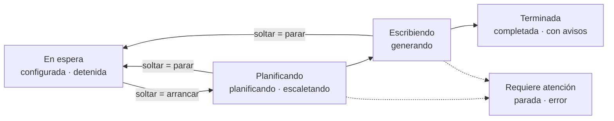

# SRS — Frontend v1: tablero de novelas

Requisitos del frontend web: un tablero al estilo Jira para ver las novelas y su generación, el detalle de una novela con sus capítulos, las paradas, un lector sencillo y la creación de una novela desde un brief.

Versión 0.1 · 23 de septiembre de 2026

> **Cómo leer este documento.** Se apoya en [spec1](spec1.md) (API y estados), [spec2](spec2.md) (paradas y reanudación) y [spec3](spec3.md) (brief), y no cambia ninguno. Los requisitos llevan el prefijo `RF-FE-`. Los callouts **Decisión entrevistada** y **Decisión de la spec** marcan qué se preguntó al autor y qué se decidió sin él. El plan de verificación está en [spec-frontend-verification.md](spec-frontend-verification.md).

---

## 1. Alcance

> **Decisión entrevistada, 23 de septiembre de 2026.** El frontend es un **extra** del plan de entrega. El bloque 7 de [storymaker-plan.md](storymaker-plan.md) no cambia: la lectura de la entrega sigue siendo HTML estático más PDF, que es lo que inspecciona el browser MCP. Se descartó que el frontend sustituyera al bloque 7 (obligaría a rehacer esa decisión y a conseguir igual el PDF) y quedarse solo en el prototipo HTML.

Entra en la v1:

- Tablero general de novelas (RF-FE-TAB).
- Tablero de una novela: planificación y capítulos (RF-FE-NOV).
- Alerta de parada con sus acciones (RF-FE-PAR).
- Lector de un capítulo cerrado (RF-FE-LEC).
- Crear novela con un formulario del brief (RF-FE-BRF).

No entra, y por qué:

| Fuera | Motivo |
| --- | --- |
| Entrevista conversacional en la web | La decisión 4 de spec3 la deja en el CLI, y la API no invoca al modelo (RF-COD-05). Llevarla a la web obliga a que corra en el worker por intenciones: es trabajo de backend con su propia spec |
| Explorador del canon, cronología, usos de un hecho y versiones publicadas | La API ya los sirve (`/canon`, `/cronologia`, `/hechos/{id}/usos` y `/versiones`, estos tres de RF3-BIB-15), pero no son lo que pidió el autor para esta ronda. Sus tipos se generan igual con el resto. `funcionalidades/canon/` queda vacía |
| Crear novela sin brief (payload de spec1) | Sigue existiendo en la API para tests y demo. En la web, toda novela nueva es personalizada |
| Despliegue | La v1 corre en local con el servidor de desarrollo, contra el backend en `127.0.0.1:8000` |
| Cambio del lector (bloque 8) | Todavía no tiene spec en el backend |

La referencia visual es el prototipo navegable de la **propuesta B, «papel técnico»** (`novelasv2-b/novelasv2-b/`, con sus decisiones en `DECISIONES.md`). La v1 reproduce sus pantallas y sus tokens. El comportamiento que el prototipo simula lo fija esta spec, y donde los dos difieren manda la spec.

## 2. Decisiones de producto

> **Decisión entrevistada, 22 y 23 de septiembre de 2026.** Seis decisiones:
>
> 1. **Tablero tipo Jira con dos niveles.** El tablero general tiene una tarjeta por novela y, al abrir una, sale su propio tablero con los capítulos como tarjetas. Se descartó un tablero solo de novelas (con una única obra generándose a la vez, casi siempre habría una tarjeta moviéndose y el resto quietas) y uno solo de capítulos (se pierde la vista de todas las obras).
> 2. **Estética B, «papel técnico».** Fondo de papel claro, azul cianotipo como único acento y rojo reservado a parada y error. Se descartaron la A, «Nostromo» (terminal ámbar sobre negro, demasiado oscura y cargada para una herramienta de horas), y una mezcla de las dos con tema oscuro alternativo.
> 3. **Crear novela = formulario del brief por pasos.** Se envía como `crear_novela` con `brief`, y la API devuelve lo que falta o se contradice. Se descartaron la entrevista en la web (ver el alcance) y no poder crear desde la web.
> 4. **Arrastrar es pedir, no hacer.** Soltar una tarjeta encola una intención, y la tarjeta cambia de columna cuando lo confirma el servidor. Se descartó que el arrastre moviera la tarjeta por su cuenta: rompería «el frontend observa, no posee» de [architecture.md](../docs/architecture.md#el-frontend-observa-no-posee).
> 5. **Three.js solo como ambiente**, en la pantalla de crear. Se descartó un grafo del canon en 3D, que se ocluye y cuesta leer.
> 6. **Prototipo antes que React.** El prototipo HTML fija la dirección visual y el flujo, y la v1 en React lo reproduce.

## 3. Requisitos específicos

### 3.1 Estructura y stack

**RF-FE-COD-01** El frontend vive en `src/frontend/` y sigue la estructura por funcionalidad de [architecture.md](../docs/architecture.md#arquitectura-del-frontend):

```text
src/frontend/
├── package.json · vite.config.ts · tsconfig.json · index.html
└── src/
    ├── app/                 # arranque, rutas, providers, composición entre funcionalidades
    ├── compartido/
    │   ├── api/             # tipos generados, cliente, SSE, intenciones
    │   ├── estilo/          # tokens.css (los de la propuesta B, sin cambios) y base
    │   └── ui/              # primitivos: botón, chip, diálogo, barra de progreso, aviso
    └── funcionalidades/
        ├── novela/          # crear: formulario del brief
        ├── ejecucion/       # tablero general, tablero de novela, paradas
        ├── canon/           # vacía en la v1
        └── manuscrito/      # lector de capítulo
```

Una funcionalidad no importa del interior de otra. Lo común baja a `compartido/` y la composición se hace en `app/`.

**RF-FE-COD-02** Stack:

| Pieza | Elección | Alternativa descartada |
| --- | --- | --- |
| Build | Vite 7 + React 19 + TypeScript 5 estricto | Next.js: no hay servidor que renderizar, el backend es otro proceso. Vite 8: ver la decisión de abajo |
| Estado del servidor | TanStack Query | SWR: invalidación por clave menos expresiva. Un almacén global (Redux, Zustand) lo prohíbe la arquitectura |
| Rutas | React Router | — |
| Arrastre | dnd-kit, con sensor de teclado | HTML5 drag and drop: sin teclado ni táctil |
| Ambiente 3D | `three` en un único componente cargado de forma perezosa | react-three-fiber: una sola pieza decorativa no justifica la capa |
| Cliente HTTP | `openapi-fetch` sobre los tipos generados | Un cliente escrito a mano: duplicaría las rutas y sus parámetros |
| Tests | Vitest 4 + Testing Library + MSW + axe | Vitest 3: tiene un aviso de seguridad abierto (GHSA-82fw-gwwq-j7x9) |

> **Decisión de la spec, 23 de septiembre de 2026.** **Vite 7 y no 8.** Vite 8 compila con rolldown, y en el equipo del autor la política de control de aplicaciones de Windows bloquea su binario nativo (`rolldown-binding.win32-x64-msvc.node`), que todavía es muy reciente. Los binarios de rollup, esbuild y lightningcss que usa Vite 7 cargan sin problema. Se descartaron dos salidas: forzar la build WASM de rolldown, porque sería rodear la política en vez de respetarla, y pedir una excepción a IT, porque bloquearía el trabajo sin ganar nada que Vite 7 no dé. Se revisa cuando el binario de rolldown gane reputación o cuando la política lo permita.

> **Decisión de la spec.** El autor no eligió librerías. Estas son las de menor ceremonia que cumplen lo que exige la arquitectura: *server state* con revalidación, arrastre accesible y 3D sin framework.

**RF-FE-COD-03** Rutas:

| Ruta | Pantalla |
| --- | --- |
| `/` | Tablero general |
| `/crear` | Crear novela (brief) |
| `/novelas/:id` | Tablero de la novela |
| `/novelas/:id/paradas/:pid` | Alerta de parada |
| `/novelas/:id/capitulos/:n` | Lector de capítulo |

### 3.2 Contrato con la API

**RF-FE-API-01 — Los tipos se generan.** Los tipos TypeScript salen de `src/backend/tests/openapi.json`, el snapshot que ya protege RF2-API-01, con `openapi-typescript` y el script `npm run tipos`, en `compartido/api/esquema.gen.ts`. TypeScript se queda en la 5.x, porque `openapi-typescript` usa la API de compilador que la 7 ya no trae. El fichero generado se commitea. Si el backend cambia el contrato, se regenera: un tipo escrito a mano que duplique un esquema publicado no pasa la revisión.

**RF-FE-API-02 — Sin CORS.** En desarrollo, Vite hace de proxy de `/api` a `http://127.0.0.1:8000`, también para el SSE. El backend no cambia.

**RF-FE-API-03 — Mocks del mismo contrato.** MSW sirve respuestas escritas contra los tipos generados, así que un cambio del contrato rompe la compilación de los mocks. Con `VITE_MOCKS=1`, el frontend corre entero sin backend, y en los tests siempre corre así.

**RF-FE-API-04 — Huecos del contrato.** Lo que el frontend necesita y la API todavía no publica. Cada hueco se resuelve en **un solo fichero** marcado como deuda, con un comentario que nombra el pedido al backend (sección 5):

| Hueco | Consecuencia | Solución provisional |
| --- | --- | --- |
| El `payload` de `crear_novela` es un `object` sin esquema, así que el `Brief` no aparece en el OpenAPI | No se puede generar su tipo | `compartido/api/brief.ts`, escrito a mano desde `compartido/brief.py` (RF3-BRF-01), con los mismos límites |
| Las acciones válidas de cada tipo de parada (`RESOLUCIONES` de `orquestador/estados.py`) no se exponen | El frontend no sabe qué botones ofrecer | `compartido/api/reglas.ts` copia la tabla de resoluciones y los conjuntos `ESTADOS_QUE_ADMITEN_ARRANCAR` y `ESTADOS_QUE_ADMITEN_RELANZAR`. El worker sigue siendo quien decide |
| `estado` y `fase` de `Ejecucion` y `NovelaResumen`, el `tipo` y el `estado` de `Parada` y el `estado` de una intención salen como `string`, no como enumerados | El compilador no avisa si el backend añade un estado | `reglas.ts` declara las uniones (`EstadoEjecucion`, `Fase`, `TipoParada`, `EstadoIntencion`) desde `compartido/tipos.py` y convierte cada `string` al leerlo. Un valor desconocido se pinta tal cual con aviso y no rompe la pantalla |
| `NovelaResumen` no trae `fase` ni `total_capitulos` | La tarjeta no puede pintar fase ni progreso | Una consulta de `/ejecucion` por novela visible. Con pocas novelas es aceptable |
| El `422` de `brief_incompleto` no está en el OpenAPI | El cuerpo del error no se tipa | Se tipa en `brief.ts` desde RF3-PER-05 |

### 3.3 Estado y datos

**RF-FE-DAT-01 — El `GET` es la verdad.** Toda pantalla se pinta desde consultas: `/novelas`, `/novelas/{id}/ejecucion`, `/estructura`, `/paradas` y `/capitulos/{n}`. No hay estado de cliente que duplique datos del servidor. El estado propio del cliente (qué diálogo está abierto, el borrador del brief) se queda en su componente.

**RF-FE-DAT-02 — El SSE invalida, no rellena.** Con una novela abierta, el frontend escucha `/novelas/{id}/eventos`. Cada evento invalida la ejecución y, si el evento lo indica, la estructura o las paradas. Ningún evento escribe datos en la caché.

**RF-FE-DAT-03 — Sondeo de respaldo.** La ejecución de una novela activa (`planificando`, `escaletando` o `generando`) se reconsulta cada 5 s aunque no llegue ningún evento. El tablero general se reconsulta cada 15 s.

**RF-FE-DAT-04 — Reconexión.** Si el SSE se corta o la red cae, aparece un aviso no bloqueante («Enlace perdido, reintentando»). Al volver, se invalidan todas las consultas y el SSE se reabre con `Last-Event-ID`. Volver de una suspensión del equipo (`visibilitychange`) cuenta como reconexión.

**RF-FE-DAT-05 — Ciclo de una intención.** `POST /intenciones` devuelve `202`, y el frontend consulta `GET /intenciones/{id}` cada segundo hasta que el estado sea `hecha`, `rechazada` o `interrumpida`, con un máximo de 60 s. Mientras tanto, lo que la pidió se ve como **pendiente**. Con `rechazada`, se muestra el `motivo` del worker. Si se agota el tiempo, se avisa y se invalida la ejecución, porque la intención puede seguir en cola.

### 3.4 Tablero general

**RF-FE-TAB-01 — Columnas.** Las nueve situaciones de la ejecución se agrupan así:

| Columna | Estados |
| --- | --- |
| En espera | `configurada`, `detenida` |
| Planificando | `planificando`, `escaletando` |
| Escribiendo | `generando` |
| Terminada | `completada`, `completada_con_avisos` |
| Requiere atención (carril aparte, en rojo, siempre visible) | `parada`, `error` |



Una novela sin ejecución (`estado` nulo en `NovelaResumen`) cae en «En espera».

**RF-FE-TAB-02 — Tarjeta de novela.** Muestra el título (o «Sin título» hasta que lo proponga el arquitecto), el estado exacto además de la columna, la fase en curso, el progreso `capitulos_completados / total_capitulos` y el tiempo desde `actualizado_en`. Una novela `completada_con_avisos` lleva un distintivo de avisos.

**RF-FE-TAB-03 — Arrastre.** Solo se puede soltar donde exista una intención:

| Desde | Hasta | Intención | Condición en el cliente |
| --- | --- | --- | --- |
| En espera | Planificando | `arrancar` | Estado en `ESTADOS_QUE_ADMITEN_ARRANCAR` |
| Planificando o Escribiendo | En espera | `parar` | Estado activo |

Mientras se arrastra, las zonas sin intención se ven bloqueadas. Al soltar, la tarjeta vuelve a su columna marcada como pendiente (RF-FE-DAT-05) y se mueve cuando la ejecución lo confirma. Las tarjetas de «Terminada» y «Requiere atención» no se arrastran: se abren.

**RF-FE-TAB-04 — Una obra a la vez.** Si ya hay una novela activa, la zona «Planificando» se ve bloqueada para las demás y lo explica. Aun así, si llega a encolarse un `arrancar`, el rechazo del worker se muestra como cualquier otro. El cliente avisa, pero quien decide es el worker.

**RF-FE-TAB-05 — Alternativa sin arrastre.** Toda tarjeta tiene un menú con las mismas intenciones y se maneja por teclado (el sensor de dnd-kit más el menú).

**RF-FE-TAB-06 — Tablero vacío.** Sin novelas, el tablero explica qué es y lleva a `/crear`.

### 3.5 Tablero de una novela

**RF-FE-NOV-01 — Cabecera.** Título, estado exacto, fase, intento `n/3` si hay capítulo en curso, y los botones que admite el estado según `reglas.ts`:

- `arrancar`, si el estado lo admite;
- `parar`, si está activo;
- `relanzar`, que pide «desde qué capítulo», con los capítulos existentes como opciones.

Con `error`, muestra `ultimo_error` y ofrece `arrancar` para reintentar.

**RF-FE-NOV-02 — Planificación.** Mientras no hay capítulos en `/estructura`, se muestra una barra de pasos: arquitecto → mundo → elenco → estructura → puerta 1 → escaleta → puerta 2. El paso activo sale de `ejecucion.fase`.

**RF-FE-NOV-03 — Capítulos.** Con estructura, los capítulos se reparten en tres columnas:

| Columna | Regla |
| --- | --- |
| Pendiente | Capítulo sin completar que no es el `capitulo_actual` |
| En curso | `capitulo_actual`, solo con la ejecución activa |
| Cerrado | `estado = completado` |

La tarjeta en curso muestra la subfase (paquete → redacción → extracción → puerta 3 → puerta 4) desde `ejecucion.fase` y el intento. Un capítulo no existe para el lector hasta que pasa la puerta 4 (RF-PIPE-08), así que la tarjeta en curso no enlaza a texto. Las tarjetas cerradas enlazan al lector. Las tarjetas de capítulo no se arrastran.

**RF-FE-NOV-04 — Parada visible.** Con `estado = parada`, una franja roja fija encima del tablero enlaza a la alerta de la parada abierta (`parada_abierta_id`).

### 3.6 Alerta de parada

**RF-FE-PAR-01 — Informe.** Muestra el tipo, el capítulo, el intento y el `informe` de `GET /paradas/{pid}`. El informe es un objeto sin esquema: sus claves conocidas se pintan con etiqueta legible y el resto como lista clave-valor, sin perder nada.

**RF-FE-PAR-02 — Acciones según el tipo.** Solo se ofrecen las acciones que admite el tipo de la parada (tabla de resoluciones en `reglas.ts`), cada una con una línea que explica su consecuencia:

| Tipo | Acciones |
| --- | --- |
| `estructura`, `escaleta` | `rehacer` |
| `continuidad` | `relanzar`, `aceptar_retcon`, `dar_por_sabido` |
| `oficio`, `presupuesto` | `relanzar` |

`relanzar` pide `desde_capitulo`. Cada acción se envía como `resolver_parada` y sigue el ciclo de RF-FE-DAT-05. Una parada ya resuelta se muestra en modo lectura, con su `resolucion`.

### 3.7 Lector

**RF-FE-LEC-01** `/novelas/:id/capitulos/:n` muestra `GET /capitulos/{n}`: número, versión, palabras y texto, con la tipografía de lectura de los tokens y un ancho de línea cómodo. Tiene navegación al capítulo anterior y al siguiente cerrados.

### 3.8 Crear novela: el brief

**RF-FE-BRF-01 — Pasos.** Formulario en cinco pasos, con los campos y límites de RF3-BRF-01:

| Paso | Campos |
| --- | --- |
| 1 · Destinatario | `nombre`, `edad`, `pronombres`, `rasgos` (1–8) |
| 2 · Su mundo | `recuerdos` (1–10), `allegados` (0–6: nombre, relación, rasgos, obligatorio) |
| 3 · El encargo | `ocasion` (+ `ocasion_detalle` si es `otra`), `quien_regala`, `mensaje_dedicatoria` |
| 4 · El terror | `intensidad`, con la tabla de RF3-BRF-02 visible (edad mínima, qué admite y qué no); `tono`; `subgenero` opcional («que lo elija el arquitecto»); `capitulos` (3–10, por defecto 10); `vetados` |
| 5 · Revisión | Resumen legible de todo, y enviar |

**RF-FE-BRF-02 — Sin texto libre.** El formulario no ofrece `texto_libre`.

> **Decisión de la spec.** El texto libre es no confiable (RF3-ENT-05) y solo tiene valor si el entrevistador extrae de él elementos con cita comprobada. Sin entrevista en la web, pegar una carta no aporta nada y abre una vía de inyección sin el filtro que la acota. Se descartó enviarlo tal cual. Quien quiera usar texto libre usa `entrevista.py`.

**RF-FE-BRF-03 — Elementos personales.** Cada rasgo, recuerdo o allegado se escribe como texto con una casilla de «obligatorio», marcada por defecto. El frontend no pone `codigo` (lo asigna `Brief.con_codigos`) ni `cita`, y deja `origen` en `entrevista`, que es lo más cercano a «lo dijo el comprador».

**RF-FE-BRF-04 — Quién valida.** El cliente aplica los límites de forma (longitudes, rangos, cantidades) para avisar pronto. **Qué falta y qué se contradice lo decide la API**: el envío devuelve `422` con código `brief_incompleto` y las listas de faltantes y contradicciones (RF3-PER-05), y el formulario vuelve al paso de cada campo señalado y lo marca con el mensaje del servidor. El cliente no reimplementa `analizar`.

> **Decisión de la spec.** Copiar `analizar` a TypeScript daría avisos antes, pero duplicaría la regla y acabaría divergiendo, que es justo lo que RF-FE-API-01 evita para los tipos. El precio es un viaje al servidor para descubrir una contradicción. Si molesta, la salida es pedir al backend un endpoint de análisis que no escriba (sección 5), no copiar la regla.

**RF-FE-BRF-05 — Envío.** Se envía `crear_novela` con `{ brief }`, sin título, porque lo propone el arquitecto (RF3-PER-01). Tras el `202`, «intención recibida, esperando asignación» hasta obtener `novela_id` (RF-FE-DAT-05), y de ahí al tablero de la novela, en `configurada`. El borrador sobrevive a recargar la página (almacenamiento local, con fallo silencioso) y se borra al crearse la novela.

**RF-FE-BRF-06 — Ambiente.** La pantalla lleva la pieza Three.js del prototipo: la estación dibujada en tinta azul sobre la retícula de plano. Es decorativa: se carga de forma perezosa, se detiene con `prefers-reduced-motion`, se oculta en pantallas de menos de 768 px y nunca tapa el formulario.

### 3.9 Estilo, accesibilidad y respuesta

**RF-FE-VIS-01 — Tokens.** `compartido/estilo/tokens.css` es el `tokens.css` de la propuesta B. Los colores, tipos, espaciados, radios y duraciones se usan solo a través de sus variables: ningún componente escribe un color literal.

**RF-FE-VIS-02 — Voz.** Los textos de interfaz son breves y en frase normal. Los códigos técnicos (estado exacto, fase, `P-0093`) van en la tipografía mono.

**RF-FE-VIS-03 — Accesibilidad.**

- Contraste AA en todo texto, con los valores ya medidos en `DECISIONES.md`.
- Foco visible.
- Todo manejable por teclado, incluido el arrastre (RF-FE-TAB-05).
- `prefers-reduced-motion` respetado.
- Los avisos de estado y de reconexión se anuncian por una región `aria-live`.

**RF-FE-VIS-04 — Tamaños de pantalla.** El escritorio es el caso principal y la tablet (≥ 768 px) tiene que ser usable. En móvil, el lector y la alerta de parada son cómodos, y el tablero se desplaza por columnas dentro de su contenedor, sin scroll horizontal de página.

## 4. Estados que toda pantalla tiene que cubrir

Cargando, vacío, error de red (con reintento), reconexión (RF-FE-DAT-04), intención pendiente, intención rechazada, novela en `error` y novela `completada_con_avisos`.

## 5. Pedidos al backend

Ninguno bloquea la v1. Cada uno retira un fichero de deuda de RF-FE-API-04:

| Pedido | Retira |
| --- | --- |
| Tipar el payload de `crear_novela` para que `Brief` aparezca en el OpenAPI, y declarar la respuesta `422` de `brief_incompleto` | `brief.ts` escrito a mano |
| Incluir en `Parada` sus `acciones_validas`, y en `Ejecucion` si admite `arrancar` y `relanzar` | `reglas.ts` |
| Declarar como `Literal` en los modelos de respuesta el estado de la ejecución, la fase, el tipo y el estado de la parada y el estado de la intención | Las uniones de `reglas.ts` |
| Añadir `fase` y `total_capitulos` a `NovelaResumen` | La consulta de ejecución por tarjeta |
| Opcional: un endpoint de análisis del brief que no escriba (`POST /briefs/analisis` devolviendo `analizar`) | El viaje de envío para descubrir contradicciones |

## 6. Orden de implementación

1. Andamiaje, tokens, rutas, tipos generados y MSW.
2. Tablero general, sin arrastre: columnas, tarjetas, sondeo.
3. Ciclo de intención y arrastre con alternativa de teclado.
4. Tablero de novela y SSE con reconexión.
5. Alerta de parada.
6. Lector.
7. Formulario del brief y ambiente Three.js.
