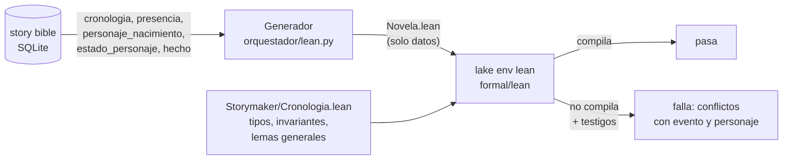

# Spec — Validador formal de la historia en Lean 4

Bloque 9 del [plan de entrega](storymaker-plan.md), primera mitad: **Lean 4**. La segunda mitad, TLA+ sobre la máquina de estados, va en su propia spec. Refina [spec3.md](spec3.md), 3.3 («Edad de los personajes» y «Cronología»), que dejó escrito qué datos lee Lean y qué pares compara que el SQL de la puerta 3 no compara. Plan de verificación: [spec-lean-verification.md](spec-lean-verification.md).

Actualizado el 24 de septiembre de 2026.

## Para qué

La puerta 3 comprueba la continuidad con SQL, **escena a escena y por el orden de la escaleta**. Tres cosas se le escapan por construcción:

1. **Las analepsis.** La comprobación de muertos y la de orden temporal las saltan enteras, porque su orden respecto a capítulos lejanos no lo conoce el extractor (spec3, RF3-BIB-09). Un recuerdo situado después de una muerte no para nada.
2. **Los antecedentes del mundo.** Llevan un orden negativo que el extractor no ve, y el SQL no los compara con la historia.
3. **Las edades.** El elenco declara la edad de cada personaje el día 0 (RF3-BIB-04), pero nada comprueba que ningún suceso ocurra antes de que nazca quien lo protagoniza, ni que la edad que la prosa afirma cuadre con la declarada.

Lean compara **por el día** (RF3-BIB-08), no por el orden de las escenas, y así puede mirar esos pares. El generador saca de la story bible un fichero `.lean` con los hechos temporales de la novela; los invariantes son proposiciones de Lean, y el fichero solo compila si la novela los cumple.

## Requisitos

**RF-LEAN-01 — Proyecto Lake.** `formal/lean/` es un proyecto Lake con la biblioteca `Storymaker` y la versión de Lean fijada en `lean-toolchain`. El módulo `Storymaker/Cronologia.lean` define los tipos de datos, los invariantes como proposiciones decidibles, las funciones que listan los testigos de cada violación y los lemas generales (RF-LEAN-04). `Storymaker/Ejemplo.lean` es el fichero que el generador produce para la novela de demo, versionado: `lake build` compila la biblioteca y ese ejemplo, así que un cambio en los tipos que rompa el generador rompe el build.

**RF-LEAN-02 — Generador.** `orquestador/lean.py`, `generar(con, novela_id) -> str`, devuelve el texto del fichero `.lean` de una novela. Es determinista: el mismo grafo da el mismo texto, byte a byte. El fichero solo lleva **datos** (ids, días, órdenes y banderas) e importa los invariantes de la biblioteca; los nombres de personajes van en comentarios, para que el fichero se pueda leer y no haya que escapar nada en Lean. Lo que exporta:

| Dato | Sale de | Qué lleva |
| --- | --- | --- |
| Evento | vista `cronologia` | id, día, orden interno, capítulo, si es antecedente del mundo, si es de la línea principal, si es un suceso dramatizado de una analepsis, y el **presente** de la historia en ese punto (RF-LEAN-03) |
| Presencia | vista `presencia` (spec2, RF2-PIPE-31) × eventos **dramatizados** con día de su escena | personaje, evento y día |
| Nacimiento | vista `personaje_nacimiento` (RF3-BIB-05) | personaje y día de nacimiento. Lean no recalcula la fórmula |
| Muerte | `estado_personaje.condicion = 'muerto'` | personaje y día: el mayor día de los eventos dramatizados de la escena donde muere |
| Edad declarada | hechos de un personaje con atributo `edad` y un valor en cifras, con «años» detrás como mucho | hecho, personaje, día y capítulo de su escena, y edad |

Un **antecedente del mundo** es un evento como los que inserta el constructor de mundo: sin escena, sin dramatizar y con orden interno negativo. Un evento que el extractor refiere sin escena no lo es, y no se compara con nada. Un suceso **referido** dentro de una escena (dramatizado a falso) no pone a nadie en él ni fija el día de la escena: contar la fundación de la colonia no es estar en ella.

Un evento sin día no entra: su hueco lo cuenta la cabecera del fichero. Una muerte en una escena sin eventos con día tampoco, y la cabecera también lo cuenta.

> **Decisión sin entrevistar, 24 de septiembre de 2026.** La presencia es la vista `presencia` entera, más ancha que `cronologia_personaje` (reparto y punto de vista). Para estos invariantes, más gente presente es el lado estricto (spec3, 3.3). Se excluye una sola fuente: el estado `muerto` registrado en una escena posterior, porque registrar que alguien sigue muerto no es estar. Se descartó usar solo `cronologia_personaje`: dejaba fuera a quien el redactor añade a la escena, que es justo donde apareció la reaparición indebida en la pasada real.

> **Decisión sin entrevistar, 24 de septiembre de 2026.** Una muerte cuenta si es la **última condición** registrada del personaje; si después se registra otra (un desaparecido que vuelve, una muerte fingida), no se exporta. Es la regla de `_SQL_MUERTO`, llevada al final de la novela. Se descartó exportar todas las muertes: una muerte revocada pararía la novela para siempre.

> **Decisión sin entrevistar, 24 de septiembre de 2026.** La edad declarada solo se lee si el valor es una cifra, con «años» detrás como mucho («34», «34 años»). Una edad en palabras («treinta y cuatro»), en otra unidad («6 meses») o con más texto («34 y medio») no se comprueba: convertirlas es otro analizador que puede equivocarse, y un falso positivo aquí bloquea la publicación. Queda como punto ciego.

> **Decisión sin entrevistar, 24 de septiembre de 2026, tras la validación del primer commit.** El validador encontró dos falsos positivos de la primera versión: la presencia se cruzaba con **todos** los eventos de la escena, también los referidos, y cualquier evento sin escena contaba como antecedente del mundo. Con la puerta enganchada, los dos habrían bloqueado la publicación sin contradicción ninguna. Se restringió la presencia a los sucesos dramatizados y el antecedente a la forma que le da el constructor de mundo. Se descartó leer el campo `tipo` del evento: es texto libre del agente.

**RF-LEAN-03 — Invariantes.** Cuatro, en `Storymaker/Cronologia.lean`:

| Invariante | Qué exige | Lo que la puerta 3 no ve |
| --- | --- | --- |
| `NadieAntesDeNacer` | Todo personaje presente en un evento ya ha nacido ese día: la edad en cada evento es 0 o más | La puerta 3 no mira las edades. Una analepsis a hace treinta años con un personaje de veinte pasa las cinco puertas |
| `NadieTrasMorir` | Nadie está presente en un evento de un día posterior al de su muerte | `_SQL_MUERTO` salta las analepsis y solo lee el reparto de la escaleta. Aquí cuentan el día, las analepsis y la presencia que registra el extractor |
| `EdadCoherente` | Una edad declarada en la prosa es la que da el nacimiento ese día: `⌊(día − nacimiento) / 365⌋` | La puerta 3 compara hechos entre sí, nunca con la edad del elenco |
| `ElTiempoNoRetrocede` | Los antecedentes del mundo caen el día 0 o antes; los eventos de la línea principal (dramatizados, fuera de analepsis), el día 0 o después, y en orden: un orden interno menor o igual no cae en un día posterior (con orden igual, el mismo día, como `dia_contra_orden`); un evento de una analepsis no cae después del presente de la historia en ese punto | La tercera parte repite `dia_contra_orden` a propósito, para comparar los dos métodos sobre los mismos pares. La primera, la segunda y la cuarta son nuevas: comparan con la historia los antecedentes y las analepsis |

El **presente** de un evento es el mayor día de la línea principal en las escenas anteriores a la suya, en el orden de la escaleta, o 0 si no hay ninguna.

> **Decisión sin entrevistar, 24 de septiembre de 2026.** Se descartó «nadie en dos lugares a la vez». La puerta 3 ya lo comprueba en SQL (`presencia_imposible`) sobre sucesos simultáneos, con la contención de lugares (RF2-PIPE-26), y llevarlo a Lean pedía exportar el árbol de lugares para repetir lo mismo. Se prefirió lo que la puerta 3 no ve, como pide el plan. Se descartó también «nadie aparece tras una partida»: la story bible no registra partidas como dato cerrado (no hay condición `partido`), y deducirlas del texto es trabajo del extractor. El detalle está en [trade-offs](../docs/proceso/trade-offs.md).

**RF-LEAN-04 — Lemas generales.** La biblioteca demuestra, para cualquier novela, que la lista de testigos de cada invariante está vacía **si y solo si** el invariante se cumple. Por eso el fichero de una novela puede afirmar el invariante con `decide` y, si falla, la lista de testigos dice exactamente qué evento y qué personaje lo rompen, sin que el testigo y la comprobación puedan discrepar.

**RF-LEAN-05 — Ejecución.** `orquestador/lean.py`, `verificar(con, novela_id) -> ResultadoPuerta`:

1. Genera el fichero en `formal/lean/Generado/` (fuera de git; se borra al terminar), compila la biblioteca con `lake build` si hace falta y ejecuta `lake env lean <fichero>`, las dos llamadas dentro de un solo límite de 300 segundos.
2. Si compila, pasa.
3. Si no compila, cada testigo impreso es un conflicto bloqueante con su comprobación (`lean_nadie_antes_de_nacer`, `lean_nadie_tras_morir`, `lean_edad_coherente`, `lean_el_tiempo_no_retrocede`), el capítulo del evento y una descripción legible con el nombre del personaje, que el editor recibe como feedback. Un error de compilación sin testigos (el fichero generado no es Lean válido) es un conflicto `lean_error` con la salida recortada.
4. Si Lean no está instalado o se agota el tiempo, el resultado es un **aviso** `lean_no_disponible`: la novela no queda sin comprobar en silencio, pero tampoco se bloquea por falta de la herramienta.

`src/backend/verificar_lean.py --novela N [--db ruta] [--generar]` hace lo mismo desde la línea de comandos, con la base en solo lectura: sirve para comprobar una copia de una novela real o para ver el fichero generado.

> **Decisión sin entrevistar, 24 de septiembre de 2026.** Sin Lean instalado, la puerta avisa y deja pasar. Se descartó bloquear: una máquina sin Lean dejaría de publicar novelas por una herramienta, no por la novela. **Pendiente de confirmar con el autor**, porque el enunciado pide que la puerta impida publicar.

**RF-LEAN-06 — Puerta antes de publicar.** *Pendiente: se engancha cuando el cambio del lector (bloque 8) esté integrado.* La verificación corre en `_completar` (`orquestador/pipeline.py`), la función que cierra tanto la generación normal como un cambio del lector, antes de la transacción que publica la versión (RF3-BIB-12). Si falla, la versión no se publica:

- en la **generación normal**, se abre una parada de tipo `formal` en el primer capítulo con conflictos, con el informe de Lean, y al relanzarlo los conflictos llegan al redactor como el informe de la puerta 3;
- en un **cambio del lector**, el cambio fracasa sin aplicar nada y devuelve el informe de Lean, sin parada.

Su resultado queda en `resultado_puerta` como puerta 6, y de ahí sale a Langfuse como score (`puerta_6` y un score por comprobación, RF3-OBS). La migración 012 admite `puerta = 6` en el `CHECK` de `resultado_puerta` y el tipo de parada `formal`.

> **Decisión sin entrevistar, 24 de septiembre de 2026, coordinada con la sesión del backend.** El punto de entrada es `_completar` y no el final de `_avanzar`, para que el cambio del lector pase por la misma puerta. Que un cambio del lector no abra parada es de esa sesión: el lector no espera a que alguien resuelva una parada, y un cambio que rompe la cronología se rechaza entero.

**RF-LEAN-07 — Evidencia.** Al menos un caso en que Lean detecta una incoherencia que la puerta 3 no detectó, o la justificación de por qué no apareció, sobre una copia de una novela real hecha con la API de backup o sobre un caso construido. Queda en `tests/test_formal_lean.py` y en el explainer.

## Lo que no hace

- No comprueba que el día que declara el extractor sea el verdadero: día y orden los declara el mismo agente (regla 3 de validators.md). Lean detecta que se contradigan entre sí o con la edad, no que los dos estén mal de la misma forma.
- No comprueba ubicuidad ni partidas (RF-LEAN-03).
- No lee edades en palabras ni en otras unidades (RF-LEAN-02).
- **No ve el orden dentro de un día.** Estar presente el día de la propia muerte, pero después de morir, pasa: el invariante compara días con `≤`. La puerta 3 tampoco lo ve si la presencia no está en el reparto.
- Un suceso dramatizado de una analepsis pone en él a todos los de la escena. Si la analepsis dramatiza algo que pasó antes de que naciera quien la recuerda (la llegada de un abuelo), Lean para aunque la prosa lo cuente bien. Es el lado estricto de spec3, 3.3; lo que no se vive en la escena debería venir como referido.
- **Escala.** La comprobación crece con el cuadrado del número de eventos: unos 21 s con 100 eventos y 8 personajes por suceso, 75 s con 200, y más de 600 s con 400. Una novela de 10 capítulos anda por los 100 a 150 eventos. Si se pasa del límite, la puerta avisa (`lean_no_disponible`), no calla.
