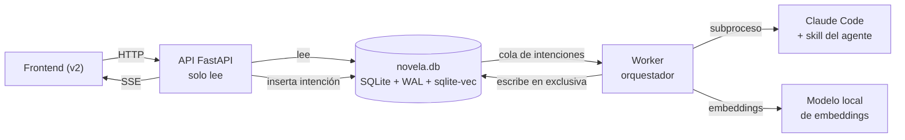
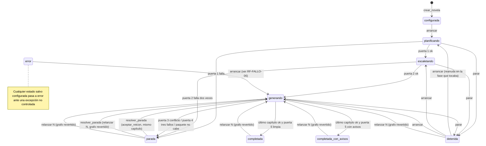

# SRS — Backend v1 del sistema de generación de novela

Especificación de requisitos de software de la **primera versión del backend**: el servidor FastAPI, el worker orquestador, la persistencia SQLite y el puerto que invoca a Claude Code. Es un único documento; las specs posteriores lo refinan por tarea, no lo sustituyen.

Versión 0.1 · 21 de septiembre de 2026 · Rama `novelasv2`

> **Cómo leer este documento.** Las secciones 1 y 2 fijan qué se construye y qué no. La sección 3 son los requisitos, numerados para poder citarlos desde el código, los tests y el plan de verificación. La sección 4 es el modelo de datos. La sección 5 enumera las decisiones que esta spec toma sobre huecos que [docs/architecture.md](../docs/architecture.md) dejó abiertos. La sección 6 es el plan de verificación resumido.
>
> Los callouts **Decisión de la spec** marcan decisiones tomadas aquí sin entrevista, con el criterio de elegir la opción más coherente con lo que `docs/` ya defiende. Son el primer sitio donde mirar si algo hay que rehacer. Las que cierren una pendiente de `docs/` se llevan allí después, con la entrevista que exige `AGENTS.md`; esta spec no edita `docs/`.

---

## 1. Introducción

### 1.1 Propósito

Definir lo que el backend v1 debe hacer para que un autor pueda, desde un cliente HTTP, configurar una novela de terror espacial, arrancar su generación autónoma, vigilarla, detenerla ante un conflicto de continuidad y leer el manuscrito resultante. El documento sirve a tres lectores: quien implementa `src/backend/`, quien escribe las skills de los agentes en `.claude/skills/`, y quien construye el plan de verificación.

### 1.2 Alcance de la v1

**Entra en la v1:**

- La API HTTP de solo lectura más la escritura de intenciones.
- El worker con el orquestador completo del pipeline hasta el **manuscrito completo**: planificación, escaleta, y el bucle de capítulo con sus cuatro puertas.
- La parte determinista de la puerta 5, ejecutada como informe final no bloqueante.
- La persistencia en un único fichero SQLite con el esquema de las secciones canon, estructura, estado, texto y traza.
- El puerto a Claude Code por terminal, como subproceso.
- Las nueve skills de los agentes que la v1 ejecuta: `arquitecto`, `mundo`, `elenco`, `estructura`, `escaleta`, `redaccion`, `extraccion`, `continuidad`, `oficio`.
- La política de fallo completa: parada en puerta 3, reintento en puerta 4, reanudación desde capítulo N y recuperación del worker caído.
- El **índice vectorial** sobre texto de escena y hechos (`sqlite-vec`), usado solo para **recuperar** contexto para el redactor y para ordenar candidatos de canon cuando sobran (sección 3.7, RF-CTX-07 a RF-CTX-10).

**Queda fuera de la v1** (ver 2.6 para el motivo de cada exclusión):

- El agente **revisor**, la skill `revision` y las cuatro pasadas globales.
- La parte de juicio de las puertas 1 y 5.
- La detección de imágenes y fórmulas repetidas por similitud (uso del índice vectorial que pertenece a la revisión).
- La revalidación en cascada al reescribir una escena antigua.
- El frontend. Esta spec fija el contrato HTTP que el frontend consumirá, nada más.
- Autenticación, multiusuario y más de una novela generándose a la vez.

### 1.3 Definiciones y acrónimos

| Término | Significado en este documento |
| --- | --- |
| **Canon** | El grafo de estado en SQLite. Es la fuente de verdad; el manuscrito es su manifestación. |
| **Agente** | Una invocación de Claude Code con la skill de una fase cargada. No es una llamada a una API de modelo. |
| **Tarea** | Carpeta de `src/backend/tareas/` con todo lo de una fase. La lista de tareas es la lista de agentes. |
| **Orquestador** | Código del worker que decide qué fase toca, ensambla paquetes, evalúa puertas y aplica la política de fallo. |
| **Puerto** | La única abstracción del backend: la interfaz por la que el worker invoca a Claude Code. |
| **Paquete de capítulo** | El contexto seleccionado por el orquestador para una llamada de agente, ajustado al presupuesto de tokens. |
| **Puerta** | Comprobación entre fases. Las deterministas son consultas al grafo; la de oficio es juicio de un agente. |
| **Intención** | Fila que la API inserta y el worker consume: la única vía por la que el usuario actúa sobre el pipeline. |
| **Parada** | Estado en que el pipeline espera decisión humana, con un informe adjunto. |
| **Trust Spec** | Etiquetas `T`/`A`/`I`/`D`/`U` de [docs/validators.md](../docs/validators.md). |

### 1.4 Referencias

- [docs/architecture.md](../docs/architecture.md) — arquitectura del sistema. Esta spec la implementa.
- [docs/definitions.md](../docs/definitions.md) — ontología. El esquema de la sección 4 la traduce a tablas.
- [docs/domain-knowledge.md](../docs/domain-knowledge.md) — los 55 principios que las skills reparten.
- [docs/validators.md](../docs/validators.md) — catálogo de métodos de verificación y Trust Spec.
- [.claude/skills/verificacion/SKILL.md](../.claude/skills/verificacion/SKILL.md) — cómo se construye el plan de verificación hermano de esta spec.

---

## 2. Descripción general

### 2.1 Perspectiva del producto

Tres procesos y un fichero:



La API no ejecuta el pipeline ni importa el orquestador. El worker es el único escritor de la base de datos. Claude Code es un programa externo al que el worker invoca a través del puerto; el backend no contiene ninguna clave de proveedor de modelo.

### 2.2 Funciones del producto

1. Crear y configurar una novela: título, restricciones de longitud, público y política de contenido, y una semilla de premisa opcional.
2. Arrancar la generación y dejarla correr sin intervención hasta el manuscrito completo.
3. Emitir el progreso en tiempo real y exponer el estado completo bajo demanda.
4. Detenerse ante cualquier contradicción con el canon, con un informe que señala el hecho, la escena origen y el texto que lo contradice.
5. Reintentar un capítulo que falla la puerta de oficio, con el criterio incumplido, hasta tres veces.
6. Parar por orden del usuario y reanudar desde el último capítulo íntegro.
7. Relanzar desde un capítulo N revirtiendo el grafo a como estaba al terminar N-1.
8. Recuperarse de un worker caído a mitad de capítulo sin dejar estado parcial.
9. Exponer el canon, la estructura y el manuscrito para lectura, con todas las versiones de cada escena.

### 2.3 Usuarios

Un único **autor**, en máquina propia. No hay roles, ni sesiones, ni usuarios ajenos. El frontend de la v2 y cualquier cliente HTTP (curl, un script) son equivalentes para esta spec.

### 2.4 Restricciones de diseño heredadas

Estas restricciones vienen de `docs/` y la spec no las discute:

| Restricción | Origen |
| --- | --- |
| Techo de **100.000 tokens** por llamada al modelo | architecture.md, restricción que condiciona el resto |
| El **capítulo** es la unidad de trabajo, de verificación y de transacción | principio 6 |
| El contexto **se selecciona, nunca se vuelca**; el agente no busca canon por su cuenta | principio 7 y regla dura del motor |
| **Un `Hecho` establecido no se borra por una pasada de prosa** | fuente de verdad |
| Lo determinista se verifica con **consultas al grafo**, no con un modelo | principio 5, validators.md |
| **La puerta 3 para; la puerta 4 reintenta tres veces y escala** | política de fallo |
| **El worker escribe, la API solo lee** salvo insertar intenciones | escritor único |
| WAL activado y `busy_timeout` distinto de cero | escritor único |
| **Una tarea no importa de otra**; lo compartido baja a `compartido/` | cortes verticales |
| **FastAPI solo aparece en los `router.py`** | cortes verticales |
| Stack: Python, FastAPI, SQLite; motor de agentes Claude Code | tabla del sistema |

### 2.5 Supuestos y dependencias

- **Un solo autor, una obra a la vez, máquina propia.** Son las tres premisas no verificadas de la arquitectura de ejecución. Si alguna cae, se rehace la sección 3.2 entera.
- **Claude Code está instalado y autenticado** en la máquina, y su ejecutable es invocable desde el worker. El backend no gestiona esa autenticación.
- **Claude Code admite modo no interactivo** con entrada por argumento o stdin, salida en JSON, sustitución del prompt de sistema y restricción de herramientas. Si alguna de esas capacidades no existe o cambia, el puerto la absorbe; el resto del backend no la ve.
- **La compactación de Claude Code no se dispara** dentro de una llamada de agente, porque el paquete cabe en el presupuesto y el agente no tiene herramientas con las que crecer. Es un supuesto, y la traza lo registra para poder contradecirlo (RF-PUERTO-08).
- La novela es de **terror espacial**. La ontología y el oficio de `docs/` son de ese género; el backend no parametriza el género.

### 2.6 Qué no entra en la v1, y por qué

| Fuera | Motivo |
| --- | --- |
| Revisor y pasadas globales | Dependen de la revalidación en cascada, que exige dependencias entre hechos aún no modeladas en definitions.md. Un manuscrito sin pasadas globales sigue siendo un resultado completo y verificable de la v1. |
| Juicio de las puertas 1 y 5 | Requiere un agente juez sobre estructura. Su parte determinista sí entra, y es la que invalida trabajo posterior. |
| Repetición de imágenes por similitud | Es un uso del índice vectorial que sirve al revisor y a las pasadas globales, no al redactor. El índice sí entra en la v1 para recuperación (RF-CTX-07); este uso concreto espera al revisor. |
| Frontend | Tiene su propia decisión pendiente (panel o sala de lectura). Esta spec le deja el contrato OpenAPI. |
| Multiusuario, concurrencia de obras | Contradice las tres premisas de la arquitectura de ejecución. |

---

## 3. Requisitos específicos

Cada requisito lleva un identificador estable. **Debe** es obligatorio en la v1; **debería** es deseable y se puede posponer con motivo escrito; **puede** es opcional.

### 3.1 Estructura del código

**RF-COD-01** El backend vive en `src/backend/` con esta forma, que es la de architecture.md sin la carpeta `revision` (fuera de la v1):

```text
src/backend/
├── pyproject.toml
├── main.py                  # API: monta los routers; no importa el orquestador
├── worker.py                # Worker: bucle de polling y orquestador
├── config.py                # lectura de variables de entorno, un solo sitio
├── compartido/
│   ├── db.py                # conexión, PRAGMAs, transacciones, migraciones
│   ├── esquema.sql          # DDL completo, un fichero
│   ├── grafo/               # repositorios por grupo: canon, estructura, estado, texto, traza
│   ├── contexto/            # ensamblado del paquete de capítulo y presupuesto
│   ├── puerto/              # interfaz PuertoAgente, PuertoTerminal, PuertoFalso
│   ├── orquestador/         # máquina de estados, política de fallo, reanudación
│   ├── vectores/            # embeddings locales, tablas vec0, reconstruir_indice()
│   └── eventos.py           # publicación de eventos de traza
└── tareas/
    ├── arquitecto/
    ├── mundo/
    ├── elenco/
    ├── estructura/
    ├── escaleta/
    ├── redaccion/
    ├── extraccion/
    ├── continuidad/
    └── oficio/
```

**RF-COD-02** Cada carpeta de `tareas/` contiene como máximo estos ficheros: `esquemas.py` (Pydantic: entrada y salida del agente), `servicio.py` (qué hace la fase con el grafo), `prompt.py` (cómo se serializa el paquete para el agente), `puerta.py` (si la fase tiene puerta), `router.py` (si expone HTTP) y sus tests al lado con prefijo `test_`.

**RF-COD-03** Ninguna tarea importa de otra tarea. Se verifica con un test que recorre los imports (sección 6).

**RF-COD-04** `fastapi` solo se importa en `main.py` y en los `router.py`. El worker no importa FastAPI.

**RF-COD-05** Los `router.py` no importan `compartido/puerto/` ni `compartido/orquestador/`. La API no puede invocar a Claude Code ni por accidente.

**RF-COD-06** El nombre de cada carpeta de `tareas/` coincide con el nombre de su skill en `.claude/skills/`.

### 3.2 Procesos y arranque

**RF-PROC-01** API y worker son **dos comandos separados**: `python -m backend.main` y `python -m backend.worker`. Ninguno arranca al otro.

> **Decisión de la spec (21-09-2026).** architecture.md dejaba abierto si el `lifespan` de la API lanza el worker. Se eligen dos comandos: es lo que la propia arquitectura llama «más honesto de depurar», y evita que reiniciar la API mate una generación en curso, que es justo lo que descarta la alternativa de un solo proceso.

**RF-PROC-02** Ambos procesos leen la misma configuración desde variables de entorno con prefijo `NOVELAS_`, centralizada en `config.py`:

| Variable | Obligatoria | Defecto | Uso |
| --- | --- | --- | --- |
| `NOVELAS_DB_PATH` | sí | — | Ruta del fichero SQLite |
| `NOVELAS_CLAUDE_BIN` | no | `claude` | Ejecutable de Claude Code |
| `NOVELAS_SKILLS_DIR` | no | `.claude/skills` relativo a la raíz del repo | Dónde están las `SKILL.md` |
| `NOVELAS_POLL_SEGUNDOS` | no | `2` | Cadencia de polling del worker |
| `NOVELAS_TIMEOUT_AGENTE_SEGUNDOS` | no | `1800` | Tiempo máximo por invocación de agente |
| `NOVELAS_PRESUPUESTO_TOKENS` | no | `100000` | Techo por llamada |
| `NOVELAS_PUERTO` | no | `terminal` | `terminal` o `falso` (tests y demos) |
| `NOVELAS_EMBEDDING_MODELO` | no | provisional, ver RF-CTX-10 | Modelo local de embeddings |
| `NOVELAS_VECTORES` | no | `1` | `0` desactiva el índice; el pipeline sigue (RF-CTX-09) |

**RF-PROC-03** Si `NOVELAS_DB_PATH` no existe, cualquiera de los dos procesos crea el fichero y aplica el esquema completo al arrancar. Si existe, aplica las migraciones pendientes (RF-PER-04).

> Sustituido por spec2, RF2-PROC-03.

**RF-PROC-04** El worker rechaza arrancar si detecta otro worker vivo sobre la misma base de datos (fila `worker_lock` con latido reciente; ver RF-PER-09). Dos workers violarían el escritor único.

### 3.3 API HTTP

**RF-API-01** La API expone OpenAPI en `/openapi.json` y toda respuesta se declara con esquemas Pydantic. El frontend generará su cliente desde ahí; ningún endpoint devuelve `dict` sin esquema.

**RF-API-02** La API **solo lee** el grafo, con una excepción: `POST` de intenciones inserta una fila en `intencion`. Ninguna otra ruta escribe.

> Ampliado por spec2, RF2-PROC-03: la API puede crear el esquema al arrancar, pero no migra.

**RF-API-03** Endpoints de la v1:

| Método y ruta | Devuelve | Notas |
| --- | --- | --- |
| `POST /intenciones` | `202` con `{ id, tipo, estado }` | Cuerpo: `{ tipo, novela_id?, payload }`. Ver RF-API-04 |
| `GET /intenciones/{id}` | Estado de la intención y, si `hecha`, su resultado | Para `crear_novela`, el resultado incluye `novela_id` |
| `GET /novelas` | Lista de novelas con su estado de ejecución | |
| `GET /novelas/{id}` | `Novela`, `Restriccion`, `EstiloNarrativo` | |
| `GET /novelas/{id}/ejecucion` | Estado completo de la ejecución (RF-WK-05) | **La verdad**; el SSE es comodidad |
| `GET /novelas/{id}/eventos` | Stream SSE de eventos de traza | Acepta `Last-Event-ID` (RF-API-06) |
| `GET /novelas/{id}/canon/{entidad}` | Filas de la entidad: `mundo`, `sistemas`, `lugares`, `personajes`, `facciones`, `amenaza`, `objetos`, `temas`, `motivos`, `eventos` | |
| `GET /novelas/{id}/estructura` | Actos → capítulos → escenas con sus atributos de escaleta, más hilos, siembras y puntos de giro | |
| `GET /novelas/{id}/capitulos/{n}` | Texto compilado del capítulo en su última versión, escena a escena | `?version=` para una versión anterior |
| `GET /novelas/{id}/capitulos/{n}/versiones` | Lista de versiones por escena, con quién y cuándo | |
| `GET /novelas/{id}/hechos` | Hechos vigentes, filtrables por `sujeto`, `categoria`, `capitulo` | Paginado |
| `GET /novelas/{id}/conocimiento` | `EstadoDeConocimiento` filtrable por `personaje` y `hecho` | Paginado |
| `GET /novelas/{id}/paradas` | Paradas de la ejecución con su informe | |
| `GET /novelas/{id}/paradas/{pid}` | Informe completo de una parada (RF-FALLO-02) | |
| `GET /novelas/{id}/traza/llamadas` | Llamadas al agente: agente, capítulo, intento, tokens estimados, duración, resultado | Sin el texto del prompt por defecto; `?completo=1` lo incluye |

**RF-API-04** Tipos de intención y su validación en la API (la API valida forma; el worker valida estado):

| `tipo` | `payload` | Precondición que valida la API |
| --- | --- | --- |
| `crear_novela` | título, género (`terror_espacial`), restricciones (RF-PIPE-02), `semilla_premisa?` | Forma del payload |
| `arrancar` | — | `novela_id` existe |
| `parar` | — | `novela_id` existe |
| `relanzar` | `desde_capitulo: int ≥ 1` | `novela_id` existe |
| `resolver_parada` | `parada_id`, `accion: relanzar \| aceptar_retcon`, `desde_capitulo?` | La parada existe y está `abierta` |

> **Decisión de la spec (21-09-2026).** Crear la novela también es una intención, no un `POST /novelas` que escriba. Mantiene intacta la regla del escritor único con su única excepción. El coste es que el cliente recibe un `202` y consulta la intención hasta obtener `novela_id`, con la latencia del polling del worker. Se acepta: el frontend ya tiene que tratar la reconexión como caso de primera clase, así que esperar dos segundos por un id no añade complejidad nueva.

> Ampliado por spec2, RF2-FALLO-03: `accion` admite también `rehacer`.

**RF-API-05** Toda lectura del grafo desde la API abre su propia conexión de solo lectura (`mode=ro` en la URI) con WAL y `busy_timeout`. Los endpoints son funciones síncronas (`def`), que FastAPI ejecuta en su pool de hilos, salvo el de SSE.

> **Decisión de la spec (21-09-2026).** Cierra la pendiente «límites de `async`»: ninguna consulta del grafo corre en el bucle de eventos. El worker es síncrono entero. Solo el endpoint SSE es `async`, y lo único que hace es dormir y consultar la tabla de eventos.

**RF-API-06** El endpoint SSE emite una fila por evento de `traza_evento` con `id` como `id:` del evento y el payload JSON como `data:`. Si la petición trae `Last-Event-ID`, empieza en el siguiente. Emite un comentario keep-alive cada 15 segundos. Si el cliente pierde el stream, `GET /ejecucion` devuelve la verdad y `Last-Event-ID` recupera lo perdido: **ninguna decisión del cliente debe depender de haber recibido un evento**.

**RF-API-07** Errores en JSON con `{ codigo, mensaje, detalle? }`. `404` para novela, capítulo, parada o intención inexistentes; `422` para intención mal formada; `409` no existe en la API: los conflictos de estado los resuelve el worker marcando la intención como `rechazada` con motivo.

### 3.4 Worker y cola

**RF-WK-01** El worker es un bucle: cada `NOVELAS_POLL_SEGUNDOS` toma la intención `pendiente` más antigua con un `UPDATE … WHERE estado='pendiente' … RETURNING` que la pasa a `en_curso`, la ejecuta y la marca `hecha` o `rechazada` con motivo.

**RF-WK-02** Solo puede haber **una ejecución activa** en toda la base de datos. `arrancar` sobre una novela mientras otra está en `planificando`, `escaletando` o `generando` se rechaza con motivo `otra_ejecucion_activa`.

**RF-WK-03** `parar` interrumpe la llamada de agente en curso (RF-PUERTO-06), hace rollback de la transacción abierta y deja la ejecución en `detenida`. Nada de lo que la llamada interrumpida produjo se conserva salvo su fila de traza. El siguiente `arrancar` reanuda desde la última unidad completa.

**RF-WK-04** El worker consulta si hay una intención `parar` pendiente para la novela activa **entre pasos** y **durante** una llamada de agente (comprobando cada `NOVELAS_POLL_SEGUNDOS` mientras espera al subproceso). Mientras ejecuta una novela no toma intenciones de otras salvo `crear_novela`.

**RF-WK-05** El estado de la ejecución vive en la tabla `ejecucion` y es lo que devuelve `GET /ejecucion`:

| Campo | Valores |
| --- | --- |
| `estado` | `configurada`, `planificando`, `escaletando`, `generando`, `parada`, `detenida`, `completada`, `completada_con_avisos`, `error` |
| `fase` | Agente o puerta en curso: `arquitecto`, `mundo`, `elenco`, `estructura`, `puerta_1`, `escaleta`, `puerta_2`, `paquete`, `redaccion`, `extraccion`, `puerta_3`, `puerta_4`, `puerta_5`, o `null` |
| `capitulo_actual` | Número o `null` |
| `intento_actual` | 1 a 3 en el bucle de capítulo |
| `capitulos_completados` | Entero |
| `parada_abierta_id` | Id de la parada si `estado = parada` |
| `ultimo_error` | Texto si `estado = error` |
| `actualizado_en` | Marca de tiempo |

**RF-WK-06** Máquina de estados de la ejecución. Las transiciones que no aparecen no existen y se rechazan:



`relanzar N` se admite desde cualquier estado salvo `configurada`; el diagrama muestra los orígenes habituales.

> Sustituido por spec2, RF2-WK-06.

**RF-WK-07** El worker escribe una fila en `worker_lock` con su pid y renueva un latido cada ciclo. Al arrancar, si hay un latido de menos de tres ciclos de antigüedad de otro pid, aborta (RF-PROC-04).

> Sustituido por spec2, RF2-WK-07 y RF2-WK-08.

### 3.5 Pipeline: planificación y escaleta

**RF-PIPE-01** Al ejecutar `crear_novela`, el worker inserta `novela` con `estado_ejecucion = configurada`, sus `restriccion` y una `ejecucion` vacía, y devuelve `novela_id` en el resultado de la intención.

**RF-PIPE-02** Las restricciones que la v1 acepta, todas opcionales salvo la longitud:

| `tipo` | `valor` | Quién la lee |
| --- | --- | --- |
| `longitud_objetivo_palabras` | Entero, obligatorio | Arquitecto (en `Novela.longitudObjetivo`), escaletador, puerta 2 |
| `longitud_capitulo_palabras` | Rango `min-max` | Escaletador, puerta 2 |
| `publico` | Texto libre | Arquitecto |
| `politica_contenido` | Texto libre | Arquitecto, redactor |
| `pov_por_defecto` | `primera`, `tercera_limitada`, `omnisciente`, `objetiva` | Arquitecto (defecto `tercera_limitada`) |
| `tiempo_verbal` | `pasado`, `presente` | Arquitecto (defecto `pasado`) |

`Restriccion` no la escribe ningún agente: entra desde la intención y el arquitecto la lee.

**RF-PIPE-03** Planificación: el worker invoca en orden **arquitecto → constructor de mundo → diseñador de elenco → estructurador**, una vez cada uno. Cada uno recibe un paquete con la salida de los anteriores (RF-CTX-06) y devuelve un JSON que valida el `esquemas.py` de su tarea. La salida validada se escribe en el grafo **en una transacción por agente**. Un fallo de validación reintenta la llamada una vez con el error adjunto; el segundo fallo pasa la ejecución a `error`.

**RF-PIPE-04** Salida obligatoria de cada agente de planificación, en términos de la ontología:

| Agente | Escribe | Criterio de terminación que el esquema hace exigible |
| --- | --- | --- |
| Arquitecto | `Novela` (premisa, logline, preguntaDramatica, temaCentral, subgeneroDominante, tipoFinal, povPorDefecto, tiempoVerbal), `Tema` ≥ 1, `Motivo` ≥ 1, `EstiloNarrativo` completo | Los tres campos de compresión no vacíos; `tipoFinal` de la lista cerrada; `ticsProhibidos` es una lista no vacía |
| Constructor de mundo | `Mundo`, `SistemaTecnologico` ≥ 1, `Lugar` ≥ 3, `Faccion` ≥ 1, `Amenaza` con `reglas` ≥ 3, `LineaDeTiempo`, `Evento` previos ≥ 1 | Cada `SistemaTecnologico` tiene `costes` y `limites` no vacíos; `Amenaza.reglas` es una lista de reglas con capacidad, límite y condición de activación |
| Diseñador de elenco | `Personaje` ≥ 3, con la cadena fantasma→herida→mentira→defecto, `tipoArco`, `rolNarrativo`, `idiolecto`; relaciones `perteneceA`, `seOponeA`, `aliadoCon` | Exactamente un `protagonista`; al menos un `oponente`; ningún par con el mismo `rolNarrativo` y la misma posición ante el tema (campo `posicion_tematica`, texto corto) |
| Estructurador | `Acto` ≥ 3, `HiloNarrativo` con exactamente uno de tipo `principal`, `PuntoDeGiro` de cada hilo, `Siembra` inicial, `Objeto` que la trama necesita | El hilo principal tiene `PuntoDeGiro` de tipo `incidente_incitador`, `punto_medio`, `climax` y `resolucion` |

**RF-PIPE-05 — Puerta 1, determinista.** Tras el estructurador, el orquestador comprueba con consultas al grafo:

1. Existe un hilo `principal` con los cuatro puntos de giro de RF-PIPE-04 y `posicion` creciente en ese orden.
2. Todo hilo tiene un punto de giro de apertura y uno de cierre, y el orden de cierre es el **inverso** al de apertura (pila), tomando `posicion` como orden.
3. Existe un protagonista con `tipoArco` declarado y un oponente.
4. `Novela.tipoFinal` está declarado y es compatible con `subgeneroDominante` según la tabla del principio 52 (la tabla es un dato de `config.py`, no un juicio).

Si falla, la ejecución pasa a `parada` con un informe de tipo `estructura`. La parte de juicio de la puerta 1 («el clímax responde la pregunta dramática») no se evalúa en la v1 y queda registrada en la sección 6 como riesgo aceptado.

**RF-PIPE-06** Escaleta: el escaletador recibe estructura y canon (RF-CTX-06) y devuelve `Capitulo`, `Secuencia`, `Escena` (con `pov`, `objetivo`, `conflicto`, `resultado`, `valorInicial`, `valorFinal`, `tension`, `ganchoSalida`, `lugar`, `reparto`, `longitud_prevista`), `Beat` y `Secuela`. Puede correr en **varias llamadas, una por acto**, si el paquete de toda la estructura no cabe en el presupuesto; el orquestador decide (RF-CTX-03) y cada llamada recibe la escaleta de los actos anteriores en forma de resumen.

**RF-PIPE-07 — Puerta 2, determinista.** Sobre toda la escaleta:

| Comprobación | Falla si |
| --- | --- |
| POV declarado | Alguna escena sin `pov` o con `pov` que no es un personaje del reparto de la escena |
| Cambio de valor | Alguna escena con `valorInicial = valorFinal` (comparación normalizada: minúsculas, sin tildes, sin espacios sobrantes) |
| Conflicto | Alguna escena con `conflicto` u `objetivo` vacíos |
| Lugar | Alguna escena sin `lugar` del canon |
| Presupuesto | La suma de `longitud_prevista` se desvía más del 10 % de `longitud_objetivo_palabras`, o algún capítulo sale del rango `longitud_capitulo_palabras` si está definido |
| Cobertura | Algún acto sin capítulos o algún capítulo sin escenas |
| Secuencia | Alguna secuencia con menos de 3 o más de 8 escenas — **aviso**, no fallo |

Si falla, se reintenta la escaleta una vez con el informe adjunto; el segundo fallo pasa a `parada` con informe `escaleta`.

### 3.6 Pipeline: bucle de capítulo

**RF-PIPE-08** Para cada capítulo en orden, el orquestador ejecuta: **paquete → redacción → extracción → puerta 3 → puerta 4**. Todo lo que producen redacción, extracción y las dos puertas para un capítulo se escribe **en una única transacción** que se confirma solo cuando la puerta 4 pasa. Hasta entonces, el capítulo no existe para ningún lector.

> Esto implementa la regla de que la unidad de transacción es la unidad de trabajo. En la práctica, el worker acumula las escrituras del capítulo en una transacción abierta y la confirma al final; las llamadas al agente ocurren con la transacción abierta pero **sin bloquear a los lectores**, que es lo que WAL garantiza.

> Sustituido por spec2, RF2-PIPE-08.

**RF-PIPE-09** Redacción: el redactor recibe el paquete de capítulo (RF-CTX-01) y devuelve `{ escenas: [{ escena_id, texto }], notas? }`, una entrada por escena de la escaleta y en su orden. Falla la validación si falta una escena, sobra una, o algún `texto` contiene un marcador pendiente (patrón configurable, por defecto `[[…]]`, `TODO`, `XXX`). El reintento por validación cuenta como intento de la puerta 4.

**RF-PIPE-10** Extracción: el extractor recibe la prosa recién escrita más el canon filtrado del paquete y devuelve, con referencia a la escena de origen en cada elemento:

| Campo | Contenido |
| --- | --- |
| `hechos` | Lista de `{ sujeto_tipo, sujeto_ref, atributo, valor, categoria, cita, supersede_a? }` (RF-PIPE-11) |
| `conocimiento` | `{ personaje_ref, hecho_ref, postura, via }` — lo que un personaje adquiere en la escena |
| `usos_de_conocimiento` | `{ personaje_ref, hecho_ref }` — lo que un personaje **usa** en la escena, reciba o no |
| `estados_personaje` | `{ personaje_ref, saludFisica, estadoPsicologico, nivelConfianza }` |
| `estados_objeto` | `{ objeto_ref, poseedor_ref?, ubicacion_ref }` |
| `eventos` | `{ fechaInterna, descripcion, tipo, dramatizado: bool }` |
| `siembras` | `{ siembra_ref, nuevo_estado }` para las regadas o pagadas, más siembras nuevas que el texto planta |
| `amenaza_revelacion` | `nivelRevelacion` alcanzado, si avanza |
| `entidades_no_reconocidas` | Nombres propios y objetos que el texto usa y no están en el paquete |
| `resumen` | Sinopsis del capítulo, ≤ 200 palabras |
| `resumen_breve` | Una frase, ≤ 40 palabras |

Las referencias (`*_ref`) son ids del canon que el paquete incluye; el extractor no inventa ids. Una `entidad_no_reconocida` no es un error de validación: es un dato para la puerta 3.

**RF-PIPE-11** Un `Hecho` se persiste como **triple**: `sujeto` (tipo de entidad e id), `atributo` (texto normalizado) y `valor` (texto), más `categoria` (`nombre`, `fisico`, `fecha`, `distancia`, `regla`, `relacion`, `ubicacion`, `otro`), `cita` (fragmento literal de la prosa) y `escena_id`. `enunciado` de la ontología se deriva como `sujeto · atributo · valor` para lectura.

> **Decisión de la spec (21-09-2026).** definitions.md modela `Hecho` con `enunciado` libre. Con enunciados libres, «contradicción» no es una consulta sino una opinión, y la puerta 3 dejaría de ser `A`. El triple es lo mínimo que hace exacta la comparación: dos hechos vigentes con el mismo sujeto y atributo y distinto valor se contradicen, salvo que el nuevo declare `supersede_a` el antiguo (una herida que cicatriza no contradice la herida). Para que el extractor reutilice atributos en vez de crear sinónimos, el paquete le entrega los atributos ya existentes de cada sujeto del reparto. Es un cambio de ontología que hay que llevar a definitions.md tras entrevista.

**RF-PIPE-12 — Puerta 3, determinista.** Sobre el grafo con los hechos del capítulo ya insertados dentro de la transacción abierta:

| Comprobación | Conflicto si | Etiqueta |
| --- | --- | --- |
| Continuidad factual | Existen dos hechos vigentes con mismo `(sujeto, atributo)` y distinto `valor`, y el posterior no `supersede_a` el anterior | `A` |
| Conocimiento no adquirido | Un `uso_de_conocimiento` de `(personaje, hecho)` en escena E sin un `EstadoDeConocimiento` del mismo personaje sobre ese hecho con `postura ∈ {sabe, cree, sospecha, cree_version_falsa}` y `desde` en una escena ≤ E | `A` |
| Sorpresa imposible | Un `EstadoDeConocimiento` con `via` igual a `presencio` o `se_lo_contaron` en escena E cuando ya existía otro `sabe` del mismo personaje sobre el mismo hecho — **aviso**, no parada | `A` |
| Presencia imposible | Un personaje en el reparto de dos escenas cuyos eventos dramatizados comparten `fechaInterna` en lugares distintos; o un personaje con `saludFisica = muerto` registrado en escena anterior que aparece en el reparto | `A` |
| Objeto sin traslado | Un objeto que aparece en una escena en lugar L cuando su último `EstadoObjeto.ubicacion` es distinto de L y esta escena no registra un `EstadoObjeto` nuevo | `A` |
| Coherencia temporal | La `fechaInterna` de los eventos dramatizados decrece respecto a la escena anterior sin que la escena esté marcada `analepsis` en la escaleta | `A` |
| Entidad fuera de canon | `entidades_no_reconocidas` no vacía | `D` (guardrail de canon) |
| Regla de la amenaza | No se evalúa en la v1: exige interpretar el texto (`I`) | — |

Cualquier conflicto (no aviso) hace **rollback** de la transacción del capítulo, conserva la traza y pasa la ejecución a `parada` con informe `continuidad` (RF-FALLO-02). La prosa que provocó el conflicto se guarda fuera de `escena_texto`, en el informe, para que el humano la lea.

> **Decisión de la spec (21-09-2026).** Se añade `analepsis` como marca opcional de escena en la escaleta. Sin ella, la coherencia temporal no distingue un flashback de un error. Es una columna nueva sobre `Escena`; se lleva a definitions.md.

**RF-PIPE-13 — Puerta 4, oficio.** Con la puerta 3 limpia, en dos partes y en este orden:

1. **Mecánica (`T`, código).** Búsquedas dirigidas sobre la prosa del capítulo: ocurrencias de `EstiloNarrativo.ticsProhibidos` (lista exacta del canon), palabras filtro (lista fija en `config.py`: vio, oyó, sintió, notó, se dio cuenta, empezó a, pudo ver y sus flexiones), adverbios en `-mente` en atribuciones de diálogo, verbos de habla expresivos. **Falla** solo si hay alguna ocurrencia de `ticsProhibidos`; el resto son avisos que van en el informe para el juez y para el redactor.
2. **Juicio (`I`, agente `oficio`).** El revisor de oficio recibe la prosa, `EstiloNarrativo`, los idiolectos del reparto y la escaleta del capítulo, y devuelve un veredicto por criterio: `{ criterio, principio, veredicto: pasa|falla, evidencia: cita, sugerencia }` para exactamente estos criterios: `voz_constante` (28-30), `distancia_psiquica` (29), `emocion_no_nombrada` (31), `dialogo_con_subtexto` (33), `voces_distinguibles` (25), `escena_se_gana_su_lugar` (10, 19), `cliche` (38), `tropos_con_causalidad` (55). Falta un criterio → fallo de validación → una repetición de la llamada.

Si alguna parte falla, el orquestador **vuelve a redacción** del mismo capítulo con los criterios incumplidos, la evidencia y la sugerencia en el paquete (RF-CTX-05). Al tercer intento fallido pasa a `parada` con informe `oficio`, adjuntando los tres veredictos: si el capítulo no se puede escribir bien, el problema probablemente está en la escaleta.

**RF-PIPE-14** Al pasar la puerta 4, y dentro de la misma transacción, el orquestador:

1. Inserta `escena_texto` (una versión nueva por escena) y `capitulo_compilado`.
2. Actualiza `capitulo.estado = completado` y `capitulo.resumen`, `capitulo.resumen_breve`.
3. Aplica `siembra_estado`, `hilo_estado` y `amenaza_revelacion` del capítulo.
4. Recompone el estado rodante (RF-CTX-04).
5. Avanza `ejecucion.capitulos_completados` y `capitulo_actual`.
6. Emite el evento `capitulo_completado`.
7. Confirma.

> Sustituido por spec2, RF2-PIPE-08.

**RF-PIPE-15 — Puerta 5, determinista y no bloqueante.** Tras el último capítulo, el orquestador genera un informe con: siembras cuyo estado final no es `pagada` ni `abandonada`; hilos cuyo estado final no es `resuelto` ni `abierto_deliberado`; hilos que pasaron más de `N` capítulos en `latente` (`N` configurable, defecto 6). La ejecución termina en `completada` si el informe está vacío y en `completada_con_avisos` si no. La curva de tensión (`D`) y las reglas de la amenaza (`I`) no se evalúan en la v1.

### 3.7 Gestión de contexto

**RF-CTX-01** El paquete de capítulo lo ensambla código en `compartido/contexto/`, por selección desde el grafo, con exactamente estos bloques:

| Bloque | Selección | Presupuesto provisional (tokens) | Recorte |
| --- | --- | --- | --- |
| Instrucciones de la skill y `EstiloNarrativo` | Completo | 8.000, fijo | Nunca |
| Escaleta del capítulo | Capítulo, secuencias, escenas, beats y secuelas del capítulo actual | 6.000, fijo | Nunca |
| Canon filtrado | `Personaje` del reparto del capítulo, `Lugar` de sus escenas, `SistemaTecnologico` referidos por `Lugar.sistemasCriticos`, `Objeto` que aparecen, `Amenaza` si alguna escena la manifiesta, `Faccion` del reparto | 20.000, acotado | Por relevancia: primero los que aparecen en más escenas del capítulo; el POV nunca se recorta |
| Hechos y conocimiento | Hechos vigentes cuyo sujeto está en el canon filtrado, con sus atributos; `EstadoDeConocimiento` del reparto; último `EstadoPersonaje` y `EstadoObjeto` de cada uno | 16.000, acotado | A los personajes presentes en la escena de mayor tensión; nunca al POV |
| Siembras vivas | `sembrada` o `regada`, cuyo `capitulo_pago_previsto` es ≤ capítulo actual + 3 o nulo, y las que pertenecen a hilos del capítulo | 2.000, pequeño | Nunca |
| Estado rodante | RF-CTX-04 | 10.000, elástico | Se recomprime (RF-CTX-04) |
| Capítulo anterior | Texto compilado de N-1 | 6.000, elástico | **Primero en caer**: se sustituye por su `resumen` |
| Recuperado (RF-CTX-07) | Fragmentos de prosa ya escrita sobre los lugares, objetos y la amenaza de este capítulo, por similitud con la escaleta | 4.000, acotado | Segundo en caer, tras el capítulo anterior; se recorta por puntuación de similitud |
| Criterios incumplidos | Solo en reintentos de puerta 4 | 2.000 | Nunca |
| **Total del paquete** | | **≤ 74.000** | |

Los 26.000 tokens restantes hasta el techo se reservan a la salida del agente y a la sobrecarga propia de Claude Code.

> Sustituido por spec2, RF2-CTX-01, RF2-CTX-11 y RF2-CTX-12 en lo que toca al recorte y al presupuesto.

> **Decisión de la spec (21-09-2026).** Las cifras son **provisionales**, como exige la pendiente de architecture.md, y viven en `config.py` como un solo diccionario. Se fijan tras medir un capítulo real; la traza guarda los tokens estimados de cada bloque para poder hacerlo (RF-PUERTO-08). Se añade `Siembra.capitulo_pago_previsto` opcional para que la selección de siembras sea una consulta y no un juicio; se lleva a definitions.md.

**RF-CTX-02** El contador de tokens es una **estimación** determinista: `ceil(caracteres / 3,5) × 1,1`, en `compartido/contexto/tokens.py`, sustituible por un tokenizador real sin tocar el resto. El paquete registra la estimación por bloque.

**RF-CTX-03** Si tras aplicar todos los recortes el paquete supera el total, **no se trunca el canon**: la ejecución pasa a `parada` con informe `presupuesto` que lista los bloques y sus tamaños. Superar el presupuesto es un fallo del orquestador, no del modelo.

> Sustituido por spec2, RF2-CTX-03.

**RF-CTX-04** El **estado rodante** es determinista y no requiere llamada de agente: la concatenación, en orden, del `resumen` completo de los últimos `K` capítulos (defecto 3) y del `resumen_breve` de todos los anteriores. Si supera su presupuesto, `K` baja hasta 1; si aún no cabe, los resúmenes breves de los capítulos más antiguos se agrupan por acto en una línea (`Acto I: …`, construida por concatenación). Lo que se pierde en la compresión sigue en el grafo: por eso el grafo existe.

> Ampliado por spec2, RF2-CTX-01: la recompresión por actos no se implementa; el recorte por elementos quita primero los resúmenes más antiguos.

> **Decisión de la spec (21-09-2026).** architecture.md dice que el estado rodante «se recomprime», sin decir quién. Hacerlo con un agente añadiría una llamada por capítulo y una fuente de deriva. Que el extractor produzca dos resúmenes por capítulo, y que la compresión sea elegir cuál usar, mantiene el estado rodante en código. El coste es una sinopsis menos fluida; se acepta porque el estado rodante es contexto, no prosa.

**RF-CTX-05** En un reintento de puerta 4, el paquete añade el bloque `criterios_incumplidos` con los veredictos `falla` del intento anterior, y la versión anterior de la prosa **no** entra: el redactor reescribe desde la escaleta con el criterio, no parchea.

**RF-CTX-06** Paquetes de planificación y escaleta (una plantilla por tarea en su `prompt.py`), sin bloques elásticos:

| Agente | Recibe |
| --- | --- |
| Arquitecto | `Restriccion`, `semilla_premisa` si la hay |
| Constructor de mundo | `Novela`, `Tema`, `EstiloNarrativo` |
| Diseñador de elenco | `Novela`, `Tema`, `Mundo`, `Amenaza`, `Faccion` |
| Estructurador | Todo el canon anterior más `Personaje` |
| Escaletador | Canon completo, `Acto`, `HiloNarrativo`, `PuntoDeGiro`, `Siembra`, `Objeto`; si va por actos, resumen de la escaleta previa |
| Extractor | Prosa del capítulo, canon filtrado del paquete, atributos existentes por sujeto, siembras vivas |
| Revisor de oficio | Prosa del capítulo, `EstiloNarrativo`, `idiolecto` del reparto, escaleta del capítulo, avisos de la parte mecánica |

Si un paquete de planificación no cabe, se aplica RF-CTX-03: el canon completo de una novela de una sola obra debe caber en 74.000 tokens, y si no cabe es que el constructor de mundo escribió de más, lo que se corrige en su skill y no truncando.

**RF-CTX-07 — Bloque recuperado.** Solo para el redactor. Antes de ensamblar el paquete del capítulo N, el orquestador construye una consulta por escena de la escaleta (objetivo, conflicto, lugar, reparto, `ganchoSalida`) y busca en el índice vectorial de `escena_texto` los fragmentos más cercanos de los capítulos 1 a N-1 que **no** estén ya en el bloque «capítulo anterior», restringidos a escenas que compartan al menos un `Lugar`, un `Objeto` o la `Amenaza` con la escena consultada. Devuelve como máximo 3 fragmentos por escena y 8 por capítulo, cada uno con su capítulo y escena de origen, ordenados por similitud, hasta agotar el presupuesto del bloque. Es la respuesta a «¿se ha descrito ya este pasillo, y cómo?»: prosa ya escrita, para que el redactor no la contradiga en la textura ni la repita.

**RF-CTX-08 — Orden de candidatos de canon.** Cuando el bloque «canon filtrado» o el de «hechos y conocimiento» no cabe, el recorte por relevancia de RF-CTX-01 se aplica en dos pasos: primero el criterio determinista (número de escenas del capítulo en que aparece la entidad; el POV nunca se recorta), y solo para desempatar entre candidatos con la misma cuenta, la similitud entre la entidad (o el hecho) y la consulta de la escaleta del capítulo. El índice ordena; nunca decide qué entra sin que el filtro determinista lo haya admitido antes.

**RF-CTX-09 — El índice es derivado y no verifica.** Ningún resultado de puerta depende del índice vectorial. Si `sqlite-vec` no está disponible o el índice está vacío, el bloque recuperado queda vacío, RF-CTX-08 desempata por `id`, y el pipeline sigue. Una llamada al índice que falle se registra como aviso en la traza, no como error.

**RF-CTX-10 — Modelo de embeddings.** Claude Code escribe y juzga, pero no produce embeddings, así que el índice necesita un modelo aparte. Se usa uno **local, multilingüe y en CPU**, cargado como dependencia Python desde `compartido/vectores/`. El nombre vive en `config.py` (`NOVELAS_EMBEDDING_MODELO`); **la dimensión no se configura**, porque es una propiedad del modelo y un valor de entorno que pueda contradecirla es un fallo esperando. El índice la toma del modelo y la escribe en `indice_estado`.

**El modelo tiene que ser multilingüe.** Los pequeños más citados (`bge-small-en-v1.5`, `all-MiniLM-L6-v2`, `potion-base-8M`) son de inglés y sobre texto español degradan. Hay dos backends, y el código elige el que arranque:

| Backend | Modelo | Dimensión | Requisito |
| --- | --- | --- | --- |
| `fastembed` | `intfloat/multilingual-e5-small` | 384 | Redistribuible de Visual C++ para `onnxruntime` |
| `model2vec` | `minishlab/potion-multilingual-128M` | 256 | Solo `numpy` |

El preferido es el primero. Si no arranca se usa el segundo **con su propio modelo**, nunca con el nombre del otro: un nombre de modelo no es intercambiable entre backends. El último recurso es un embedding determinista por hash, que recupera mal pero no rompe nada. Cuál se usó de verdad queda en `indice_estado`, para que la diferencia entre recuperar bien y recuperar por hash no sea invisible.

Los modelos de la familia **e5 esperan prefijos**: `query:` para lo que se busca y `passage:` para lo indexado. Sin ellos la recuperación empeora de forma silenciosa, así que el tipo de texto es parte de la interfaz del módulo y no una decisión del llamante.

Se vectoriza por **escena** (una fila por versión vigente de `escena_texto`) y por **hecho** (una fila por triple vigente), tras confirmar el capítulo y fuera de su transacción. Cambiar de modelo obliga a reconstruir el índice entero, que también corre tras cualquier reversión (RF-FALLO-04).

> **Decisión de la spec (21-09-2026).** architecture.md dejaba pendientes el modelo de embeddings, su dimensión y la granularidad. Se decide local y por escena y por hecho, y se descarta por párrafo en la v1: la unidad que el redactor necesita recuperar es la escena que describió un lugar, no un párrafo suelto, y el índice de párrafos multiplica el coste sin que el paquete lo pueda aprovechar con 4.000 tokens. Se descarta un modelo por API porque introduce la clave de proveedor que la elección de Claude Code evita. El modelo concreto es provisional y se fija midiendo sobre un capítulo real, igual que las cifras del presupuesto. El bloque recuperado va **después** del capítulo anterior en el orden de recorte porque el capítulo anterior es lo que el redactor necesita para el enlace inmediato de voz y ritmo; lo recuperado es textura de fondo.

### 3.8 Puerto a Claude Code

**RF-PUERTO-01** `compartido/puerto/` define la interfaz `PuertoAgente` con una sola operación: `invocar(agente: str, sistema: str, entrada: str, esquema_salida: type[BaseModel], timeout_s: int) -> ResultadoAgente`, donde `ResultadoAgente` contiene la salida validada, la salida cruda, la duración, los tokens estimados de entrada y salida, y los metadatos que Claude Code devuelva (coste, turnos, si los expone).

**RF-PUERTO-02** `PuertoTerminal` ejecuta Claude Code como **subproceso en modo no interactivo**, con:

Las banderas están **verificadas contra la versión 2.1.274** del CLI instalada; las que se citan existen y hacen lo que aquí se dice.

| Qué | Bandera | Por qué |
| --- | --- | --- |
| Turno único, no interactivo | `-p` | Una invocación, una salida |
| Prompt de sistema **sustituido** por la `SKILL.md` | `--system-prompt-file` | El puerto lee la skill del disco y la inyecta; no depende del descubrimiento de skills ni de una herramienta que las cargue |
| **Sin herramientas** | `--allowedTools ""` | El agente no puede leer ficheros, buscar ni ejecutar. Todo lo que sabe está en el paquete |
| Salida estructurada y validada | `--output-format json` con `--json-schema` | Devuelve `structured_output` ya conforme al esquema, además del texto y los metadatos |
| Directorio de trabajo | Un **temporal vacío** por llamada | No la raíz del repo: no hay nada que leer por su cuenta |

Dos hechos verificados que condicionan la implementación:

- **`--bare` no se usa.** Rompe la autenticación: no lee las credenciales de la sesión y responde «Not logged in». Sin él, el CLI autentica con la sesión del autor y no hace falta ninguna clave, que es lo que exige RNF-06.
- **La entrada va por `stdin`, nunca como argumento.** En Windows la línea de comandos tiene un techo cercano a 32.000 caracteres y un paquete de capítulo lo supera con holgura.

Sin sesión persistente: cada invocación es nueva.

> **Decisión de la spec (21-09-2026).** Cierra la pendiente más urgente de architecture.md, «cómo se acota el contexto de Claude Code». La skill no se carga por el mecanismo de descubrimiento de Claude Code sino que el puerto la lee del disco y la inyecta como prompt de sistema: así no depende de si el modo no interactivo descubre skills, y el agente no necesita la herramienta que las invoca. Con la lista de herramientas vacía y el directorio de trabajo vacío, la gestión de contexto de Claude Code no tiene nada que leer, y el principio 7 se sostiene por construcción, no por instrucción. Se elige terminal y no SDK porque architecture.md ya dice que migrar en ese sentido es barato y al revés no.

**RF-PUERTO-03** El puerto toma la salida de `structured_output`, que el CLI ya devuelve validada contra el esquema. Si ese campo falta, cae a extraer el primer objeto JSON completo del texto del resultado. Si no hay objeto válido, o el CLI marca error, **repite la llamada una vez** añadiendo a la entrada el error literal. Si vuelve a fallar, lanza `SalidaInvalida`; la tarea decide (RF-PIPE-03, RF-PIPE-09, RF-PIPE-13). Un «Not logged in» no se reintenta: lanza `AgenteNoAutenticado` de inmediato, porque reintentar no lo arregla.

**RF-PUERTO-04** El puerto registra cada invocación en `llamada_modelo` **antes** de lanzar el subproceso (con estado `en_curso`) y la completa al terminar, con exit code, duración, salida cruda, y estado `ok`, `salida_invalida`, `timeout`, `interrumpida` o `error`. Guarda el `sistema` y la `entrada` completos: la traza es lo que permite reproducir una llamada.

**RF-PUERTO-05** Si el subproceso supera `timeout_s`, el puerto lo termina, registra `timeout` y lanza `TiempoAgotado`. El orquestador lo trata como fallo de agente: reintenta una vez; el segundo pasa a `error`.

**RF-PUERTO-06** El puerto expone `interrumpir()`, que termina el subproceso en curso y registra `interrumpida`. Lo llama el worker al recibir `parar` (RF-WK-03).

**RF-PUERTO-07** `PuertoFalso` implementa la misma interfaz devolviendo respuestas grabadas por agente desde un directorio de fixtures, y registra las entradas que recibe. Es lo que usan los tests del orquestador y los `demo`: el pipeline entero debe poder correr de principio a fin con `NOVELAS_PUERTO=falso` sin Claude Code instalado.

**RF-PUERTO-08** La traza guarda, por llamada, los tokens estimados de entrada por bloque y los de salida, y cualquier señal de compactación o truncado que Claude Code devuelva en sus metadatos. Es la evidencia para fijar las cifras de RF-CTX-01 y para contradecir el supuesto de 2.5 si hace falta.

**RF-PUERTO-09** Ninguna clave, token ni credencial pasa por el backend. Si Claude Code no está autenticado, el puerto devuelve `error` con el stderr del subproceso, y la ejecución pasa a `error` con ese texto en `ultimo_error`.

### 3.9 Política de fallo, reanudación y recuperación

**RF-FALLO-01** Una **parada** es una fila en `parada` con `tipo ∈ {estructura, escaleta, continuidad, oficio, presupuesto}`, `capitulo`, `intento`, `informe` (JSON), `estado ∈ {abierta, resuelta}`, `resolucion?`. Mientras haya una parada abierta la ejecución está en `parada` y solo acepta `resolver_parada`, `relanzar` y `parar`.

**RF-FALLO-02** El informe de una parada de continuidad contiene, por conflicto: el tipo de comprobación, el hecho nuevo (triple y cita), el hecho establecido con el que choca (triple, cita, capítulo y escena de origen), el personaje o el objeto implicados, y la prosa completa del capítulo rechazado. El de oficio contiene los tres veredictos completos. El de presupuesto, los bloques con sus tamaños. Un informe se puede leer sin abrir la base de datos.

**RF-FALLO-03** `resolver_parada` con `aceptar_retcon` (solo para `continuidad`): marca el hecho **antiguo** como `vigente = 0` con `motivo = retcon` y `parada_id`, inserta un `Evento` de tipo `retcon` no dramatizado, cierra la parada y vuelve a `generando` en el mismo capítulo, que se regenera entero. **No** se reutiliza la prosa rechazada: la regla de que un hecho no se borra por una pasada de prosa se respeta porque aquí quien lo retira es el humano, con rastro.

> Sustituido por spec2, RF2-FALLO-03.

**RF-FALLO-04** `resolver_parada` con `relanzar` y `relanzar` directo hacen lo mismo: **revertir el grafo** a como estaba al terminar el capítulo N-1 y continuar desde N. Revertir es determinista porque todo el estado es append-only con escena de origen (RF-PER-06):

1. Borrar `hecho`, `estado_conocimiento`, `estado_personaje`, `estado_objeto`, `evento` (dramatizados), `siembra_estado`, `hilo_estado`, `amenaza_revelacion` cuya escena de origen pertenece a un capítulo ≥ N.
2. Borrar las siembras **creadas** por la extracción de capítulos ≥ N (las planificadas por el estructurador se conservan).
3. Marcar `escena_texto` y `capitulo_compilado` de capítulos ≥ N como `descartada` (no se borran: son historia legible en `/versiones`).
4. Poner `capitulo.estado = planificado` y vaciar sus resúmenes para capítulos ≥ N.
5. Cerrar las paradas abiertas con `resolucion = relanzado`.
6. `ejecucion.capitulo_actual = N`, `intento_actual = 1`, `capitulos_completados = N-1`.

Todo en una transacción. La escaleta y el canon de planificación **no** se tocan: relanzar regenera prosa, no plan. Si N excede el último capítulo completado + 1, se rechaza la intención.

> Sustituido por spec2, RF2-FALLO-03: la reversión se conserva y queda acotada a los tipos de parada que la admiten.

**RF-FALLO-05** `relanzar` con `desde_capitulo = 1` regenera toda la prosa conservando plan y escaleta. No existe en la v1 una intención para rehacer la planificación: se crea otra novela.

> Ampliado por spec2, RF2-FALLO-03: una parada de estructura o de escaleta se resuelve rehaciendo esa fase.

**RF-FALLO-06** **Recuperación del worker caído.** Al arrancar, el worker:

1. Busca `llamada_modelo` en `en_curso` y las marca `interrumpida`.
2. Busca `intencion` en `en_curso` y las marca `interrumpida` con motivo `worker_caido`.
3. Para cada `ejecucion` en `planificando`, `escaletando` o `generando`, comprueba que el grafo está íntegro (RF-PER-07). Como cada capítulo y cada agente de planificación confirman en una sola transacción, el grafo está siempre al final de la última unidad completa; el worker fija `capitulo_actual` e `intento_actual` desde lo que hay, no desde lo que había en `ejecucion`, y deja la ejecución en `detenida` con `ultimo_error = interrumpida_por_caida`.
4. Emite un evento `worker_recuperado`.

No reanuda solo: el autor decide con `arrancar`. Es la parte de la reanudación que architecture.md señala como la que más cuidado necesita, y por eso la v1 prefiere detenerse a adivinar.

> Sustituido por spec2, RF2-FALLO-06.

**RF-FALLO-07** Una excepción no controlada en cualquier punto hace rollback, registra el traceback en `ejecucion.ultimo_error` y un evento `error`, y deja la ejecución en `error`. `arrancar` desde `error` reanuda como desde `detenida`.

### 3.10 Skills de los agentes

**RF-SKILL-01** La v1 entrega las nueve skills de 1.2 en `.claude/skills/<agente>/SKILL.md`. Cada una se escribe junto con su tarea y entra en el mismo commit.

**RF-SKILL-02** Toda `SKILL.md` de agente tiene estas secciones, en este orden: **Qué produces** (las entidades de la ontología de su fila en architecture.md, con el nombre exacto de cada campo del esquema de salida), **Con qué criterio** (los principios de domain-knowledge.md de su fila, reescritos como instrucciones operativas, no citados), **Qué no haces** (no inventar entidades fuera del paquete, no buscar canon, no dejar marcadores), **Formato de salida** (un único objeto JSON conforme al esquema que el puerto adjunta). Ninguna skill incluye principios que no estén en su fila: es el principio 7 aplicado al oficio.

**RF-SKILL-03** La skill `verificacion` existente es de desarrollo, no de ejecución: el puerto rechaza invocarla como agente.

### 3.11 Persistencia

**RF-PER-01** Un único fichero SQLite. Ambos procesos abren con `PRAGMA journal_mode=WAL`, `PRAGMA busy_timeout=5000`, `PRAGMA foreign_keys=ON`, `PRAGMA synchronous=NORMAL`. La API además abre en modo solo lectura.

**RF-PER-02** El DDL completo vive en `compartido/esquema.sql`, versionado con la tabla `esquema_version`. Se usa `sqlite3` de la biblioteca estándar; no hay ORM.

> **Decisión de la spec (21-09-2026).** Sin ORM porque las puertas son consultas SQL explícitas (principio 5) y un ORM las escondería; y porque el esquema es la traducción directa de definitions.md, que ya es el modelo. Los repositorios de `compartido/grafo/` devuelven Pydantic, no filas.

**RF-PER-03** Convención de nombres: tablas y columnas en `snake_case`, traducción directa del `camelCase` de la ontología (`valorInicial` → `valor_inicial`). Toda tabla tiene `id INTEGER PRIMARY KEY`, y toda tabla del grupo canon, estructura o estado tiene `novela_id` con clave ajena.

**RF-PER-04** Migraciones: ficheros numerados en `compartido/migraciones/` aplicados en orden dentro de una transacción; `esquema_version` guarda la última. En la v1 hay una sola migración: la inicial.

**RF-PER-05** El texto se versiona: `escena_texto` tiene `(escena_id, version)` único, con `origen ∈ {redaccion, retcon}`, `intento`, `estado ∈ {vigente, descartada}` y `creado_en`. Nunca se hace `UPDATE` sobre `texto`. `capitulo_compilado` es la concatenación de las versiones vigentes en orden, con `version` propia, y se regenera al confirmar el capítulo.

**RF-PER-06** Todo el **estado** (`hecho`, `estado_conocimiento`, `estado_personaje`, `estado_objeto`, `evento`, `siembra_estado`, `hilo_estado`, `amenaza_revelacion`) es append-only y lleva `escena_id` de origen. Los atributos de la ontología que cambian durante la redacción (`Siembra.estado`, `HiloNarrativo.estado`, `Amenaza.nivelRevelacion`, `Lugar.presenciaActual`) **no son columnas** sobre las que se haga `UPDATE`: se derivan de la última fila de su tabla de estado o, en el caso de `presenciaActual`, del reparto de la última escena en ese lugar. Es lo que hace que revertir (RF-FALLO-04) sea borrar por escena de origen.

> **Decisión de la spec (21-09-2026).** definitions.md modela esos cuatro como atributos. Mantenerlos como columnas mutables rompería la reanudación por borrado y haría que un `UPDATE` de prosa pudiera alterar estado sin rastro. Tablas de estado por entidad, con escena de origen, es la forma más coherente con «el registro de hechos es append-only». A llevar a definitions.md.

**RF-PER-07** Integridad comprobable en cualquier momento con una consulta única `verificar_integridad()` que devuelve violaciones de: todo `hecho` tiene `escena_id` de una escena existente; toda `siembra_estado = pagada` tiene escena posterior a la de siembra; ningún `estado_conocimiento` precede a la escena que establece su hecho; ningún capítulo `completado` sin `capitulo_compilado` vigente; ningún `capitulo_compilado` vigente para un capítulo no completado. Es la comprobación que usa RF-FALLO-06 y la que los tests de propiedades atacan.

> Ampliado por spec2, RF2-PER-07.

**RF-PER-08** Índices mínimos: `hecho(novela_id, sujeto_tipo, sujeto_id, atributo)` para la puerta 3; `estado_conocimiento(personaje_id, hecho_id)`; `escena_texto(escena_id, version)`; `traza_evento(novela_id, id)`; `intencion(estado, creado_en)`.

**RF-PER-09** Tablas de infraestructura fuera de los grupos de la ontología: `intencion`, `ejecucion`, `parada`, `worker_lock`, `esquema_version`, `traza_evento`, `llamada_modelo`, `resultado_puerta`, más las de vectores de 4.5.

**RF-PER-10** Las tablas `vec0` se crean solo si la extensión `sqlite-vec` carga; si no, `indice_estado` lo registra y RF-CTX-09 aplica. La API nunca consulta las tablas de vectores: son del worker.

### 3.12 Requisitos no funcionales

**RNF-01 Reproducibilidad de la traza.** Toda llamada al agente se puede reconstruir desde `llamada_modelo` sin ningún otro dato: sistema, entrada, salida cruda, esquema.

**RNF-02 Sin estado parcial visible.** Un lector de la API nunca ve un capítulo sin sus hechos, ni hechos de un capítulo sin texto. Es consecuencia de RF-PIPE-08 y se verifica con un test que lee durante una generación con `PuertoFalso`.

**RNF-03 Tiempo.** Una novela de 90.000 palabras en unos 40 capítulos supone del orden de 130 a 200 llamadas de agente. El backend no impone latencia propia: el polling añade ≤ 2 s por intención y el ensamblado de un paquete debe tardar < 1 s sobre un grafo de una novela completa.

**RNF-04 Recursos.** Un único fichero SQLite; sin servicios adicionales; sin red salvo la que Claude Code use por su cuenta.

**RNF-05 Calidad del código.** Python ≥ 3.12, `uv` para dependencias, `ruff` (formato y lint), `pyright` en modo estricto sobre `src/backend/`, `pytest` para tests. Los tres pasan en limpio antes de cada commit.

**RNF-06 Sin secretos.** El repositorio y la base de datos no contienen credenciales. El backend no lee ninguna variable con clave de API.

**RNF-07 Idioma.** Código, esquemas, mensajes de error y eventos en castellano, como el resto del repositorio. Los nombres de campos de la ontología se conservan tal cual los fija definitions.md, en su traducción `snake_case`.

**RNF-08 Portabilidad.** Corre en Windows, macOS y Linux. Las rutas se manejan con `pathlib`; el subproceso de Claude Code se lanza sin shell intermedia.

---

## 4. Modelo de datos

Traducción de [docs/definitions.md](../docs/definitions.md) a tablas, más la infraestructura. Solo se listan las columnas que no se deducen del nombre del atributo; toda tabla tiene `id` y, donde aplica, `novela_id`.

### 4.1 Canon

| Tabla | Columnas | Notas |
| --- | --- | --- |
| `novela` | titulo, genero, subgenero_dominante, premisa, logline, pregunta_dramatica, tema_central, tipo_final, longitud_objetivo, pov_por_defecto, tiempo_verbal, semilla_premisa, creado_en | Uno por obra |
| `restriccion` | tipo, valor | RF-PIPE-02 |
| `mundo` | nombre, geografia, historia, culturas, reglas_fisicas | 1 por novela |
| `sistema_tecnologico` | mundo_id, nombre, capacidades, costes, limites, acceso, dureza (`duro`/`blando`) | |
| `lugar` | mundo_id, nombre, tipo, descripcion, sistemas_criticos (JSON de ids) | `presencia_actual` se deriva |
| `linea_de_tiempo` | origen, unidad | 1 por novela |
| `personaje` | nombre, rol, rol_narrativo, deseo, necesidad_interna, fantasma, herida, mentira, defecto, tipo_arco, subtipo_arco, idiolecto, secreto, posicion_tematica, faccion_id | `rol_narrativo` de lista cerrada |
| `personaje_relacion` | origen_id, destino_id, tipo (`se_opone_a`/`aliado_con`) | |
| `faccion` | nombre, proposito, objetivos, recursos | |
| `faccion_relacion` | origen_id, destino_id, tipo | |
| `amenaza` | naturaleza, reglas (JSON: lista de `{capacidad, limite, activacion}`), origen, tema_id | `nivel_revelacion` se deriva |
| `objeto` | nombre, funcion_narrativa | |
| `tema` | pregunta_central, verdad_tematica | |
| `motivo` | tema_id, simbolo, significado_inicial, significado_final | |
| `estilo_narrativo` | registro, ritmo_prosa, densidad_sensorial, distancia_psiquica, tics_prohibidos (JSON lista), convenciones_formato | 1 por novela |

### 4.2 Estructura

| Tabla | Columnas | Notas |
| --- | --- | --- |
| `acto` | numero, funcion_narrativa | |
| `capitulo` | acto_id, numero, objetivo, pov_id, gancho_apertura, gancho_cierre, longitud_prevista, estado (`planificado`/`completado`), resumen, resumen_breve | |
| `secuencia` | acto_id, objetivo_intermedio, orden | |
| `escena` | capitulo_id, secuencia_id, orden, pov_id, lugar_id, objetivo, conflicto, resultado, valor_inicial, valor_final, tension, gancho_salida, longitud_prevista, analepsis (bool), punto_de_giro_id? | |
| `escena_personaje` | escena_id, personaje_id | Reparto |
| `escena_objeto` | escena_id, objeto_id | |
| `escena_motivo` | escena_id, motivo_id | |
| `secuela` | escena_id, reaccion, dilema, decision, motiva_escena_id? | |
| `beat` | escena_id, orden, tipo, cambio | |
| `punto_de_giro` | hilo_id, tipo, posicion | `tipo` de lista cerrada (principio 3) |
| `hilo` | tipo (`principal`/`subtrama`), conflicto_central, tema_id? | `estado` se deriva de `hilo_estado` |
| `hilo_personaje` | hilo_id, personaje_id | |
| `siembra` | elemento, hilo_id?, sembrada_en_escena_id, capitulo_pago_previsto?, origen (`estructura`/`extraccion`) | `estado` se deriva |

### 4.3 Estado (append-only, con escena de origen)

| Tabla | Columnas |
| --- | --- |
| `hecho` | escena_id, sujeto_tipo, sujeto_id, atributo, valor, categoria, cita, supersede_a?, vigente (bool), motivo_no_vigente?, parada_id? |
| `estado_conocimiento` | personaje_id, hecho_id, escena_id, postura (`sabe`/`cree`/`sospecha`/`ignora`/`cree_version_falsa`), via (`presencio`/`se_lo_contaron`/`dedujo`/`le_mintieron`) |
| `uso_conocimiento` | personaje_id, hecho_id, escena_id |
| `estado_personaje` | personaje_id, escena_id, salud_fisica, estado_psicologico, nivel_confianza (JSON por personaje) |
| `estado_objeto` | objeto_id, escena_id, poseedor_id?, ubicacion_lugar_id |
| `evento` | linea_de_tiempo_id, escena_id?, fecha_interna, descripcion, tipo, dramatizado (bool) |
| `siembra_estado` | siembra_id, escena_id, estado (`sembrada`/`regada`/`pagada`/`abandonada`) |
| `hilo_estado` | hilo_id, escena_id, estado (`abierto`/`complicando`/`latente`/`resuelto`/`abierto_deliberado`) |
| `amenaza_revelacion` | amenaza_id, escena_id, nivel (`rastro`/`efecto`/`vislumbre`/`encuentro`/`confrontacion`) |
| `entidad_no_reconocida` | escena_id, nombre, contexto, parada_id? |

### 4.4 Texto

| Tabla | Columnas |
| --- | --- |
| `escena_texto` | escena_id, version, texto, palabras, origen, intento, estado (`vigente`/`descartada`), llamada_modelo_id, creado_en |
| `capitulo_compilado` | capitulo_id, version, texto, palabras, estado, creado_en |

### 4.5 Vectores (derivado, reconstruible)

| Tabla | Columnas | Notas |
| --- | --- | --- |
| `vec_escena` | Tabla virtual `vec0`: escena_texto_id, embedding | Una fila por versión vigente de `escena_texto`; se borra al descartar la versión |
| `vec_hecho` | Tabla virtual `vec0`: hecho_id, embedding | Una fila por hecho vigente |
| `indice_estado` | modelo, dimension, reconstruido_en | Para detectar un cambio de modelo y forzar `reconstruir_indice()` |

### 4.6 Traza e infraestructura

| Tabla | Columnas |
| --- | --- |
| `intencion` | tipo, novela_id?, payload (JSON), estado (`pendiente`/`en_curso`/`hecha`/`rechazada`/`interrumpida`), motivo?, resultado (JSON)?, creado_en, actualizado_en |
| `ejecucion` | novela_id, estado, fase, capitulo_actual, intento_actual, capitulos_completados, parada_abierta_id?, ultimo_error?, actualizado_en |
| `parada` | ejecucion_id, tipo, capitulo?, intento?, informe (JSON), estado, resolucion?, creado_en, resuelto_en |
| `llamada_modelo` | novela_id, agente, capitulo?, intento?, sistema, entrada, salida_cruda?, tokens_entrada_por_bloque (JSON), tokens_salida, duracion_ms, exit_code, estado, metadatos (JSON), creado_en |
| `resultado_puerta` | novela_id, puerta (1-5), capitulo?, intento?, veredicto (`pasa`/`falla`/`aviso`), detalle (JSON), creado_en |
| `traza_evento` | novela_id, tipo, payload (JSON), creado_en |
| `worker_lock` | pid, latido_en |
| `esquema_version` | version, aplicado_en |

Tipos de `traza_evento`: `intencion_recibida`, `fase_cambiada`, `agente_iniciado`, `agente_terminado`, `puerta_evaluada`, `capitulo_completado`, `parada`, `parada_resuelta`, `detenida`, `revertido`, `completada`, `error`, `worker_recuperado`.

---

## 5. Decisiones que esta spec toma sobre pendientes de `docs/`

Resumen de los callouts, para poder llevarlos a `docs/` con entrevista. Ninguna se ha aplicado en `docs/`.

| Pendiente en architecture.md | Decisión aquí | Requisito | Afecta a |
| --- | --- | --- | --- |
| Arranque del worker | Dos comandos separados | RF-PROC-01 | architecture.md |
| Límites de `async` | API síncrona en pool de hilos; solo SSE `async`; worker síncrono | RF-API-05 | architecture.md |
| Terminal o Agent SDK | Terminal, tras el puerto | RF-PUERTO-02 | architecture.md |
| Cómo se acota el contexto de Claude Code | Skill inyectada como prompt de sistema, sin herramientas, cwd vacío | RF-PUERTO-02 | architecture.md |
| Recuperación del worker caído | Marcar interrumpido, fijar estado desde el grafo, detenerse sin reanudar solo | RF-FALLO-06 | architecture.md |
| Cifras del presupuesto | Provisionales en `config.py`, con traza por bloque para medirlas | RF-CTX-01 | architecture.md |
| Esquema de tablas | Sección 4 | RF-PER-* | architecture.md, definitions.md |
| Quién recomprime el estado rodante | Código, a partir de dos resúmenes del extractor | RF-CTX-04 | architecture.md |
| Qué fases existen | Las diez de la tabla menos el revisor, que es v2 | 1.2 | architecture.md |
| Modelo de embeddings y granularidad | Local en CPU, por escena y por hecho; solo recupera y ordena, nunca verifica | RF-CTX-07 a RF-CTX-10 | architecture.md |
| Revalidación en cascada | Fuera de la v1 | 2.6 | — |

Cambios de ontología que la spec necesita y definitions.md no tiene:

| Cambio | Motivo | Requisito |
| --- | --- | --- |
| `Hecho` como triple `sujeto · atributo · valor` con `supersede_a` | Hacer exacta la contradicción | RF-PIPE-11 |
| `Escena.analepsis` | Distinguir flashback de error temporal | RF-PIPE-12 |
| `Siembra.capitulo_pago_previsto` | Seleccionar siembras por consulta | RF-CTX-01 |
| `Personaje.posicion_tematica` | Hacer comprobable «ningún personaje duplica la función de otro» | RF-PIPE-04 |
| `Siembra.estado`, `HiloNarrativo.estado`, `Amenaza.nivelRevelacion`, `Lugar.presenciaActual` como estado derivado | Reanudación por borrado y rastro de todo cambio | RF-PER-06 |
| `UsoDeConocimiento` como entidad de estado | Detectar conocimiento no adquirido exige saber qué se usó, no solo qué se adquirió | RF-PIPE-10 |

---

## 6. Plan de verificación (resumen)

Métodos y etiquetas según [docs/validators.md](../docs/validators.md). El plan completo, con evidencia y estado por fila, se construye con la skill `verificacion` en `specs/spec1-verification.md` al empezar la implementación; esta tabla fija qué propiedades tiene que cubrir como mínimo.

### 6.1 Propiedades

| # | Propiedad | Requisito | Método | Tag |
| --- | --- | --- | --- | --- |
| 1 | Ninguna tarea importa de otra tarea; FastAPI solo en `router.py`; los routers no importan puerto ni orquestador | RF-COD-03/04/05 | Static analysis (test que recorre el AST de imports) | `A` |
| 2 | Toda respuesta de la API tiene esquema Pydantic y aparece en OpenAPI | RF-API-01 | Type checking + contract testing sobre `/openapi.json` | `A` + `T` |
| 3 | La API no escribe salvo `intencion` | RF-API-02 | Integration testing: ejecutar todos los endpoints contra una BD y comprobar que solo `intencion` cambia | `T` |
| 4 | Un lector nunca ve un capítulo sin sus hechos ni hechos sin capítulo | RNF-02, RF-PIPE-08 | Integration testing con `PuertoFalso` y lector concurrente; property-based sobre `verificar_integridad()` | `T` |
| 5 | La puerta 2 detecta toda escena con `valorInicial = valorFinal`, sin POV, sin conflicto o sin lugar | RF-PIPE-07 | Unit testing + mutation testing (escaletas correctas mutadas) | `T` |
| 6 | La puerta 3 detecta contradicción, conocimiento no adquirido, objeto sin traslado, presencia imposible y retroceso temporal | RF-PIPE-12 | Mutation testing: grafo correcto con una contradicción inyectada por tipo | `T` |
| 7 | La puerta 3 no produce falsos positivos ante `supersede_a` ni ante `analepsis` | RF-PIPE-12 | Unit testing | `T` |
| 8 | Invariantes del grafo: todo hecho tiene escena; toda siembra pagada se paga después de sembrarse; ningún conocimiento precede a su hecho | RF-PER-07 | Property-based testing con grafos sintéticos | `T` |
| 9 | Revertir a N deja el grafo idéntico al que había al terminar N-1 | RF-FALLO-04 | Property-based: generar K capítulos con `PuertoFalso`, volcar el grafo tras N-1, seguir, revertir, comparar | `T` |
| 10 | La máquina de estados no admite transiciones fuera de RF-WK-06 | RF-WK-06 | Model checking sobre la tabla de transiciones + unit testing de cada rechazo | `A` + `T` |
| 11 | Ningún paquete supera el presupuesto; si no cabe, parada y no truncado | RF-CTX-01/03 | Property-based con canon sintético creciente | `T` |
| 12 | El orden de recorte es capítulo anterior → estado rodante → canon → hechos, y el POV nunca se recorta | RF-CTX-01 | Unit testing | `T` |
| 13 | El agente no puede leer el repositorio ni el canon por su cuenta | RF-PUERTO-02 | Guardrail: invocar con una skill de prueba que intente leer un fichero y observar que falla | `D` |
| 14 | El puerto reconstruye una llamada desde `llamada_modelo` | RNF-01 | Integration testing | `T` |
| 15 | `parar` durante una llamada no deja nada en el grafo salvo la traza | RF-WK-03 | Integration testing con `PuertoFalso` lento | `T` |
| 16 | El worker caído a mitad de capítulo reanuda desde el último capítulo íntegro | RF-FALLO-06 | Demonstration: matar el proceso durante una demo con `PuertoFalso`, arrancar, comprobar | `D` |
| 17 | Dos workers no escriben a la vez | RF-PROC-04 | Integration testing | `T` |
| 18 | El SSE recupera con `Last-Event-ID` sin huecos ni duplicados | RF-API-06 | Integration testing | `T` |
| 19 | La salida de cada agente cumple su esquema y sus criterios de terminación | RF-PIPE-04/09/10/13 | Evals por skill: conjunto de paquetes de referencia con salida esperada | `T`, `I` donde el scorer es un modelo |
| 20 | El extractor captura los hechos que un manuscrito de referencia fija | RF-PIPE-10 | Evals con golden dataset de escenas anotadas a mano | `I` |
| 21 | El juez de oficio acierta contra escenas con veredicto conocido | RF-PIPE-13 | Evals con escenas de referencia | `I` |
| 22 | Ningún secreto en el repo ni en la BD | RNF-06 | SAST (escaneo de secretos) | `A` |
| 23 | Pipeline completo de principio a fin sin Claude Code | RF-PUERTO-07 | Integration testing: demo grabada | `T` |
| 24 | Pipeline completo con Claude Code real sobre una novela corta | Todo | Demonstration | `D` |
| 25 | Ningún veredicto de puerta cambia si el índice vectorial está vacío o ausente | RF-CTX-09 | Integration testing: correr el pipeline con `PuertoFalso` con y sin índice y comparar `resultado_puerta` | `T` |
| 26 | El bloque recuperado solo contiene fragmentos de capítulos anteriores que comparten lugar, objeto o amenaza con la escena consultada | RF-CTX-07 | Property-based sobre grafos sintéticos | `T` |
| 27 | Tras revertir a N, el índice no contiene filas de versiones descartadas ni de hechos borrados | RF-CTX-10, RF-FALLO-04 | Integration testing | `T` |
| 28 | El filtro determinista admite antes de que la similitud ordene | RF-CTX-08 | Unit testing | `T` |

### 6.2 Riesgos aceptados en la v1

| # | Propiedad | Por qué no se verifica | Qué lo hace tolerable |
| --- | --- | --- | --- |
| U1 | El clímax responde la pregunta dramática (puerta 1, juicio) | Exige agente juez sobre estructura, fuera de la v1 | La parte determinista de la puerta 1 sí corre; el autor lee la estructura por la API antes de que baje a capítulos |
| U2 | La prosa respeta `Amenaza.reglas` y `SistemaTecnologico.limites` | Exige interpretar el texto (`I`); sin juez de canon en la v1 | Las reglas están en el paquete del redactor y del juez de oficio; el revisor humano las puede cotejar en las paradas |
| U3 | Curva de tensión en lectura continua | `D` que requiere lector humano | Es el mismo `U` que validators.md declara para «si da miedo» |
| U4 | La estimación de tokens se desvía del recuento real | Sin tokenizador de referencia en la v1 | Margen del 10 % y 28.000 tokens de reserva; la traza permite medir la desviación |
| U5 | Claude Code compacta o trunca dentro de una llamada | No observable desde fuera salvo por metadatos | Sin herramientas y con el paquete bajo presupuesto, no debería ocurrir; RF-PUERTO-08 lo registra si ocurre |
| U6 | Un `Hecho` mal extraído degrada la coherencia sin que ninguna puerta lo note | Es la pieza frágil declarada en architecture.md | Evals del extractor (fila 20) antes que las de cualquier otro agente; las paradas hacen visible la fricción pronto |
| U7 | La normalización de `atributo` produce sinónimos que la puerta 3 no compara | Sin ontología cerrada de atributos | El paquete entrega al extractor los atributos existentes por sujeto; la eval del extractor mide la tasa de sinónimos |
| U8 | Los fragmentos recuperados son los que el redactor de verdad necesitaba | La relevancia semántica no tiene respuesta correcta única | El bloque es pequeño y el redactor lo recibe como referencia, no como instrucción; la selección obligatoria del canon sigue siendo determinista |

---

## Anexo A — Orden de implementación sugerido

No es requisito, es la secuencia que minimiza el tiempo hasta poder correr el pipeline de punta a punta con `PuertoFalso`:

1. `compartido/db.py`, `esquema.sql`, migración inicial, `verificar_integridad()`.
2. `compartido/puerto/` con `PuertoFalso` y la interfaz; `PuertoTerminal` después.
3. `compartido/orquestador/` con la máquina de estados y la cola; `worker.py`.
4. Tareas de planificación con sus esquemas y sus skills; puerta 1.
5. `escaleta` y puerta 2.
6. `compartido/contexto/` con el presupuesto.
7. `redaccion`, `extraccion`, `continuidad` (puerta 3), `oficio` (puerta 4), primero sin bloque recuperado.
7b. `compartido/vectores/` y el bloque recuperado, una vez que el bucle de capítulo corre sin él: así se puede medir qué aporta.
8. Política de fallo: paradas, `resolver_parada`, revertir, recuperación.
9. API: routers de lectura, intenciones, SSE.
10. Puerta 5 e informe final.
11. `PuertoTerminal` contra Claude Code real y medición del presupuesto (RF-CTX-01).

El extractor recibe sus evals antes que ningún otro agente, como pide architecture.md.
