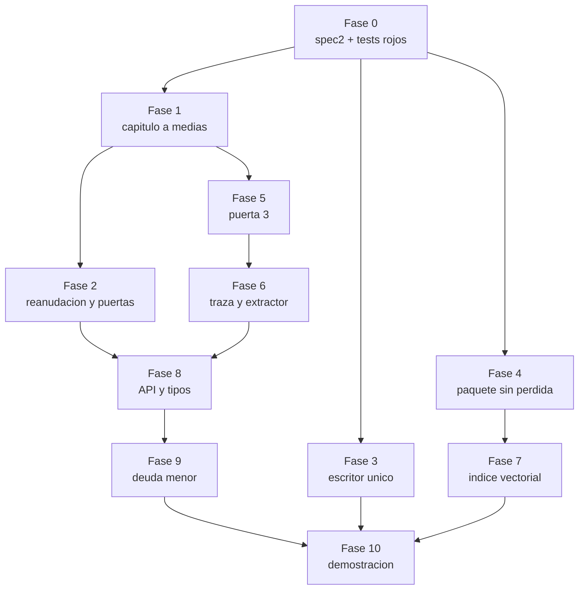
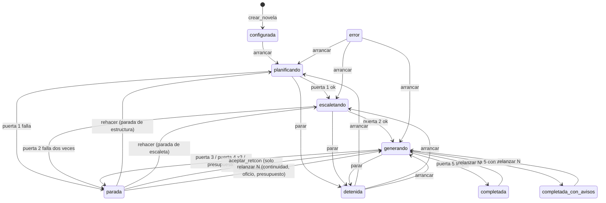

# Plan de implementación — spec2

Cómo pasar del backend v1 ([spec1.md](spec1.md)) a la v2 que corrige lo que encontró la auditoría del 23 de septiembre de 2026. Este documento **no es la spec**: dice en qué orden se escribe `spec2.md`, qué código toca cada paso, qué test lo demuestra y qué fila de verificación cierra. Métodos y etiquetas según [docs/validators.md](../docs/validators.md).

Versión 0.1 · 23 de septiembre de 2026

> **Cómo leer este documento.** La sección 1 fija las reglas que valen para todas las fases. La 2 es el mapa de dependencias. La 3 es el cuerpo: una fase por bloque de hallazgos, siempre con la misma forma. La 4 recoge lo que el plan deja fuera. Los callouts **Decisión del plan** marcan lo decidido sin entrevista; son el primer sitio que revisar si algo hay que rehacer.

---

## 1. Reglas que valen para todas las fases

**Spec primero, en el mismo commit.** Cada fase empieza escribiendo su sección de `spec2.md` y termina con un único commit que lleva la spec, el código, los tests y las filas de `spec2-verification.md`. Es la regla de [AGENTS.md](../AGENTS.md); una fase que no cabe en un commit se parte, no se relaja la regla.

**Rojo antes que verde.** La auditoría dejó reproducciones de cada fallo (E1 a E8 y la del paquete). Lo primero que hace cada fase es convertir las suyas en tests que **fallan** sobre el código actual. Una corrección sin su test rojo previo no cuenta como cerrada: sin él no se sabe si el test mira donde está el problema.

**spec2 refina, no sustituye.** Lo dice la cabecera de spec1: las specs posteriores lo refinan. Cada requisito nuevo lleva el prefijo `RF2-` y, si reemplaza a uno de spec1, lo nombra (`Sustituye a RF-FALLO-06`). En spec1 se añade, justo debajo del requisito sustituido, una línea `> Sustituido por spec2, RF2-…`. spec1 no se reescribe.

**Las etiquetas y los puntos ciegos se escriben al lado.** Toda propiedad nueva entra en `spec2-verification.md` con su etiqueta T/A/I/D/U, su punto ciego y la marca de *validador solitario* cuando lo sea (reglas 1 y 2 de validators.md). Cuando la propiedad se comprueba sobre un dato que declara el propio agente, la fila lleva el segundo método que mira el texto (regla 3).

**Suite verde al cerrar cada fase:** `pytest`, `ruff check` y, desde la fase 8, `pyright`. Nada se da por terminado con tests en rojo.

> **Decisión del plan.** Los requisitos van en un `spec2.md` nuevo y no en una revisión de spec1. Se descartó reescribir spec1 porque su plan de verificación ya tiene filas numeradas y citadas desde el código; renumerar rompería esas referencias. Se descartó también una spec por fase: son correcciones de un mismo sistema, y repartirlas en nueve documentos dispersa lo que hay que leer junto.

---

## 2. Mapa de fases

| Fase | Qué cierra | Hallazgos | Severidad |
| --- | --- | --- | --- |
| 0 | Base: spec2, verificación honesta, tests rojos | — | — |
| 1 | El capítulo a medias no sobrevive a nada | 5, 6 | Alto |
| 2 | Reanudar nunca se salta una puerta | 1, 2, 12 | Crítico |
| 3 | Un solo escritor, de verdad | 3, 23 | Crítico |
| 4 | El paquete no pierde canon en silencio | 4, 10, 22, 24 | Crítico |
| 5 | Puerta 3 sin falsos positivos ni puntos muertos | 7, 8, 15, 16, 20, 21 | Alto |
| 6 | La traza dice la verdad y el extractor deja rastro | 9, 11, 17, 18 | Alto |
| 7 | El índice filtra antes de ordenar y no mezcla modelos | 13, 14 | Medio |
| 8 | Contrato de la API y tipos | 19, pyright | Medio |
| 9 | Deuda menor | 25, 26 y "cosas que chirrían" | Bajo |
| 10 | Demostración que ejercita de verdad la puerta 3 | fila 41 | — |

La numeración de hallazgos es la del informe de auditoría.

La fase 1 va antes que la 2 aunque la 2 sea más grave: la 2 necesita la función de reversión que la 1 separa. Las fases 3 y 4 no dependen de nadie y se pueden hacer en paralelo con la 1.

---

## 3. Fases

### Fase 0 — Base

**Objetivo.** Dejar escrito el esqueleto de la v2 y hacer que el plan de verificación deje de mentir antes de cambiar una línea de código.

**Pasos.**

1. Aparcar o commitear los cambios pendientes en `docs/validators.md` y `.claude/skills/verificacion/SKILL.md`, que no son de este plan. Sin eso, el primer commit de la fase mezcla trabajo ajeno.
2. Crear `specs/spec2.md` con la cabecera, el alcance (esta lista de fases) y una sección vacía por fase. Cada fase la rellena al empezar.
3. Crear `specs/spec2-verification.md` con la misma forma que el de spec1.
4. **Degradar en `spec1-verification.md`** a `fallando` las filas que la auditoría contradijo, con la reproducción como evidencia: 11 y 35 (la integridad no ve el capítulo a medias), 16 y 17 (supersesión encadenada y tildes), 21 (el paquete sí trunca), 25 (`parar` solo probado antes de generar) y 27 (la puerta 4 registra `pasa` con el juez en contra).
5. Llevar las reproducciones a `src/backend/tests/` como tests marcados `xfail(strict=True)` con el número de hallazgo en el nombre. `strict=True` hace que el test **rompa la suite** el día que el fallo desaparezca sin que nadie quite la marca: así cada fase tiene que retirarla a conciencia.
6. Añadir `hypothesis` a las dependencias de desarrollo para los tests de propiedades de las fases 2 y 4.

**Criterio de hecho.** Suite verde con los `xfail` contados; spec1-verification refleja el estado real.

> **Decisión del plan.** Las filas se degradan ya, en la fase 0, y no cuando se arreglen. Un plan de verificación que dice «implementado» sobre un fallo reproducido es justo lo que su propia cabecera llama la forma más común de mentir.

---

### Fase 1 — El capítulo a medias no sobrevive a nada

**Hallazgos.** 5 (`parar` en el tramo 3 deja texto y hechos) y 6 (`recuperar()` no revierte).

**Qué escribir en spec2.**

- **RF2-PIPE-08** — sustituye a RF-PIPE-08 y RF-PIPE-14. Describe los tres tramos tal como ya los documenta architecture.md, y añade la regla que faltaba: *toda salida del bucle de capítulo que no sea «capítulo cerrado» ni «parada de continuidad» revierte el estado del capítulo N antes de propagarse*. Eso cubre `Detenido`, `AgenteInterrumpido`, salida inválida del agente de oficio y cualquier excepción.
- **RF2-FALLO-06** — sustituye a RF-FALLO-06. Al arrancar, para cada ejecución activa, el worker revierte los capítulos posteriores al último completado **antes** de dejarla en `detenida`. El párrafo de spec1 que da por hecho una transacción por capítulo desaparece.
- **RF2-PER-07** — amplía RF-PER-07 con una regla nueva: ningún texto vigente ni ningún hecho pertenece a un capítulo no completado **cuando la ejecución no está activa**.

**Cambios de código.**

| Fichero | Cambio |
| --- | --- |
| [orquestador/fallo.py](../src/backend/orquestador/fallo.py) | Separar `revertir_a` en dos: `revertir_grafo(con, novela_id, desde)`, que solo toca el grafo, y `relanzar(con, novela_id, desde)`, que revierte y además mueve el estado y cierra paradas. Hoy una sola función hace las dos cosas, y por eso el reintento de oficio cierra paradas y cambia el estado de rebote |
| [orquestador/pipeline.py](../src/backend/orquestador/pipeline.py) | `generar_capitulo` marca cuándo ha confirmado el tramo 2 y, en un `finally`, si el capítulo no se cerró ni abrió parada de continuidad, llama a `revertir_grafo(N)` en su propia transacción y deja que la excepción siga. El reintento de oficio pasa a usar `revertir_grafo` |
| [worker.py](../src/backend/worker.py) | `recuperar()` llama a `revertir_grafo(ultimo_completado + 1)` por cada ejecución activa |
| [compartido/db.py](../src/backend/compartido/db.py) | Regla nueva `estado_en_capitulo_no_completado`. `verificar_integridad` recibe si hay ejecución activa, para no dar por fallo el estado intermedio legítimo |

**Tests (rojo primero).** E4 y E6 dejan de ser `xfail`. Nuevo `tests/test_capitulo_a_medias.py`: salida inválida del oficio en el tramo 3, `AgenteInterrumpido` durante el juez, y la regla de integridad sobre una ejecución detenida.

**Verificación.**

| Propiedad | Método | Tag | Punto ciego | ¿Solitario? |
| --- | --- | --- | --- | --- |
| Ninguna salida del bucle deja estado del capítulo sin cerrar | Integration testing, una prueba por tipo de salida | `T` | Solo las salidas que el test enumera; una excepción nueva en otro sitio no está cubierta | No: la regla de integridad lo ve después |
| El worker caído deja el grafo en el último capítulo íntegro | Integration testing (antes `D`, fila 35) | `T` | Simula la caída con una excepción; no mata el proceso de verdad | No |

**Docs afectados.** architecture.md, párrafo «Por qué SQLite encaja»: ya dice que la recuperación revierte; ahora será verdad. No hace falta editarlo.

---

### Fase 2 — Reanudar nunca se salta una puerta

**Hallazgos.** 1 (una parada de estructura acaba en `completada` sin capítulos), 2 (la escaleta rechazada se queda y se genera desde ella) y 12 (`aceptar_retcon` sobre cualquier parada revierte desde el capítulo 1).

**Decisión de producto (entrevistada el 23 de septiembre de 2026).** Resolver una parada de estructura o de escaleta **rehace esa fase**: se borra lo que la puerta rechazó y el agente lo vuelve a producir con el informe de la parada en su paquete. La novela no se pierde.

**Qué escribir en spec2.**

- **RF2-WK-06** — sustituye a RF-WK-06. Máquina de estados nueva:

- **RF2-FALLO-03** — sustituye a RF-FALLO-03 y RF-FALLO-04. Tabla cerrada de acciones de `resolver_parada` por tipo de parada:

| Tipo de parada | Acciones válidas | Qué hacen |
| --- | --- | --- |
| `estructura` | `rehacer` | Borra actos, hilos, puntos de giro, siembras de origen `estructura` y objetos; el estructurador vuelve a correr con el informe; la puerta 1 se reevalúa |
| `escaleta` | `rehacer` | Borra capítulos y secuencias (y con ellos escenas); el escaletador vuelve a correr con el informe; la puerta 2 se reevalúa |
| `continuidad` | `aceptar_retcon`, `relanzar` | Como en spec1. `aceptar_retcon` se rechaza si ningún conflicto trae `hecho_previo_id` |
| `oficio`, `presupuesto` | `relanzar` | Como en spec1 |

  Cualquier otra combinación la rechaza el worker con motivo. La API sigue validando solo la forma (RF-API-04 añade `rehacer` a los valores de `accion`).

- **RF2-PIPE-00** — requisito nuevo. `avanzar` **deriva del grafo** qué toca, en este orden, en vez de decidirlo por el estado de `ejecucion`: agentes de planificación que faltan → puerta 1 no vigente → escaleta ausente → puerta 2 no vigente → capítulos pendientes → puerta 5. Una puerta está **vigente** si su último registro en `resultado_puerta` no es `falla` y es posterior a la última escritura de lo que juzga.
- **RF2-PIPE-00b** — guardarraíl. `generar_capitulo` se niega a empezar si las puertas 1 y 2 no están vigentes, y lanza un error que acaba en `error`, no en un capítulo.

**Cambios de código.**

| Fichero | Cambio |
| --- | --- |
| [orquestador/estados.py](../src/backend/orquestador/estados.py) | `TRANSICIONES` nuevas; se quita `("parada","resolver")`, que nadie usa. La transición depende del tipo de parada, así que `transicion()` recibe `tipo_parada` |
| [orquestador/pipeline.py](../src/backend/orquestador/pipeline.py) | `avanzar` reescrito como derivación. Función `puerta_vigente(con, novela_id, puerta)`. El informe de la escaleta fallida se lee de la última parada o de `resultado_puerta`, no de `ctx.eventos` (que vive en memoria y se pierde al reiniciar el worker). En `escaletar`, el `DELETE` va antes de `_abrir_parada` |
| [worker.py](../src/backend/worker.py) | `_resolver_parada` con la tabla de acciones; fuera el `COALESCE(capitulo, 1)` |
| [orquestador/fallo.py](../src/backend/orquestador/fallo.py) | `rehacer_estructura` y `rehacer_escaleta`, cada una en una transacción |
| [main.py](../src/backend/main.py) | `rehacer` como valor válido de `accion` |

**Tests (rojo primero).** E3 deja de ser `xfail`. Nuevo `tests/test_reanudacion.py`: parada de escaleta → `rehacer` → la escaleta rechazada no existe y la puerta 2 se evaluó otra vez; `aceptar_retcon` sobre una parada de estructura se rechaza; caída entre la estructura y la puerta 1 → al arrancar se evalúa la puerta 1 y no se escaleta.

**Model checking.** `tests/test_estados_exhaustivo.py` recorre todos los pares (estado, suceso, resultado de cada puerta) con puertas falsas que pasan o fallan, y comprueba el invariante: *no se llama a `generar_capitulo` sin las puertas 1 y 2 vigentes*. El espacio es pequeño (9 estados, unos 12 sucesos, 2 resultados por puerta), así que se enumera entero sin necesidad de `hypothesis`.

**Verificación.**

| Propiedad | Método | Tag | Punto ciego | ¿Solitario? |
| --- | --- | --- | --- | --- |
| Ningún capítulo se genera sin las puertas 1 y 2 vigentes | Model checking de estados + `avanzar` | `A` | Solo ve el orden; se fía de que `resultado_puerta` sea veraz (lo arregla la fase 6 para la puerta 4) | No |
| Lo mismo, en ejecución | Guardarraíl en `generar_capitulo` | `D` | El mismo | No |
| Resolver una parada rehace lo que la puerta rechazó | Integration testing | `T` | Comprueba que se rehace, no que la segunda versión sea mejor | Sí: señalarlo |

**Docs afectados.** architecture.md, «Política de fallo»: añadir que las paradas de planificación rehacen la fase, con un callout de decisión entrevistada.

---

### Fase 3 — Un solo escritor, de verdad

**Hallazgos.** 3 (el cerrojo caduca a los 6 s y nadie late durante el pipeline) y 23 (se escribe antes de tomar el cerrojo; carrera entre leer la versión y migrar).

**Qué escribir en spec2.**

- **RF2-WK-07** — sustituye a RF-WK-07. El latido lo da un **hilo propio del worker, con su propia conexión**, cada `poll_segundos`, mientras el proceso vive; no depende de que el bucle principal vuelva a la cola. El latido comprueba que la fila sigue siendo suya y, si no lo es, levanta la bandera `cerrojo_perdido`.
- **RF2-WK-08** — nuevo, *fencing*. Toda transacción de escritura del worker comprueba, **ya dentro de `BEGIN IMMEDIATE`**, que `worker_lock.pid` es el suyo. Si no lo es, revierte y el worker se detiene. Se comprueba con el cerrojo de escritura tomado, que es lo que impide que dos procesos escriban aunque los dos crean tener el cerrojo.
- **RF2-PROC-03** — sustituye a RF-PROC-03. El worker toma el cerrojo antes de cualquier otra escritura (índice y traza incluidos). Crear el esquema y migrar usan `BEGIN IMMEDIATE` y vuelven a leer la versión dentro de la transacción.

**Cambios de código.**

| Fichero | Cambio |
| --- | --- |
| [orquestador/cola.py](../src/backend/orquestador/cola.py) | `latir` devuelve si sigue siendo el dueño (`rowcount == 1`). Clase `Latido` (hilo + conexión propia + bandera) |
| [compartido/db.py](../src/backend/compartido/db.py) | `transaccion()` acepta un `al_empezar` opcional que corre tras `BEGIN IMMEDIATE`. `_script_atomico` pasa a `BEGIN IMMEDIATE` y relee `esquema_version` |
| [worker.py](../src/backend/worker.py) | Orden de arranque: conectar → preparar el esquema → tomar el cerrojo → arrancar `Latido` → migrar → construir `Indice`. `_comprobar_parada` también mira `cerrojo_perdido` y `self.parar` (señal) |
| [orquestador/pipeline.py](../src/backend/orquestador/pipeline.py) | Las transacciones del contexto usan el `al_empezar` de *fencing* |

**Tests (rojo primero).** E5 deja de ser `xfail`. Nuevo `tests/test_cerrojo.py`: dos procesos reales (subproceso) intentan escribir; un generador falso roba el cerrojo a mitad del pipeline y el worker original aborta sin escribir nada más. Cierra la fila 34.

**Verificación.**

| Propiedad | Método | Tag | Punto ciego | ¿Solitario? |
| --- | --- | --- | --- | --- |
| Dos workers no escriben a la vez | Integration testing con dos procesos | `T` | Un proceso congelado más tiempo que la gracia, que al despertar escribe en la misma transacción que ya tenía abierta. El *fencing* lo acota a esa transacción | No: *fencing* + latido |

> **Decisión del plan.** Latido en un hilo y no dentro del bucle de sondeo del puerto. El puerto solo late mientras hay una llamada al agente; las fases SQL largas (puerta 3, reversión) quedarían otra vez sin latido. Se descartó alargar la gracia a minutos: solo cambia cuánto tarda en aparecer el mismo fallo.
>
> **Decisión del plan.** La API sigue pudiendo crear el esquema al arrancar, como excepción escrita a RF-API-02. Quitárselo obligaría a arrancar siempre el worker antes que la API, y la carrera que preocupaba la resuelve el `BEGIN IMMEDIATE` con relectura.

---

### Fase 4 — El paquete no pierde canon en silencio

**Hallazgos.** 4 (el bloque de hechos y conocimiento desaparece entero), 10 (`LIMIT 200` tira los hechos más antiguos), 22 (conocimiento sin límite ni filtro de vigencia) y 24 (la configuración del presupuesto no se usa).

**Qué escribir en spec2.**

- **RF2-CTX-01** — sustituye a RF-CTX-01 en lo que toca al recorte. Los bloques de canon, hechos y conocimiento dejan de ser texto y pasan a ser **listas de elementos** ya ordenados por relevancia, cada uno marcado como *obligatorio* u *opcional*. El recorte quita elementos opcionales desde el final; nunca corta a mitad de elemento ni vacía un bloque por ser «un párrafo».
- **RF2-CTX-03** — sustituye a RF-CTX-03. Si los elementos obligatorios no caben, `PresupuestoExcedido` y parada de presupuesto. Todo recorte, aunque quepa, se registra en la traza (evento `paquete_recortado`, por bloque y por número de elementos).
- **RF2-CTX-11** — nuevo. Qué es obligatorio: todos los hechos vigentes de los personajes del reparto y del lugar de cada escena, y el último estado de conocimiento de cada personaje del reparto sobre cada hecho vigente. Opcional: hechos de amenaza, mundo y novela, y el resto del canon por orden de apariciones.
- **RF2-CTX-12** — nuevo. El presupuesto sale de `Config.presupuesto_bloques`, que llega al paquete desde el contexto del orquestador. La variable `NOVELAS_PRESUPUESTO_TOKENS` pasa a fijar el techo total o se elimina; no se queda como configuración muerta.

**Cambios de código.**

| Fichero | Cambio |
| --- | --- |
| [compartido/contexto/paquete.py](../src/backend/compartido/contexto/paquete.py) | `Bloque` con `elementos: list[Elemento(texto, obligatorio)]`; `render` los une; `ajustar` recorta por elementos y recibe el presupuesto |
| [compartido/grafo/lectura.py](../src/backend/compartido/grafo/lectura.py) | `hechos_del_reparto` sin `LIMIT`, con orden de relevancia y marca de obligatorio. `conocimiento_del_reparto` filtra hechos vigentes y deja la última postura por (personaje, hecho) |
| [tareas/redaccion/servicio.py](../src/backend/tareas/redaccion/servicio.py), [tareas/extraccion/servicio.py](../src/backend/tareas/extraccion/servicio.py), [tareas/oficio/servicio.py](../src/backend/tareas/oficio/servicio.py) | Construyen elementos en vez de cadenas. El extractor deja de meter la prosa bajo el nombre `escaleta`: bloque propio `prosa`, fijo |
| [config.py](../src/backend/config.py) | Un único origen del presupuesto |

**Tests (rojo primero).** El caso de `repro_ctx` y E8 dejan de ser `xfail`. `tests/test_paquete.py` con `hypothesis`: para cualquier conjunto de elementos y cualquier presupuesto, o el paquete cabe con todos los obligatorios, o se lanza `PresupuestoExcedido`; nunca hay un bloque que pase de tener elementos a cero sin quedar registrado.

**Verificación.**

| Propiedad | Método | Tag | Punto ciego | ¿Solitario? |
| --- | --- | --- | --- | --- |
| Ningún elemento obligatorio se pierde; ningún recorte es silencioso | Property-based testing | `T` | Lo que se marca como opcional puede ser lo que el capítulo necesitaba: el criterio de relevancia es una heurística | Sí: señalarlo |
| La estimación de tokens no se desvía del recuento real | — | `U` | Sigue siendo U4 de spec1 | — |

---

### Fase 5 — Puerta 3 sin falsos positivos ni puntos muertos

**Hallazgos.** 7 (supersesión encadenada), 8 (`LOWER()` no pliega tildes), 15 (`orden_interno` autoasignado), 16 (muerte detectada con `LIKE '%muert%'`), 20 (nombres duplicados) y 21 (`hecho.vigente` es una columna mutable).

**Qué escribir en spec2.**

- **RF2-PIPE-11** — sustituye a RF-PIPE-11. El hecho guarda, además del texto, **claves normalizadas** (`sujeto_clave`, `atributo_clave`, `valor_clave`) calculadas en Python con la misma `normalizar()` del resolvedor. La puerta 3 compara claves, nunca `LOWER()`.
- **RF2-PIPE-12** — sustituye a RF-PIPE-12 en la contradicción factual. Un hecho previo solo cuenta si **no está sustituido** por otro hecho de ordinal menor o igual al del nuevo. Eso hace transitiva la cadena herida → infectada → cicatrizada. Cada par se informa una sola vez.
- **RF2-PIPE-10** — amplía RF-PIPE-10. Todo evento dramatizado lleva `orden_interno` **obligatorio**; el paquete del extractor le entrega el último valor global para que siga la escala. Sin él, la salida no valida y se repite la llamada. Se elimina la autoasignación.
- **RF2-PER-06** — sustituye a RF-PER-06 en lo que toca al hecho. Revocar un hecho es una fila nueva en `hecho_revocacion(hecho_id, parada_id, motivo, creado_en)`. La vigencia se deriva en una vista `hecho_vigente`. La columna `vigente` deja de leerse y escribirse.
- **RF2-PER-11** — nuevo. `UNIQUE (novela_id, nombre_clave)` en personaje, lugar, objeto, facción y sistema tecnológico.
- **Muerte como dato cerrado.** `EstadoPersonaje` gana `condicion ∈ {vivo, herido, incapacitado, muerto, desaparecido}` y `_SQL_MUERTO` consulta `condicion = 'muerto'`. `saludFisica` sigue como texto libre para la prosa.

**Migraciones.** Primeras reales del proyecto: `compartido/migraciones/002_*.sql` (columnas, tabla, vista, índices sobre las claves) y un relleno en Python de las claves existentes. `_migraciones_pendientes` acepta ficheros `.py` con una función `aplicar(con)`, dentro de la misma transacción que el SQL. La restricción `UNIQUE` falla si ya hay duplicados: la migración los busca antes y aborta con la lista, sin arreglarlos por su cuenta.

**Cambios de código.**

| Fichero | Cambio |
| --- | --- |
| [tareas/continuidad/puerta.py](../src/backend/tareas/continuidad/puerta.py) | Consultas sobre claves y `hecho_vigente`; exclusión transitiva; pares sin duplicar; muerte por `condicion` |
| [tareas/extraccion/servicio.py](../src/backend/tareas/extraccion/servicio.py) y [esquemas.py](../src/backend/tareas/extraccion/esquemas.py) | Una función `insertar_hecho` en `compartido/grafo/escritura.py` que calcula las claves; `orden_interno` obligatorio si `dramatizado`; `condicion` en el estado de personaje |
| [orquestador/fallo.py](../src/backend/orquestador/fallo.py) | `aceptar_retcon` inserta en `hecho_revocacion` |
| [compartido/grafo/lectura.py](../src/backend/compartido/grafo/lectura.py), [compartido/vectores/indice.py](../src/backend/compartido/vectores/indice.py), [main.py](../src/backend/main.py) | Todo lo que filtraba por `vigente = 1` pasa a `hecho_vigente` |
| `.claude/skills/extraccion/SKILL.md` | `orden_interno` y `condicion` en «Qué produces» (RF-SKILL-01: la skill entra en el mismo commit) |

**Tests (rojo primero).** E1 y E2 dejan de ser `xfail`. En `tests/test_puerta_continuidad.py`: cadena de tres supersesiones, pares con tildes y eñes, «casi muerto» no para, «fallecida» con `condicion = muerto` sí para, evento dramatizado sin `orden_interno` rechazado por el esquema. Test de migración: una BD con el esquema 1 migra a la 2 y conserva los datos.

**Verificación.**

| Propiedad | Método | Tag | Punto ciego | ¿Solitario? |
| --- | --- | --- | --- | --- |
| Una cadena de supersesiones no produce contradicciones | Mutation testing | `T` | Supersesiones que el extractor no declaró: siguen siendo contradicción, que es lo correcto, pero pueden ser falsos positivos si el extractor olvida marcar | No |
| Dos valores que solo difieren en mayúsculas o tildes son el mismo | Unit testing | `T` | Sinónimos («castaño» y «marrón»): sigue siendo U7 de spec1 | — |
| `condicion = muerto` impide reaparecer | Mutation testing | `T` | **Dato autodeclarado por el extractor** (regla 3): necesita el segundo método de la fase 6 que busca el nombre en la prosa | No, con la fase 6 |

**Docs afectados.** definitions.md: `EstadoPersonaje.condicion`, y que la revocación de un `Hecho` es un registro y no un atributo (con callout de decisión y alternativas descartadas). validators.md: el punto ciego de «Presencia imposible» nombra `condicion`. architecture.md, «Persistencia»: tabla nueva y vista nueva; de paso, corregir «cincuenta tablas».

---

### Fase 6 — La traza dice la verdad y el extractor deja rastro

**Hallazgos.** 9 (el juez de la puerta 4 no se registra), 11 (el extractor descarta en silencio), 17 (el agente podría usar herramientas) y 18 (SIGTERM entre llamadas no para).

**Qué escribir en spec2.**

- **RF2-PIPE-13** — amplía RF-PIPE-13. `resultado_puerta` de la puerta 4 lleva mecánica **y** juicio en un solo registro; cada criterio con `falla` es un conflicto. `falla` si falla cualquiera de las dos partes.
- **RF2-PIPE-16** — nuevo. `extraccion.aplicar` devuelve el recuento de lo que descartó, por tipo y motivo (escena desconocida, personaje sin resolver, hecho sin resolver). El recuento va a la traza y, en la puerta 3, cada uso de conocimiento descartado es un **aviso**: es conocimiento que ninguna consulta ha comprobado.
- **RF2-PIPE-17** — nuevo, el segundo método que mira el texto (regla 3; picaresca antes que juez). Búsquedas dirigidas en el tramo 2, como avisos de la puerta 3:
  - nombres del canon que aparecen en la prosa de una escena sin ningún registro extraído en ella;
  - cifras y fechas en la prosa sin ningún hecho de categoría `fecha` o `distancia` en la escena;
  - nombre de un personaje con `condicion = muerto` en la prosa de una escena posterior no marcada como analepsis.
- **RF2-PUERTO-10** — nuevo. Una llamada con `num_turns > 1` o con `permission_denials` no vacío es un error de puerto: el agente intentó usar herramientas.
- **RF2-WK-09** — nuevo. SIGTERM y SIGINT detienen el pipeline en el siguiente punto de comprobación, no solo si llegan durante una llamada.

**Cambios de código.**

| Fichero | Cambio |
| --- | --- |
| [orquestador/pipeline.py](../src/backend/orquestador/pipeline.py) | Combinar `mecanica` y `juicio` antes de `_registrar_puerta`; recoger el recuento del extractor |
| [tareas/extraccion/servicio.py](../src/backend/tareas/extraccion/servicio.py) | Cada `continue` suma al recuento |
| [tareas/continuidad/puerta.py](../src/backend/tareas/continuidad/puerta.py) | Avisos de descartes y de las búsquedas dirigidas |
| [compartido/puerto/terminal.py](../src/backend/compartido/puerto/terminal.py) | Comprobación de turnos y denegaciones. Verificar contra el binario instalado si existe una bandera que **retire** herramientas (no solo permisos) y usarla junto a `--allowedTools ""`. No limpiar `_interrumpido` si la parada vino de una señal |

**Tests (rojo primero).** E7 deja de ser `xfail`. Contract test: toda parada de oficio tiene al menos un `falla` de la puerta 4 registrado. Extractor con un uso sobre un hecho inexistente: aviso visible. Puerto falso que devuelve `num_turns = 3`: error. Cierra la fila 33 en su parte automática.

**Verificación.**

| Propiedad | Método | Tag | Punto ciego | ¿Solitario? |
| --- | --- | --- | --- | --- |
| `resultado_puerta` refleja las dos partes de la puerta 4 | Contract testing | `T` | No dice si el juez acierta (fila 39, evals) | No |
| El extractor no descarta en silencio | Integration testing sobre el recuento | `T` | Lo que el extractor ni siquiera emitió | No, con la fila siguiente |
| Cobertura del extractor desde el texto | Búsquedas dirigidas | `T` | Rasgos sin nombre propio ni cifra; alias y pronombres | No: complementa las evals del extractor (`I`, fila 38) |
| El agente no usa herramientas | Guardarraíl en el puerto | `D` | Depende de que el CLI siga devolviendo esos metadatos | Sí: señalarlo |

---

### Fase 7 — El índice filtra antes de ordenar y no mezcla modelos

**Hallazgos.** 13 (KNN global y filtro después) y 14 (cambio de modelo o de dimensión silencioso).

**Qué escribir en spec2.**

- **RF2-CTX-07** — sustituye a RF-CTX-07 en la mecánica. La distancia se calcula **solo sobre los candidatos** que el filtro determinista admitió, no sobre todo el índice.
- **RF2-CTX-09** — sustituye a RF-CTX-09. Todo fallo del índice es un aviso en la traza (evento `indice_fallo`), no un `pass`.
- **RF2-CTX-10** — sustituye a RF-CTX-10. Las tablas vec0 guardan el modelo y la dimensión con que se construyeron. Si el modelo que carga no coincide, el índice se reconstruye antes de usarse. El respaldo por hash solo se admite si se pidió `hash` expresamente; en cualquier otro caso, sin modelo no hay índice y el bloque recuperado queda vacío.
- **RF2-FALLO-04b** — nuevo. Toda reversión purga el índice, no solo `relanzar`.
- **RF-CTX-08** (el desempate por similitud) queda como riesgo aceptado en la v2: el orden determinista con desempate por `id` basta mientras no haya un golden set que diga que la similitud mejora algo.

**Cambios de código.** [compartido/vectores/indice.py](../src/backend/compartido/vectores/indice.py) (consulta sobre candidatos con la función de distancia de sqlite-vec, registro de modelo y dimensión, reconstrucción), [compartido/vectores/embebido.py](../src/backend/compartido/vectores/embebido.py) (`permitir_hash` falso por defecto), [orquestador/pipeline.py](../src/backend/orquestador/pipeline.py) (`_indexar` y `_recuperar` emiten el aviso) y [orquestador/fallo.py](../src/backend/orquestador/fallo.py) (purga en toda reversión).

**Tests.** `tests/test_indice.py`: con 50 escenas en otro lugar más parecidas a la consulta, las del lugar admitido se siguen devolviendo (rojo hoy); cambiar el modelo reconstruye; fallo de carga deja aviso. Golden set de recuperación con el modelo real cacheado, marcado `@pytest.mark.modelo` para que no corra por defecto.

**Verificación.**

| Propiedad | Método | Tag | Punto ciego | ¿Solitario? |
| --- | --- | --- | --- | --- |
| El filtro admite antes de que la similitud ordene | Unit testing (fila 28 de spec1) | `T` | — | No |
| Lo recuperado es relevante | Golden set, recall@k, sin juez | `T` | Golden set pequeño y escrito por el equipo; U8 sigue abierto | Sí: señalarlo |

---

### Fase 8 — Contrato de la API y tipos

**Hallazgos.** 19 (seis endpoints sin esquema) y los 295 errores de pyright strict.

**Qué escribir en spec2.** **RF2-API-01** — refuerza RF-API-01, que ya prohibía `dict` sin esquema: se cumple y se comprueba con un snapshot del OpenAPI. **RF2-API-04**: un `desde_capitulo` que no es entero es `422`, no `500`.

**Cambios de código.** Modelos Pydantic para `ver_novela`, `ver_canon` (uno por entidad o una unión discriminada), `ver_estructura`, `ver_versiones`, `ver_conocimiento` y `ver_llamadas` en [main.py](../src/backend/main.py). Tipos para las filas de lectura (`TypedDict` en `compartido/tipos.py`) hasta dejar pyright strict en cero sobre `src/backend` sin los tests.

**Tests.** `tests/test_api.py`: ninguna respuesta en el OpenAPI es `object` sin propiedades; snapshot versionado del esquema, que obliga a revisar a mano todo cambio de contrato.

**Verificación.**

| Propiedad | Método | Tag | Punto ciego | ¿Solitario? |
| --- | --- | --- | --- | --- |
| Toda respuesta tiene esquema | Contract testing | `T` | Forma, no semántica | No |
| Tipos consistentes | Type checking (pyright strict) | `A` | No ve el contenido real de las filas de SQLite | No |

> **Decisión del plan.** Sin CI en este plan: el proyecto no tiene ninguna y montarla es otra decisión. El comando único de verificación (`pytest`, `ruff`, `pyright`) se documenta en `src/backend/README.md`.

---

### Fase 9 — Deuda menor

Cada punto con su línea en `spec2.md` cuando cambie comportamiento, y sin ella cuando sea limpieza.

- Quitar `pov_declarado` de la puerta 2 (código muerto: `pov_id` es `NOT NULL`).
- `hilos()` ordena el principal primero.
- El ordinal de escena deja de ser `numero*1000 + orden`: comparación por la pareja (capítulo, orden) o un factor que no colisione.
- Hilo latente medido como tramo continuo, no como máximo menos mínimo.
- Puerta 5: añadir «pago sin siembra previa» y «cierre en orden distinto al inverso de apertura», como avisos. Escribir en validators.md que la puerta 5 no bloquea en la v2 y por qué, para resolver la contradicción con su tabla.
- `insertar` y `actualizar` validan los nombres de columna contra `PRAGMA table_info`; `actualizar` admite poner una columna a NULL de forma explícita.
- Retirar el truco de `emitir_evento(*args)` con un parámetro de payload explícito.
- Quitar los `noqa` sobrantes que marca ruff (`RUF100`).

---

### Fase 10 — Demostración que ejercita de verdad la puerta 3

**Por qué.** La «prueba pequeña» que pasó sin fallos corrió con el puerto falso y un solo atributo: la puerta 3 no tenía nada que comparar. Un verde así no dice nada.

**Pasos.**

1. Enriquecer los generadores de [compartido/puerto/demo.py](../src/backend/compartido/puerto/demo.py) para que la demo con puerto falso produzca al menos: cinco atributos por sujeto, una cadena de supersesiones, usos de conocimiento adquirido y no adquirido, un objeto que se traslada, una siembra pagada y un hilo cerrado. El test de la demo comprueba que **cada una de las siete comprobaciones de la puerta 3 se ha evaluado con datos**, no solo que la demo termina.
2. Pasada completa con Claude Code real sobre una novela corta (fila 41), con el guardarraíl de herramientas de la fase 6 activo, y medición de los tokens por bloque para fijar las cifras provisionales del presupuesto.
3. Primeras evals del extractor con un capítulo anotado a mano (fila 38): es la pieza frágil y la que más se beneficia de todo lo anterior.

**Verificación.**

| Propiedad | Método | Tag | Punto ciego | ¿Solitario? |
| --- | --- | --- | --- | --- |
| La demo ejercita todas las comprobaciones de la puerta 3 | Integration testing con cobertura por comprobación | `T` | Los datos los fabrica el propio equipo: prueba el mecanismo, no el extractor real | No |
| Pipeline completo con Claude Code real | Demonstration | `D` | Una novela corta no enseña lo que pasa hacia el capítulo 30 | Sí: señalarlo |

---

## 4. Lo que este plan deja fuera

- **El frontend.** Sigue sin scaffolding, y la decisión de «qué ve el frontend» sigue abierta en architecture.md. La fase 8 deja el contrato listo para generar el cliente cuando toque.
- **El revisor y las pasadas globales.** Siguen bloqueados por la revalidación en cascada, igual que en spec1.
- **El agente evaluador de tono.** Idea guardada; no entra hasta que se mida el ruido del juez.
- **El desempate por similitud de RF-CTX-08**, aceptado como riesgo en la fase 7.
- **Las evals de los agentes salvo el extractor** (filas 37 y 39), que siguen en el orden que ya fija spec1-verification.
