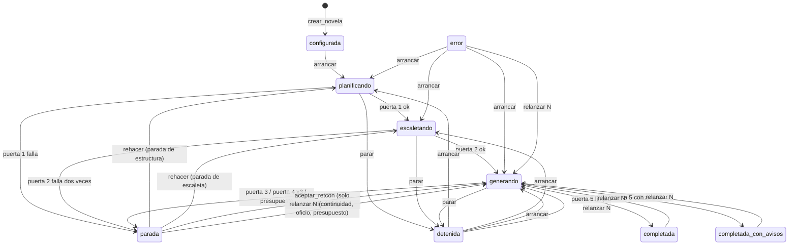

# SRS — Backend v2: correcciones de la auditoría

Especificación de requisitos de la **segunda versión del backend**. No sustituye a [spec1.md](spec1.md): la refina donde la auditoría del 23 de septiembre de 2026 encontró que el código, la spec o las dos se equivocaban. Todo lo que este documento no toca sigue valiendo tal como lo escribe spec1.

Versión 0.1 · 23 de septiembre de 2026 · Rama `pruebas`

> **Cómo leer este documento.** La sección 1 fija las reglas de relación con spec1. La 2 es el alcance, una fase por bloque de hallazgos. La 3 son los requisitos, en una subsección por fase. El orden de implementación, los ficheros que toca cada fase y los tests que la demuestran viven en [spec2-plan.md](spec2-plan.md); el estado fila a fila, en [spec2-verification.md](spec2-verification.md).
>
> Los callouts **Decisión de la spec** marcan lo decidido sin entrevista. Los que vienen del plan conservan su justificación allí; aquí solo se repiten cuando cambian un requisito.

---

## 1. Relación con spec1

- Todo requisito nuevo lleva el prefijo `RF2-`. Si reemplaza a uno de spec1, lo dice en su primera línea: *Sustituye a RF-…*. Si lo amplía, *Amplía RF-…*.
- En spec1, justo debajo del requisito sustituido, se añade una línea `> Sustituido por spec2, RF2-…`. spec1 no se reescribe: su plan de verificación tiene filas numeradas y citadas desde el código, y renumerar rompería esas referencias.
- Los hallazgos se citan con el número del informe de auditoría (hallazgo 1 a 26). Las reproducciones viven como tests en `src/backend/tests/test_auditoria.py`, uno por hallazgo, con el número en el nombre.

## 2. Alcance

| Fase | Qué cierra | Hallazgos | Severidad |
| --- | --- | --- | --- |
| 0 | Base: spec2, verificación honesta, tests rojos | — | — |
| 1 | El capítulo a medias no sobrevive a nada | 5, 6 | Alto |
| 2 | Reanudar nunca se salta una puerta | 1, 2, 12 | Crítico |
| 3 | Un solo escritor, de verdad | 3, 23 | Crítico |
| 4 | El paquete no pierde canon en silencio | 4, 10, 22, 24 | Crítico |
| 5 | Puerta 3 sin falsos positivos ni puntos muertos | 7, 8, 15, 16, 20, 21 | Alto |
| 6 | La traza dice la verdad y el extractor deja rastro | 9, 11, 17, 18 | Alto |
| 7 | El índice filtra antes de ordenar y no mezcla modelos | 13, 14 | Medio |
| 8 | Contrato de la API y tipos | 19, pyright | Medio |
| 9 | Deuda menor | 25, 26 y «cosas que chirrían» | Bajo |
| 10 | Demostración que ejercita de verdad la puerta 3 | fila 41 | — |

**Queda fuera**, como en spec1: el frontend, el revisor y las pasadas globales, el agente evaluador de tono, el desempate por similitud de RF-CTX-08 y las evals de los agentes salvo el extractor. El motivo de cada exclusión está en la sección 4 del plan.

---

## 3. Requisitos

### 3.0 Fase 0 — Base

Sin requisitos de comportamiento. La fase deja el plan de verificación de spec1 diciendo la verdad: las filas que la auditoría contradijo pasan a `fallando` con su reproducción como evidencia, y cada reproducción es un test `xfail(strict=True)` que la fase que la arregle tiene que desmarcar a conciencia.

### 3.1 Fase 1 — El capítulo a medias

Hallazgos 5 (`parar` en el tramo 3 deja texto y hechos) y 6 (`recuperar()` no revierte).

**RF2-PIPE-08** *Sustituye a RF-PIPE-08 y RF-PIPE-14.* Para cada capítulo, el orquestador ejecuta **paquete → redacción → extracción → puerta 3 → puerta 4** en tres tramos, porque una llamada al agente dura minutos y no puede ocurrir con el cerrojo de escritura tomado:

1. **Sin transacción.** Se llama al redactor y al extractor y su salida se guarda en memoria.
2. **Transacción corta.** Entran juntos el texto (una versión nueva por escena) y todo lo extraído, y se evalúa la puerta 3. Si hay conflicto, la transacción se revierte entera y se abre una parada de continuidad.
3. **Sin transacción, y luego otra corta.** Se juzga el oficio. Si pasa, una transacción compila el capítulo, lo marca `completado`, avanza `capitulos_completados` y emite `capitulo_completado`. Si no pasa, se revierte el capítulo y se vuelve a redactar con los criterios incumplidos.

Y la regla que faltaba: **toda salida del bucle de capítulo que no sea «capítulo cerrado» ni «parada de continuidad» revierte el estado del capítulo N antes de propagarse.** Eso cubre `Detenido`, `AgenteInterrumpido`, la salida inválida del agente de oficio y cualquier otra excepción. La reversión corre en su propia transacción; si ella misma falla, se registra y la excepción original sigue su camino.

Entre el tramo 2 y el 3 un capítulo puede tener texto y hechos sin estar completado. Es el único estado intermedio legítimo, y solo lo es mientras la ejecución está activa (RF2-PER-07).

**RF2-FALLO-06** *Sustituye a RF-FALLO-06.* Al arrancar, el worker:

1. Marca `interrumpida` toda `llamada_modelo` en `en_curso`.
2. Marca `interrumpida` con motivo `worker_caido` toda `intencion` en `en_curso`.
3. Para cada ejecución en `planificando`, `escaletando` o `generando`, **revierte el grafo desde el capítulo siguiente al último completado** y después la deja en `detenida` con `ultimo_error = interrumpida_por_caida`, `capitulo_actual` e `intento_actual` fijados desde el grafo.
4. Emite `worker_recuperado` con el resultado de `verificar_integridad()`.

El párrafo de spec1 que daba por hecho una transacción por capítulo desaparece: con tres tramos, el grafo **no** está siempre al final de la última unidad completa, y es la reversión la que lo devuelve ahí.

**RF2-PER-07** *Amplía RF-PER-07.* `verificar_integridad()` añade la regla `estado_en_capitulo_no_completado`: **ninguna versión vigente de texto ni ninguna fila de estado** (`hecho`, `estado_conocimiento`, `uso_conocimiento`, `estado_personaje`, `estado_objeto`, `evento`, `siembra_estado`, `hilo_estado`, `amenaza_revelacion`, `entidad_no_reconocida`) **pertenece a un capítulo no completado cuando la ejecución de su novela no está activa**. La función recibe qué novelas tienen ejecución activa, para no dar por fallo el estado intermedio del tramo 2; si no se le dice, lo lee de `ejecucion`.

> **Decisión de la spec (23-09-2026).** La reversión se separa en dos operaciones: `revertir_grafo`, que solo toca el grafo, y `relanzar`, que además mueve el estado de la ejecución y cierra las paradas abiertas. En spec1 eran una sola, y por eso el reintento de oficio cerraba paradas y reescribía el estado de rebote. Se descartó añadir banderas a la función única: dos operaciones con nombre dicen mejor cuál de los dos efectos quiere cada llamante.

### 3.2 Fase 2 — Reanudar nunca se salta una puerta

Hallazgos 1 (una parada de estructura acaba en `completada` sin capítulos), 2 (la escaleta rechazada se queda y se genera desde ella) y 12 (`aceptar_retcon` sobre cualquier parada revierte desde el capítulo 1).

> **Decisión de producto, entrevistada el 23 de septiembre de 2026.** Resolver una parada de estructura o de escaleta **rehace esa fase**: se borra lo que la puerta rechazó y el agente lo vuelve a producir con el informe de la parada en su paquete. La novela no se pierde.

**RF2-WK-06** *Sustituye a RF-WK-06.* Máquina de estados de la ejecución. Las transiciones que no aparecen no existen y el worker las rechaza con motivo:

Desde `parada`, la transición depende del **tipo** de la parada abierta, así que `transicion()` lo recibe. `arrancar` solo se admite desde `configurada`, `detenida` y `error`: sobre una novela completada se rechaza con motivo, porque volver a pasar la puerta 5 no es una transición. `relanzar N` exige además que las puertas 1 y 2 estén vigentes (RF2-PIPE-00): sin escaleta aprobada no hay capítulos que relanzar. Cualquier estado salvo `configurada` pasa a `error` ante una excepción no controlada.

> **Decisión de la spec (23-09-2026).** El diagrama del plan no dibujaba `relanzar N` desde `detenida` ni desde `error`, que spec1 sí admitía. Se conservan: relanzar desde un capítulo concreto tras detener la generación es el uso normal, y la condición de puertas vigentes ya impide relanzar una novela sin escaleta aprobada. Se descartó quitarlas porque obligaría a arrancar y parar solo para poder relanzar.

**RF2-FALLO-03** *Sustituye a RF-FALLO-03 y RF-FALLO-04.* Tabla cerrada de acciones de `resolver_parada` por tipo de parada:

| Tipo de parada | Acciones válidas | Qué hacen |
| --- | --- | --- |
| `estructura` | `rehacer` | Borra actos, hilos (con sus puntos de giro), siembras de origen `estructura` y objetos; cierra la parada y deja la ejecución en `planificando`. El estructurador vuelve a correr con el informe de la puerta 1 en su paquete y la puerta 1 se reevalúa |
| `escaleta` | `rehacer` | Borra capítulos y secuencias, y con ellos escenas, beats y secuelas; cierra la parada y deja la ejecución en `escaletando`. El escaletador vuelve a correr con el informe de la puerta 2 y la puerta 2 se reevalúa |
| `continuidad` | `aceptar_retcon`, `relanzar` | Como en spec1. `aceptar_retcon` revierte desde el capítulo de la parada y se rechaza si ningún conflicto trae `hecho_previo_id`: sin hecho que revocar, el mismo conflicto se repetiría |
| `oficio`, `presupuesto` | `relanzar` | Como en spec1 |

Cualquier otra combinación la rechaza el worker con motivo, sin tocar nada. La API sigue validando solo la forma: RF-API-04 añade `rehacer` a los valores de `accion`. En `relanzar` por `resolver_parada`, `desde_capitulo` es opcional y por defecto vale el capítulo de la parada.

El informe con el que el agente rehace su fase se lee del último registro `falla` de su puerta en `resultado_puerta`, que es persistente, y no de memoria: un worker reiniciado entre el fallo y el segundo intento lo conserva. Cuando la puerta 2 falla por segunda vez, la escaleta rechazada se borra **antes** de abrir la parada, y el informe de la parada la incluye resumida para que el autor pueda leer qué se rechazó sin abrir la base de datos.

**RF2-PIPE-00** *Requisito nuevo.* `avanzar` **deriva del grafo** qué toca, en este orden, en vez de decidirlo por el estado de `ejecucion`:

1. agentes de planificación que faltan;
2. puerta 1 no vigente;
3. escaleta ausente;
4. puerta 2 no vigente;
5. capítulos pendientes;
6. puerta 5.

Una puerta está **vigente** si su último registro en `resultado_puerta` no es `falla` y **juzgó exactamente lo que hay ahora**: el registro guarda una huella (SHA-256) de las filas que la puerta lee, y la huella tiene que coincidir con la del grafo actual. La puerta 1 lee actos, hilos, puntos de giro, el rol y el arco de cada personaje, y el subgénero y el tipo de final de la novela; la puerta 2, capítulos (sin su estado ni sus resúmenes), secuencias, escenas, reparto y restricciones.

> **Decisión de la spec (23-09-2026).** El plan pedía que el registro fuera «posterior a la última escritura de lo que juzga». Se implementa con una huella del contenido y no con marcas de tiempo, porque `datetime('now')` tiene resolución de segundo y dos escrituras del mismo segundo no se ordenan; ni con ids, porque los de tablas distintas no son comparables. La huella además es más estricta: una puerta que juzgó otra versión de la escaleta deja de estar vigente aunque la reescritura fuera anterior al registro.

**RF2-PIPE-00b** *Guardarraíl.* `generar_capitulo` se niega a empezar si las puertas 1 y 2 no están vigentes, con un error que lleva la ejecución a `error` y no a un capítulo. Es la misma propiedad que RF2-PIPE-00, comprobada en ejecución y no solo por construcción.

### 3.3 Fase 3 — Un solo escritor

*Pendiente: se escribe al empezar la fase.*

### 3.4 Fase 4 — El paquete no pierde canon en silencio

*Pendiente: se escribe al empezar la fase.*

### 3.5 Fase 5 — Puerta 3 sin falsos positivos

*Pendiente: se escribe al empezar la fase.*

### 3.6 Fase 6 — La traza dice la verdad

*Pendiente: se escribe al empezar la fase.*

### 3.7 Fase 7 — El índice vectorial

*Pendiente: se escribe al empezar la fase.*

### 3.8 Fase 8 — Contrato de la API y tipos

*Pendiente: se escribe al empezar la fase.*

### 3.9 Fase 9 — Deuda menor

*Pendiente: se escribe al empezar la fase.*

### 3.10 Fase 10 — Demostración

*Pendiente: se escribe al empezar la fase.*
