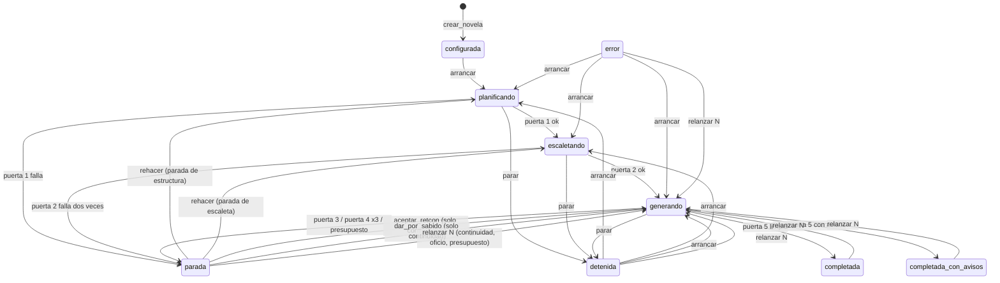

# SRS — Backend v2: correcciones de la auditoría

Especificación de requisitos de la **segunda versión del backend**. No sustituye a [spec1.md](spec1.md): la refina donde la auditoría del 23 de septiembre de 2026 encontró que el código, la spec o las dos se equivocaban. Todo lo que este documento no toca sigue valiendo tal como lo escribe spec1.

Versión 0.1 · 23 de septiembre de 2026 · Rama `pruebas`

> **Cómo leer este documento.** La sección 1 fija las reglas de relación con spec1. La 2 es el alcance, una fase por bloque de hallazgos. La 3 son los requisitos, en una subsección por fase. El orden de implementación, los ficheros que toca cada fase y los tests que la demuestran viven en [spec2-plan.md](spec2-plan.md); el estado fila a fila, en [spec2-verification.md](spec2-verification.md).
>
> Los callouts **Decisión de la spec** marcan lo decidido sin entrevista. Los que vienen del plan conservan su justificación allí; aquí solo se repiten cuando cambian un requisito.

---

## 1. Relación con spec1

- Todo requisito nuevo lleva el prefijo `RF2-`. Si reemplaza a uno de spec1, lo dice en su primera línea: *Sustituye a RF-…*. Si lo amplía, *Amplía RF-…*.
- En spec1, justo debajo del requisito sustituido, se añade una línea `> Sustituido por spec2, RF2-…`. spec1 no se reescribe: su plan de verificación tiene filas numeradas y citadas desde el código, y renumerar rompería esas referencias.
- Los hallazgos se citan con el número del informe de auditoría (hallazgo 1 a 26). Las reproducciones viven como tests en `src/backend/tests/test_auditoria.py`, uno por hallazgo, con el número en el nombre.

## 2. Alcance

| Fase | Qué cierra | Hallazgos | Severidad |
| --- | --- | --- | --- |
| 0 | Base: spec2, verificación honesta, tests rojos | — | — |
| 1 | El capítulo a medias no sobrevive a nada | 5, 6 | Alto |
| 2 | Reanudar nunca se salta una puerta | 1, 2, 12 | Crítico |
| 3 | Un solo escritor, de verdad | 3, 23 | Crítico |
| 4 | El paquete no pierde canon en silencio | 4, 10, 22, 24 | Crítico |
| 5 | Puerta 3 sin falsos positivos ni puntos muertos | 7, 8, 15, 16, 20, 21 | Alto |
| 6 | La traza dice la verdad y el extractor deja rastro | 9, 11, 17, 18 | Alto |
| 7 | El índice filtra antes de ordenar y no mezcla modelos | 13, 14 | Medio |
| 8 | Contrato de la API y tipos | 19, pyright | Medio |
| 9 | Deuda menor | 25, 26 y «cosas que chirrían» | Bajo |
| 10 | Demostración que ejercita de verdad la puerta 3 | fila 41 | — |

**Queda fuera**, como en spec1: el frontend, el revisor y las pasadas globales, el agente evaluador de tono, el desempate por similitud de RF-CTX-08 y las evals de los agentes salvo el extractor. El motivo de cada exclusión está en la sección 4 del plan.

---

## 3. Requisitos

### 3.0 Fase 0 — Base

Sin requisitos de comportamiento. La fase deja el plan de verificación de spec1 diciendo la verdad: las filas que la auditoría contradijo pasan a `fallando` con su reproducción como evidencia, y cada reproducción es un test `xfail(strict=True)` que la fase que la arregle tiene que desmarcar a conciencia.

### 3.1 Fase 1 — El capítulo a medias

Hallazgos 5 (`parar` en el tramo 3 deja texto y hechos) y 6 (`recuperar()` no revierte).

**RF2-PIPE-08** *Sustituye a RF-PIPE-08 y RF-PIPE-14.* Para cada capítulo, el orquestador ejecuta **paquete → redacción → extracción → puerta 3 → puerta 4** en tres tramos, porque una llamada al agente dura minutos y no puede ocurrir con el cerrojo de escritura tomado:

1. **Sin transacción.** Se llama al redactor y al extractor y su salida se guarda en memoria.
2. **Transacción corta.** Entran juntos el texto (una versión nueva por escena) y todo lo extraído, y se evalúa la puerta 3. Si hay conflicto, la transacción se revierte entera y se abre una parada de continuidad.
3. **Sin transacción, y luego otra corta.** Se juzga el oficio. Si pasa, una transacción compila el capítulo, lo marca `completado`, avanza `capitulos_completados` y emite `capitulo_completado`. Si no pasa, se revierte el capítulo y se vuelve a redactar con los criterios incumplidos.

Y la regla que faltaba: **toda salida del bucle de capítulo que no sea «capítulo cerrado» ni «parada de continuidad» revierte el estado del capítulo N antes de propagarse.** Eso cubre `Detenido`, `AgenteInterrumpido`, la salida inválida del agente de oficio y cualquier otra excepción. La reversión corre en su propia transacción; si ella misma falla, se registra y la excepción original sigue su camino.

Entre el tramo 2 y el 3 un capítulo puede tener texto y hechos sin estar completado. Es el único estado intermedio legítimo, y solo lo es mientras la ejecución está activa (RF2-PER-07).

**RF2-FALLO-06** *Sustituye a RF-FALLO-06.* Al arrancar, el worker:

1. Marca `interrumpida` toda `llamada_modelo` en `en_curso`.
2. Marca `interrumpida` con motivo `worker_caido` toda `intencion` en `en_curso`.
3. Para cada ejecución en `planificando`, `escaletando` o `generando`, **revierte el grafo desde el capítulo siguiente al último completado** y después la deja en `detenida` con `ultimo_error = interrumpida_por_caida`, `capitulo_actual` e `intento_actual` fijados desde el grafo.
4. Emite `worker_recuperado` con el resultado de `verificar_integridad()`.

El párrafo de spec1 que daba por hecho una transacción por capítulo desaparece: con tres tramos, el grafo **no** está siempre al final de la última unidad completa, y es la reversión la que lo devuelve ahí.

**RF2-PER-07** *Amplía RF-PER-07.* `verificar_integridad()` añade la regla `estado_en_capitulo_no_completado`: **ninguna versión vigente de texto ni ninguna fila de estado** (`hecho`, `estado_conocimiento`, `uso_conocimiento`, `estado_personaje`, `estado_objeto`, `evento`, `siembra_estado`, `hilo_estado`, `amenaza_revelacion`, `entidad_no_reconocida`) **pertenece a un capítulo no completado cuando la ejecución de su novela no está activa**. La función recibe qué novelas tienen ejecución activa, para no dar por fallo el estado intermedio del tramo 2; si no se le dice, lo lee de `ejecucion`.

> **Decisión de la spec (23-09-2026).** La reversión se separa en dos operaciones: `revertir_grafo`, que solo toca el grafo, y `relanzar`, que además mueve el estado de la ejecución y cierra las paradas abiertas. En spec1 eran una sola, y por eso el reintento de oficio cerraba paradas y reescribía el estado de rebote. Se descartó añadir banderas a la función única: dos operaciones con nombre dicen mejor cuál de los dos efectos quiere cada llamante.

### 3.2 Fase 2 — Reanudar nunca se salta una puerta

Hallazgos 1 (una parada de estructura acaba en `completada` sin capítulos), 2 (la escaleta rechazada se queda y se genera desde ella) y 12 (`aceptar_retcon` sobre cualquier parada revierte desde el capítulo 1).

> **Decisión de producto, entrevistada el 23 de septiembre de 2026.** Resolver una parada de estructura o de escaleta **rehace esa fase**: se borra lo que la puerta rechazó y el agente lo vuelve a producir con el informe de la parada en su paquete. La novela no se pierde.

**RF2-WK-06** *Sustituye a RF-WK-06.* Máquina de estados de la ejecución. Las transiciones que no aparecen no existen y el worker las rechaza con motivo:

Desde `parada`, la transición depende del **tipo** de la parada abierta, así que `transicion()` lo recibe. `arrancar` solo se admite desde `configurada`, `detenida` y `error`: sobre una novela completada se rechaza con motivo, porque volver a pasar la puerta 5 no es una transición. `relanzar N` exige además que las puertas 1 y 2 estén vigentes (RF2-PIPE-00): sin escaleta aprobada no hay capítulos que relanzar. Cualquier estado salvo `configurada` pasa a `error` ante una excepción no controlada.

> **Decisión de la spec (23-09-2026).** El diagrama del plan no dibujaba `relanzar N` desde `detenida` ni desde `error`, que spec1 sí admitía. Se conservan: relanzar desde un capítulo concreto tras detener la generación es el uso normal, y la condición de puertas vigentes ya impide relanzar una novela sin escaleta aprobada. Se descartó quitarlas porque obligaría a arrancar y parar solo para poder relanzar.

**RF2-FALLO-03** *Sustituye a RF-FALLO-03 y RF-FALLO-04.* Tabla cerrada de acciones de `resolver_parada` por tipo de parada:

| Tipo de parada | Acciones válidas | Qué hacen |
| --- | --- | --- |
| `estructura` | `rehacer` | Borra actos, hilos (con sus puntos de giro), siembras de origen `estructura` y objetos; cierra la parada y deja la ejecución en `planificando`. El estructurador vuelve a correr con el informe de la puerta 1 en su paquete y la puerta 1 se reevalúa |
| `escaleta` | `rehacer` | Borra capítulos y secuencias, y con ellos escenas, beats y secuelas; cierra la parada y deja la ejecución en `escaletando`. El escaletador vuelve a correr con el informe de la puerta 2 y la puerta 2 se reevalúa |
| `continuidad` | `aceptar_retcon`, `dar_por_sabido`, `relanzar` | Como en spec1. `aceptar_retcon` revierte desde el capítulo de la parada y se rechaza si ningún conflicto trae `hecho_previo_id`: sin hecho que revocar, el mismo conflicto se repetiría. `dar_por_sabido` es RF2-FALLO-07 |
| `oficio`, `presupuesto` | `relanzar` | Como en spec1 |

Cualquier otra combinación la rechaza el worker con motivo, sin tocar nada. La API sigue validando solo la forma: RF-API-04 añade `rehacer` a los valores de `accion`. En `relanzar` por `resolver_parada`, `desde_capitulo` es opcional y por defecto vale el capítulo de la parada.

El informe con el que el agente rehace su fase se lee del último registro `falla` de su puerta en `resultado_puerta`, que es persistente, y no de memoria: un worker reiniciado entre el fallo y el segundo intento lo conserva. Cuando la puerta 2 falla por segunda vez, la escaleta rechazada se borra **antes** de abrir la parada, y el informe de la parada la incluye resumida para que el autor pueda leer qué se rechazó sin abrir la base de datos.

**RF2-PIPE-00** *Requisito nuevo.* `avanzar` **deriva del grafo** qué toca, en este orden, en vez de decidirlo por el estado de `ejecucion`:

1. agentes de planificación que faltan;
2. puerta 1 no vigente;
3. escaleta ausente;
4. puerta 2 no vigente;
5. capítulos pendientes;
6. puerta 5.

Una puerta está **vigente** si su último registro en `resultado_puerta` no es `falla` y **juzgó exactamente lo que hay ahora**: el registro guarda una huella (SHA-256) de las filas que la puerta lee, y la huella tiene que coincidir con la del grafo actual. La puerta 1 lee actos, hilos, puntos de giro, el rol y el arco de cada personaje, y el subgénero y el tipo de final de la novela; la puerta 2, capítulos (sin su estado ni sus resúmenes), secuencias, escenas, reparto y restricciones.

> **Decisión de la spec (23-09-2026).** El plan pedía que el registro fuera «posterior a la última escritura de lo que juzga». Se implementa con una huella del contenido y no con marcas de tiempo, porque `datetime('now')` tiene resolución de segundo y dos escrituras del mismo segundo no se ordenan; ni con ids, porque los de tablas distintas no son comparables. La huella además es más estricta: una puerta que juzgó otra versión de la escaleta deja de estar vigente aunque la reescritura fuera anterior al registro.

> Ampliado por spec3, RF3-PER-07: en una novela con brief, la huella de las puertas 1 y 2 incluye también lo que leen del encargo.

**RF2-PIPE-00b** *Guardarraíl.* `generar_capitulo` se niega a empezar si las puertas 1 y 2 no están vigentes, con un error que lleva la ejecución a `error` y no a un capítulo. Es la misma propiedad que RF2-PIPE-00, comprobada en ejecución y no solo por construcción.

### 3.3 Fase 3 — Un solo escritor

Hallazgos 3 (el cerrojo caduca a los 6 s y nadie late durante el pipeline) y 23 (se escribe antes de tomar el cerrojo; carrera entre leer la versión del esquema y migrar).

**RF2-WK-07** *Sustituye a RF-WK-07.* El latido lo da un **hilo propio del worker, con su propia conexión**, cada `NOVELAS_POLL_SEGUNDOS`, mientras el proceso vive; no depende de que el bucle principal vuelva a la cola, que durante un capítulo puede tardar horas. Cada latido comprueba que la fila de `worker_lock` sigue siendo suya (`rowcount = 1`). Si no lo es, levanta la bandera `cerrojo_perdido` y deja de latir. El pipeline mira esa bandera en cada punto de comprobación y, si está levantada, aborta. La gracia sigue siendo de tres ciclos: otro worker solo puede quedarse el cerrojo si el latido lleva tres ciclos parado.

**RF2-WK-08** *Requisito nuevo: fencing.* Toda transacción de escritura del worker comprueba, **ya dentro de `BEGIN IMMEDIATE`**, que `worker_lock.pid` es el suyo. Si no lo es, revierte y lanza `CerrojoPerdido`, que ningún manejador del pipeline captura: el worker se detiene. Se comprueba con el cerrojo de escritura de SQLite tomado, que es lo que impide que dos procesos escriban aunque los dos crean tener el cerrojo. La comprobación va asociada a la conexión del worker desde que toma el cerrojo, así que cubre toda transacción que pase por ella, también las de la traza, la cola y el puerto.

**RF2-PROC-03** *Sustituye a RF-PROC-03.* El worker arranca en este orden: conectar → crear el esquema si no existe → **tomar el cerrojo** → arrancar el latido → migrar → construir el índice → recuperar. Crear el esquema es la única escritura anterior al cerrojo, porque la tabla del cerrojo vive en el esquema. Crear el esquema y migrar usan `BEGIN IMMEDIATE` y **vuelven a leer la versión dentro de la transacción**: si otro proceso ya la aplicó, no se hace nada. Cada fichero de esquema o de migración se aplica sentencia a sentencia dentro de esa transacción, y no con `executescript`, que confirmaría la transacción abierta antes de empezar.

Poner la base en modo WAL también se reintenta durante el `busy_timeout`: cambiar el modo de diario necesita un cerrojo exclusivo en el que SQLite no aplica la espera, y con varios procesos abriendo a la vez una base recién creada uno recibía `database is locked`. Si otro ya la puso en WAL, no se vuelve a pedir. *Lo destapó el test de creación concurrente durante la fase 5.*

La API sigue pudiendo **crear** el esquema al arrancar, como excepción escrita a RF-API-02: quitárselo obligaría a arrancar siempre el worker antes que la API, y la carrera que preocupaba la resuelve el `BEGIN IMMEDIATE` con relectura. La API **no migra**: migrar es del worker, que lo hace con el cerrojo tomado.

> **Decisión de la spec (23-09-2026).** El latido va en un hilo y no dentro del bucle de sondeo del puerto: el puerto solo late mientras hay una llamada al agente, y las fases SQL largas (la puerta 3, una reversión) quedarían otra vez sin latido. Se descartó alargar la gracia a minutos, que solo cambia cuánto tarda en aparecer el mismo fallo. El fencing no sustituye al latido, lo acota: un proceso congelado más tiempo que la gracia puede despertar con una transacción ya abierta y terminarla, pero no puede abrir otra.

### 3.4 Fase 4 — El paquete no pierde canon en silencio

Hallazgos 4 (el bloque de hechos y conocimiento desaparece entero), 10 (`LIMIT 200` tira los hechos más antiguos), 22 (conocimiento sin límite ni filtro de vigencia) y 24 (la configuración del presupuesto no se usa).

**RF2-CTX-01** *Sustituye a RF-CTX-01 en lo que toca al recorte.* Todo bloque del paquete es una **lista de elementos**, cada uno marcado como *obligatorio* u *opcional* y ya ordenado por relevancia. Un bloque fijo es un único elemento obligatorio; uno elástico de texto (estado rodante, capítulo anterior) es una lista de párrafos opcionales; el canon, los hechos, el conocimiento y lo recuperado son una lista de entidades, hechos, posturas o fragmentos. El recorte **quita elementos opcionales desde el final** de la lista, primero para que cada bloque quepa en su presupuesto y después, en el orden de `ORDEN_DE_RECORTE`, para que quepa el paquete. Nunca corta a mitad de elemento ni vacía un bloque por ser «un párrafo». El orden en que un bloque se presenta al agente puede no ser el de relevancia (el estado rodante se lee en orden cronológico, y se recorta empezando por lo más antiguo).

El bloque del capítulo anterior, como ya pedía spec1, **se sustituye por su resumen** antes de perder párrafos.

**RF2-CTX-03** *Sustituye a RF-CTX-03.* Si los elementos obligatorios no caben, `PresupuestoExcedido` y parada de presupuesto, con los bloques y sus tamaños en el informe; vale para los paquetes del redactor, del extractor y del juez de oficio. **Todo recorte, aunque el paquete quepa, se registra en la traza** con el evento `paquete_recortado`, por bloque: cuántos elementos se quitaron, cuántos tokens y si el bloque se sustituyó por su alternativa.

**RF2-CTX-11** *Requisito nuevo.* Qué es obligatorio:

| Bloque | Obligatorio | Opcional, de más a menos relevante |
| --- | --- | --- |
| Canon | Los personajes que son POV de alguna escena del capítulo y los lugares de sus escenas | El resto del reparto por número de apariciones, la amenaza, los sistemas técnicos, los objetos y las facciones |
| Hechos | Todos los hechos vigentes, establecidos antes del capítulo, de los personajes del reparto y de los lugares de sus escenas | Los hechos de amenaza, mundo y novela, del más reciente al más antiguo. Detrás, los de los objetos del capítulo y las facciones del reparto, y al final los de los personajes que ya salieron sin estar en el reparto (spec3, RF3-PAS-10) |
| Conocimiento | La última postura de cada personaje del reparto sobre cada hecho vigente | — |

Un hecho sustituido por otro vigente (`supersede_a`) no entra: el agente ve el valor actual, no la historia.

**RF2-CTX-12** *Requisito nuevo.* El presupuesto sale de `Config`, que llega al paquete desde el contexto del orquestador; ningún módulo lee las constantes de `config.py` por su cuenta. `NOVELAS_PRESUPUESTO_TOKENS` fija el **techo por llamada**, y el paquete dispone de ese techo menos una reserva fija de 26.000 tokens para la salida del agente y la sobrecarga de Claude Code. Con el valor por defecto (100.000) el paquete tiene los 74.000 de spec1. Un techo que no deje sitio a la reserva es configuración inválida y el proceso no arranca.

La prosa del capítulo es un bloque propio, `prosa`, fijo, en los paquetes del extractor y del juez de oficio; antes viajaba bajo el nombre `escaleta`. Cada agente declara qué bloques puede llevar, y la suma de sus presupuestos no pasa del paquete.

> **Decisión de la spec (23-09-2026).** El plan dejaba sin fijar qué parte del canon es obligatoria; se toma la de spec1 («el POV nunca se recorta») y se añaden los lugares de las escenas, porque sus hechos ya son obligatorios y un hecho de un lugar sin el lugar no se entiende. Para `NOVELAS_PRESUPUESTO_TOKENS` se descartó eliminarla: el techo por llamada es la restricción que da forma al pipeline y tiene que poder bajarse para medir. La recompresión del estado rodante por actos que describía RF-CTX-04 no se implementa: el recorte por elementos quita primero los resúmenes breves más antiguos, que es lo que esa recompresión perdía, y queda registrado.

### 3.5 Fase 5 — Puerta 3 sin falsos positivos

Hallazgos 7 (supersesión encadenada), 8 (`LOWER()` no pliega tildes), 15 (`orden_interno` autoasignado), 16 (muerte detectada con `LIKE '%muert%'`), 20 (nombres duplicados) y 21 (`hecho.vigente` es una columna mutable).

**RF2-PIPE-11** *Sustituye a RF-PIPE-11.* Un `Hecho` guarda, además del triple en texto, **claves normalizadas** `sujeto_clave`, `atributo_clave` y `valor_clave`, calculadas en Python con la misma `normalizar()` del resolvedor de nombres (sin tildes, sin mayúsculas, sin espacios de sobra). Todo hecho se inserta con una única función, `insertar_hecho`, que las calcula. La puerta 3 y el extractor comparan claves, nunca `LOWER()`, que en SQLite solo pliega ASCII.

**RF2-PIPE-12** *Sustituye a RF-PIPE-12 en la contradicción factual.* Dos hechos vigentes del mismo sujeto y atributo con distinta `valor_clave` se contradicen, salvo que el anterior **esté sustituido** por otro hecho vigente de ordinal menor o igual al del nuevo. Eso hace transitiva la cadena herida → infectada → cicatrizada: cada eslabón sustituye al anterior y ninguno choca con los de atrás. Cada par se informa una sola vez. La presencia imposible por muerte consulta `EstadoPersonaje.condicion`: hay conflicto si la **última** condición registrada del personaje antes de la escena es `muerto` y la escena no es analepsis.

**RF2-PIPE-10** *Amplía RF-PIPE-10.* Todo evento con `dramatizado = true` lleva `orden_interno` **obligatorio**. El paquete del extractor le entrega el último `orden_interno` registrado en la novela para que siga la escala. Sin él, la salida no valida y el puerto repite la llamada con el error. Se elimina la autoasignación, que hacía crecer siempre el orden y dejaba sin efecto la ubicuidad y el retroceso temporal. Todo `estado_personaje` lleva `condicion ∈ {vivo, herido, incapacitado, muerto, desaparecido}`, también obligatoria; `salud_fisica` sigue como texto libre para la prosa.

**RF2-PER-06** *Sustituye a RF-PER-06 en lo que toca al hecho.* Revocar un hecho es **insertar** una fila en `hecho_revocacion(hecho_id, parada_id, capitulo, motivo, creado_en)`; nunca un `UPDATE`. La vigencia se deriva en la vista `hecho_vigente`, que es lo que leen la puerta 3, el paquete, el índice y la API. La columna `hecho.vigente` y sus compañeras `motivo_no_vigente` y `parada_id` dejan de leerse y escribirse, y un trigger impide modificar cualquier columna de contenido de `hecho`: el hecho es append-only de verdad, y no por disciplina. Revertir al capítulo N borra las revocaciones decididas en capítulos posteriores a N; la que decide el autor al aceptar un retcon en el capítulo N es el punto de partida de su regeneración, y se conserva.

**RF2-PER-11** *Requisito nuevo.* `UNIQUE (novela_id, nombre_clave)` en `personaje`, `lugar`, `objeto`, `faccion` y `sistema_tecnologico`, con `nombre_clave` calculada al insertar y obligatoria. Los esquemas de salida de mundo, elenco y estructura rechazan dos nombres que solo difieren en tildes o mayúsculas, para que el agente lo corrija en su reintento en vez de fallar al escribir.

**Migraciones.** Son las primeras reales del proyecto: `compartido/migraciones/002_*.sql` (columnas, tabla, vista e índices) y `002_*.py`, con una función `aplicar(con)` que rellena las claves de las filas existentes, pasa a `hecho_revocacion` los hechos que tenían `vigente = 0`, crea los índices únicos y los triggers. Los dos ficheros de un mismo número se aplican en la misma transacción. Antes de crear los índices únicos, la migración busca nombres duplicados y, si los hay, aborta con la lista: no los arregla por su cuenta. Una base nueva se crea ya en la versión actual (esquema base y todas las migraciones); migrar una base existente es del worker.

> **Decisión de la spec (23-09-2026).** Las columnas `vigente`, `motivo_no_vigente` y `parada_id` no se borran. `DROP COLUMN` no admite una columna con clave ajena, y reconstruir `hecho` exige desactivar las claves ajenas fuera de la transacción, con tres tablas que cuelgan de él en cascada. Se prefirió dejarlas muertas y blindar la tabla con un trigger. Se descartó también calcular las claves con una función SQL registrada en la conexión: la API y cualquier herramienta externa abrirían la base sin ella.

### 3.6 Fase 6 — La traza dice la verdad

Hallazgos 9 (el juez de la puerta 4 no se registra), 11 (el extractor descarta en silencio), 17 (el agente podría usar herramientas) y 18 (SIGTERM entre llamadas no para).

**RF2-PIPE-13** *Amplía RF-PIPE-13.* El `resultado_puerta` de la puerta 4 lleva la parte mecánica **y** la de juicio en un solo registro: los conflictos de la mecánica y un conflicto por cada criterio que el juez da por `falla`, con su evidencia y su sugerencia. El veredicto es `falla` si falla cualquiera de las dos. Si la mecánica falla, el juez no se invoca y el registro lo dice.

**RF2-PIPE-16** *Requisito nuevo.* `extraccion.aplicar` devuelve el recuento de lo que descartó, por tipo de registro y motivo (`escena_desconocida`, `personaje_sin_resolver`, `hecho_sin_resolver`, `objeto_sin_resolver`), y el detalle de cada uso de conocimiento descartado. El recuento va a la traza (evento `extraccion_descartes`). En la puerta 3, cada uso de conocimiento descartado es un **aviso** `conocimiento_sin_comprobar`: es conocimiento que el personaje usa y que ninguna consulta ha podido comprobar.

**RF2-PIPE-17** *Requisito nuevo: el segundo método que mira el texto (regla 3 de validators.md; picaresca antes que juez).* Búsquedas dirigidas sobre la prosa del capítulo, dentro del tramo 2, como **avisos** de la puerta 3:

- `nombre_sin_registro`: nombres del canon (personajes, lugares, objetos) que aparecen en la prosa de una escena sin ningún registro extraído sobre ellos en esa escena;
- `cifra_sin_hecho`: cifras en la prosa de una escena sin ningún hecho de categoría `fecha` o `distancia` en ella;
- `muerto_nombrado`: el nombre de un personaje cuya última condición registrada es `muerto` en la prosa de una escena posterior que no es analepsis.

Los nombres se buscan como palabras enteras sobre el texto normalizado, igual que se comparan las claves. Son avisos y no conflictos: una escena puede nombrar a alguien sin que haya nada que extraer, y lo que miden es la cobertura del extractor, no la continuidad.

**RF2-PUERTO-10** *Requisito nuevo.* El puerto invoca a Claude Code con `--tools ""`, que **retira** las herramientas integradas (no solo sus permisos), junto a `--allowedTools ""`, y con `--strict-mcp-config`, que deja fuera los servidores MCP de la configuración del usuario. Una llamada que devuelve `permission_denials` no vacío es un error de puerto (`AgenteUsoHerramientas`): el agente intentó usar herramientas. No se reintenta. El número de turnos se guarda en la traza, pero no decide nada.

> **Decisión de la spec (23-09-2026).** El plan fijaba el umbral en «más de un turno». Una llamada real verificada con el CLI 2.1.274, con `--json-schema` y sin herramientas, devuelve `num_turns = 2`: la salida estructurada consume un turno. Con el umbral del plan, toda llamada legítima habría sido un error. El umbral pasa a dos, y la señal principal es `permission_denials`. Se descartó `--restricted`, que además ignora los ficheros de configuración del usuario y no está probado contra la autenticación de la sesión, como no lo estaba `--bare`, que la rompía.

> **Decisión de la spec (23-09-2026), tras la primera pasada real.** El umbral de dos turnos tampoco aguantó: la primera llamada del pipeline completo con Claude Code real (el arquitecto, con Opus 5) devolvió `num_turns = 3`, `permission_denials` vacío, ninguna herramienta de servidor y una salida estructurada válida, y el guardarraíl la dio por uso de herramientas. El número de turnos depende de cómo el CLI reintenta la salida estructurada, no de si el agente usó herramientas, así que deja de ser señal. Queda `permission_denials`, y por debajo `--tools ""`, que retira las herramientas: sin ellas no hay nada que usar. Se descartó subir el umbral a tres o cuatro, porque sería otro número adivinado que la siguiente llamada podía volver a romper.

**RF2-WK-09** *Requisito nuevo.* SIGTERM y SIGINT detienen el pipeline en el siguiente punto de comprobación, no solo si llegan durante una llamada. La interrupción que viene de una señal es **definitiva**: el puerto la conserva y cualquier llamada posterior se corta sin lanzar el subproceso. La que viene de una intención `parar` sigue siendo de una sola llamada.

### 3.7 Fase 7 — El índice vectorial

Hallazgos 13 (el KNN va sobre todo el índice y el filtro se aplica después) y 14 (un cambio de modelo o de dimensión pasa en silencio).

**RF2-CTX-07** *Sustituye a RF-CTX-07 en la mecánica.* La distancia se calcula **solo sobre los candidatos** que el filtro determinista admitió (escenas anteriores, vigentes, que comparten lugar u objeto con la consulta), con la función de distancia de `sqlite-vec` sobre esas filas, y no con un KNN sobre todo el índice que luego se filtra. Así una novela larga, con cientos de escenas más parecidas en otros lugares, no deja vacío el bloque recuperado.

**RF2-CTX-09** *Sustituye a RF-CTX-09.* Ningún resultado de puerta depende del índice, y **todo fallo del índice es un aviso en la traza** (evento `indice_fallo`, con la operación y el error), nunca un `pass`. Que el índice esté desactivado por configuración no es un fallo y no avisa.

**RF2-CTX-10** *Sustituye a RF-CTX-10.* `indice_estado` guarda el modelo y la dimensión **con que se construyeron las tablas vec0**, no los del último proceso que arrancó. Si el modelo que carga el worker no coincide, las tablas se rehacen con la dimensión nueva y se reindexa todo lo escrito antes de usarlas. El respaldo por hash solo se usa si se pidió `hash` expresamente; en cualquier otro caso, si ningún modelo carga, no hay índice, el bloque recuperado queda vacío y la traza lo avisa.

**RF2-FALLO-04b** *Requisito nuevo.* Toda reversión del grafo purga el índice en la misma transacción: las versiones de texto que dejan de ser vigentes y los hechos que dejan de serlo salen de las tablas vec0. Antes solo lo hacía `relanzar`, y el reintento de oficio o la recuperación dejaban vectores de texto descartado.

**RF-CTX-08** (el desempate por similitud entre candidatos de canon) queda como **riesgo aceptado** en la v2: el orden determinista con desempate por `id` basta mientras no haya un golden set que diga que la similitud mejora algo.

La relevancia de lo recuperado se mide con un **golden set** de consultas y escenas esperadas (recall@k, sin juez), con el modelo real cacheado. Va marcado `modelo` y no corre por defecto, porque exige el modelo descargado.

> **Decisión de la spec (23-09-2026).** Para filtrar antes de medir se eligió calcular la distancia fila a fila sobre los candidatos, y no subir el `k` del KNN: con cualquier `k` fijo, una novela bastante larga vuelve a dejar fuera a los candidatos admitidos. El coste es lineal en el número de candidatos, que el filtro por lugar y capítulo ya acota.

### 3.8 Fase 8 — Contrato de la API y tipos

Hallazgo 19 (seis endpoints devuelven `dict` sin esquema) y los errores de pyright estricto, que nunca se había pasado.

**RF2-API-01** *Refuerza RF-API-01, que ya prohibía `dict` sin esquema: ahora se cumple y se comprueba.* Toda respuesta JSON de la API tiene un modelo Pydantic con sus propiedades: `ver_novela`, `ver_estructura`, `ver_versiones`, `ver_conocimiento` y `ver_llamadas` tienen el suyo, y `ver_canon` devuelve una **unión discriminada** por el campo `entidad`, que coincide con el valor del camino (`mundo`, `sistemas`, `lugares`…). Las columnas JSON del canon (reglas de la amenaza, sistemas críticos de un lugar) salen ya como listas tipadas. El stream de eventos se declara como `text/event-stream`. Dos comprobaciones: ninguna respuesta del OpenAPI es un objeto sin propiedades, y un **snapshot versionado** del esquema (`tests/openapi.json`) obliga a revisar a mano cualquier cambio de contrato.

**RF2-API-04** *Amplía RF-API-04.* La API valida la forma de cada payload con un modelo por tipo de intención (`crear_novela`, `relanzar`, `resolver_parada`). Un payload mal formado, como un `desde_capitulo` que no es un entero o una `accion` fuera de la lista, es `422` con el campo y el motivo, nunca un `500`.

**RF2-API-06** *Amplía RF-API-02.* Cada petición abre su propia conexión y la cierra al terminar, y esa conexión **puede abrirse, usarse y cerrarse en hilos distintos**: FastAPI corre las dependencias síncronas (`leer`, `escribir_intencion`) en su threadpool, y la creación y el cierre de una misma dependencia pueden caer en hilos diferentes. La conexión de la API se abre con `check_same_thread=False`. Nunca se comparte entre peticiones, así que no hay dos hilos usándola a la vez.

> **Decisión sin entrevistar, 23 de septiembre de 2026.** La encontró el frontend: con varias consultas a la vez la API respondía 500 a ratos (`SQLite objects created in a thread can only be used in that same thread`). Se descartó pasar las dependencias a `async def`, que movería las consultas síncronas de SQLite al bucle de eventos y bloquearía el resto de peticiones mientras corren. El worker no cambia: sus conexiones siguen atadas a su hilo.

**Tipos.** `pyright` en modo estricto pasa en cero sobre `src/backend` sin los tests, con el entorno virtual del proyecto (`venvPath`/`venv` en `pyproject.toml`; sin eso pyright no veía pydantic ni FastAPI y todo modelo salía «sin tipo»). El JSON leído de la base se tipa con dos ayudas compartidas, `como_dict` y `como_lista`. El comando único de verificación (`pytest`, `ruff check`, `pyright`) está en `src/backend/README.md`.

> **Decisión del plan, mantenida.** Sin CI: el proyecto no tiene ninguna y montarla es otra decisión. Los tests quedan fuera del modo estricto: comprueban comportamiento, y tiparlos a fondo no añade garantías sobre el código que ejercitan.

### 3.9 Fase 9 — Deuda menor

Hallazgos 25 y 26 y las «cosas que chirrían» del informe. Cada punto que cambia comportamiento lleva su línea; la limpieza, no.

**RF2-PER-12** *Sustituye a la definición del ordinal de escena de spec1.* El orden global de escena deja de ser `capítulo × 1000 + orden`, que colisionaba en cuanto un capítulo pasaba de 999 escenas: pasa a `capítulo × 1.000.000 + orden`, y un trigger rechaza una escena con `orden` fuera de 1 a 999.999, de modo que la colisión es imposible y no solo improbable (migración 003).

**RF2-PIPE-15** *Amplía RF-PIPE-15.* La puerta 5 añade dos avisos: **pago sin siembra previa** (una siembra pagada que nunca se registró plantada) y **cierre fuera de orden** (dos hilos que se cierran en el mismo orden en que se abrieron, en vez del inverso). Un hilo latente se mide como **tramo continuo** de capítulos en `latente`, no como distancia entre su primer y su último registro latente, que sumaba tramos separados. La puerta 5 **sigue sin bloquear** en la v2: llegado a ella el manuscrito existe, y lo que encuentra se arregla revisando, que es trabajo del revisor, fuera de la v2 (validators.md lo recoge).

**RF2-PIPE-07** *Amplía RF-PIPE-07.* La comprobación «escena sin POV declarado» de la puerta 2 desaparece: `escena.pov_id` es `NOT NULL` y el esquema de la escaleta lo exige, así que nunca podía disparar. Queda «POV fuera del reparto», que es la que sí puede fallar.

**Limpieza sin cambio de comportamiento.** Los hilos se leen con el principal primero. `insertar` y `actualizar` validan los nombres de columna contra `PRAGMA table_info` (una tabla o una columna desconocida es un error en Python, no SQL interpolado), y `actualizar` admite poner una columna a NULL con el marcador `NULO`. `emitir_evento` declara `(con, novela_id, tipo, /, **payload)` con parámetros solo posicionales, en vez de recibir `*args`: un payload con una clave `tipo` ya no choca con el parámetro. Se quitan los `noqa` que ruff marca como sobrantes.

**Lo que spec1 pedía y sigue sin hacerse**, escrito para que no sea un hueco: la escaleta por actos cuando el paquete no cabe (RF-PIPE-06) no se implementa, porque el escaletador recibe texto y no un paquete con presupuesto; si la estructura no cabe en una llamada, hoy falla la llamada. Es un riesgo aceptado mientras las novelas de prueba sean cortas (U2-3 en spec2-verification).

### 3.10 Fase 10 — Demostración

La «prueba pequeña» que pasó sin fallos corrió con el puerto falso y un solo atributo: la puerta 3 no tenía nada que comparar, y un verde así no dice nada.

**RF2-PIPE-18** *Requisito nuevo: el estado de los hilos lo registra el extractor.* El paquete del extractor lista los hilos vivos, numerados, con su tipo y su estado actual, y la salida admite `hilos: [{escena_orden, hilo, nuevo_estado}]`, donde `hilo` es el número de la lista y `nuevo_estado` uno de `abierto`, `complicando`, `latente`, `resuelto`, `abierto_deliberado`. Cada entrada es una fila de `hilo_estado` con su escena de origen. Un número que no está en la lista se descarta y cuenta (`hilo_desconocido`, RF2-PIPE-16).

> **Decisión de la spec (23-09-2026).** Al preparar la demostración apareció que ningún agente escribía `hilo_estado`: RF-PIPE-14 decía que el cierre del capítulo aplica los estados de los hilos, pero el extractor no tenía dónde declararlos, así que todo hilo terminaba la novela «abierto» y la puerta 5 avisaba siempre. Se le da al extractor, que es quien lee la prosa y ya registra las siembras, que son lo más parecido. Se descartó derivar el estado de los puntos de giro de la escaleta: dice lo planificado, no lo que la prosa hizo. Los hilos se nombran por número porque la tabla no tiene nombre propio y comparar el texto del conflicto central sería frágil.

**RF2-PIPE-19** *Amplía RF2-PIPE-11.* Un hecho extraído que **repite** el vigente del mismo sujeto y atributo (misma `valor_clave`, sin `supersede_a`) no crea fila: el extractor reutiliza el hecho vigente como referencia para lo que venga detrás en la misma salida (conocimiento, supersesiones). Solo se inserta lo que cambia o lo que es nuevo.

> **Decisión de la spec (23-09-2026).** La encontró la demostración: con cinco rasgos repetidos en cada capítulo, cada repetición creaba un hecho nuevo, el conocimiento adquirido en el capítulo 1 apuntaba al hecho viejo y el uso del capítulo 3 al nuevo, y la puerta 3 daba `conocimiento_no_adquirido` sobre algo que el personaje sabía. Se descartó que la puerta 3 comparase conocimiento por claves en vez de por `hecho_id`: el conocimiento es de un hecho concreto, y cuando el valor cambia, lo sabido deja de valer, que es justo lo que la comprobación tiene que ver. La repetición no pierde nada: la escena donde se reafirma el rasgo sigue en el texto y en el índice.

**RF2-PIPE-20** *Sustituye, en la salida del extractor, al límite de palabras de `resumen` (≤ 200) y `resumen_breve` (≤ 40) de spec1.* Pasarse del límite no invalida la salida: el resumen se **recorta** al límite, por la última frase completa que quepa (o por la palabra, si ni la primera frase cabe), y el recorte queda en la traza (evento `resumen_recortado`). El límite sigue existiendo porque el estado rodante se compone con estos resúmenes (RF-CTX-04).

> **Decisión de la spec (23-09-2026), tras la primera pasada real.** El extractor del capítulo 1 devolvió dos salidas con unos 150 registros cada una y un resumen de 235 y luego 205 palabras; el validador rechazó las dos y la ejecución acabó en `error`, tirando 1,5 $ de extracción válida por cinco palabras. Un modelo no cuenta palabras con exactitud, y el límite protege un presupuesto, no la continuidad: recortar es determinista y no pierde canon, porque lo que el resumen omite sigue en el grafo. Se descartó subir el límite, que solo mueve el borde, y se descartó pedir al extractor un tercer intento, que cuesta otra extracción entera para arreglar un campo que el código puede arreglar solo.

**RF2-PIPE-21** *Sustituye, en la puerta 3, a la fila «Conocimiento no adquirido» de RF-PIPE-12.* Un uso de conocimiento de `(personaje, hecho)` en la escena E es conflicto solo si no hay ningún `EstadoDeConocimiento` que lo habilite en una escena ≤ E **y** el personaje no estaba en la escena donde se fijó el hecho (en su reparto o como POV), si esa escena es ≤ E. Estar presente cuando el texto fija un dato es haberlo presenciado. Sigue siendo conflicto usar lo que se fijó en una escena en la que el personaje no estaba, que es lo que la comprobación tiene que cazar.

**RF2-PIPE-22** *Sustituye a la fila «Entidad fuera de canon» de RF-PIPE-12.* Una entidad que el texto usa sin estar en el paquete es un **aviso**, no una parada. Sigue registrada en `entidad_no_reconocida` con su escena y su contexto, para que el autor la revise.

> **Decisión de producto, entrevistada el 23 de septiembre de 2026, tras la primera pasada real.** El capítulo 1 escrito por Claude Code real paró la puerta 3 con 18 conflictos y ninguno era un error de la novela. Seis eran conocimiento «no adquirido» de personajes que estaban en la escena donde se fijaba el dato, o que eran su fuente: el que lee una consola, la que describe su propia llave. El extractor registró el uso y no la adquisición, y la regla solo contaba la adquisición registrada. Los otros doce eran detalles menores que el redactor inventa como cualquier novelista: el planeta, el nombre de la cuadrilla, los sectores de la estación, la enfermería, un código de orden, una fecha. Para el conocimiento se descartó convertirlo en aviso, que perdía la detección de verdad, y exigir al extractor la adquisición explícita, que dependía de que el modelo lo hiciera siempre. Para las entidades se descartó parar solo si la entidad era un personaje, que exigía que el extractor tipase cada una, y añadir lo inventado al canon, que es el cambio más completo y el más grande: queda para cuando haga falta. **Lo que se pierde:** estar en la escena no garantiza haberse enterado (un personaje dormido lo «sabe» igual), y lo que el redactor inventa no entra en el canon, así que nada comprueba que el «sector 4» del capítulo 1 siga llamándose así en el 3.

**RF2-PIPE-23** *Amplía RF-PIPE-10.* El paquete del extractor lista los atributos que ya existen **con su valor vigente** (`atributo = valor`), no solo el nombre. La instrucción: si el texto vuelve a decir lo mismo, repetir el valor exacto; si lo cambia, registrar el nuevo con `supersede_a`; si habla de otro aspecto, usar otro atributo.

**RF2-PIPE-24** *Requisito nuevo.* La cita manda sobre el número de escena. Si la `cita` de un hecho no aparece en la prosa de la escena que el extractor declara y aparece en la de **una sola** otra escena del capítulo, el hecho se registra en esa escena. Si no aparece en ninguna, o aparece en varias, se respeta la escena declarada. Cada corrección se cuenta y va a la traza con el recuento de descartes (`correcciones`).

> **Decisión sin entrevistar, 23 de septiembre de 2026, tras la primera pasada real.** El capítulo 2 escrito por Claude Code paró con cuatro conflictos y ninguno era un error de la novela. Tres eran «contradicciones» factuales que solo eran el mismo dato dicho de otra forma («responsable de la cuadrilla de mantenimiento Malla-3» frente a «responsable de cuadrilla Malla-3 y administradora del caudal»): el extractor veía el nombre de los atributos existentes pero no su valor, y no podía repetirlo. El cuarto era un conocimiento «no adquirido» porque el extractor atribuyó a la escena 3 una frase que solo está en la 4, donde el personaje que la usa es quien la dice. Se descartó rebajar la contradicción factual a aviso, o compararla por contención de palabras: cambia la severidad de la puerta, y eso es decisión del autor (es la idea de mutabilidad de atributos, guardada aparte). **Lo que no arregla:** el valor vigente mejora lo que el extractor escribe, pero es una instrucción a un modelo, no una garantía; y una cita reformulada, que no está literal en ninguna escena, deja la escena declarada.

**RF2-PIPE-25** *Amplía RF2-PIPE-19.* Un conocimiento o un uso de conocimiento se refiere al hecho **vigente en su escena**: el último de ese sujeto y atributo fijado en una escena de ordinal menor o igual. Los hechos de una salida se aplican en orden de escena, no en el orden en que el extractor los lista.

> **Decisión sin entrevistar, 23 de septiembre de 2026, tras la primera pasada real.** Error del código, no del modelo: en el capítulo 2 un personaje usa en la escena 2 el caudal que marca la consola (7,3) y en la escena 4 el caudal baja a 6,9, registrado bien como sustitución. `aplicar` resolvía el uso con el último hecho del capítulo, el de la escena 4, y la puerta 3 daba conocimiento no adquirido: el personaje «usaba» un dato que aún no existía. Aplicar en el orden de lista tenía el mismo defecto con los hechos: una reafirmación de la escena 1 listada después de una sustitución de la escena 2 se comparaba con el valor nuevo y entraba como contradicción. Se descartó conservar el índice en memoria de la salida y ordenarlo, porque la consulta por ordinal sobre el grafo ya tiene todos los hechos del capítulo insertados y es la misma regla que usa la puerta.

**RF2-FALLO-07** *Requisito nuevo: dar por sabido.* Una parada de continuidad se puede resolver con `dar_por_sabido`: el autor confirma que el personaje se enteró **fuera de escena** de lo que usa. Por cada conflicto `conocimiento_no_adquirido` de la parada cuyo hecho sigue en el grafo (fijado en un capítulo anterior), se inserta un `EstadoDeConocimiento` del personaje sobre ese hecho con `postura = sabe` y `via = se_lo_contaron`, en la **última escena del capítulo anterior** al de la parada, y se relanza desde el capítulo de la parada, como `aceptar_retcon`. El capítulo se regenera: la prosa rechazada no se reutiliza, pero el redactor ya ve que el personaje lo sabe y la puerta 3 ya no para por ello. Si ningún conflicto de la parada es de conocimiento con un hecho que siga en el grafo, se rechaza con motivo. Para poder resolverlo, el conflicto `conocimiento_no_adquirido` lleva en sus datos `hecho_id` y `personaje_id`; para una parada anterior a este cambio, el hecho se busca por sus claves normalizadas (sujeto, atributo, valor) y el personaje por su nombre.

> **Decisión de producto, entrevistada el 23 de septiembre de 2026, tras la primera pasada real.** El capítulo 2 paró porque un personaje critica un método que se explicó en una escena del capítulo 1 en la que él no estaba. La regla acierta sobre lo escrito, pero es verosímil que se enterase entre capítulos. La única salida era reescribir el capítulo, que puede repetir el mismo conflicto. Se descartó rebajar a aviso el conocimiento fijado en capítulos anteriores, que perdía la detección en obra larga, donde más importa. La decisión sigue siendo humana y queda en el grafo con su escena, así que relanzar desde un capítulo anterior la deshace, igual que deshace todo lo registrado después. **Lo que no cubre:** un conocimiento fijado en el mismo capítulo rechazado desaparece con él al revertir, y no se puede dar por sabido: ese caso se resuelve relanzando.

**RF2-PER-13** *Requisito nuevo.* Un `Lugar` puede estar **dentro de** otro lugar de la novela (`lugar.dentro_de_id`, migración 005): la sala de lechos del sector 4 está dentro del anillo de habitación. Lo declara el constructor de mundo con el nombre de otro lugar de su misma salida (`dentro_de`), y el esquema rechaza un nombre que no está en la lista, un lugar dentro de sí mismo y los ciclos.

**RF2-PIPE-26** *Amplía RF2-PIPE-12 en la presencia imposible y en el objeto sin traslado.* Dos lugares son **el mismo sitio** a efectos de la puerta 3 si son el mismo o si uno contiene al otro, a cualquier profundidad. Un objeto cuya última ubicación es el anillo y aparece en la sala de lechos, que está dentro, no se ha movido sin traslado; un personaje en el anillo y en la sala de lechos en el mismo momento no está en dos sitios a la vez. Dos lugares hermanos (dos salas del mismo anillo) siguen siendo sitios distintos.

> **Decisión de producto, entrevistada el 23 de septiembre de 2026, tras la primera pasada real.** El capítulo 2 paró porque la matriz madre, registrada en el capítulo 1 en el anillo de habitación, aparecía en la sala de lechos del sector 4, que está dentro del anillo: el modelo no sabía que un lugar puede contener a otro. Se descartó comparar los lugares por su nombre («sector 4» dentro de «sectores 1 a 8»), que es frágil, y rebajar la comprobación a aviso, que perdía los traslados que sí faltan. **Lo que se pierde:** un objeto que se mueve de un rincón del anillo a otro, sin traslado, ya no para, porque la puerta solo ve el anillo; y la jerarquía la declara el mismo agente que escribe los lugares, así que un lugar que no declara su contenedor se trata como un sitio aparte, igual que antes.

**RF2-PIPE-27** *Amplía RF2-PIPE-21.* Un personaje también ha recibido un dato si **otro miembro de su facción** (`personaje.faccion_id`) lo sabía al terminar un **capítulo anterior**: lo sabía por un `EstadoDeConocimiento` que lo habilita o por haber estado (reparto o POV) en la escena donde se fijó. Dentro del mismo capítulo no cuenta: lo que un compañero acaba de ver no ha tenido tiempo de circular. Un personaje sin facción no recibe nada por esta vía.

**RF2-PIPE-28** *Amplía RF2-PIPE-12 en el objeto sin traslado.* Un objeto cuyo último estado tiene **poseedor** viaja con él: si el poseedor está en la escena nueva (reparto o POV), el objeto puede aparecer en su lugar sin traslado registrado. Un objeto sin poseedor sigue necesitando el traslado, salvo que el lugar nuevo sea el mismo sitio (RF2-PIPE-26).

> **Decisión de producto, entrevistada el 23 de septiembre de 2026, tras la pasada real.** Las dos reglas se comprobaron contra los conflictos de la pasada antes de adoptarlas. La de la facción resuelve los cuatro conocimientos que pararon los capítulos 2 y 3 (tres de un miembro de «El Turno» sobre lo que sabían Suau, Perdomo o Trebo; uno de un miembro de la cuadrilla sobre lo que sabía Aldama) sin tener que darlos por sabidos uno a uno. La del poseedor resuelve la orden de misión, un papel que Aldama lleva en el bolsillo y que la puerta daba por movida sin traslado del gantry a la consola. Para el conocimiento se descartó que circulara al instante dentro de la facción, que perdía la detección dentro del capítulo, y dejarlo todo en `dar_por_sabido`, que abría una parada por miembro. Para los objetos se descartó marcar objetos «de información» sin ubicación: no habría resuelto este caso, que era un objeto físico. **Lo que se pierde:** la facción la declara el elenco, así que un personaje mal encuadrado recibe lo que no debería (en la pasada, el elenco puso a Kaminski en «El Turno» y la prosa lo trató como cuadrilla, un error que ninguna puerta ve); y un objeto que el poseedor deja en un sitio sin que se registre sigue «viajando» con él.

**RF2-PIPE-29** *Amplía RF2-PIPE-12 en la contradicción factual.* Un atributo puede ser una **conducta** del sujeto: un hábito, un ritual, una manera de hacer, algo que hace siempre y no un rasgo. El extractor lo marca con `conducta: true` en el hecho, y queda en una tabla de estado, `atributo_conducta` (sujeto y atributo por sus claves normalizadas, con su escena de origen; migración 007). Un cambio de valor en un atributo que es conducta en una escena anterior o en la misma es un **aviso**, no un conflicto: romper un hábito es un recurso dramático, no un error. La skill pide además registrar la excepción puntual como suceso y no como valor nuevo del hábito.

> **Decisión de producto, entrevistada el 23 de septiembre de 2026, tras la pasada real.** El capítulo 3 paró porque «cuenta hasta cuatro, mete la llave y la gira» (capítulo 2) chocaba con «no contó hasta cuatro; cerró» (capítulo 3): la ruptura del ritual era la escena. Se descartó dejarlo solo en una instrucción de la skill, que si el modelo falla sigue parando, y el catálogo completo de mutabilidad (la idea guardada en `src/frontend/README.md`), que es lo más sólido y lo más grande. No se añade «conducta» a `CategoriaHecho`: el `CHECK` de `hecho.categoria` obligaría a reconstruir la tabla, lo que la migración 002 ya decidió evitar, y ser conducta es una propiedad del atributo, no del contenido del hecho. **Lo que se pierde:** la marca la pone el extractor (es autodeclarada, regla 3 de validators.md), así que un rasgo físico marcado por error como conducta deja de parar al cambiar; y basta una marca en cualquier escena anterior para que todo cambio posterior de ese atributo sea aviso.

**RF2-PIPE-30** *Amplía RF2-PIPE-21.* Estar en una escena es estar en su reparto, ser su POV **o actuar en ella**: tener registrado en esa escena un uso de conocimiento o un estado de personaje. El redactor puede sumar a una escena a alguien que la escaleta no puso, y el extractor lo registra; la puerta 3 no puede darlo por ausente.

> **Decisión sin entrevistar, 23 de septiembre de 2026, al reanudar la pasada real.** El capítulo 3 paró porque Otxoa usaba la medida de un pozo que ella misma dice en la escena 2 («El pozo es de metro diez —dijo Otxoa»), y la escaleta no la había puesto en esa escena. La presencia se leía solo del reparto planificado. Es la misma decisión que RF2-PIPE-21 (presenciar es saber), con la presencia bien medida. Se descartó buscar el nombre del personaje en la prosa de la escena, porque nombrar a alguien no es estar. **Lo que no cubre:** alguien que está en la escena sin que el extractor le registre nada sigue contando como ausente.

**RF2-PIPE-31** *Amplía RF2-PIPE-30.* El extractor registra **quién está físicamente en cada escena**, aunque la escaleta no lo pusiera (tabla de estado `presencia_escena`, con su escena de origen; migración 008). La presencia de un personaje en una escena es la unión de cinco cosas: el reparto, el POV, esa presencia extraída, y un uso de conocimiento o un estado registrados allí (RF2-PIPE-30). La vista `presencia` la reúne, y la puerta 3 la lee en todas las comprobaciones que preguntan si alguien estaba: el conocimiento propio, la facción (RF2-PIPE-27), la deducción por verificar (spec3, RF3-PAS-08) y el poseedor del objeto (RF2-PIPE-28). El campo del extractor y la instrucción de la skill son de spec3, RF3-PAS-09. La muerte y la ubicuidad no leen la vista: leen lo que constata el extractor, y el reparto solo en una escena sin presencias constatadas (spec3, RF3-PAS-11).

> **Decisión de producto, entrevistada el 23 de septiembre de 2026, en la pasada real.** El capítulo 4 paró porque Vilar usaba una frase que él mismo había dicho en la escena 3.2 («Una asignación sin responsable es una circunstancia»). La escaleta no lo había puesto en esa escena y el redactor sí («Vilar, desde dos pasos atrás, ya tenía la tableta encendida»). El extractor no le registró allí ni un uso ni un estado, así que RF2-PIPE-30 no alcanzaba. Era la segunda parada por un personaje que el redactor suma a una escena, tras la de Otxoa. Se descartaron dos alternativas. Contar como presente al sujeto de un hecho fijado en la escena da por enterado de todo lo que se dijo a quien solo era el tema de la conversación. `dar_por_sabido` resuelve el caso y deja el hueco abierto para el siguiente. El muerto que reaparece y la ubicuidad siguen leyendo solo el reparto, porque un cadáver está físicamente en la escena y leer la presencia extraída pararía en cada escena donde se encuentra un cuerpo. **Lo que se pierde:** la presencia extraída es autodeclarada (regla 3 de validators.md). Un extractor que marque presente a alguien que no estaba silencia `conocimiento_no_adquirido` para todo lo que se fijó en esa escena. Y quien está sin que el extractor lo registre sigue contando como ausente.

**RF2-DEMO-01** *Requisito nuevo.* Los generadores de `compartido/puerto/demo.py` producen, con el puerto falso, al menos: cinco atributos por sujeto, una cadena de tres supersesiones, conocimiento adquirido y usado después, una sorpresa repetida (aviso), una muerte registrada con `condicion`, un objeto que se traslada con su traslado registrado, una siembra plantada, regada y pagada, y dos hilos que se abren y se cierran en orden inverso. El test de la demo comprueba que **cada comprobación de la puerta 3 se evaluó con datos**, no solo que la demo termina, y además rompe la demo a propósito, una comprobación cada vez, para ver que esa comprobación para el pipeline.

**Pasada con Claude Code real** (fila 41 de spec1): ejecutada el 23 de septiembre de 2026 con la aprobación del autor y parada por decisión suya en el capítulo 3 de 4. Detalle en «Resultado de la pasada real», al final de esta sección. **Evals del extractor** (fila 38): un capítulo anotado a mano y un puntuador determinista de cobertura (recall por tipo de registro, sin juez), probados con salidas sintéticas; la pasada contra el extractor real va marcada `agente` y no corre por defecto, por el mismo motivo. Está en `tests/test_evals_extraccion.py`, con el dataset en `tests/datos/`: planifica con el puerto falso, redacta el capítulo anotado y solo la extracción va a Claude Code.

> **Decisión de la spec (23-09-2026).** Un registro esperado casa si coinciden escena y referencias y aparece en el registro una de las alternativas de cada grupo de claves; el nombre del atributo es libre, porque lo que se mide es si el hecho se capturó y no cómo se llamó. Los umbrales de la pasada real son 0,8 de recall total y 0,75 en hechos, que son lo que compara la puerta 3; con 15 registros esperados, cada uno que falta pesa casi siete puntos. Se descartó un juez que valorase la salida: la regla 3 de validators.md pide agotar lo determinista antes, y aquí basta. Se descartó también medir precisión: lo que el extractor inventa lo frenan el inventario cerrado de nombres y la puerta 3, y lo que se escapa sin registrar no lo ve ninguna otra pieza.

#### Resultado de la pasada real (23-09-2026)

La novela de `demo.py` (unas 9.000 palabras, que el estructurador real repartió en 4 capítulos), con Claude Code 2.1.274 y el modelo por defecto de la cuenta (Opus 5; el puerto no fija `--model`), sobre una base aparte (`src/backend/novela_real.db`, fuera del control de versiones). 26 llamadas y 11,57 $. La planificación, las puertas 1 y 2 y los **capítulos 1 y 2 completos** pasaron; el autor paró en el capítulo 3 para decidir con calma los huecos que quedan abiertos.

Lo que encontró, en el orden en que apareció:

| Qué | Tipo | Resolución |
| --- | --- | --- |
| El guardarraíl de herramientas contaba turnos, y una llamada legítima dio 3 | Error del código | RF2-PUERTO-10 corregido: solo `permission_denials` |
| Un resumen de 205 palabras tiraba una extracción entera | Error del código | RF2-PIPE-20: se recorta |
| Personajes presentes en la escena donde se fija el dato, dados por ignorantes | Diseño | RF2-PIPE-21, entrevistado |
| Detalles menores inventados por el redactor paraban el pipeline | Diseño | RF2-PIPE-22, entrevistado: aviso |
| El mismo dato reformulado, tomado por contradicción | Error del código | RF2-PIPE-23: el extractor ve el valor vigente |
| Un hecho atribuido a una escena donde no está su cita | Error del modelo, corregible | RF2-PIPE-24: manda la cita |
| Un uso resuelto con el último hecho del capítulo, no con el de su escena | Error del código | RF2-PIPE-25 |
| Conocimiento que un personaje verosímilmente supo entre capítulos | Diseño | RF2-FALLO-07, entrevistado: `dar_por_sabido` |
| Un objeto en una sala del anillo, «movido» desde el anillo | Diseño | RF2-PER-13 y RF2-PIPE-26, entrevistados |

**Huecos abiertos**, los tres del capítulo 3, pendientes de decisión del autor (U2-4 a U2-6 en spec2-verification):

- **Un hábito roto se registra como contradicción.** «Cuenta hasta cuatro y gira la llave» (capítulo 2) frente a «no contó hasta cuatro; cerró» (capítulo 3): romper el ritual es una señal dramática buscada, y el extractor la guardó como nuevo valor del hábito en vez de como suceso. Es la idea de mutabilidad de atributos guardada en `src/frontend/README.md`.
- **El conocimiento de grupo.** Cada miembro de la cuadrilla que usa algo que la cuadrilla sabe abre una parada nueva; `dar_por_sabido` lo resuelve uno a uno.
- **Los objetos de información.** Una orden de misión, casi seguro digital, «no se ha trasladado» del gantry a la consola: el modelo trata todo objeto como algo físico con una sola ubicación.

**RF2-EVAL-01** *Requisito nuevo: evals del extractor sobre la prosa real.* Los capítulos 1 y 2 de la pasada, anotados a mano, son dataset del extractor (`tests/datos/extraccion_real_cap{1,2}.json`). Cada uno guarda el **paquete exacto** que recibió el extractor, congelado; la prosa; los **valores vigentes** antes del capítulo; y la **salida real** de aquella vez, que da la línea base sin gastar nada. Además del recall por tipo, el puntuador cuenta las **contradicciones falsas**: hechos que repiten un sujeto y atributo ya registrados con otro valor y sin declarar la sustitución, que es lo que la puerta 3 tomaría por contradicción. Un registro esperado casa con uno extraído por escena, referencias al canon por **prefijo** (no por contención: «Sala de lechos» no es «Lecho 2 de la sala de lechos») y claves; el emparejamiento es el **máximo**, no el primero que casa. La pasada contra el extractor real va marcada `agente` (≈0,5 $ por capítulo) con umbral de 0,85 de recall total y ninguna contradicción falsa.

**Línea base (salida real guardada):** 32/33 (0,97) en el capítulo 1 y 30/32 (0,94) en el 2, sin contradicciones falsas en las extracciones aceptadas. En los cinco intentos del capítulo 2, el primero, anterior a RF2-PIPE-23, chocaba seis veces con valores vigentes; los otros cuatro, ninguna. Los tres fallos: un nombre no reconocido atribuido a una escena donde no sale; un **valor compuesto** («treinta y un grados y ochenta por ciento de humedad; olor dulce a fruta pasada y cloro» en un solo hecho, que se come dos); y un **uso de conocimiento sin registrar** (Kaminski usa la tabla del censo en la escena 1 del capítulo 2 y la extracción aceptada no lo recoge).

> **Decisión de la spec (23-09-2026).** Se congela el paquete en vez de reconstruirlo desde la base: `novela_real.db` no está en el repositorio y reconstruir el estado de antes del capítulo 2 exige revertirla. **El coste:** la pasada `agente` mide la skill y el modelo, no los cambios en cómo se monta el paquete; para eso hay que regenerar el dataset desde una pasada nueva. El umbral deja 0,09 de margen bajo la línea base para la varianza del modelo; las contradicciones falsas no tienen margen porque eran las que paraban el pipeline. Se anota solo lo que la prosa afirma sin ambigüedad, así que el recall alto dice poco de lo implícito: la anotación mide que no se pierda lo evidente, y las contradicciones falsas miden la consistencia, que es donde falló la pasada.

**Lo que ninguna puerta vio**, encontrado al anotar: en el capítulo 2, Suau habla de «los siete de fuera», y el capítulo 1 fijó cinco del turno y seis de cuadrilla, once en total. Es una cifra en un diálogo que no llegó a hecho (la puerta 3 solo avisa `cifra_sin_hecho` si la escena no tiene ningún hecho de fecha o distancia). Y el uso de Kaminski que el extractor no registró es el mismo que, en un intento anterior, había parado el capítulo: la puerta pasó en parte porque el extractor vio menos.

Lo que la pasada enseña, más allá de cada caso: la puerta 3 es correcta sobre lo registrado, y casi todo lo que la hizo parar en falso vino de la distancia entre lo que la prosa dice y lo que el extractor registra. Cada regeneración de un capítulo trajo falsos positivos nuevos, porque la prosa cambia. El dataset de evals del extractor (fila 32 de spec2-verification) dio 15/15 sobre un capítulo corto y explícito; la pasada real muestra que ese número era optimista, como ya advertía. Sobre la prosa real el recall de lo evidente sigue alto (RF2-EVAL-01): lo que falla es la consistencia entre capítulos, no la cobertura.
