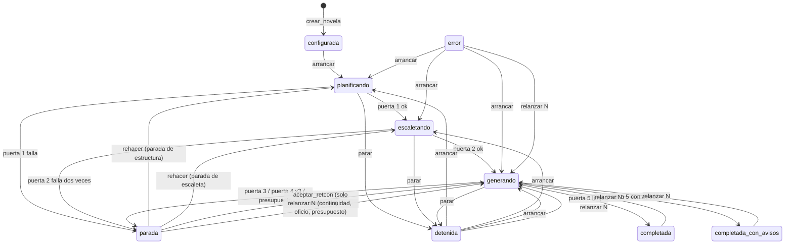

# SRS — Backend v2: correcciones de la auditoría

Especificación de requisitos de la **segunda versión del backend**. No sustituye a [spec1.md](spec1.md): la refina donde la auditoría del 23 de septiembre de 2026 encontró que el código, la spec o las dos se equivocaban. Todo lo que este documento no toca sigue valiendo tal como lo escribe spec1.

Versión 0.1 · 23 de septiembre de 2026 · Rama `pruebas`

> **Cómo leer este documento.** La sección 1 fija las reglas de relación con spec1. La 2 es el alcance, una fase por bloque de hallazgos. La 3 son los requisitos, en una subsección por fase. El orden de implementación, los ficheros que toca cada fase y los tests que la demuestran viven en [spec2-plan.md](spec2-plan.md); el estado fila a fila, en [spec2-verification.md](spec2-verification.md).
>
> Los callouts **Decisión de la spec** marcan lo decidido sin entrevista. Los que vienen del plan conservan su justificación allí; aquí solo se repiten cuando cambian un requisito.

---

## 1. Relación con spec1

- Todo requisito nuevo lleva el prefijo `RF2-`. Si reemplaza a uno de spec1, lo dice en su primera línea: *Sustituye a RF-…*. Si lo amplía, *Amplía RF-…*.
- En spec1, justo debajo del requisito sustituido, se añade una línea `> Sustituido por spec2, RF2-…`. spec1 no se reescribe: su plan de verificación tiene filas numeradas y citadas desde el código, y renumerar rompería esas referencias.
- Los hallazgos se citan con el número del informe de auditoría (hallazgo 1 a 26). Las reproducciones viven como tests en `src/backend/tests/test_auditoria.py`, uno por hallazgo, con el número en el nombre.

## 2. Alcance

| Fase | Qué cierra | Hallazgos | Severidad |
| --- | --- | --- | --- |
| 0 | Base: spec2, verificación honesta, tests rojos | — | — |
| 1 | El capítulo a medias no sobrevive a nada | 5, 6 | Alto |
| 2 | Reanudar nunca se salta una puerta | 1, 2, 12 | Crítico |
| 3 | Un solo escritor, de verdad | 3, 23 | Crítico |
| 4 | El paquete no pierde canon en silencio | 4, 10, 22, 24 | Crítico |
| 5 | Puerta 3 sin falsos positivos ni puntos muertos | 7, 8, 15, 16, 20, 21 | Alto |
| 6 | La traza dice la verdad y el extractor deja rastro | 9, 11, 17, 18 | Alto |
| 7 | El índice filtra antes de ordenar y no mezcla modelos | 13, 14 | Medio |
| 8 | Contrato de la API y tipos | 19, pyright | Medio |
| 9 | Deuda menor | 25, 26 y «cosas que chirrían» | Bajo |
| 10 | Demostración que ejercita de verdad la puerta 3 | fila 41 | — |

**Queda fuera**, como en spec1: el frontend, el revisor y las pasadas globales, el agente evaluador de tono, el desempate por similitud de RF-CTX-08 y las evals de los agentes salvo el extractor. El motivo de cada exclusión está en la sección 4 del plan.

---

## 3. Requisitos

### 3.0 Fase 0 — Base

Sin requisitos de comportamiento. La fase deja el plan de verificación de spec1 diciendo la verdad: las filas que la auditoría contradijo pasan a `fallando` con su reproducción como evidencia, y cada reproducción es un test `xfail(strict=True)` que la fase que la arregle tiene que desmarcar a conciencia.

### 3.1 Fase 1 — El capítulo a medias

Hallazgos 5 (`parar` en el tramo 3 deja texto y hechos) y 6 (`recuperar()` no revierte).

**RF2-PIPE-08** *Sustituye a RF-PIPE-08 y RF-PIPE-14.* Para cada capítulo, el orquestador ejecuta **paquete → redacción → extracción → puerta 3 → puerta 4** en tres tramos, porque una llamada al agente dura minutos y no puede ocurrir con el cerrojo de escritura tomado:

1. **Sin transacción.** Se llama al redactor y al extractor y su salida se guarda en memoria.
2. **Transacción corta.** Entran juntos el texto (una versión nueva por escena) y todo lo extraído, y se evalúa la puerta 3. Si hay conflicto, la transacción se revierte entera y se abre una parada de continuidad.
3. **Sin transacción, y luego otra corta.** Se juzga el oficio. Si pasa, una transacción compila el capítulo, lo marca `completado`, avanza `capitulos_completados` y emite `capitulo_completado`. Si no pasa, se revierte el capítulo y se vuelve a redactar con los criterios incumplidos.

Y la regla que faltaba: **toda salida del bucle de capítulo que no sea «capítulo cerrado» ni «parada de continuidad» revierte el estado del capítulo N antes de propagarse.** Eso cubre `Detenido`, `AgenteInterrumpido`, la salida inválida del agente de oficio y cualquier otra excepción. La reversión corre en su propia transacción; si ella misma falla, se registra y la excepción original sigue su camino.

Entre el tramo 2 y el 3 un capítulo puede tener texto y hechos sin estar completado. Es el único estado intermedio legítimo, y solo lo es mientras la ejecución está activa (RF2-PER-07).

**RF2-FALLO-06** *Sustituye a RF-FALLO-06.* Al arrancar, el worker:

1. Marca `interrumpida` toda `llamada_modelo` en `en_curso`.
2. Marca `interrumpida` con motivo `worker_caido` toda `intencion` en `en_curso`.
3. Para cada ejecución en `planificando`, `escaletando` o `generando`, **revierte el grafo desde el capítulo siguiente al último completado** y después la deja en `detenida` con `ultimo_error = interrumpida_por_caida`, `capitulo_actual` e `intento_actual` fijados desde el grafo.
4. Emite `worker_recuperado` con el resultado de `verificar_integridad()`.

El párrafo de spec1 que daba por hecho una transacción por capítulo desaparece: con tres tramos, el grafo **no** está siempre al final de la última unidad completa, y es la reversión la que lo devuelve ahí.

**RF2-PER-07** *Amplía RF-PER-07.* `verificar_integridad()` añade la regla `estado_en_capitulo_no_completado`: **ninguna versión vigente de texto ni ninguna fila de estado** (`hecho`, `estado_conocimiento`, `uso_conocimiento`, `estado_personaje`, `estado_objeto`, `evento`, `siembra_estado`, `hilo_estado`, `amenaza_revelacion`, `entidad_no_reconocida`) **pertenece a un capítulo no completado cuando la ejecución de su novela no está activa**. La función recibe qué novelas tienen ejecución activa, para no dar por fallo el estado intermedio del tramo 2; si no se le dice, lo lee de `ejecucion`.

> **Decisión de la spec (23-09-2026).** La reversión se separa en dos operaciones: `revertir_grafo`, que solo toca el grafo, y `relanzar`, que además mueve el estado de la ejecución y cierra las paradas abiertas. En spec1 eran una sola, y por eso el reintento de oficio cerraba paradas y reescribía el estado de rebote. Se descartó añadir banderas a la función única: dos operaciones con nombre dicen mejor cuál de los dos efectos quiere cada llamante.

### 3.2 Fase 2 — Reanudar nunca se salta una puerta

Hallazgos 1 (una parada de estructura acaba en `completada` sin capítulos), 2 (la escaleta rechazada se queda y se genera desde ella) y 12 (`aceptar_retcon` sobre cualquier parada revierte desde el capítulo 1).

> **Decisión de producto, entrevistada el 23 de septiembre de 2026.** Resolver una parada de estructura o de escaleta **rehace esa fase**: se borra lo que la puerta rechazó y el agente lo vuelve a producir con el informe de la parada en su paquete. La novela no se pierde.

**RF2-WK-06** *Sustituye a RF-WK-06.* Máquina de estados de la ejecución. Las transiciones que no aparecen no existen y el worker las rechaza con motivo:

Desde `parada`, la transición depende del **tipo** de la parada abierta, así que `transicion()` lo recibe. `arrancar` solo se admite desde `configurada`, `detenida` y `error`: sobre una novela completada se rechaza con motivo, porque volver a pasar la puerta 5 no es una transición. `relanzar N` exige además que las puertas 1 y 2 estén vigentes (RF2-PIPE-00): sin escaleta aprobada no hay capítulos que relanzar. Cualquier estado salvo `configurada` pasa a `error` ante una excepción no controlada.

> **Decisión de la spec (23-09-2026).** El diagrama del plan no dibujaba `relanzar N` desde `detenida` ni desde `error`, que spec1 sí admitía. Se conservan: relanzar desde un capítulo concreto tras detener la generación es el uso normal, y la condición de puertas vigentes ya impide relanzar una novela sin escaleta aprobada. Se descartó quitarlas porque obligaría a arrancar y parar solo para poder relanzar.

**RF2-FALLO-03** *Sustituye a RF-FALLO-03 y RF-FALLO-04.* Tabla cerrada de acciones de `resolver_parada` por tipo de parada:

| Tipo de parada | Acciones válidas | Qué hacen |
| --- | --- | --- |
| `estructura` | `rehacer` | Borra actos, hilos (con sus puntos de giro), siembras de origen `estructura` y objetos; cierra la parada y deja la ejecución en `planificando`. El estructurador vuelve a correr con el informe de la puerta 1 en su paquete y la puerta 1 se reevalúa |
| `escaleta` | `rehacer` | Borra capítulos y secuencias, y con ellos escenas, beats y secuelas; cierra la parada y deja la ejecución en `escaletando`. El escaletador vuelve a correr con el informe de la puerta 2 y la puerta 2 se reevalúa |
| `continuidad` | `aceptar_retcon`, `relanzar` | Como en spec1. `aceptar_retcon` revierte desde el capítulo de la parada y se rechaza si ningún conflicto trae `hecho_previo_id`: sin hecho que revocar, el mismo conflicto se repetiría |
| `oficio`, `presupuesto` | `relanzar` | Como en spec1 |

Cualquier otra combinación la rechaza el worker con motivo, sin tocar nada. La API sigue validando solo la forma: RF-API-04 añade `rehacer` a los valores de `accion`. En `relanzar` por `resolver_parada`, `desde_capitulo` es opcional y por defecto vale el capítulo de la parada.

El informe con el que el agente rehace su fase se lee del último registro `falla` de su puerta en `resultado_puerta`, que es persistente, y no de memoria: un worker reiniciado entre el fallo y el segundo intento lo conserva. Cuando la puerta 2 falla por segunda vez, la escaleta rechazada se borra **antes** de abrir la parada, y el informe de la parada la incluye resumida para que el autor pueda leer qué se rechazó sin abrir la base de datos.

**RF2-PIPE-00** *Requisito nuevo.* `avanzar` **deriva del grafo** qué toca, en este orden, en vez de decidirlo por el estado de `ejecucion`:

1. agentes de planificación que faltan;
2. puerta 1 no vigente;
3. escaleta ausente;
4. puerta 2 no vigente;
5. capítulos pendientes;
6. puerta 5.

Una puerta está **vigente** si su último registro en `resultado_puerta` no es `falla` y **juzgó exactamente lo que hay ahora**: el registro guarda una huella (SHA-256) de las filas que la puerta lee, y la huella tiene que coincidir con la del grafo actual. La puerta 1 lee actos, hilos, puntos de giro, el rol y el arco de cada personaje, y el subgénero y el tipo de final de la novela; la puerta 2, capítulos (sin su estado ni sus resúmenes), secuencias, escenas, reparto y restricciones.

> **Decisión de la spec (23-09-2026).** El plan pedía que el registro fuera «posterior a la última escritura de lo que juzga». Se implementa con una huella del contenido y no con marcas de tiempo, porque `datetime('now')` tiene resolución de segundo y dos escrituras del mismo segundo no se ordenan; ni con ids, porque los de tablas distintas no son comparables. La huella además es más estricta: una puerta que juzgó otra versión de la escaleta deja de estar vigente aunque la reescritura fuera anterior al registro.

**RF2-PIPE-00b** *Guardarraíl.* `generar_capitulo` se niega a empezar si las puertas 1 y 2 no están vigentes, con un error que lleva la ejecución a `error` y no a un capítulo. Es la misma propiedad que RF2-PIPE-00, comprobada en ejecución y no solo por construcción.

### 3.3 Fase 3 — Un solo escritor

Hallazgos 3 (el cerrojo caduca a los 6 s y nadie late durante el pipeline) y 23 (se escribe antes de tomar el cerrojo; carrera entre leer la versión del esquema y migrar).

**RF2-WK-07** *Sustituye a RF-WK-07.* El latido lo da un **hilo propio del worker, con su propia conexión**, cada `NOVELAS_POLL_SEGUNDOS`, mientras el proceso vive; no depende de que el bucle principal vuelva a la cola, que durante un capítulo puede tardar horas. Cada latido comprueba que la fila de `worker_lock` sigue siendo suya (`rowcount = 1`). Si no lo es, levanta la bandera `cerrojo_perdido` y deja de latir. El pipeline mira esa bandera en cada punto de comprobación y, si está levantada, aborta. La gracia sigue siendo de tres ciclos: otro worker solo puede quedarse el cerrojo si el latido lleva tres ciclos parado.

**RF2-WK-08** *Requisito nuevo: fencing.* Toda transacción de escritura del worker comprueba, **ya dentro de `BEGIN IMMEDIATE`**, que `worker_lock.pid` es el suyo. Si no lo es, revierte y lanza `CerrojoPerdido`, que ningún manejador del pipeline captura: el worker se detiene. Se comprueba con el cerrojo de escritura de SQLite tomado, que es lo que impide que dos procesos escriban aunque los dos crean tener el cerrojo. La comprobación va asociada a la conexión del worker desde que toma el cerrojo, así que cubre toda transacción que pase por ella, también las de la traza, la cola y el puerto.

**RF2-PROC-03** *Sustituye a RF-PROC-03.* El worker arranca en este orden: conectar → crear el esquema si no existe → **tomar el cerrojo** → arrancar el latido → migrar → construir el índice → recuperar. Crear el esquema es la única escritura anterior al cerrojo, porque la tabla del cerrojo vive en el esquema. Crear el esquema y migrar usan `BEGIN IMMEDIATE` y **vuelven a leer la versión dentro de la transacción**: si otro proceso ya la aplicó, no se hace nada. Cada fichero de esquema o de migración se aplica sentencia a sentencia dentro de esa transacción, y no con `executescript`, que confirmaría la transacción abierta antes de empezar.

Poner la base en modo WAL también se reintenta durante el `busy_timeout`: cambiar el modo de diario necesita un cerrojo exclusivo en el que SQLite no aplica la espera, y con varios procesos abriendo a la vez una base recién creada uno recibía `database is locked`. Si otro ya la puso en WAL, no se vuelve a pedir. *Lo destapó el test de creación concurrente durante la fase 5.*

La API sigue pudiendo **crear** el esquema al arrancar, como excepción escrita a RF-API-02: quitárselo obligaría a arrancar siempre el worker antes que la API, y la carrera que preocupaba la resuelve el `BEGIN IMMEDIATE` con relectura. La API **no migra**: migrar es del worker, que lo hace con el cerrojo tomado.

> **Decisión de la spec (23-09-2026).** El latido va en un hilo y no dentro del bucle de sondeo del puerto: el puerto solo late mientras hay una llamada al agente, y las fases SQL largas (la puerta 3, una reversión) quedarían otra vez sin latido. Se descartó alargar la gracia a minutos, que solo cambia cuánto tarda en aparecer el mismo fallo. El fencing no sustituye al latido, lo acota: un proceso congelado más tiempo que la gracia puede despertar con una transacción ya abierta y terminarla, pero no puede abrir otra.

### 3.4 Fase 4 — El paquete no pierde canon en silencio

Hallazgos 4 (el bloque de hechos y conocimiento desaparece entero), 10 (`LIMIT 200` tira los hechos más antiguos), 22 (conocimiento sin límite ni filtro de vigencia) y 24 (la configuración del presupuesto no se usa).

**RF2-CTX-01** *Sustituye a RF-CTX-01 en lo que toca al recorte.* Todo bloque del paquete es una **lista de elementos**, cada uno marcado como *obligatorio* u *opcional* y ya ordenado por relevancia. Un bloque fijo es un único elemento obligatorio; uno elástico de texto (estado rodante, capítulo anterior) es una lista de párrafos opcionales; el canon, los hechos, el conocimiento y lo recuperado son una lista de entidades, hechos, posturas o fragmentos. El recorte **quita elementos opcionales desde el final** de la lista, primero para que cada bloque quepa en su presupuesto y después, en el orden de `ORDEN_DE_RECORTE`, para que quepa el paquete. Nunca corta a mitad de elemento ni vacía un bloque por ser «un párrafo». El orden en que un bloque se presenta al agente puede no ser el de relevancia (el estado rodante se lee en orden cronológico, y se recorta empezando por lo más antiguo).

El bloque del capítulo anterior, como ya pedía spec1, **se sustituye por su resumen** antes de perder párrafos.

**RF2-CTX-03** *Sustituye a RF-CTX-03.* Si los elementos obligatorios no caben, `PresupuestoExcedido` y parada de presupuesto, con los bloques y sus tamaños en el informe; vale para los paquetes del redactor, del extractor y del juez de oficio. **Todo recorte, aunque el paquete quepa, se registra en la traza** con el evento `paquete_recortado`, por bloque: cuántos elementos se quitaron, cuántos tokens y si el bloque se sustituyó por su alternativa.

**RF2-CTX-11** *Requisito nuevo.* Qué es obligatorio:

| Bloque | Obligatorio | Opcional, de más a menos relevante |
| --- | --- | --- |
| Canon | Los personajes que son POV de alguna escena del capítulo y los lugares de sus escenas | El resto del reparto por número de apariciones, la amenaza, los sistemas técnicos, los objetos y las facciones |
| Hechos | Todos los hechos vigentes, establecidos antes del capítulo, de los personajes del reparto y de los lugares de sus escenas | Los hechos de amenaza, mundo y novela, del más reciente al más antiguo |
| Conocimiento | La última postura de cada personaje del reparto sobre cada hecho vigente | — |

Un hecho sustituido por otro vigente (`supersede_a`) no entra: el agente ve el valor actual, no la historia.

**RF2-CTX-12** *Requisito nuevo.* El presupuesto sale de `Config`, que llega al paquete desde el contexto del orquestador; ningún módulo lee las constantes de `config.py` por su cuenta. `NOVELAS_PRESUPUESTO_TOKENS` fija el **techo por llamada**, y el paquete dispone de ese techo menos una reserva fija de 26.000 tokens para la salida del agente y la sobrecarga de Claude Code. Con el valor por defecto (100.000) el paquete tiene los 74.000 de spec1. Un techo que no deje sitio a la reserva es configuración inválida y el proceso no arranca.

La prosa del capítulo es un bloque propio, `prosa`, fijo, en los paquetes del extractor y del juez de oficio; antes viajaba bajo el nombre `escaleta`. Cada agente declara qué bloques puede llevar, y la suma de sus presupuestos no pasa del paquete.

> **Decisión de la spec (23-09-2026).** El plan dejaba sin fijar qué parte del canon es obligatoria; se toma la de spec1 («el POV nunca se recorta») y se añaden los lugares de las escenas, porque sus hechos ya son obligatorios y un hecho de un lugar sin el lugar no se entiende. Para `NOVELAS_PRESUPUESTO_TOKENS` se descartó eliminarla: el techo por llamada es la restricción que da forma al pipeline y tiene que poder bajarse para medir. La recompresión del estado rodante por actos que describía RF-CTX-04 no se implementa: el recorte por elementos quita primero los resúmenes breves más antiguos, que es lo que esa recompresión perdía, y queda registrado.

### 3.5 Fase 5 — Puerta 3 sin falsos positivos

Hallazgos 7 (supersesión encadenada), 8 (`LOWER()` no pliega tildes), 15 (`orden_interno` autoasignado), 16 (muerte detectada con `LIKE '%muert%'`), 20 (nombres duplicados) y 21 (`hecho.vigente` es una columna mutable).

**RF2-PIPE-11** *Sustituye a RF-PIPE-11.* Un `Hecho` guarda, además del triple en texto, **claves normalizadas** `sujeto_clave`, `atributo_clave` y `valor_clave`, calculadas en Python con la misma `normalizar()` del resolvedor de nombres (sin tildes, sin mayúsculas, sin espacios de sobra). Todo hecho se inserta con una única función, `insertar_hecho`, que las calcula. La puerta 3 y el extractor comparan claves, nunca `LOWER()`, que en SQLite solo pliega ASCII.

**RF2-PIPE-12** *Sustituye a RF-PIPE-12 en la contradicción factual.* Dos hechos vigentes del mismo sujeto y atributo con distinta `valor_clave` se contradicen, salvo que el anterior **esté sustituido** por otro hecho vigente de ordinal menor o igual al del nuevo. Eso hace transitiva la cadena herida → infectada → cicatrizada: cada eslabón sustituye al anterior y ninguno choca con los de atrás. Cada par se informa una sola vez. La presencia imposible por muerte consulta `EstadoPersonaje.condicion`: hay conflicto si la **última** condición registrada del personaje antes de la escena es `muerto` y la escena no es analepsis.

**RF2-PIPE-10** *Amplía RF-PIPE-10.* Todo evento con `dramatizado = true` lleva `orden_interno` **obligatorio**. El paquete del extractor le entrega el último `orden_interno` registrado en la novela para que siga la escala. Sin él, la salida no valida y el puerto repite la llamada con el error. Se elimina la autoasignación, que hacía crecer siempre el orden y dejaba sin efecto la ubicuidad y el retroceso temporal. Todo `estado_personaje` lleva `condicion ∈ {vivo, herido, incapacitado, muerto, desaparecido}`, también obligatoria; `salud_fisica` sigue como texto libre para la prosa.

**RF2-PER-06** *Sustituye a RF-PER-06 en lo que toca al hecho.* Revocar un hecho es **insertar** una fila en `hecho_revocacion(hecho_id, parada_id, capitulo, motivo, creado_en)`; nunca un `UPDATE`. La vigencia se deriva en la vista `hecho_vigente`, que es lo que leen la puerta 3, el paquete, el índice y la API. La columna `hecho.vigente` y sus compañeras `motivo_no_vigente` y `parada_id` dejan de leerse y escribirse, y un trigger impide modificar cualquier columna de contenido de `hecho`: el hecho es append-only de verdad, y no por disciplina. Revertir al capítulo N borra las revocaciones decididas en capítulos posteriores a N; la que decide el autor al aceptar un retcon en el capítulo N es el punto de partida de su regeneración, y se conserva.

**RF2-PER-11** *Requisito nuevo.* `UNIQUE (novela_id, nombre_clave)` en `personaje`, `lugar`, `objeto`, `faccion` y `sistema_tecnologico`, con `nombre_clave` calculada al insertar y obligatoria. Los esquemas de salida de mundo, elenco y estructura rechazan dos nombres que solo difieren en tildes o mayúsculas, para que el agente lo corrija en su reintento en vez de fallar al escribir.

**Migraciones.** Son las primeras reales del proyecto: `compartido/migraciones/002_*.sql` (columnas, tabla, vista e índices) y `002_*.py`, con una función `aplicar(con)` que rellena las claves de las filas existentes, pasa a `hecho_revocacion` los hechos que tenían `vigente = 0`, crea los índices únicos y los triggers. Los dos ficheros de un mismo número se aplican en la misma transacción. Antes de crear los índices únicos, la migración busca nombres duplicados y, si los hay, aborta con la lista: no los arregla por su cuenta. Una base nueva se crea ya en la versión actual (esquema base y todas las migraciones); migrar una base existente es del worker.

> **Decisión de la spec (23-09-2026).** Las columnas `vigente`, `motivo_no_vigente` y `parada_id` no se borran. `DROP COLUMN` no admite una columna con clave ajena, y reconstruir `hecho` exige desactivar las claves ajenas fuera de la transacción, con tres tablas que cuelgan de él en cascada. Se prefirió dejarlas muertas y blindar la tabla con un trigger. Se descartó también calcular las claves con una función SQL registrada en la conexión: la API y cualquier herramienta externa abrirían la base sin ella.

### 3.6 Fase 6 — La traza dice la verdad

Hallazgos 9 (el juez de la puerta 4 no se registra), 11 (el extractor descarta en silencio), 17 (el agente podría usar herramientas) y 18 (SIGTERM entre llamadas no para).

**RF2-PIPE-13** *Amplía RF-PIPE-13.* El `resultado_puerta` de la puerta 4 lleva la parte mecánica **y** la de juicio en un solo registro: los conflictos de la mecánica y un conflicto por cada criterio que el juez da por `falla`, con su evidencia y su sugerencia. El veredicto es `falla` si falla cualquiera de las dos. Si la mecánica falla, el juez no se invoca y el registro lo dice.

**RF2-PIPE-16** *Requisito nuevo.* `extraccion.aplicar` devuelve el recuento de lo que descartó, por tipo de registro y motivo (`escena_desconocida`, `personaje_sin_resolver`, `hecho_sin_resolver`, `objeto_sin_resolver`), y el detalle de cada uso de conocimiento descartado. El recuento va a la traza (evento `extraccion_descartes`). En la puerta 3, cada uso de conocimiento descartado es un **aviso** `conocimiento_sin_comprobar`: es conocimiento que el personaje usa y que ninguna consulta ha podido comprobar.

**RF2-PIPE-17** *Requisito nuevo: el segundo método que mira el texto (regla 3 de validators.md; picaresca antes que juez).* Búsquedas dirigidas sobre la prosa del capítulo, dentro del tramo 2, como **avisos** de la puerta 3:

- `nombre_sin_registro`: nombres del canon (personajes, lugares, objetos) que aparecen en la prosa de una escena sin ningún registro extraído sobre ellos en esa escena;
- `cifra_sin_hecho`: cifras en la prosa de una escena sin ningún hecho de categoría `fecha` o `distancia` en ella;
- `muerto_nombrado`: el nombre de un personaje cuya última condición registrada es `muerto` en la prosa de una escena posterior que no es analepsis.

Los nombres se buscan como palabras enteras sobre el texto normalizado, igual que se comparan las claves. Son avisos y no conflictos: una escena puede nombrar a alguien sin que haya nada que extraer, y lo que miden es la cobertura del extractor, no la continuidad.

**RF2-PUERTO-10** *Requisito nuevo.* El puerto invoca a Claude Code con `--tools ""`, que **retira** las herramientas integradas (no solo sus permisos), junto a `--allowedTools ""`, y con `--strict-mcp-config`, que deja fuera los servidores MCP de la configuración del usuario. Una llamada que devuelve `permission_denials` no vacío, o más de dos turnos, es un error de puerto (`AgenteUsoHerramientas`): el agente intentó usar herramientas. No se reintenta.

> **Decisión de la spec (23-09-2026).** El plan fijaba el umbral en «más de un turno». Una llamada real verificada con el CLI 2.1.274, con `--json-schema` y sin herramientas, devuelve `num_turns = 2`: la salida estructurada consume un turno. Con el umbral del plan, toda llamada legítima habría sido un error. El umbral pasa a dos, y la señal principal es `permission_denials`. Se descartó `--restricted`, que además ignora los ficheros de configuración del usuario y no está probado contra la autenticación de la sesión, como no lo estaba `--bare`, que la rompía.

**RF2-WK-09** *Requisito nuevo.* SIGTERM y SIGINT detienen el pipeline en el siguiente punto de comprobación, no solo si llegan durante una llamada. La interrupción que viene de una señal es **definitiva**: el puerto la conserva y cualquier llamada posterior se corta sin lanzar el subproceso. La que viene de una intención `parar` sigue siendo de una sola llamada.

### 3.7 Fase 7 — El índice vectorial

*Pendiente: se escribe al empezar la fase.*

### 3.8 Fase 8 — Contrato de la API y tipos

*Pendiente: se escribe al empezar la fase.*

### 3.9 Fase 9 — Deuda menor

*Pendiente: se escribe al empezar la fase.*

### 3.10 Fase 10 — Demostración

*Pendiente: se escribe al empezar la fase.*
