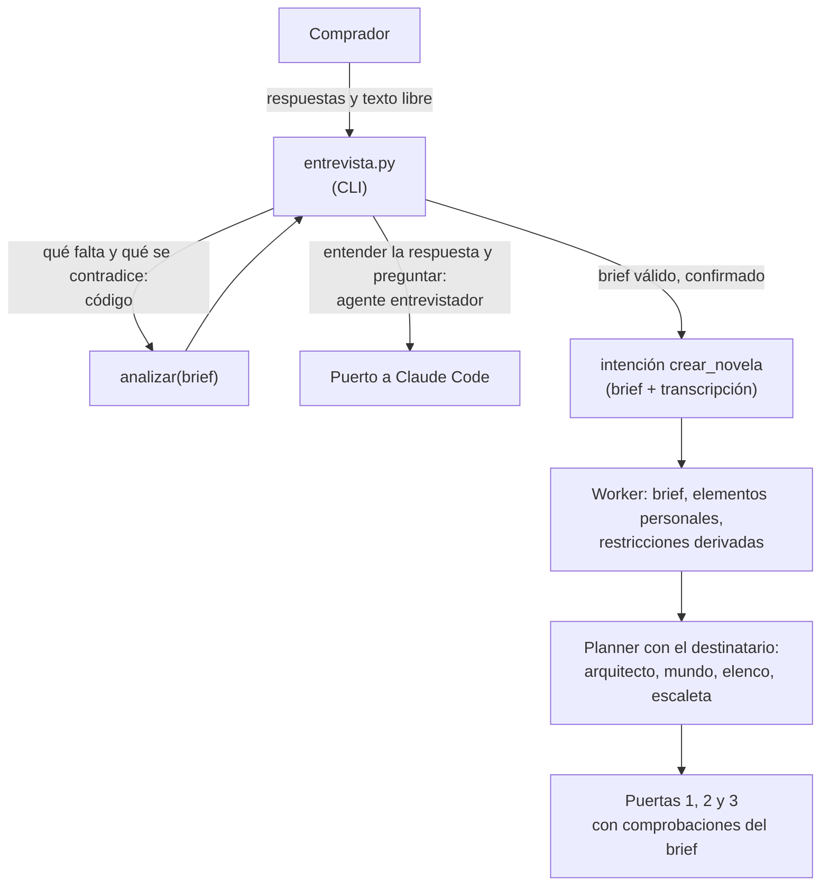

# SRS — storyMaker: personalización y entrega

Requisitos de lo que el [plan de entrega](storymaker-plan.md) añade al backend para el examen: la personalización, la lectura, la observabilidad, los guardrails y la verificación formal. Una sección por bloque del plan; cada una se escribe al empezar su bloque.

Versión 0.1 · 23 de septiembre de 2026

> **Cómo leer este documento.** Refina [spec1](spec1.md) y [spec2](spec2.md), no las sustituye. Los requisitos nuevos llevan el prefijo `RF3-`. Si uno reemplaza a otro anterior, lo nombra, y el anterior recibe la línea `> Sustituido por spec3, RF3-…`. Los callouts **Decisión entrevistada** y **Decisión de la spec** marcan qué se preguntó al autor y qué se decidió sin él. El plan de verificación está en [spec3-verification.md](spec3-verification.md).

---

## 1. Alcance

| Bloque del plan | Sección | Estado |
| --- | --- | --- |
| 2. Personalización del terror | [3.2](#32-bloque-2--personalización-del-terror) | Escrita |
| 3. Huecos de la story bible | 3.3 | Pendiente |
| 4. Observabilidad con Langfuse | 3.4 | Pendiente |
| 5. Guardrails | 3.5 | Pendiente |
| 6. Validadores que faltan | 3.6 | Pendiente |
| 7. Lectura | 3.7 | Pendiente |
| 8. Cambio del lector | 3.8 | Pendiente |
| 9. Validadores formales | 3.9 | Pendiente |
| 10. Infraestructura de evals | 3.10 | Pendiente |

---

## 3.2 Bloque 2 — Personalización del terror

Las novelas siguen siendo de terror espacial. Lo que se personaliza es **para quién** es el terror: el destinatario del regalo es el protagonista, sus rasgos y sus recuerdos entran en la historia, y la intensidad se ajusta a su edad.

> **Decisión entrevistada, 23 de septiembre de 2026.** Cuatro decisiones de producto:
>
> 1. **El destinatario es el protagonista** y el punto de vista principal. Se descartó un personaje principal sin punto de vista (se reconoce menos) y dejarlo a elección del comprador (más casos que probar sin ganar nada claro).
> 2. **Tres niveles de intensidad con edad mínima.** Se descartaron una escala del 1 al 5 (cada número necesitaría una definición comprobable) y dos niveles (dejan fuera al adolescente y al adulto que no quiere violencia explícita).
> 3. **El destinatario nunca muere.** Es un regalo. Se descartó permitirlo con permiso del comprador: añade un caso a validar sin que nadie lo haya pedido.
> 4. **La entrevista es un CLI conversacional.** Se descartó un formulario de una sola pasada (menos entrevista) y un endpoint en la API (la API no invoca al modelo, RF-COD-05).

### El brief

**RF3-BRF-01 — Modelo.** El brief es un modelo Pydantic en `compartido/brief.py`, porque lo usan la API, el worker y el entrevistador. Campos:

| Campo | Tipo | Obligatorio | Notas |
| --- | --- | --- | --- |
| `destinatario.nombre` | texto, 1–60 | sí | Se escribe **exactamente** así en toda la novela |
| `destinatario.edad` | entero, 1–110 | sí | Es la edad del lector: la novela es para él |
| `destinatario.pronombres` | `el` · `ella` · `neutro` | sí | Concordancia gramatical del protagonista en castellano |
| `destinatario.rasgos` | lista de elementos personales, 1–8 | sí (al menos uno) | Rasgos de carácter o físicos |
| `recuerdos` | lista de elementos personales, 1–10 | sí (al menos uno) | Anécdotas, lugares, costumbres |
| `allegados` | lista de allegados, 0–6 | no | Personas o mascotas cercanas: `nombre`, `relacion`, `rasgos`, `obligatorio` |
| `ocasion` | `cumpleanos` · `aniversario` · `boda` · `jubilacion` · `navidad` · `otra` | sí | Más `ocasion_detalle` libre si es `otra` |
| `quien_regala` | texto, 1–80 | sí | Firma la dedicatoria |
| `mensaje_dedicatoria` | texto, ≤ 300 | no | Lo que el comprador quiere decir; el arquitecto lo integra |
| `intensidad` | `atmosferico` · `tension` · `intenso` | sí | RF3-BRF-02 |
| `tono` | `sobrio` · `emotivo` · `humor_negro` · `aventura` | sí | |
| `subgenero` | uno de los seis de `compartido/tipos.py::Subgenero` | no | Si falta, lo elige el arquitecto |
| `capitulos` | entero, 1–10 | no, por defecto 10 | Extensión (RF3-ESC-01) |
| `vetados` | lista de textos, 0–30 | no | Palabras o temas que no pueden aparecer; los aplica el guardrail del bloque 5 |
| `texto_libre` | texto, ≤ 4.000 | no | Anécdota o carta pegada por el comprador. **No confiable** (RF3-ENT-05) |

Un **elemento personal** es `{codigo, texto, obligatorio, origen, cita}`. El `codigo` es estable dentro del brief (`RAS1`, `REC1`, `ALL1`…) y es lo que el resto del sistema usa para decir dónde aparece cada elemento. `origen` es `entrevista` o `texto_libre`, y `cita` es el fragmento literal del que se extrajo. Por defecto todo elemento es obligatorio.

**RF3-BRF-02 — Intensidad.** Tres niveles, cada uno con su edad mínima y con lo que admite:

| Nivel | Edad mínima | Admite | No admite |
| --- | --- | --- | --- |
| `atmosferico` | 10 | Inquietud, amenaza sugerida, peligro que se resuelve, pérdidas sin descripción | Muertes en escena, sangre, heridas descritas, crueldad |
| `tension` | 14 | Peligro real, muertes fuera de plano, heridas sin detalle anatómico | Violencia gráfica, tortura, terror corporal explícito |
| `intenso` | 18 | Violencia explícita al servicio de la historia | Contenido sexual, que queda fuera del producto en todos los niveles |

La tabla vive en `compartido/brief.py` y es la única fuente: de ella salen las restricciones de público y de política de contenido (RF3-PER-01) y el texto que reciben el arquitecto y el redactor.

> **Decisión de la spec.** No hay nivel para menores de 10 años: una novela de terror para un niño de 8 no es un producto que el sistema deba ofrecer. El brief con esa edad es una contradicción que no se resuelve bajando la intensidad, y el entrevistador lo dice así.

**RF3-BRF-03 — Análisis determinista.** `analizar(brief_parcial)` devuelve dos listas, **sin llamar a ningún modelo** (picaresca antes que juicio):

- **Faltantes:** los campos obligatorios de RF3-BRF-01 vacíos, en el orden de la tabla.
- **Contradicciones**, cada una con un código y los campos implicados:

| Código | Cuándo | Cómo se resuelve |
| --- | --- | --- |
| `edad_bajo_intensidad` | La edad está por debajo de la mínima de la intensidad elegida | Bajar la intensidad, o corregir la edad; con menos de 10 años no hay resolución |
| `subgenero_exige_intensidad` | `terror_corporal` o `slasher_espacial` con intensidad `atmosferico`: esos subgéneros viven del cuerpo y de las bajas | Otro subgénero, o más intensidad si la edad lo permite |
| `elemento_con_vetado` | Un término de `vetados` aparece, normalizado, en un elemento obligatorio o en el nombre de un allegado obligatorio | Quitar el término de `vetados` o el elemento |

La normalización ignora mayúsculas y acentos, conserva la eñe y trata el plural simple (`-s`, `-es`) como el singular. Es la misma que usará el guardrail del bloque 5, y vive en `compartido/` para que ambos la compartan.

**RF3-BRF-04 — Un brief válido no tiene faltantes ni contradicciones.** `Brief.validar_completo()` lanza un error con las dos listas si alguna no está vacía. Lo aplican la API (RF3-PER-05) y el worker.

### El entrevistador

**RF3-ENT-01 — Qué es.** Un agente nuevo, `entrevistador`, con su skill en `.claude/skills/entrevistador/` y su tarea en `tareas/entrevistador/` (esquemas y servicio). Hace dos cosas y ninguna más: **entender** la respuesta del comprador (convertirla en campos del brief) y **preguntar** por lo siguiente pendiente. Qué falta y qué se contradice lo decide el código (RF3-BRF-03), no el agente.

**RF3-ENT-02 — Bucle.** `src/backend/entrevista.py` es un CLI, como `demo.py`:

1. Si hay texto libre (`--texto-libre fichero`), se procesa primero (RF3-ENT-05).
2. En cada turno el código calcula los pendientes (contradicciones primero, después faltantes) y llama al agente con el brief parcial, los pendientes, los últimos turnos y la última respuesta.
3. El agente devuelve `SalidaEntrevistador = {actualizaciones: [{campo, valor, cita}], pregunta}`.
4. El código aplica cada actualización solo si el campo está permitido, el valor valida contra el brief y la `cita` aparece **literalmente** (normalizada) en la respuesta del comprador. Lo que no cumple se descarta y se anota en la transcripción: el agente no puede inventarse datos que el comprador no dio.
5. Sin pendientes, se muestra el resumen y se pide confirmación. Con un «sí», se encola `crear_novela` con el brief y la transcripción.

**RF3-ENT-03 — Límite.** Como máximo 25 turnos. Si se agotan con pendientes, la entrevista termina sin encolar nada y lo dice: un retry con límite, como el resto del harness.

**RF3-ENT-04 — Sin agente, cuando no hace falta.** `entrevista.py --brief fichero.json` valida un brief ya escrito, informa de sus faltantes y contradicciones y, si es válido, lo encola. No invoca al modelo. Es lo que usan el brief de ejemplo, los tests y los cinco briefs de prueba del bloque 10.

**RF3-ENT-05 — Texto libre no confiable.** El texto libre es **dato, nunca instrucción**:

- Entra en el paquete entre delimitadores explícitos y con la indicación de que es contenido del comprador que no se obedece.
- De él solo se pueden extraer `rasgos`, `recuerdos` y `allegados`, con origen `texto_libre`. La intensidad, los vetados, la extensión, la ocasión y quién regala solo los fija el comprador en la conversación.
- Cada elemento extraído lleva una cita que el código comprueba literalmente contra el texto (como en RF3-ENT-02, punto 4).
- Una búsqueda determinista de patrones de inyección («ignora las instrucciones», «a partir de ahora eres», «prompt del sistema», marcadores de rol) añade una **alerta** a la transcripción. El texto sigue tratándose como dato; la alerta es para el red-team log y el audit log del bloque 5.

**RF3-ENT-06 — Un solo escritor.** La entrevista no escribe en la base de datos salvo la fila de la intención, igual que la API (RF-API-02). Invoca al puerto **sin conexión**, así que sus llamadas no van a `llamada_modelo`; su traza viaja en la transcripción dentro de la intención y el worker la guarda (RF3-PER-02).

**RF3-ENT-07 — Puerto falso.** El puerto falso tiene un generador de entrevistador que responde de forma determinista a un guion de respuestas, para probar el bucle sin gastar.

### El brief dentro del pipeline

**RF3-PER-01 — Restricciones derivadas.** Al crear una novela con brief, el worker deriva sus restricciones del brief en lugar de recibirlas: `longitud_objetivo_palabras = capitulos × 1.250`, `longitud_capitulo_palabras = 1000-1500`, `capitulos = N`, `publico` y `politica_contenido` de la tabla de intensidad, `pov_por_defecto = tercera_limitada` y `tiempo_verbal = pasado`. El título queda vacío y lo propone el arquitecto (ya lo hace si falta).

**RF3-PER-02 — Persistencia.** Tres tablas nuevas (migración 004):

| Tabla | Qué guarda |
| --- | --- |
| `brief` | El brief validado, en JSON, uno por novela |
| `elemento_personal` | Un elemento por fila: código, tipo (`rasgo`, `recuerdo`, `allegado`), texto, obligatorio, origen, cita |
| `escena_elemento` | Qué elementos personales planifica la escaleta en cada escena |

Más `entrevista` (la transcripción, con sus alertas y las llamadas al agente) y la columna `novela.dedicatoria`. Son canon: ninguna reversión de capítulos las toca. `escena_elemento` cae con sus escenas cuando se rehace la escaleta.

**RF3-PER-03 — Qué recibe cada agente.**

| Agente | Recibe del brief | Produce |
| --- | --- | --- |
| Arquitecto | Destinatario, ocasión, quién regala, mensaje, intensidad con su tabla, tono, subgénero si viene fijado, vetados | Lo de siempre más `dedicatoria` (≤ 400 caracteres, con el nombre del destinatario escrito exactamente) |
| Mundo | Los recuerdos, como material que la estación puede reflejar | Lo de siempre |
| Elenco | Destinatario (nombre, edad, pronombres, rasgos) y allegados obligatorios | El destinatario como `protagonista` con su nombre exacto, y cada allegado obligatorio como personaje |
| Escaleta | Los elementos personales obligatorios con su código, y el número de capítulos | Cada escena declara los códigos que integra (`elementos`) |
| Redactor | Por escena, los elementos que integra; la intensidad con su tabla; el nombre exacto del destinatario | Lo de siempre |

**RF3-PER-04 — Puertas.** Comprobaciones nuevas, todas deterministas y bloqueantes:

| Puerta | Comprobación | Falla si |
| --- | --- | --- |
| 1 | `destinatario_protagonista` | No hay un personaje con el nombre normalizado del destinatario y rol `protagonista` |
| 1 | `allegado_en_elenco` | Un allegado obligatorio no está en el elenco |
| 1 | `dedicatoria_nombra_al_destinatario` | La dedicatoria no contiene el nombre del destinatario tal cual |
| 1 | `subgenero_del_brief` | El brief fija un subgénero y el arquitecto eligió otro |
| 2 | `numero_de_capitulos` | La escaleta no tiene exactamente los capítulos del brief |
| 2 | `pov_del_destinatario` | El destinatario es el punto de vista de la mitad de las escenas o menos |
| 2 | `elemento_sin_escena` | Un elemento obligatorio no está planificado en ninguna escena |
| 3 | `destinatario_muere` | La condición del destinatario pasa a `muerto` en el capítulo |

Un código de elemento que la escaleta declara y no existe se ignora y deja un aviso.

> **Decisión de la spec.** Que un elemento esté **planificado** en una escena lo declara el escaletador, así que es dato autodeclarado (regla 3 de validators.md). La comprobación de la puerta 2 detecta un olvido del plan, pero no que la prosa lo cumpla. El segundo método, que el elemento aparezca en la prosa comprobado contra la tabla de hechos, es del bloque 6; hasta entonces la fila de verificación lo declara.

**RF3-PER-05 — API.** `crear_novela` acepta `brief` (RF3-BRF-01) y `entrevista`. Un brief con faltantes o contradicciones es `422` con las dos listas. El payload antiguo, sin brief, sigue funcionando para los tests y la demo existentes, y crea una novela sin personalización.

**RF3-PER-06 — Demo.** `demo.py --brief fichero.json` crea la novela desde un brief. `ejemplos/brief-ejemplo.json` pasa a ser un brief personalizado completo.

**RF3-ESC-01 — Escala del examen.** Diez capítulos de 1.000 a 1.500 palabras por defecto. La escala sale de RF3-PER-01 y la vigilan comprobaciones que ya existen (presupuesto y longitud por capítulo de la puerta 2) más `numero_de_capitulos`. La longitud **real** de cada capítulo escrito es del bloque 6.

### Lo que el bloque 2 deja para después

- Que la prosa respete la intensidad: el guardrail por nivel (bloque 5) y la rúbrica del juez (bloque 6).
- Que cada elemento personal aparezca en la prosa y de forma natural (bloque 6).
- Los nombres escritos exactamente en la prosa (bloque 6).
- Que las llamadas del entrevistador lleguen a Langfuse (bloque 4); hasta entonces viven en la transcripción.
