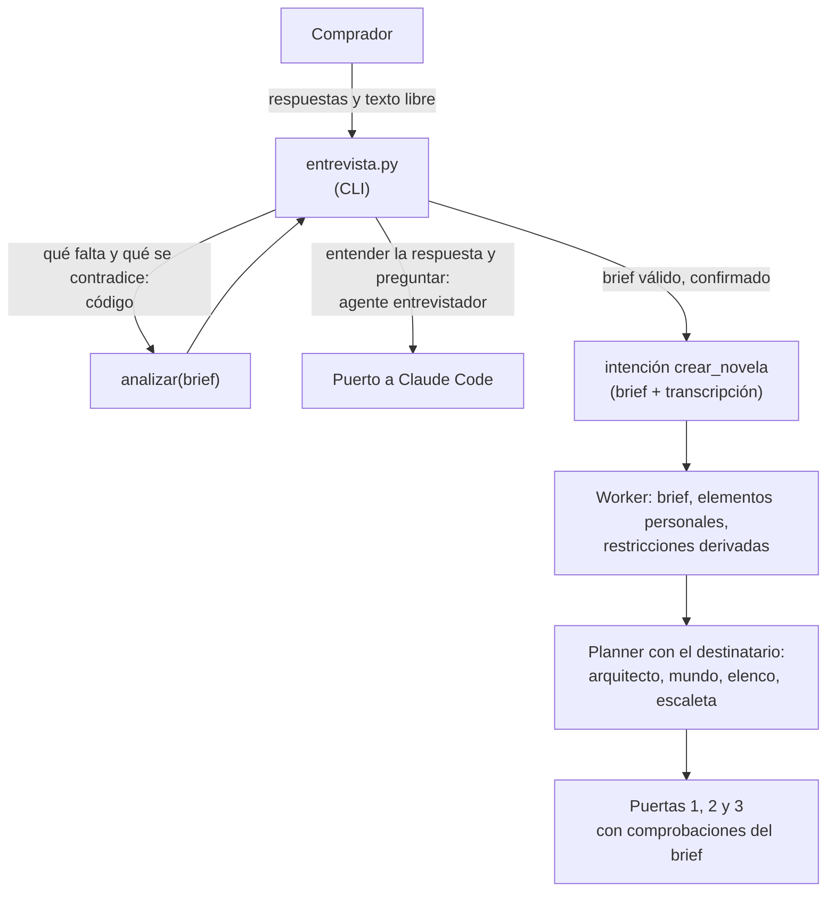
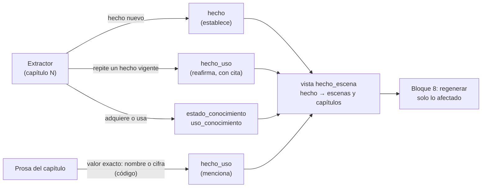
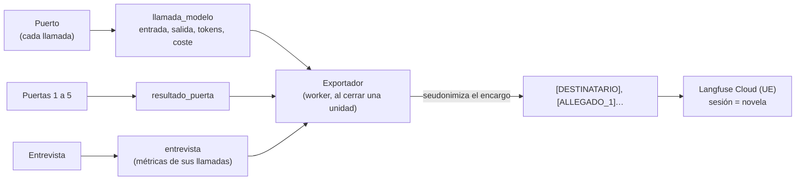

# SRS — storyMaker: personalización y entrega

Requisitos de lo que el [plan de entrega](storymaker-plan.md) añade al backend para el examen: la personalización, la lectura, la observabilidad, los guardrails y la verificación formal. Una sección por bloque del plan; cada una se escribe al empezar su bloque.

Versión 0.1 · 23 de septiembre de 2026

> **Cómo leer este documento.** Refina [spec1](spec1.md) y [spec2](spec2.md), no las sustituye. Los requisitos nuevos llevan el prefijo `RF3-`. Si uno reemplaza a otro anterior, lo nombra, y el anterior recibe la línea `> Sustituido por spec3, RF3-…`. Los callouts **Decisión entrevistada** y **Decisión de la spec** marcan qué se preguntó al autor y qué se decidió sin él. El plan de verificación está en [spec3-verification.md](spec3-verification.md).

---

## 1. Alcance

| Bloque del plan | Sección | Estado |
| --- | --- | --- |
| 2. Personalización del terror | [3.2](#32-bloque-2--personalización-del-terror) | Escrita |
| 3. Huecos de la story bible | [3.3](#33-bloque-3--huecos-de-la-story-bible) | Escrita |
| 4. Observabilidad con Langfuse | [3.4](#34-bloque-4--observabilidad-con-langfuse) | Escrita |
| 5. Guardrails | 3.5 | Pendiente |
| 6. Validadores que faltan | 3.6 | Pendiente |
| 7. Lectura | 3.7 | Pendiente |
| 8. Cambio del lector | 3.8 | Pendiente |
| 9. Validadores formales | 3.9 | Pendiente |
| 10. Infraestructura de evals | [3.10](#310-bloque-10--infraestructura-de-evals) | Empezada: el banco de contraejemplos de la puerta 3 |
| Mejoras tras la primera pasada real | [3.11](#311-lo-que-enseñó-la-primera-pasada-real) | Escrita: 3 de los 6 frentes (extractor, resumen y nombres menores) |

---

## 3.2 Bloque 2 — Personalización del terror

Las novelas siguen siendo de terror espacial. Lo que se personaliza es **para quién** es el terror: el destinatario del regalo es el protagonista, sus rasgos y sus recuerdos entran en la historia, y la intensidad se ajusta a su edad.

> **Decisión entrevistada, 23 de septiembre de 2026.** Cuatro decisiones de producto:
>
> 1. **El destinatario es el protagonista** y el punto de vista principal. Se descartó un personaje principal sin punto de vista (se reconoce menos) y dejarlo a elección del comprador (más casos que probar sin ganar nada claro).
> 2. **Tres niveles de intensidad con edad mínima.** Se descartaron una escala del 1 al 5 (cada número necesitaría una definición comprobable) y dos niveles (dejan fuera al adolescente y al adulto que no quiere violencia explícita).
> 3. **El destinatario nunca muere.** Es un regalo. Se descartó permitirlo con permiso del comprador: añade un caso a validar sin que nadie lo haya pedido.
> 4. **La entrevista es un CLI conversacional.** Se descartó un formulario de una sola pasada (menos entrevista) y un endpoint en la API (la API no invoca al modelo, RF-COD-05).

### El brief

**RF3-BRF-01 — Modelo.** El brief es un modelo Pydantic en `compartido/brief.py`, porque lo usan la API, el worker y el entrevistador. Campos:

| Campo | Tipo | Obligatorio | Notas |
| --- | --- | --- | --- |
| `destinatario.nombre` | texto, 1–60 | sí | Se escribe **exactamente** así en toda la novela |
| `destinatario.edad` | entero, 1–110 | sí | Es la edad del lector: la novela es para él |
| `destinatario.pronombres` | `el` · `ella` · `neutro` | sí | Concordancia gramatical del protagonista en castellano |
| `destinatario.rasgos` | lista de elementos personales, 1–8 | sí (al menos uno) | Rasgos de carácter o físicos |
| `recuerdos` | lista de elementos personales, 1–10 | sí (al menos uno) | Anécdotas, lugares, costumbres |
| `allegados` | lista de allegados, 0–6 | no | Personas o mascotas cercanas: `nombre`, `relacion`, `rasgos`, `obligatorio` |
| `ocasion` | `cumpleanos` · `aniversario` · `boda` · `jubilacion` · `navidad` · `otra` | sí | Más `ocasion_detalle` libre si es `otra` |
| `quien_regala` | texto, 1–80 | sí | Firma la dedicatoria |
| `mensaje_dedicatoria` | texto, ≤ 300 | no | Lo que el comprador quiere decir; el arquitecto lo integra |
| `intensidad` | `atmosferico` · `tension` · `intenso` | sí | RF3-BRF-02 |
| `tono` | `sobrio` · `emotivo` · `humor_negro` · `aventura` | sí | |
| `subgenero` | uno de los seis de `compartido/tipos.py::Subgenero` | no | Si falta, lo elige el arquitecto |
| `capitulos` | entero, 3–10 | no, por defecto 10 | Extensión (RF3-ESC-01). Tres como mínimo: la estructura tiene tres actos, y un acto sin capítulos para la puerta 2 |
| `vetados` | lista de textos, 0–30 | no | Palabras o temas que no pueden aparecer; los aplica el guardrail del bloque 5 |
| `texto_libre` | texto, ≤ 4.000 | no | Anécdota o carta pegada por el comprador. **No confiable** (RF3-ENT-05) |

Un **elemento personal** es `{codigo, texto, obligatorio, origen, cita}`. El `codigo` es estable dentro del brief (`RAS1`, `REC1`, `ALL1`…) y es lo que el resto del sistema usa para decir dónde aparece cada elemento. `origen` es `entrevista` o `texto_libre`, y `cita` es el fragmento literal del que se extrajo. Por defecto todo elemento es obligatorio.

**RF3-BRF-02 — Intensidad.** Tres niveles, cada uno con su edad mínima y con lo que admite:

| Nivel | Edad mínima | Admite | No admite |
| --- | --- | --- | --- |
| `atmosferico` | 10 | Inquietud, amenaza sugerida, peligro que se resuelve, pérdidas sin descripción | Muertes en escena, sangre, heridas descritas, crueldad |
| `tension` | 14 | Peligro real, muertes fuera de plano, heridas sin detalle anatómico | Violencia gráfica, tortura, terror corporal explícito |
| `intenso` | 18 | Violencia explícita al servicio de la historia | Contenido sexual, que queda fuera del producto en todos los niveles |

La tabla vive en `compartido/brief.py` y es la única fuente: de ella salen las restricciones de público y de política de contenido (RF3-PER-01) y el texto que reciben el arquitecto y el redactor.

> **Decisión de la spec.** No hay nivel para menores de 10 años: una novela de terror para un niño de 8 no es un producto que el sistema deba ofrecer. El brief con esa edad es una contradicción que no se resuelve bajando la intensidad, y el entrevistador lo dice así.

**RF3-BRF-03 — Análisis determinista.** `analizar(brief_parcial)` devuelve dos listas, **sin llamar a ningún modelo** (picaresca antes que juicio):

- **Faltantes:** los campos obligatorios de RF3-BRF-01 vacíos, en el orden de la tabla.
- **Contradicciones**, cada una con un código y los campos implicados:

| Código | Cuándo | Cómo se resuelve |
| --- | --- | --- |
| `edad_bajo_intensidad` | La edad está por debajo de la mínima de la intensidad elegida | Bajar la intensidad, o corregir la edad; con menos de 10 años no hay resolución |
| `subgenero_exige_intensidad` | `terror_corporal` o `slasher_espacial` con intensidad `atmosferico`: esos subgéneros viven del cuerpo y de las bajas | Otro subgénero, o más intensidad si la edad lo permite |
| `elemento_con_vetado` | Un término de `vetados` aparece, normalizado, en un elemento obligatorio o en el nombre de un allegado obligatorio | Quitar el término de `vetados` o el elemento |

La normalización ignora mayúsculas y acentos, conserva la eñe y trata el plural simple (`-s`, `-es`) como el singular. Es la misma que usará el guardrail del bloque 5, y vive en `compartido/` para que ambos la compartan.

**RF3-BRF-04 — Un brief válido no tiene faltantes ni contradicciones.** `Brief.validar_completo()` lanza un error con las dos listas si alguna no está vacía. Lo aplican la API (RF3-PER-05) y el worker.

### El entrevistador

**RF3-ENT-01 — Qué es.** Un agente nuevo, `entrevistador`, con su skill en `.claude/skills/entrevistador/` y su tarea en `tareas/entrevistador/` (esquemas y servicio). Hace dos cosas y ninguna más: **entender** la respuesta del comprador (convertirla en campos del brief) y **preguntar** por lo siguiente pendiente. Qué falta y qué se contradice lo decide el código (RF3-BRF-03), no el agente.

**RF3-ENT-02 — Bucle.** `src/backend/entrevista.py` es un CLI, como `demo.py`:

1. Si hay texto libre (`--texto-libre fichero`), se procesa primero (RF3-ENT-05).
2. En cada turno el código calcula los pendientes (contradicciones primero, después faltantes) y llama al agente con el brief parcial, los pendientes, los últimos turnos y la última respuesta.
3. El agente devuelve `SalidaEntrevistador = {actualizaciones: [{campo, valor, cita}], pregunta}`.
4. El código aplica cada actualización solo si pasa cuatro filtros, y lo que no los pasa se descarta con su motivo en la transcripción:
   - el campo está permitido;
   - la `cita` son **palabras completas** de la respuesta del comprador (no una letra ni un trozo de palabra);
   - el `valor` está **anclado** en lo que dijo: en los campos de texto, el valor son sus propias palabras; en la edad y los capítulos, el número está en la cita, en cifras o en letras; en los enumerados, la cita nombra el valor o una palabra que lo signifique (tabla `ANCLAS` del servicio);
   - el valor valida contra el brief.

   Así el agente no puede meter un dato que el comprador no dio, ni con una cita real: la cita sola no basta, el valor tiene que salir de ella.
5. En las listas, una actualización puede **añadir** o **quitar** (`operacion`). Quitar es como se resuelve `elemento_con_vetado`, y lo que ya está no se añade dos veces.
6. Sin pendientes, se muestra el resumen y se pide confirmación, también si el encargo se completa en el último turno. Con un «sí», se encola `crear_novela` con el brief y la transcripción.

**RF3-ENT-03 — Límite.** Como máximo 25 turnos. Si se agotan con pendientes, la entrevista termina sin encolar nada y lo dice: un retry con límite, como el resto del harness.

**RF3-ENT-04 — Sin agente, cuando no hace falta.** `entrevista.py --brief fichero.json` valida un brief ya escrito, informa de sus faltantes y contradicciones y, si es válido, lo encola. No invoca al modelo. Es lo que usan el brief de ejemplo, los tests y los cinco briefs de prueba del bloque 10.

**RF3-ENT-05 — Texto libre no confiable.** El texto libre es **dato, nunca instrucción**:

- Entra en el paquete entre delimitadores explícitos y con la indicación de que es contenido del comprador que no se obedece.
- De él solo se pueden extraer `rasgos`, `recuerdos` y `allegados`, con origen `texto_libre`, y entran como **no obligatorios**: son material que la novela puede usar, no algo que la escaleta esté obligada a planificar. La intensidad, los vetados, la extensión, la ocasión y quién regala solo los fija el comprador en la conversación.
- Un elemento extraído que dispara un patrón de inyección se descarta, y el texto pierde cualquier marcador del delimitador antes de entrar en el paquete, para que no pueda cerrarlo por su cuenta.
- Cuando los recuerdos llegan a los agentes del pipeline, van entre comillas y marcados como descripciones del comprador, no como instrucciones.
- Cada elemento extraído lleva una cita que el código comprueba literalmente contra el texto (como en RF3-ENT-02, punto 4).
- Una búsqueda determinista de patrones de inyección («ignora las instrucciones», «a partir de ahora eres», «prompt del sistema», marcadores de rol) añade una **alerta** a la transcripción. El texto sigue tratándose como dato; la alerta es para el red-team log y el audit log del bloque 5.

**RF3-ENT-06 — Un solo escritor.** La entrevista no escribe en la base de datos salvo la fila de la intención, igual que la API (RF-API-02). Invoca al puerto **sin conexión**, así que sus llamadas no van a `llamada_modelo`; su traza viaja en la transcripción dentro de la intención y el worker la guarda (RF3-PER-02).

**RF3-ENT-07 — Puerto falso.** El puerto falso tiene un generador de entrevistador que responde de forma determinista a un guion de respuestas, para probar el bucle sin gastar.

### El brief dentro del pipeline

**RF3-PER-01 — Restricciones derivadas.** Al crear una novela con brief, el worker deriva sus restricciones del brief en lugar de recibirlas: `longitud_objetivo_palabras = capitulos × 1.250`, `longitud_capitulo_palabras = 1000-1500`, `capitulos = N`, `publico` y `politica_contenido` de la tabla de intensidad, `pov_por_defecto = tercera_limitada` y `tiempo_verbal = pasado`. El título queda vacío y lo propone el arquitecto (ya lo hace si falta).

**RF3-PER-02 — Persistencia.** Tres tablas nuevas (migración 004):

| Tabla | Qué guarda |
| --- | --- |
| `brief` | El brief validado, en JSON, uno por novela |
| `elemento_personal` | Un elemento por fila: código, tipo (`rasgo`, `recuerdo`, `allegado`), texto, obligatorio, origen, cita |
| `escena_elemento` | Qué elementos personales planifica la escaleta en cada escena |

Más `entrevista` (la transcripción, con sus alertas y las llamadas al agente) y la columna `novela.dedicatoria`. Son canon: ninguna reversión de capítulos las toca. `escena_elemento` cae con sus escenas cuando se rehace la escaleta.

**RF3-PER-03 — Qué recibe cada agente.**

| Agente | Recibe del brief | Produce |
| --- | --- | --- |
| Arquitecto | Destinatario, ocasión, quién regala, mensaje, intensidad con su tabla, tono, subgénero si viene fijado, vetados | Lo de siempre más `dedicatoria` (≤ 400 caracteres, con el nombre del destinatario escrito exactamente) |
| Mundo | Los recuerdos, como material que la estación puede reflejar | Lo de siempre |
| Elenco | Destinatario (nombre, edad, pronombres, rasgos) y allegados obligatorios | El destinatario como `protagonista` con su nombre exacto, y cada allegado obligatorio como personaje |
| Escaleta | Los elementos personales obligatorios con su código, y el número de capítulos | Cada escena declara los códigos que integra (`elementos`) |
| Redactor | Por escena, los elementos que integra; la intensidad con su tabla; el nombre exacto del destinatario | Lo de siempre |

**RF3-PER-04 — Puertas.** Comprobaciones nuevas, todas deterministas y bloqueantes:

| Puerta | Comprobación | Falla si |
| --- | --- | --- |
| 1 | `destinatario_protagonista` | No hay un personaje con el nombre normalizado del destinatario y rol `protagonista` |
| 1 | `allegado_en_elenco` | Un allegado obligatorio no está en el elenco |
| 1 | `dedicatoria_nombra_al_destinatario` | La dedicatoria no contiene el nombre del destinatario tal cual |
| 1 | `subgenero_del_brief` | El brief fija un subgénero y el arquitecto eligió otro |
| 1 | `subgenero_exige_intensidad` | El brief no fija subgénero y el arquitecto eligió uno que no cabe en la intensidad (terror corporal o slasher en «atmosférico») |
| 2 | `numero_de_capitulos` | La escaleta no tiene exactamente los capítulos del brief |
| 2 | `pov_del_destinatario` | El destinatario es el punto de vista de la mitad de las escenas o menos |
| 2 | `elemento_sin_escena` | Un elemento obligatorio no está planificado en ninguna escena |
| 3 | `destinatario_muere` | La condición del destinatario pasa a `muerto` en el capítulo |

Un código de elemento que la escaleta declara y no existe se ignora y queda en la traza (evento `elemento_desconocido`); si por eso un elemento obligatorio se queda sin escena, lo para `elemento_sin_escena`.

Las comprobaciones del encargo solo corren en novelas con brief: una novela sin personalizar pasa por las puertas exactamente igual que antes.

**Rehacer una parada de estructura vuelve a la fase culpable.** La puerta 1 juzga cosas que no escribe el estructurador: la dedicatoria y el subgénero son del arquitecto, y el protagonista y los allegados, del elenco. `rehacer` mira qué comprobaciones fallaron y borra desde la fase más temprana implicada (arquitecto, elenco o estructura); la planificación se repite desde ahí, y el agente que vuelve a correr recibe el informe de la puerta en su paquete. Sin esto, una dedicatoria mal escrita dejaba la novela en una parada que no se podía resolver.

> **Decisión de la spec.** Que un elemento esté **planificado** en una escena lo declara el escaletador, así que es dato autodeclarado (regla 3 de validators.md). La comprobación de la puerta 2 detecta un olvido del plan, pero no que la prosa lo cumpla. El segundo método, que el elemento aparezca en la prosa comprobado contra la tabla de hechos, es del bloque 6; hasta entonces la fila de verificación lo declara.

**RF3-PER-05 — API.** `crear_novela` acepta `brief` (RF3-BRF-01) y `entrevista`. Un brief con faltantes o contradicciones es `422` con código `brief_incompleto` y las dos listas, en JSON, en `detalle`. Un brief mal formado (un nombre en blanco, dos elementos con el mismo código) también es `422`, y nunca llega al worker. El payload antiguo, sin brief, sigue funcionando para los tests y la demo existentes, y crea una novela sin personalización.

**RF3-PER-07 — Vigencia de las puertas.** Amplía RF2-PIPE-00. Las puertas 1 y 2 añaden a su huella lo que leen del encargo (el brief, el nombre normalizado de los personajes, la dedicatoria, los elementos personales y dónde los planifica la escaleta), pero **solo si la novela tiene brief**. Una novela sin personalizar conserva exactamente la huella de antes, así que ninguna novela ya generada pierde la vigencia de sus puertas al migrar.

**RF3-PER-06 — Demo.** `demo.py --brief fichero.json` crea la novela desde un brief. `ejemplos/brief-ejemplo.json` pasa a ser un brief personalizado completo.

**RF3-ESC-01 — Escala del examen.** Diez capítulos de 1.000 a 1.500 palabras por defecto. La escala sale de RF3-PER-01 y la vigilan comprobaciones que ya existen (presupuesto y longitud por capítulo de la puerta 2) más `numero_de_capitulos`. La longitud **real** de cada capítulo escrito es del bloque 6 (RF3-VAL-02).

### Lo que el bloque 2 deja para después

- Que la prosa respete la intensidad: el guardrail por nivel (bloque 5) y la rúbrica del juez (bloque 6).
- Que cada elemento personal aparezca en la prosa y de forma natural (bloque 6; los allegados, RF3-VAL-03).
- Los nombres escritos exactamente en la prosa (bloque 6, RF3-VAL-01).
- Que las llamadas del entrevistador lleguen a Langfuse (bloque 4); hasta entonces viven en la transcripción.

---

## 3.3 Bloque 3 — Huecos de la story bible

La story bible guardaba dónde se **establece** cada hecho, pero no dónde se **usa**, ni la edad de nadie, ni un tiempo con el que se pueda contar, ni qué leyó el lector. Tres bloques posteriores lo necesitan: el cambio del lector (bloque 8) regenera solo los capítulos que usan el hecho cambiado, Lean (bloque 9) comprueba edades y orden temporal con números, y la lectura (bloque 7) publica versiones con una página de novedades.

> **Decisión entrevistada, 23 de septiembre de 2026.** Cuatro decisiones:
>
> 1. **Dónde se usa un hecho sale de tres fuentes**: lo que el extractor vuelve a afirmar, el conocimiento que los personajes adquieren o usan, y una búsqueda determinista del valor exacto en la prosa. Se descartaron solo el extractor (dato autodeclarado sin segundo método, regla 3 de validators.md) y solo la búsqueda (no ve una paráfrasis). La tabla peca de incluir de más: regenerar un capítulo de sobra cuesta dinero, dejarse uno rompe la continuidad.
> 2. **El protagonista tiene la edad del destinatario.** Se reconoce mejor, y es comprobable contra el brief. Se descartaron que la eligiera el elenco con margen y que la eligiera libremente.
> 3. **Una versión nace cuando la novela se completa** y cada vez que un cambio la vuelve a completar con otro texto. Lo que el harness rehace por dentro (reintentos, paradas) no es una versión: el lector nunca lo vio. Se descartaron versionar también cada parada resuelta y versionar solo a petición del autor.
> 4. **El tiempo se cuenta en días desde el comienzo de la historia**, enteros y negativos antes de él. Se descartaron los años (no distinguen dos sucesos de la misma semana, que en una estación son casi todos) y quedarse en el orden relativo (Lean no podría comprobar una edad).

### Dónde se usa cada hecho

**RF3-BIB-01 — Tabla `hecho_uso`.** Una fila por cada escena que usa un hecho sin establecerlo: `hecho_id`, `escena_id`, `via` y `cita`. Es estado: append-only, con escena de origen, y la reversión de un capítulo la borra con el resto de su estado (RF-FALLO-04). Dos vías:

| Vía | Quién la registra | Cuándo |
| --- | --- | --- |
| `reafirma` | El extractor, sin saberlo | Devuelve un hecho con el mismo valor que el vigente. Hasta ahora esa reafirmación se descartaba sin rastro (RF2-PIPE-19): sigue sin crear un hecho nuevo, pero deja su uso con la cita que la fija |
| `menciona` | El código, al registrar el capítulo | El **valor exacto** de un hecho vigente, y todavía no sustituido en ese punto de la historia, aparece en la prosa de la escena, con la comparación de palabras completas de `compartido/texto.py` (la misma del brief y del guardrail). Solo cuentan los hechos cuyo valor es un literal que la prosa repite: categorías `nombre`, `fecha` y `distancia`, o un valor con cifras. Un valor de menos de tres letras sin cifras no se busca |

Una escena no se registra como uso del hecho que ella misma establece, y un mismo hecho se registra como mucho una vez por escena y vía.

**RF3-BIB-02 — Vista `hecho_escena`.** Une las cuatro fuentes en `(novela_id, hecho_id, escena_id, capitulo_numero, via)`, con `via` en `establece`, `reafirma`, `menciona`, `conoce` (un estado de conocimiento) y `usa` (un uso de conocimiento). `lectura.capitulos_de_hecho(hecho_id)` devuelve los capítulos, en orden, que el bloque 8 regenerará.

> **Decisión de la spec.** Cambiar el **nombre** de una entidad (el perro se llama Nala) no es cambiar un hecho: los nombres viven en `personaje`, `lugar` y `objeto`, no en `hecho`. Esos capítulos son los del reparto de la entidad más los que la nombran, y los calcula el bloque 8 con las mismas dos piezas (el reparto de la escaleta y `contiene_termino`). Aquí no se duplica.

**RF3-BIB-03 — Lo que ve la puerta 3.** Dos búsquedas dirigidas de la puerta 3 (RF2-PIPE-17) cuentan ahora `hecho_uso` como registro:

- `nombre_sin_registro` deja de avisar cuando la escena reafirma un hecho de la entidad nombrada. Era un falso aviso: el extractor sí había dicho algo, y se descartaba.
- `cifra_sin_hecho` deja de avisar cuando la escena usa (reafirma o menciona) un hecho de fecha o distancia: la cifra ya está en el canon.

### Edad de los personajes

**RF3-BIB-04 — Edad.** El elenco declara la `edad` de cada personaje, en años enteros de 0 a 1.000 (una inteligencia de a bordo o algo más viejo también la tiene), **el día 0** de la historia. Es obligatoria en la salida del elenco. La columna `personaje.edad` admite nulo solo por las novelas anteriores a este bloque.

**RF3-BIB-05 — Nacimiento.** La vista `personaje_nacimiento` deriva el día de nacimiento: `nacimiento_dia = −(edad × 365) − 182`. El año tiene 365 días, sin bisiestos, y el nacimiento cae a mitad de año para que la edad sea la declarada durante medio año antes y después del día 0: una analepsis de una semana no le quita un año a nadie. La edad en un día `d` es `⌊(d − nacimiento_dia) / 365⌋`. La fórmula vive solo en la vista; Lean (bloque 9) la lee de ahí.

**RF3-BIB-06 — La edad del destinatario.** En una novela con brief, el protagonista tiene exactamente la edad del destinatario. Comprobación nueva de la puerta 1, `edad_del_destinatario`, bloqueante; su rechazo se rehace desde el elenco (la fase culpable, como `destinatario_protagonista`). La huella de la puerta 1 incluye la edad de los personajes solo si la novela tiene brief **y** edades (RF3-PER-07).

Una novela con brief creada antes de este bloque no tiene edades: su elenco no las declaraba. Para ella la comprobación no se aplica y la huella es exactamente la que registró su puerta 1, así que al migrar no pierde la vigencia. Sin esa excepción, la puerta 1 quedaba sin vigencia, una ejecución en `generando` se atascaba al intentar replanificar, y al reevaluarse la puerta rechazaba siempre por una edad nula.

**RF3-BIB-07 — La edad llega a quien escribe.** La ficha de cada personaje en el paquete del redactor incluye su edad, para que la prosa no la contradiga.

### Cronología

**RF3-BIB-08 — Día.** Cada evento lleva `dia`: días enteros desde el comienzo de la historia, que es el día 0, y negativos antes de él.

- El constructor de mundo declara el `dia` de cada evento previo, que tiene que ser 0 o menor. Su `orden_interno` sale de ordenar los previos por día (antes salía del orden de la lista, y un previo mal colocado habría contradicho su propia fecha).
- El extractor declara el `dia` de cada evento dramatizado, igual que su `orden_interno` y con la misma obligación (RF2-PIPE-10). Su paquete le dice el último día registrado.
- `fecha_interna` se queda como texto para la prosa («la tercera noche»); el cálculo usa `dia`.

**RF3-BIB-09 — El día y el orden no se contradicen.** Comprobación nueva de la puerta 3, `dia_contra_orden`, bloqueante: dos eventos con día y orden interno se contradicen si uno va antes en orden y después en días, o si son simultáneos (mismo orden) y caen en días distintos. Cada par sale una vez, y al menos uno de los dos es del capítulo que se evalúa. Es la misma familia que `coherencia_temporal`: dos datos que declara el extractor, comparados entre sí sin preguntar a nadie.

Como `coherencia_temporal`, solo compara eventos **dramatizados fuera de una analepsis**. Los antecedentes del mundo llevan un orden negativo que el extractor no ve, y el orden de un recuerdo respecto a sucesos de capítulos lejanos tampoco lo conoce: compararlos producía choques que el extractor no podía evitar. Esos pares se comprueban por el día en Lean (bloque 9).

**RF3-BIB-10 — Vista `cronologia`.** Un evento por fila, en orden de `dia` y `orden_interno`: evento, día, orden, fecha en texto, descripción, si está dramatizado, capítulo y escena, y lugar. `cronologia_personaje` da los personajes de cada evento: el reparto y el punto de vista de su escena. Un evento previo del mundo no tiene escena, ni lugar, ni personajes.

> **Decisión de la spec.** Los personajes de un evento son los de su escena. Es una aproximación: en una escena larga, alguien del reparto puede no estar en un suceso concreto. La alternativa, que el extractor declarase los participantes de cada evento, añade otro dato autodeclarado sin segundo método. Para las invariantes de Lean (nadie en dos lugares a la vez, nadie actúa antes de nacer) la aproximación peca de estricta, que es el lado seguro.

### Versiones de la novela

**RF3-BIB-11 — Tablas.** `novela_version` (número, motivo, detalle, título, dedicatoria, fecha) y `novela_version_capitulo` (número de capítulo, texto, palabras, `cambiado`). Son canon: ninguna reversión las toca.

> **Decisión de la spec.** La versión **copia** el texto de cada capítulo en lugar de apuntar a `capitulo_compilado`. Rehacer la escaleta borra los capítulos, y con ellos sus compilados, en cascada; una versión que apuntase a ellos perdería su texto justo cuando el lector más la necesita. Diez capítulos de 1.500 palabras por versión no pesan nada.

**RF3-BIB-12 — Cuándo nace.** Al completarse la novela, en la misma transacción que la lleva a `completada` o `completada_con_avisos`, el worker publica una versión **si el texto difiere de la última publicada**: capítulos, título o dedicatoria.

| Situación | Resultado |
| --- | --- |
| Primera vez que se completa | Versión 1, motivo `primera`, todos sus capítulos `cambiado` |
| Se relanza desde un capítulo y se vuelve a completar con otro texto | Versión siguiente, motivo `relanzamiento`, `cambiado` solo en los capítulos cuyo texto difiere |
| Se vuelve a completar con el mismo texto | Ninguna |
| Un cambio del lector (bloque 8) | Versión siguiente, motivo `cambio_lector`, con el cambio en `detalle` |

**RF3-BIB-13 — Novelas anteriores.** La migración publica la versión 1 de cada novela que ya estaba completada, con su texto vigente, para que ninguna novela completada quede sin versión.

**RF3-BIB-14 — Integridad.** Regla nueva de `verificar_integridad`, `version_desfasada`: una novela completada tiene al menos una versión, y la última tiene exactamente sus capítulos vigentes con su texto (ni uno de menos ni uno que ya no exista), su título y su dedicatoria. Otra regla, `uso_antes_del_hecho`: ningún `hecho_uso` precede a la escena que establece su hecho.

### API

**RF3-BIB-15 — Rutas de lectura.** Tres rutas nuevas, de solo lectura como el resto (RF-API-02):

| Ruta | Devuelve |
| --- | --- |
| `GET /novelas/{id}/cronologia` | Los eventos de la vista `cronologia`, con sus personajes |
| `GET /novelas/{id}/hechos/{hecho_id}/usos` | Las filas de `hecho_escena` del hecho, con capítulo, escena, vía y cita |
| `GET /novelas/{id}/versiones` y `GET /novelas/{id}/versiones/{numero}` | Las versiones publicadas; la segunda, con sus capítulos |

### Lo que el bloque 3 deja para después

- Regenerar los capítulos de un hecho cambiado, y la página de novedades (bloque 8).
- Generar el fichero de Lean desde la cronología y las edades (bloque 9).
- La lectura en HTML y PDF de una versión (bloque 7).

---

## 3.4 Bloque 4 — Observabilidad con Langfuse

Cada llamada a un agente ya queda en `llamada_modelo` con su entrada, su salida, sus tokens y el coste que declara Claude Code, y cada puerta deja su veredicto en `resultado_puerta`. Este bloque lleva esos datos a Langfuse, para ver una novela entera, su coste y sus validadores en un solo sitio, y para comparar versiones de las skills cuando llegue la iteración de tuning.

> **Decisión entrevistada, 23 de septiembre de 2026.** Tres decisiones:
>
> 1. **Langfuse Cloud, región UE.** Se descartaron el autoalojado con Docker (hay que levantarlo y mantenerlo, también en la demo) y reutilizar otro proyecto.
> 2. **Se envía todo, con el encargo seudonimizado.** Entradas y salidas de cada llamada, pero el nombre del destinatario, los allegados y quien regala se sustituyen por etiquetas antes de salir de la máquina. Se descartaron enviar solo métricas (en Langfuse no se podría leer qué recibió cada agente) y enviarlo todo tal cual (datos personales reales a un tercero).
> 3. **Envía el worker al cerrar cada unidad de trabajo**, y un comando exporta novelas enteras. Se descartaron enviar solo a mano (hay que acordarse) y enviar cada llamada en directo (mete la red en el camino del pipeline).

> **Lección del primer harness.** Langfuse declaraba menos de la cuarta parte del coste real, porque solo anotaba lo que se le contaba desde fuera (commit `2280640`). Otros dos fallos de entonces: un modelo sin precio que salía gratis (`cf3ba67`) e identificadores que chocaban entre novelas (`b87775d`). Aquí la fuente es la base, el coste es el que declara el puerto llamada a llamada, y los identificadores salen de las filas de la base.

### Configuración

**RF3-OBS-01 — Claves.** `LANGFUSE_PUBLIC_KEY`, `LANGFUSE_SECRET_KEY` y `LANGFUSE_HOST` (por defecto `https://cloud.langfuse.com`, la región UE). Sin las dos claves, el exportador está desactivado y nada más cambia: el pipeline, los tests y la demo corren igual. Con el puerto falso tampoco se exporta, aunque haya claves: una demo o un test no gasta nada y solo ensuciaría el proyecto del autor. Las claves solo viven en `src/backend/.env`, que no se commitea; `.env.example` lleva las variables vacías.

**RF3-OBS-02 — El `.env` se carga solo.** `config.py` lee `src/backend/.env` si existe, antes de leer el entorno. Una variable ya fijada en el entorno del proceso manda sobre la del fichero. Cierra el punto pendiente del bloque 1 del plan.

### Qué se envía

**RF3-OBS-03 — La base es la única fuente.** El exportador lee `llamada_modelo` (solo llamadas terminadas), `resultado_puerta` y `entrevista`, y no depende de nada que el pipeline recuerde en memoria. El coste de cada llamada es el `total_cost_usd` que devolvió Claude Code. Una llamada terminada sin coste se envía con nivel `WARNING` y la marca `coste_desconocido`: parecer gratis es peor que no contarlo.

**RF3-OBS-04 — Estructura.**

| En Langfuse | Qué es | Identificador |
| --- | --- | --- |
| Sesión | La novela entera | `storymaker-novela-<clave>` |
| Traza | Una unidad de trabajo: `entrevista`, `planificacion`, `capitulo-<n>` o `cierre` (la puerta 5), con la fecha de su primera fila en la base | Derivado de la clave y la unidad |
| Generación | Una llamada a un agente, con su rol (planner, writer, editor, extractor o entrevistador), intento, estado, turnos, modelo, tokens, coste y latencia | Derivado de la fila de `llamada_modelo` |
| Span | Una evaluación de puerta, con sus conflictos | Derivado de la fila de `resultado_puerta` |
| Score | Los validadores (RF3-OBS-05) | Derivado de la fila y del nombre del score |

Los identificadores son UUID deterministas (versión 5) de la **clave** de la novela y de la fila de origen: reenviar lo mismo actualiza, no duplica. La clave es el id de la novela más una huella de su fecha de creación, porque cada base (`novela.db`, `novela_real.db`, las temporales) tiene su novela 1, y con el id solo se pisarían. El sobre de cada evento lleva un identificador nuevo en cada envío, para que Langfuse no descarte como repetida una actualización. Las llamadas de la entrevista solo guardan métricas en la transcripción, así que en Langfuse van sin texto.

> **Decisión de la spec.** El plan decía «una traza por novela». Se usa **una sesión por novela y una traza por unidad**: una novela dura horas, cruza reinicios del worker y suma cientos de llamadas, y una sola traza así no se puede leer. La sesión es la vista de la novela entera; la traza, la de un capítulo.

**RF3-OBS-05 — Los validadores como scores.** Por cada evaluación de puerta:

- `puerta_<n>`, booleano: 1 si no falla.
- `puerta_<n>_bloqueantes` y `puerta_<n>_avisos`, numéricos.
- Por cada comprobación que falla o avisa, un score booleano a 0 con su nombre (`continuidad_factual`, `dia_contra_orden`…), para poder filtrar por comprobación.

**RF3-OBS-06 — Las skills como prompts versionados.** Cada skill es un prompt de Langfuse llamado `storymaker-<agente>`. Su versión se identifica por la huella SHA-256 del texto que recibió el agente (etiqueta `sha-<12 primeros>`), que es el `sistema` guardado en la propia llamada. La primera vez que aparece una huella se crea la versión, y cada generación enlaza la suya. Cambiar una skill produce una versión nueva sin que nadie tenga que registrarla.

**RF3-OBS-07 — Seudonimización (RGPD).** Antes de salir de la máquina, todo texto que se envía (entradas, salidas, metadatos y también las **claves** de los diccionarios, porque `nivel_confianza` va por personaje) sustituye los nombres del encargo. La comparación se hace sobre el texto entero **plegado**: sin distinguir mayúsculas, también las matemáticas o de tipo letra («𝐌», «ℳ»); sin ninguna marca diacrítica, en los dos lados (el brief puede decir «Ramon» y la prosa «Ramón», o al revés, y lo mismo con «João», «Dvořák» o «Ştefan»); con las letras sin descomposición que se leen como otra («Łukasz» y «Lukasz», «ø», «ß»); sin los caracteres que no se ven (todos los de formato, que incluyen el guion blando, los anchos cero y las marcas bidi que trae un nombre pegado desde un contacto, y todas las marcas, también las que no combinan, como el CGJ o los selectores de variante), y con los apóstrofos rectos, los tipográficos y las letras modificadoras que Unicode recomienda como apóstrofo («ʼ», U+02BC) como iguales. Un mapa de posiciones lleva cada acierto al texto original, y la salida sale en NFC. Se sustituye como palabra completa: solo otra letra, delante o detrás, hace de un nombre otra palabra («Martina» no es «Marta»); un dígito o un guion bajo, no («Marta2», «marta_ibanez»), y tampoco una letra separada por una frontera suave (un carácter de formato o un relleno quitados, «Marta​Ibáñez», o un símbolo que pliega a letras, «Marta™») o por un paso a mayúscula («regaloParaMarta», «MARTAIbáñez»). El reemplazo cubre las marcas que siguen al nombre, no los caracteres de formato: el cierre de un aislamiento bidi se queda donde estaba. Dos aciertos que se solapan en parte en el texto original se funden en un solo reemplazo. El nombre del brief se trocea por cualquier carácter que no sea letra. Una frontera suave o un paso a mayúscula («MartaIbáñez») pueden separar dos partes o ir dentro de una (un guion blando), así que se toman todas las lecturas: cada tramo entre dos cortes cualesquiera. `quien_regala` es la firma de la dedicatoria y trae puntuación («Andrés, tu hermano», «Tus padres (Lucía y Andrés)»). **Lo que puede no ser un nombre se sustituye igual, pero solo cuando en la prosa empieza en mayúscula**: una partícula («Van», «Del»), lo que acompaña al nombre en la firma (posesivos, parentescos, palabras de dedicatoria) y una parte que solo sale de partir por un corte sin separador visible («mar» de «Mar­ta»). En mayúscula es como la prosa escribe un nombre; en minúscula, «del», «feliz» o «el mar» no se tocan. Escritas en minúscula en el brief, la partícula («María de los Ángeles», salvo que abra el nombre: «van Ferrer») y las palabras de dedicatoria de la firma («tu hermano») no son el nombre, y tampoco el posesivo o la preposición que abre la firma («Tus padres…»). Cualquier otra palabra de la firma escrita en minúscula («un abrazo enorme») casa solo en mayúscula. Un brief tecleado todo en minúscula no distingue el nombre de lo que lo acompaña: ahí la minúscula no descarta ni marca nada. Un nombre de una sola palabra que es dudosa («Van») casa, también entero, solo en mayúscula. Ninguna lista descarta nunca una parte del destinatario ni de un allegado escrita en mayúscula: «Tía», «Prima», «Van» o «Amigo» son nombres y apellidos reales. Un apellido con apóstrofo cuenta entero y por la parte de después («O'Hara» y «Hara»). Dos claves de un diccionario que dan la misma etiqueta no se pisan: la segunda lleva « #2».

| Dato del brief | Etiqueta |
| --- | --- |
| Nombre del destinatario, completo y cada una de sus partes de tres letras o más que no sean partículas («de los» de «María de los Ángeles» no se sustituye suelto) | `[DESTINATARIO]` |
| Nombre de cada allegado, completo y por partes | `[ALLEGADO_1]`, `[ALLEGADO_2]`… |
| Quien regala, completo y por partes | `[QUIEN_REGALA]` |

El mapa de sustitución no sale nunca de la máquina. Una novela sin brief no tiene nada que sustituir.

> **Decisión de la spec.** Seis puntos ciegos quedan aceptados (el sexto, reescrito tras la quinta revisión), con su fila en el plan de verificación (44). Una parte de menos de tres letras («Li», «Bo») no se sustituye suelta: sustituirla tocaría cada sílaba igual de la prosa, y el nombre completo sí se cubre. Dos copias de una misma base comparten la clave de novela y, por tanto, identificadores en Langfuse: la segunda pisa a la primera, que es lo que se quiere al reenviar. Un nombre que también es palabra común («Luz», «Rosa») se sustituye de más, también cuando la prosa habla de la luz: sustituir de más es el lado seguro. Y un nombre escrito con escapes JSON (`\u00e1`) dentro de un texto no se ve: hoy no hay camino que los produzca, porque todo `json.dumps` que alimenta lo enviado usa `ensure_ascii=False` y la salida se parsea antes de seudonimizar; un `json.dumps` nuevo sin ese parámetro abriría la fuga. Dos partes fundidas todo en mayúsculas y sin separador («MARTAIBAÑEZ») tampoco se separan. Y una parte que puede no ser un nombre (una partícula, lo que acompaña a la firma, lo que solo sale de un corte invisible del brief) escrita en minúscula en la prosa no se sustituye suelta; ni, en la firma, un nombre escrito en minúscula que coincide con una palabra de dedicatoria, o uno que la abre y coincide con un posesivo o una preposición («Con»). Se descartaron las listas que excluían del todo: cada una dejaba pasar los nombres reales que coincidían con ella (cuarta y quinta revisión del validador).

> **Decisión de la spec.** Los rasgos y los recuerdos se envían tal cual. Son la materia que hay que poder leer para depurar la personalización, y sin los nombres no identifican a nadie por sí solos. Queda como riesgo aceptado (U3-3): un recuerdo muy concreto («el faro de su abuelo en Cabo de Gata») puede identificar a alguien combinado con otros datos.

### Cuándo se envía

**RF3-OBS-08 — El worker, al cerrar una unidad.** El worker exporta lo nuevo de la novela al terminar la planificación, la escaleta, cada capítulo, al abrir una parada y al completar la novela. Envía dentro de su proceso, con un tiempo máximo por petición. Lo enviado queda en `langfuse_envio` (tabla, fila; migración 009), que solo escribe el worker, y se envía una sola vez. Si Langfuse falla o rechaza parte del lote, se emite el evento `langfuse_fallo` en la traza, no se marca nada de ese lote y se reintenta en el siguiente envío. Un fallo de Langfuse nunca para ni revierte el pipeline. Sí puede retrasarlo un poco: con Langfuse caído, cada envío espera como mucho el tiempo máximo por operación (5 segundos para conectar, 10 para el resto) antes de rendirse. El latido del cerrojo va en su propio hilo y no se ve afectado.

**RF3-OBS-09 — El comando.** `python exportar_langfuse.py --novela <id>` (o `--todas`) exporta una novela entera desde la base, por ejemplo la de la pasada real. Abre la base en solo lectura y no marca nada: como los identificadores son deterministas, repetirlo no duplica. `--comprobar` hace una petición mínima y dice si las claves y el host funcionan.

**RF3-OBS-10 — El modelo de cada llamada.** El puerto guarda también `modelUsage` en los metadatos de la llamada, que es donde Claude Code dice qué modelo contestó y cuánto costó cada uno. La generación lleva ese modelo.

### Lo que el bloque 4 deja para después

- Enviar el audit log del policy engine (bloque 5) y las evals (bloque 10) como scores y datasets.
- Comparar versiones de prompts en la iteración de tuning, que es donde se usa lo que este bloque registra.
- El diagnóstico del coste del extractor (spec3, RF3-PAS-01) se lee en estas trazas: turnos y coste por llamada.

---

## 3.6 Bloque 6 — Validadores que faltan

Tres errores de la prosa que el lector de un regalo ve y que ninguna puerta miraba: su nombre mal escrito, un allegado que la escaleta prometió y no sale, y un capítulo de longitud impropia. Los tres son deterministas y van en la parte mecánica de la puerta 4 (RF-PIPE-13), que corre antes del juez y, si falla, devuelve el capítulo al redactor con la descripción del fallo. Si falla tres veces, para.

**RF3-VAL-01 — Los nombres del canon, escritos exactamente.** La comprobación `nombre_mal_escrito` falla si una palabra de la prosa con mayúscula es una palabra de un nombre del canon (personaje, lugar, objeto o facción, de tres letras o más y con mayúscula en el canon) salvo por las tildes o la eñe: «Sebastian» por «Sebastián», «Nunez» por «Núñez». Las mayúsculas no cuentan («NÚÑEZ» está bien escrito), y una palabra en minúscula no es un nombre. Al empezar frase solo se miran las palabras de seis letras o más: ahí va con mayúscula cualquier palabra, y «Más» y el apellido «Mas» solo se distinguen por la tilde. La descripción dice cada forma mal escrita, cuántas veces sale y cómo se escribe.

**RF3-VAL-02 — La longitud real.** El aviso `longitud_real` sale si el capítulo escrito tiene menos o más palabras que el rango `longitud_capitulo_palabras` de la novela. Va al informe y al juez como los demás avisos de la mecánica.

**RF3-VAL-03 — Los allegados planificados, en la prosa.** En una novela con brief, la comprobación `allegado_ausente` falla si la escaleta planificó un allegado en una escena del capítulo y la prosa del capítulo no lo nombra. Basta con una palabra de su nombre de tres letras o más, porque el redactor lo llama por el nombre de pila. La redacción de demostración nombra a los allegados que la escaleta le pide, para que la demo con brief siga pasando.

> **Decisión sin entrevistar.** El nombre y el allegado devuelven el capítulo, y la longitud solo avisa. El nombre mal escrito del destinatario es el error más visible de un regalo, y el allegado que falta es una promesa del encargo incumplida; los dos se corrigen con una reescritura dirigida. La longitud, en cambio, no la percibe el lector como un error, el modelo no cuenta palabras, y reescribir un capítulo entero por eso arriesga meter errores de continuidad nuevos, que es lo contrario del objetivo del autor. Se descartó bloquear la longitud con un margen (por ejemplo, un 20 %) por lo mismo. Puntos ciegos: un nombre mal escrito al empezar frase con menos de seis letras, un nombre escrito con otra letra («Sevastián») y los rasgos y recuerdos del encargo, que no se pueden buscar por palabras y quedan para el juez de personalización del bloque 6.

## 3.10 Bloque 10 — Infraestructura de evals

La tabla definitiva se saca al final. Esta sección empieza por la pieza que mide la puerta 3.

### El banco de contraejemplos de la puerta 3

La puerta 3 se ha afinado parada a parada quitando falsos positivos, y cada arreglo afloja algo: la reafirmación por trozos, las presencias, la deducción. Los falsos negativos no paran nada, así que nadie los ve. En la primera novela real completa, las diez paradas fueron falsos positivos o casos discutibles. En cambio, las cinco puertas dejaron pasar contradicciones reales de la prosa final:
- «los siete de fuera» con una cuadrilla de seis;
- un censo que pierde a tres personas;
- un plazo de cuarenta horas para un carguero que llega en treinta y una;
- un personaje al que el elenco pone en una facción y la prosa trata siempre como de otra.

La idea de medirlo metiendo errores a propósito viene de FlawedFictions (arXiv 2504.11900) y de ConStory-Bench (arXiv 2603.05890).

**RF3-BAN-01 — La base.** Una novela de demo completa hecha con el puerto falso (tres capítulos aprobados), creada una vez. Cada caso trabaja sobre una copia hecha con la API de backup: ningún caso ve lo que cambió otro, y no cuesta nada.

**RF3-BAN-02 — Los casos.** Cada caso lleva:
- un identificador;
- un subtipo: factual, personaje, conocimiento, objeto, espacio, tiempo, estado, aritmética, pertenencia o control;
- la verdad: contradicción o caso limpio;
- una mutación del grafo de la novela aprobada: puede caer en un capítulo anterior, como una muerte o una presencia, pero la contradicción aflora siempre en el último, que es el que la puerta evalúa;
- lo que la puerta hace hoy: los bloqueantes que salen y los avisos que tienen que salir.

La mutación deja el grafo como lo habría dejado el extractor ante una prosa con ese error. Si el extractor no lo habría registrado, como una cifra dicha solo en un diálogo, lo deja sin tocar. Una contradicción que hoy no para, o un caso limpio que para, lleva su **punto ciego**: por qué pasa, con su fila del plan de verificación. Algunos casos van por pares, con el mismo grafo y distinta verdad, para dejar a la vista lo que la puerta no puede distinguir: la presencia inflada frente a la presencia real fuera del reparto, y el muerto que vuelve frente al reparto desfasado.

**RF3-BAN-03 — La medida.** El **recall** es la parte de las contradicciones que paran la novela. Los **falsos positivos** son la parte de los casos limpios que la paran. Las dos se dan también por subtipo. Los avisos no paran, así que se cuentan aparte: en cuántos casos sale cada uno. La línea base del 23 de septiembre (14 contradicciones y 8 limpios) da un recall del 50 % y un 25 % de falsos positivos.

**RF3-BAN-04 — Regresión en los dos sentidos.** Un test fija lo que la puerta hace hoy con cada caso. Si un cambio hace que deje de detectar una contradicción, o que empiece a parar un caso limpio, el test falla. Entonces el banco se actualiza a conciencia y deja su entrada en el registro de iteraciones. Mejorar la puerta también obliga a tocar el banco, y así la mejora queda medida.

**RF3-BAN-05 — El informe.** `banco_contraejemplos.py`, desde `src/backend`, imprime:
- la tabla de casos, con el subtipo, la verdad, lo esperado, los bloqueantes y avisos que salen y si el caso es conforme;
- las dos métricas;
- el desglose por subtipo;
- el recuento de avisos.

Sale con código 1 si algún caso se desvía de lo esperado. Solo trabaja sobre bases temporales.

> **Decisión de la spec.** Las mutaciones son del grafo y no de la prosa. La puerta 3 es SQL sobre el grafo, y medir lo que el extractor registra de una prosa es otra eval (fila 34), que cuesta dinero. Por eso lo que el extractor no registra se modela no registrando nada: una contradicción así cuenta como falso negativo de la puerta, aunque la raíz esté en la extracción.
>
> ConStory-Bench reparte sus 19 subtipos de error en tres grupos:
> - los que una consulta sobre un grafo puede detectar: fechas, duraciones, simultaneidad, elementos abandonados, geografía, apariencia y cantidades;
> - los que necesitan un juez;
> - los de estilo.
>
> El banco empieza por los primeros, que es donde el paper sitúa la mayoría de los fallos de los modelos. Ahí quedan dos huecos sin comprobación hoy: las duraciones declaradas frente a los días transcurridos y la topología de la estación.

> **Decisión sin entrevistar.** El banco vive en un paquete nuevo, `evals/`, junto a `tareas/`, `orquestador/` y `compartido/`. No es un agente ni corre dentro del pipeline, y ahí irá el resto del bloque 10: el ejecutor de briefs y la tabla de resultados. Se descartó ponerlo en `tests/`, porque el informe tiene que poder correrse como comando y no solo como test.

---

## 3.11 Lo que enseñó la primera pasada real

La primera pasada con Claude Code real (23 de septiembre, `novela_real.db`, sin brief) escribió 2 de 4 capítulos por 11,57 $ y paró seis veces por continuidad. Las cinco primeras paradas se cerraron en spec2 (RF2-PIPE-20 a RF2-PIPE-26, RF2-FALLO-07, RF2-PER-13). Esta sección recoge lo que quedaba y no necesitaba una decisión de producto: los valores compuestos del extractor, el resumen que siempre se recorta y los nombres menores que nadie mantiene.

> **Decisión entrevistada, 23 de septiembre de 2026.** El autor eligió empezar por estos tres frentes porque no gastan y atacan la mayoría de las paradas y de los avisos. Quedan para después: la puerta 4 que no rechaza nada, el modelo por agente (necesita medir con Claude Code real) y los tres huecos de la parada 6 (hábito roto, conocimiento de grupo, objetos de información), que necesitan entrevista.

**Datos de la pasada** (sobre una copia de la base):

| Qué | Medida |
| --- | --- |
| Hechos con un valor de más de 8 palabras | 57 de 94; media de 12,7 palabras y un máximo de 38 |
| Valores de distancia, relación y nombre | Todos de 7 palabras o menos |
| Resúmenes recortados | 7 de 7, con entre 201 y 261 palabras |
| Avisos de entidad fuera de canon | 50, sobre 15 nombres distintos; uno es el nombre del propio mundo y otro, una variante de un lugar del canon |

### Un hecho, un dato

**RF3-PAS-01 — Valor corto.** El valor de un hecho tiene como mucho **10 palabras**. Es un **límite blando**: un valor más largo no invalida la salida del extractor, se registra, se cuenta en las correcciones de la traza (`valor_largo`) y la puerta 3 da un aviso `valor_compuesto`. El esquema que recibe el agente declara el límite. La skill del extractor explica cómo partir un valor compuesto en varios hechos con atributos distintos («frecuencia respiratoria en reposo = doce por minuto», no «doce por minuto en reposo, dieciséis en trabajo ligero»).

> **Decisión de la spec.** Diez palabras deja pasar todos los valores legítimos de la pasada y marca los compuestos. Un valor largo es la causa de las contradicciones falsas: cualquier reformulación parece otro valor, y la búsqueda de menciones del bloque 3 no lo encuentra nunca. Se descartó recortar el valor (perdería el dato sin rastro). Al principio se rechazaba la salida entera; la segunda reanudación demostró que era un error (ver abajo).

**Medido con el extractor real** (paquete congelado de los dos capítulos de la pasada, 23 de septiembre): 0 valores largos, salida válida a la primera, recall igual a la línea base y 0 contradicciones falsas, también en el capítulo 2, que arrastra los valores largos del 1. **Pero la llamada cuesta unas 2,5 veces más** (1,19 $ y 1,36 $ frente a 0,45 $ y 0,54 $), con el doble de tokens de salida y de tiempo. Los hechos de más (59 frente a 46, y 77 frente a 50) no lo explican todo.

> **Decisión entrevistada, 23 de septiembre de 2026.** El autor decidió integrar la mejora y diagnosticar el coste con la reanudación de la novela real, que guarda en la traza los turnos y el coste de cada llamada. Si el CLI trata el patrón del esquema como una validación con reintentos internos, se quita el patrón del esquema y el límite queda en la validación de Python y en la skill. Se descartó medir antes otra variante con coste.

**Lo que enseñó la reanudación** (capítulo 3 de `novela_real.db`, con las mejoras ya integradas). Dos cosas, y las dos se corrigen aquí:

- **El patrón provocaba reintentos internos.** La extracción dio 3 turnos, 1,75 $ y 48.311 tokens de salida, frente a los 2 turnos de una llamada sin reintento (la redacción del mismo capítulo). El límite deja de viajar como `pattern` del esquema: lo dice la descripción del campo (y, desde el relanzamiento, pasarlo solo deja un aviso).
- **Un valor vigente compuesto no se puede repetir.** El capítulo 2 había fijado un «ambiente interior» de 22 palabras; en el 3, el extractor, que ya no puede escribir más de 10, se quedó con una parte («treinta y un grados y ochenta por ciento de humedad») y la puerta 3 lo tomó por contradicción. Ahora, cuando el valor vigente pasa del límite y el nuevo es un **trozo** suyo, cuenta como **reafirmación**, con su uso en `hecho_uso`. Un trozo son tres palabras completas seguidas o más del valor vigente (con la comparación de `compartido/texto.py`, que admite plurales simples), y no puede ir detrás de un negador («no», «sin», «nunca», «ni», «jamás», «ningún», «nadie», «nada», «tampoco», «salvo», «excepto»), tampoco del que cierra el segmento anterior: «es vegetal» sale de «que no es vegetal» y dice lo contrario. El trozo cae dentro de un solo segmento del vigente (partido por «;»): uno que cruce el «;» junta el final de un dato con el principio de otro. En el segundo relanzamiento, el extractor se quedó con el primer y el último segmento del vigente y se saltó el del medio, y eso abrió la parada 8: un valor nuevo con varios segmentos separados por «;» cuenta si **cada segmento es un segmento entero del vigente**, en el mismo orden y sin repetir ninguno. Con trozos no basta, y lo encontró el validador: juntar trozos de datos distintos cambia a quién se atribuye cada valor («sector 6 a Otxoa; turno de trabajo, al noventa» pone el sector 6 al noventa por ciento). Un trozo tampoco corta una cifra escrita en cifras o en letra («al ciento» de «al ciento quince por ciento» pasa de 115 a 100). La regla supone que cada segmento del vigente es un dato completo: si el vigente separa con «;» el sujeto de su cifra, saltarse segmentos vuelve a cruzar la atribución, y eso queda como punto ciego (fila 33b). Además, el paquete del extractor marca esos valores como `[COMPUESTO]` y le pide partirlos en hechos de un dato con `supersede_a`. Un valor que no es un trozo válido sigue contradiciendo.

**Lo que enseñó el relanzamiento** (el mismo capítulo 3, ya sin el patrón). Sin el patrón, la extracción volvió al coste de antes: 2 turnos y 0,60 $ y 0,47 $ en sus dos intentos, frente a 0,62 $ de la redacción. Pero los dos intentos traían tres o cuatro valores de 11 y 12 palabras («Registro del día 1.890: constantes leídas en la grabación»), la validación los rechazó y, agotados los intentos, la novela acabó en `error`, con decenas de hechos válidos tirados. Es la misma lección que la del resumen (RF2-PIPE-20): **un límite blando no rechaza**. Desde aquí, el valor largo entra con aviso (arriba), y si más adelante se repite, la regla de los trozos evita que dé una contradicción falsa.

> **Decisión de la spec.** Se descartó rechazar solo por encima de un techo alto (por ejemplo, 20 palabras): cualquier techo que rechace vuelve a poder llevar una novela a `error` por un solo valor, y el aviso basta para que el autor lo vea.

### El resumen

**RF3-PAS-02 — Resumen sin recorte.** El esquema pide un resumen de **unas 160 palabras**, y el límite duro sube de 200 a 250. El modelo no cuenta palabras: pedirle 200 le hacía escribir entre 201 y 261, y el recorte se llevaba la última frase, que suele ser el gancho. El estado rodante tiene sitio de sobra: tres resúmenes completos caben con holgura en su presupuesto de 10.000 tokens.

### Los nombres menores

**RF3-PAS-03 — El mundo es del canon.** El inventario del extractor incluye el nombre del mundo y el título de la novela. En la pasada, «Cerro Quince», el nombre de la propia estación, salió como entidad no reconocida en el capítulo 1.

**RF3-PAS-04 — Variantes de un nombre del canon.** El resolvedor de nombres, cuando no encuentra la clave exacta, prueba una **clave laxa**: sin puntuación y sin artículos ni preposiciones de dos letras o más («de», «del», «la», «el», «los», «las», «en», «al»). La acepta solo si identifica una entidad y nada más. «Bodega fría del sector 7» es así «Bodega fría, sector 7». Una palabra de una letra nunca se quita: «a» e «y» también designan, y «Anillo A», «Anillo Y» y «Anillo» son tres sitios. Al registrar las entidades no reconocidas, se descarta la que tiene la clave laxa de una entidad del canon, del mundo o del título, y la que tiene la de otra ya registrada en el mismo capítulo, aunque sea en otra escena y con la misma grafía («la operadora» y «la Operadora»): se conserva la primera. Cada descarte queda en las correcciones del extractor, en la traza.

**RF3-PAS-05 — Los nombres menores se mantienen.** Los nombres no reconocidos de capítulos anteriores forman una lista de **nombres menores**, sin duplicados por clave laxa y con la primera grafía. El redactor la recibe como material opcional del canon: si vuelve a usar uno, lo escribe igual. El extractor la recibe para registrarlos con esa misma grafía.

**RF3-PAS-06 — Un aviso por nombre nuevo.** El aviso `entidad_fuera_de_canon` de la puerta 3 sale solo la primera vez que aparece un nombre. Un nombre menor que ya salió en un capítulo anterior no vuelve a avisar: el autor ya lo vio.

> **Decisión de la spec.** Los nombres menores no entran en el canon: harían falta un tipo (lugar, objeto, facción) y una descripción que nadie ha escrito, y promoverlos es trabajo del revisor. La lista es un canon ligero que solo garantiza la grafía. Se descartó seguir avisando cada vez (50 avisos para 15 nombres tapaban los que importan).

### Los usos de conocimiento

**RF3-PAS-07 — Un cálculo propio no es un uso.** La skill del extractor define el uso de conocimiento como actuar sobre el dato **tal como consta**. Un personaje que calcula con sus propios datos una cifra o un valor parecido a un hecho del canon ni usa ese hecho ni lo conoce: su cuenta es un hecho **del personaje** (su estimación), con un atributo propio (y `supersede_a` si vuelve a estimar con otra cifra), y no del sujeto sobre el que calcula, porque lo que un personaje estima no es canon del mundo. Solo si la escena muestra que llega al dato registrado exacto, en las mismas condiciones, es conocimiento por la vía `dedujo`; y si además actúa sobre él, también es un uso, como dice la regla de siempre. En el relanzamiento del capítulo 3 de la novela real (parada 9), un personaje hizo su propia cuenta con diez personas y llegó a «veintiséis de planta». El extractor registró a la vez el cálculo como hecho nuevo y un uso del hecho «déficit a las veintiséis horas con once respirando», fijado en una escena en la que ese personaje no estaba. La puerta 3 lo tomó por conocimiento no adquirido.

> **Decisión de la spec.** El arreglo va en la skill y no en la puerta. La puerta 3 hace bien su trabajo con el uso que recibe, y relajarla dejaría pasar usos reales de lo que no se ha recibido, que es el error número uno de continuidad en obra larga. Se descartó exigir una cita en cada uso: la cita de este caso («veintiséis de planta») habría casado igual con el hecho. Se mide en el siguiente relanzamiento (fila 38b), que regenera la prosa: la medida solo vale si la traza muestra una escena con una cuenta propia parecida a un hecho.

**RF3-PAS-08 — Una deducción de lo que no se presenció, a la vista.** La puerta 3 da el aviso `deduccion_por_verificar` por cada conocimiento con la vía `dedujo` y una postura que habilita usos, sobre un hecho fijado en una escena en la que el personaje no estaba. Estar es lo que aplica la comprobación de conocimiento no adquirido, la vista `presencia` de spec2 RF2-PIPE-31: punto de vista, reparto, la presencia que registra el extractor (RF3-PAS-09) o actuar en ella (un uso o un estado del personaje, RF2-PIPE-30). Ese conocimiento habilita los usos siguientes, y nada comprueba si la deducción es plausible: sin el aviso, un extractor que tomara una cifra que coincide por una deducción cambiaría una parada visible por un silencio.

> **Decisión de la spec.** Es un aviso y no un bloqueante: deducir lo que no se vio es legítimo, y parar cada deducción castigaría la prosa que razona. El autor ve el hecho y la escena, y decide.

**RF3-PAS-09 — Quién está en la escena.** La salida del extractor lleva `presencias`: cada personaje del canon que la prosa muestra **físicamente** en una escena, aunque la escaleta no lo pusiera en el reparto. Nombrar o recordar a alguien no es estar, ni oírlo por un canal o verlo en una pantalla desde otro sitio. `aplicar` las escribe en `presencia_escena` (spec2, RF2-PIPE-31), resolviendo el nombre como las demás referencias; la que no se resuelve se descarta con su motivo, en la traza. Para que pueda nombrar a quien el redactor mete por su cuenta, el paquete del extractor lleva, además del reparto del capítulo, una línea con los otros personajes de la novela: sin ella, ese nombre solo podía ir a entidades no reconocidas. La puerta 3 las cuenta como presencia. En la parada 10 (capítulo 4 de la novela real), un personaje repitió una máxima que él mismo había dicho en el capítulo 3; la escaleta no lo ponía en esa escena y el extractor no le registró ni un uso ni un estado allí, así que para la puerta no estaba. Era la segunda vez.

> **Decisión entrevistada, 23 de septiembre de 2026** (vía la sesión de la pasada real). El extractor registra la presencia física y la puerta 3 la cuenta. El reparto es de la escaleta, que se escribe antes que la prosa; quien está de verdad solo lo sabe quien lee la prosa. La presencia es autodeclarada: un extractor que marque de más a alguien silencia `conocimiento_no_adquirido` (punto ciego de la fila 38d y de RF2-PIPE-31).

### Lo que el redactor tiene delante

**RF3-PAS-10 — La ficha de quien ya salió, los hechos que faltaban y las cuentas.** El repaso de la primera novela completa con la prosa (23 de septiembre) dejó dos patrones:
- **El redactor mete en una escena a personajes que la escaleta no puso.** Pasó en las paradas 8 y 10, y otra vez en el capítulo 4, y los escribe sin su ficha.
- **Las contradicciones reales que nadie cazó son cuentas.** «Los siete de fuera» con una cuadrilla de seis, un censo que pierde a tres personas y un plazo de cuarenta horas para un carguero que llega en treinta y una.

El paquete del redactor añade tres cosas:
- **Las fichas de los personajes que ya salieron en un capítulo anterior** y no están en el reparto de este. Salieron según la vista `presencia`: reparto, POV, lo que constató el extractor o actuar en la escena. Van en su propia sección y son opcionales: se recortan antes que el reparto.
- **Los hechos vigentes de esos personajes, de los objetos de las escenas del capítulo y de las facciones del reparto.** Son opcionales, como los de amenaza, mundo y novela, pero se recortan antes que ellos: primero los de quien está fuera del reparto, después los de objetos y facciones, y los de amenaza, mundo y novela los últimos. Dentro de cada grupo, del más antiguo al más reciente. Amplía la tabla de RF2-CTX-11.
- **Dos reglas en la skill.** Una cuenta de personas, horas, plazos o raciones sale de los hechos establecidos y cuadra con ellos. Y a quien la escaleta no puso solo se le trae si está entre los que ya han salido, como dicen su ficha y sus hechos. Quien está en la escena oye lo que se dice en ella; lo que sabía de antes no viene en el paquete, así que actúa sobre lo que oye allí.

> **Decisión sin entrevistar.** La regla de las cuentas es un prompt, y no una comprobación, porque la puerta 3 no suma ni resta entre hechos de atributos distintos: es el falso negativo C12 del banco (fila 50). Prevenir en el redactor es lo más barato. La detección es el criterio `cuentas_cuadran` de la puerta 4 (RF3-PAS-12). Se descartó hacer obligatorias las fichas de los que ya salieron: con un elenco grande, desplazarían del paquete el canon del reparto, que es el que el capítulo usa seguro. Por lo mismo, sus hechos se recortan antes que los de mundo: el validador midió que, mezclados por recencia, 25 personajes fuera del reparto con 30 hechos cada uno sacaban del paquete un «personas a bordo: once» del capítulo 1, que es justo lo que la regla de las cuentas necesita. También se descartó darle al redactor lo que sabe cada uno de ellos: multiplicaría el bloque obligatorio del conocimiento, y si le hace usar lo que no ha recibido, la puerta 3 lo para.

### Las cuentas, en la puerta 4

**RF3-PAS-12 — El juez de oficio comprueba las cuentas.** *Amplía RF-PIPE-13 de spec1.* Las cuatro contradicciones reales que pasaron las cinco puertas en la primera novela completa eran cuentas o se comprueban igual:
- «los siete de fuera» con «once a bordo: cinco del turno y seis de cuadrilla» (el extractor registró la frase como siembra, no como hecho);
- un censo del capítulo 4 que no suma dentro del propio capítulo;
- un plazo de cuarenta horas para un carguero que llega en treinta y una;
- la facción de un personaje, que el elenco y la prosa no comparten.

La puerta 3 no puede con las tres primeras: compara cada valor con el de su mismo sujeto y atributo, y no suma ni resta entre datos distintos (C12 del banco). Tampoco ve una cifra que no llegó a hecho (C10 y C14). Leer la prosa y hacer la cuenta es juicio, así que va al juez de oficio:
- **Un noveno criterio, `cuentas_cuadran`** (principio 48: la avería como reloj, con cifras concretas y visibles). Toda cifra de la prosa que se deriva de otras cuadra con los hechos establecidos y dentro del capítulo. Si falla, el capítulo vuelve al redactor con la cita y el hecho con el que no cuadra, como cualquier criterio de oficio.
- **El paquete del juez lleva los hechos vigentes con cifras** hasta el capítulo, incluido, porque una cuenta puede descuadrar dentro del mismo capítulo. Un hecho lleva cifra si su valor tiene dígitos o un numeral en letra; «un», «una», «uno» y «medio» no cuentan, porque también son artículos o adjetivos. Van primero los de amenaza, mundo y novela, y después del más reciente al más antiguo. Son opcionales: sin ellos, el juez aún ve si la prosa cuadra consigo misma.
- **La skill deja de decirle que no busque contradicciones.** Hechos, conocimiento y presencias siguen siendo de la puerta 3; las cuentas, del juez.

> **Decisión sin entrevistar.** Es un criterio de oficio y no una llamada aparte: cuesta cero llamadas más y reutiliza la vuelta al redactor con evidencia, que ya funciona. Se descartó hacer la cuenta en SQL: haría falta que el extractor registrara cada cifra con su unidad y su relación con otras, que es justo lo que falló en «los siete de fuera». Un juez LLM tiene recall limitado (el verificador de ConStory-Bench, un 55 %), así que esto reduce los fallos de cuentas pero no los elimina. La facción del elenco frente a la prosa (C13) queda fuera: necesita la ficha del elenco en el paquete del juez y es otra comprobación. Riesgo aceptado: un `falla` de más cuesta una reescritura, y al tercer intento, una parada. La skill le pide que una cifra que el personaje estima o recuerda mal a sabiendas, y que la escena marca como tal, pase.
